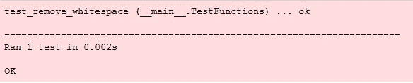
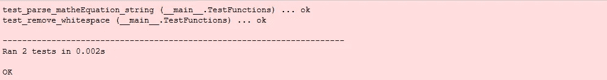
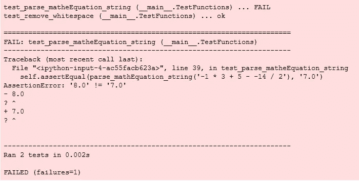
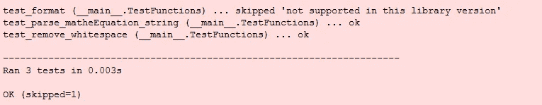
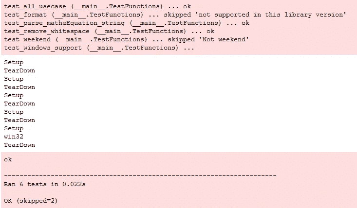

# 单元测试简介:Python 中的单元测试框架

> 原文：<https://betterprogramming.pub/introduction-to-unittest-a-unit-testing-framework-in-python-fa0d96fc8262>

## 使用 Python 标准库创建您自己的单元测试脚本


[大卫·特拉维斯](https://unsplash.com/@dtravisphd?utm_source=unsplash&utm_medium=referral&utm_content=creditCopyText)在 [Unsplash](https://unsplash.com/s/photos/test?utm_source=unsplash&utm_medium=referral&utm_content=creditCopyText) 上的照片

这篇文章将帮助你学习用 Python 对你自己的应用程序进行单元测试。基于官方[文件](https://docs.python.org/3/library/unittest.html)，`unittest`:

> “…最初是受 JUnit 的启发，与其他语言中的主要单元测试框架有相似之处。它支持测试自动化，共享测试的设置和关闭代码，将测试聚合到集合中，以及测试独立于报告框架。”

`unittest`是 Python 的标准库，支持面向对象的代码。它具有以下特点:

*   `text fixture`—`test fixture`代表执行一个或多个测试和任何相关清理行动所需的准备工作。例如，这可能涉及创建临时或代理数据库、目录或启动服务器进程。
*   `test case` — A `test case`是测试的个体单位。它检查对一组特定输入的特定响应。`unittest`提供了一个基类`TestCase`，它可以用来创建新的测试用例。
*   `test suite`—`test suite`是`test case`、`test suite`或两者的集合。它用于聚集应该一起执行的测试。
*   `test runner`—`test runner`是编排测试执行并向用户提供结果的组件。运行者可以使用图形界面、文本界面，或者返回一个特殊的值来指示执行测试的结果。

在本教程中，我们将重点关注`test case`。让我们进入下一节，开始用 Python 编写一些代码。

# 基本概念

## 导入

首先，您需要通过在 Python 文件的顶部声明模块来导入它:

```
import unittest
```

## 测试案例

为了创建一个`testcase`，你必须创建一个继承`unittest.TestCase`类的类

```
class TestFunctions(unittest.TestCase):
```

## 测试方法

可以通过在它们前面加上关键字`test`来创建一个测试方法。任何以关键字`test`开头的函数都将被视为单元测试方法。

```
def test_some_function(self):
```

让我们用一个简单的函数来尝试一下，从输入字符串中删除空白。它接受一个输入字符串，并输出删除了空格的相同文本。

```
def remove_whitespace(text):
    result = text.replace(' ', '')
    return result
```

接下来，我们必须创建一个测试方法来测试我们上面定义的功能。我将只使用相同的名称和前缀与`test`关键字。你可以随意命名它，只要它以关键字`test`开头。在函数内部，您需要使用`assertEqual`调用来定义对预期结果的检查。

在上面给出的例子中，我写了三行代码来检查`remove_whitespace`函数的输出是否与预期结果相同。在一个实际的用例中，你应该涵盖所有你能想到的可能性。

## 主要的

完成后，编写以下代码来完成第一个单元测试的脚本:

```
if __name__ == '__main__':
    unittest.main()
```

将脚本保存为 Python 文件，并在命令提示符下使用以下语法正常运行。将名称更改为您设置的文件的名称。

```
python -m unittest myFile.py
```

您可以指定其他参数。常见参数有:

*   `-b` —测试运行期间缓冲标准输出和标准误差流。通过测试期间的输出被丢弃。输出通常在测试失败或出错时回显，并添加到失败消息中。
*   `-c` —测试运行期间的 Control-C 等待当前测试结束，然后报告到目前为止的所有结果。第二个 Control-C 引发正常的键盘中断异常。
*   `-f` —在第一次出现错误或失败时停止测试运行。
*   `-k` —只运行匹配模式或子串的测试方法和类。这个选项可能会被多次使用，在这种情况下，所有匹配给定模式的测试用例都会被包含进来。使用`fnmatch.fnmatchcase()`将包含通配符(`*`)的模式与测试名称进行匹配。否则，使用简单的区分大小写的子字符串匹配。模式与测试加载器导入的完全限定的测试方法名称相匹配。
*   `-v` —详细输出

假设您想要一个详细的输出。您运行以下命令。

```
python -m unittest -v myFile.py
```

如果你在 Jupyter 笔记本上运行，你会遇到以下错误:


作者图片

您可以通过将主代码更改为以下内容来轻松解决这个问题:

```
unittest.main(argv=['ignored'], exit=False)
```

列表参数是为了防止`unittest`查找`sys.argv`,因为它是笔记本的启动程序，而`exit=False`是为了防止`unittest`关闭内核。参数也可以添加到列表中。例如:

```
unittest.main(argv=['ignored', '-v'], exit=False)
```

运行该脚本时，您应该会看到以下结果:



作者图片

## 第二测试函数

如果你很难编写单元测试，你的代码可能不够模块化。建议将您的代码分解成更小的函数，以便您可以轻松地测试它。让我们尝试添加另一个函数，并为它编写一个简单的测试方法。

上面的代码接受一个输入字符串，根据其中的文本计算数学运算，并以字符串形式返回结果。之后，为它添加测试方法:

我添加了三行等式检查。请注意，我没有对不可计算的字符串执行任何异常检查。如果您的函数中有一个异常检查，您还应该在测试函数中为它创建一个相等检查。

当您运行脚本时，以下结果将输出到控制台。



作者图片

让我们将第二行的比较值从`8.0`改为`7.0`，以检查运行脚本时的输出。您应该会看到以下结果:



作者图片

如您所见，它会在日志中反映出逻辑错误。在这种情况下，生成的输出`8.0`不等于预期的结果`7.0`。这将有助于在修改基本函数后运行单元测试时查明问题。

# 维护

在这一节中，我们将深入探索可以在您的测试用例中使用的上述其他类型的`assert`。

## assertNotEqual

这用于检查左参数是否与右参数相同。

```
self.assertNotEqual(1, 2)
```

## assertTrue

这将检查输入参数是否评估为`true`。除了通常的`True`和`False`值。您也可以使用其他数据类型。`0`将被评估为`False`，而任何其他值将被视为`True`。你也可以用它来计算一个字符串。空字符串被视为`False`。

```
self.assertTrue(1)
```

## assertFalse

`assertFalse`是`assertTrue`的反义词。用于评估输入参数是否为`False`。

```
self.assertFalse(False)
```

## 阿瑟公司

`assertIs`可用于检查两个输入参数是否是相同的对象。您也可以使用它来检查对象的类型。在调用它之前，我们先创建几个变量:

```
a = 2
b = 2
c = 3basket = [1, 2]
```

继续写`assertIs`的代码:

```
self.assertIs(a, b)
self.assertIs(type(a), int)
```

## 资产广告

这将检查两个输入参数是否不是相等的对象。检查确切的类型和类别。

```
self.assertIsNot(a, c)
self.assertIsNot(a, '2')
```

## 阿瑟酮

如果您想检查`None`，您可以使用`assertIsNone`。

```
self.assertIsNone(None)
```

## 资产声明无

`assertIsNone`的对立面。用于检查不是`None`的对象。

```
self.assertIsNotNone('string')
```

## assertIn

您可以使用`assertIn`来检查左输入参数是否是右参数中的一项。下面的例子检查我们上面定义的变量是否是`basket`列表中项目的一部分。

```
self.assertIn(a, basket)
```

## 资产净值

`unittest`模块还为我们提供了`assertNotIn`，帮助我们检查左输入参数是否不是右参数中项目的一部分。

```
self.assertNotIn(c, basket)
```

## 资产实例

检查左输入参数是否是右输入参数的对象。它基于`isinstance()`功能。这意味着它将返回`True`，即使对于子类也是如此。

```
self.assertIsInstance(a, int)
```

## 资产声明实例

与`asserIsInstance`相反的是`assertIsNotInstance`，可以用来评估两个对象是否不是彼此的实例。

```
self.assertNotIsInstance(a, float)
```

## 比较运算符

这个模块还附带了两个对象之间数学运算的断言。

*   `assertGreater`
*   `assertGreaterEqual`
*   `assertLess`
*   `assertLessEqual`

```
self.assertGreater(c, a)
self.assertGreaterEqual(a, b)
self.assertLess(a, c)
self.assertLessEqual(a, b)
```

# 安装和拆卸

## 设置

可能会有这样的情况，在每个单元测试之前需要执行一些初始化。例如，在每次测试之前将配置设置重置为默认值或固定窗口分辨率。在这种情况下，您可以在`setUp`函数中定义代码，它将在任何测试函数之前被调用。请注意，将为每个测试方法调用设置功能。因此，初始化，如登录系统或连接数据库，应该放在类中，而不是放在`setUp`中。

```
def setUp(self):
    print('Setup')
```

## 拆卸

如果您想在每次测试功能后处理或清理一些对象，您可以在`tearDown`功能中记录下来。每次测试函数调用后，将记录结果并调用`tearDown`函数。

```
def tearDown(self):
    print('TearDown')
```

如果你有三种测试方法，你会看到三行`Setup`输出和三行`TearDown`输出。

# 空白测试

## 装修工

此外，`unittest`还允许我们设置`decorator`来跳过特定的测试类或方法。让我们用下面的装饰者来测试一下:

*   `skipIf`
*   `skipUnless`

两个函数都接受两个参数。第一个参数是测试类或方法被跳过时所遵循的条件、原因或要输出的消息。

## 斯基皮夫

假设您刚刚更新了您的自定义模块，由于向后兼容性，它现在将导致一个错误。如果版本是最新的，可以用`skipIf`跳过。如果日志版本为 0.5.1.2，以下示例测试函数将不会运行:

```
import logging@unittest.skipIf(logging.__version__ == '0.5.1.2', "not supported in this library version")
def test_format(self):
    #Tests that work for only a certain version of the library.
    print(logging.__version__)
```

您应该会看到以下输出:



作者图片

## 无技能

另一方面，当且仅当条件满足时，如果您希望运行测试，`skipUnless`是有用的。例如，以下测试方法仅在现有系统平台为 Windows 时运行。

```
[@unittest](http://twitter.com/unittest).skipUnless(sys.platform.startswith("win"), "requires Windows")
def test_windows_support(self):
    # windows specific testing code
    print(sys.platform)
```

如果使用 Windows，以下结果将输出到控制台:


作者图片

## skipTest

您也可以通过在函数内部进行评估来跳过测试。您可以轻松地实现一个简单的条件语句来触发`skipTest`调用。以下测试功能仅在周六或周日运行:

```
import datetimedef test_weekend(self):
    index = datetime.datetime.today().isoweekday()
    if(index >= 1 and index <= 5):
        self.skipTest("Not weekend")
```

请随意查看以下要点以获得完整的代码:

运行该脚本时，您应该能够看到以下结果。



作者图片

# 结论

让我们回顾一下今天所学的内容。

我们从简单解释`unittest`模块的基本概念开始。我们编写了一个简单的测试脚本并运行它。

之后，我们详细探讨了`unittest`模块中可用的不同类型的资产。

该模块还带有一个`setUp`函数，作为每个测试方法的初始化调用。此外，`tearDown`函数可用于在每次测试方法调用后释放或终止对象。

最后，我们测试了 skip `decoractor` s 和函数，它允许我们跳过一个粒子测试类或方法。

感谢阅读，我希望你喜欢它。下一篇再见！

# 参考

1.  [Unittest 的文档](https://docs.python.org/3/library/unittest.html)
2.  [Jupyter 笔记本运行单元测试故障排除](https://stackoverflow.com/questions/37895781/unable-to-run-unittests-main-function-in-ipython-jupyter-notebook)