# 用彩色和故事书介绍视觉回归测试

> 原文：<https://betterprogramming.pub/introduction-to-visual-regression-testing-with-chromatic-and-storybook-286ea98bf808>

## 如何使用 GitHub 动作实现 Chromatic 并通过持续集成使其自动化


由[乔舒亚·科尔曼](https://unsplash.com/@joshstyle?utm_source=medium&utm_medium=referral)在 [Unsplash](https://unsplash.com?utm_source=medium&utm_medium=referral) 上拍摄的照片。

视觉回归测试用于验证代码的变化如何影响界面的视觉效果。我们可以使用 [Chromatic](https://www.chromatic.com/) 在[故事书](https://storybook.js.org/)组件上运行视觉测试。

Chromatic 是一个用来自动化故事书工作流程的工具。它为团队提供了一个共享的工作空间来共同评论和评审 UI 工作。查看以下视频，快速了解半音阶:

在本文中，我们将了解如何在 React 应用程序中实现 Chromatic，以及如何使用 GitHub 操作来自动化持续集成。

本文假设您对 React 和 Storybook 有基本的了解。如果您不熟悉 Storybook，请查看下面的文章开始阅读:

[](https://javascript.plainenglish.io/why-you-should-use-storybook-for-your-next-project-1a991e6a8e65) [## 为什么你应该在你的下一个项目中使用故事书

### 孤立地构建 UI 组件，并用 Storybook 跟踪它们。

javascript.plainenglish.io](https://javascript.plainenglish.io/why-you-should-use-storybook-for-your-next-project-1a991e6a8e65) 

# 设置

对于这个例子，我们将使用一个支持 TypeScript 的基本`create-react-app`设置。我也已经用默认的 stories 文件夹安装了 Storybook，如下所示:

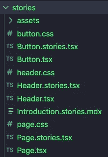

第一步是将这个项目添加到 [GitHub](https://github.com/) 。如果您愿意，也可以使用 GitLab 或 BitBucket。

一旦你的项目被保存在 GitHub 上，前往 [Chromatic](https://www.chromatic.com/start) 并与存储你的项目的提供商登录。您将进入以下屏幕:

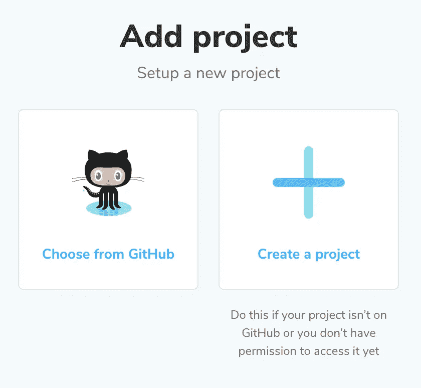

在您的项目中选择 GitHub 存储库。

## 安装彩色

然后，我们可以继续在我们的项目中安装彩色。请遵循以下步骤。

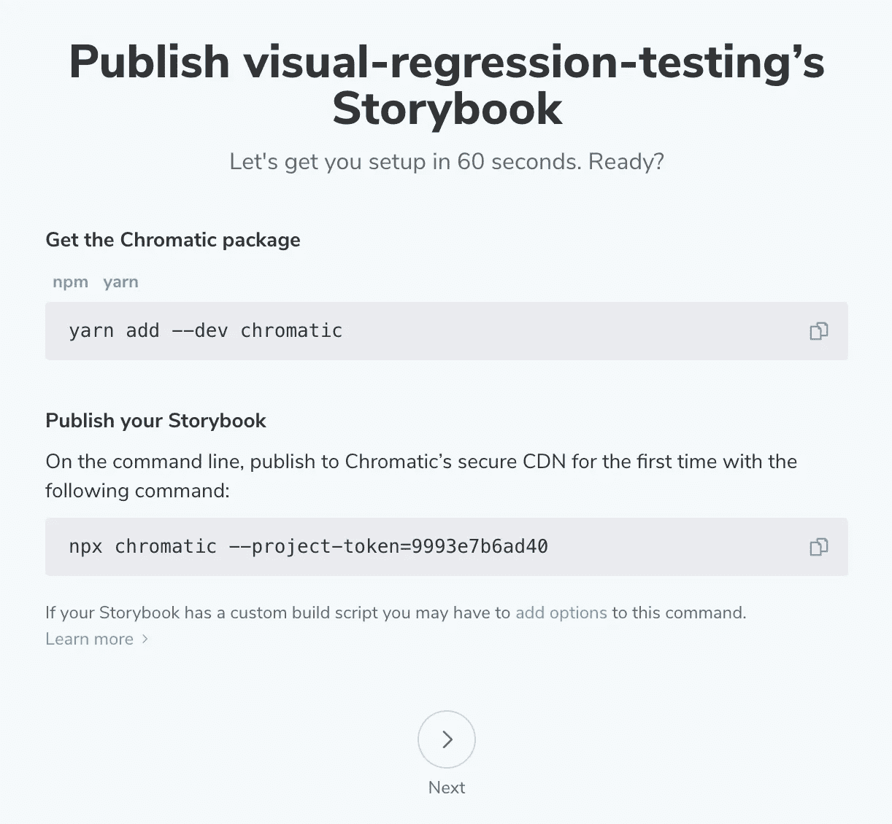

第一个命令将 Chromatic 作为 dev 依赖项安装在您的项目中:

```
yarn add --dev chromatic
```

第二个命令使用您唯一的项目令牌将您的故事书发布到 Chromatic:

```
npx chromatic --project-token=9993e7b6ad40
```

发布后，系统会提示您以下问题。键入`y` 将半音阶脚本添加到`package.json`文件中。有了这个脚本，我们可以随时运行半音阶构建。

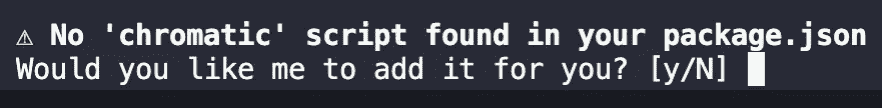

构建完成后，您将进入以下页面:

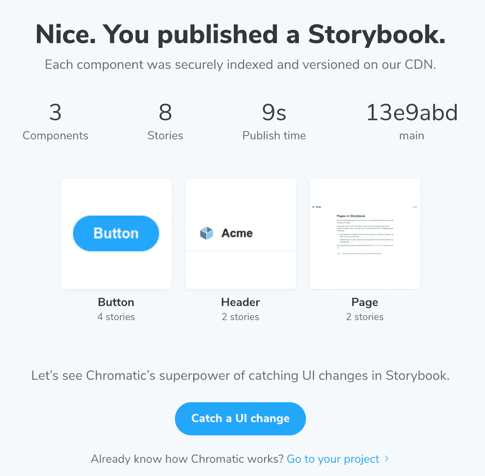

在这里，你可以点击底部的按钮“转到你的项目”接下来我们将讨论如何使用半音阶。

# 我们的第一次测试

让我们对组件进行一些更改，并进行第一次可视化回归测试。对于这个例子，我们将在`Button`组件中添加文本，看看 Chromatic 是如何工作的。

转向你的项目，进入`src/stories/Button.tsx`文件。这个文件包含一个`Button`组件。我将在标签旁边添加文本`“HELLO WORLD!”`:

如果我们保存我们的项目，我们就可以运行`yarn chromatic`。如果您没有在上面的部分中设置脚本，您可以改为运行`npx chromatic --project-token=9993e7b6ad40`。这也将再次发布您的故事书。

现在回到半音阶，我们可以检查变化。

# 彩色仪表盘

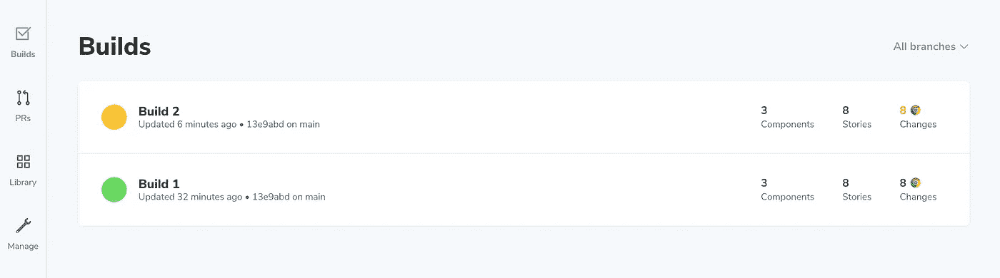

欢迎来到彩色仪表盘！有四个选项卡可供选择:构件(UI 测试)、PRs (UI 审阅)、库(故事书组件库)和管理(设置)。在本例中，我们将重点关注 Builds 选项卡。

单击构建 2。在这里，我们将看到当我们将`“HELLO WORLD!”`文本添加到`Button`组件时，所有被更改的组件。

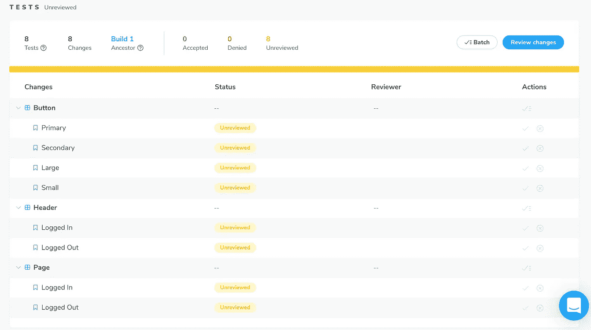

如果我们点击`Button/Primary`组件，我们将进入以下屏幕:

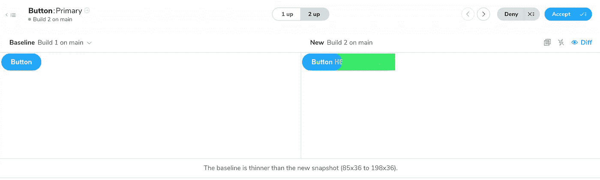

左侧向我们展示了基线组件，而右侧向我们展示了新组件。我们可以看到绿色区域的变化。我们可以接受或否认这些变化。

在右上角，我们可以选择一些选项来帮助我们更好地了解差异(聚焦/散焦、频闪差异和切换差异)。当很难看到非常小的变化时，这些就可以派上用场了。

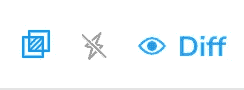

因为这个`Button`组件也在其他组件中使用，我们也将看到这些组件的变化。例如，如果我们查看`Header/Logged Out`组件，我们将看到我们对`Button`组件所做的更改。

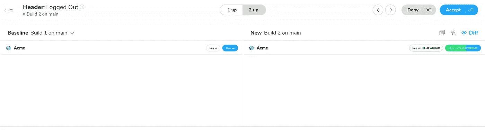

让我们接受对这些组件的所有更改。如果我们返回到 Build 2 屏幕，我们会看到所有的测试现在都被标记为通过:

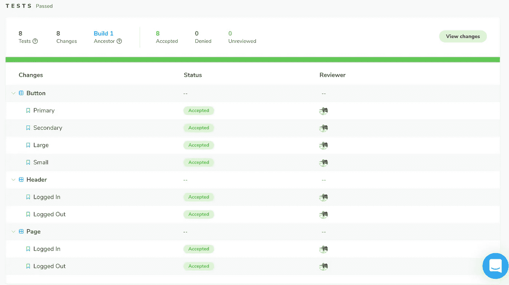

# 通过 CI 实现自动化

与其手动运行 Chromatic 脚本，更好的工作流程应该是通过持续集成来实现自动化。这意味着 Chromatic 脚本将会运行，我们可以在任何时候将它推送到 GitHub 上，对我们的代码进行可视化测试。为此，我们将使用 GitHub 动作。

我们要做的第一件事是更新`package.json`文件中的半音阶脚本:

```
"scripts": {
  "chromatic": "chromatic --exit-zero-on-changes"
}
```

然后，我们将在项目的`.github/workflows`文件夹中创建一个名为`chromatic.yml`的新文件。然后将以下代码添加到文件中:

接下来，转到 GitHub，将您的 Chromatic 项目令牌添加为新的存储库密码:

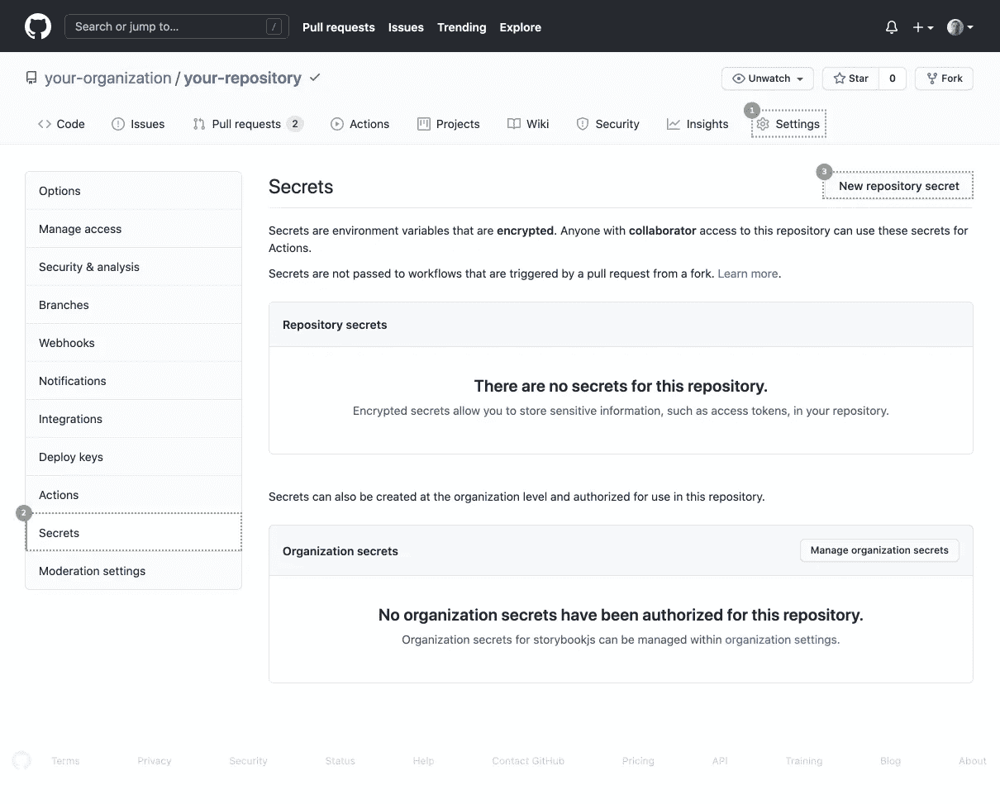

来源:[彩色文档](https://www.chromatic.com/docs/github-actions)

秘密名称将是`CHROMATIC_PROJECT_TOKEN`。作为值，添加来自 Chromatic 的项目令牌。

一旦设置好了，Chromatic 就会在你每次将代码推送到 GitHub 时运行。

让我们在代码中做一些更改，以验证这是否正常工作。这一次，我将打开`button.css`文件并更改主按钮的背景颜色:

```
*.storybook-button--primary* {
  color: white;
  background-color: **green**;
}
```

在提交代码之前，让我们将`build-storybook.log`添加到`.gitignore`文件中。这不需要成为我们 Git 历史的一部分。我们现在可以将代码提交并推送到 GitHub。

如果我们去 GitHub 查看我们的提交历史，我们会看到我们最近的提交没有绿色的勾号。这是因为我们还没有接受半音阶的变化。

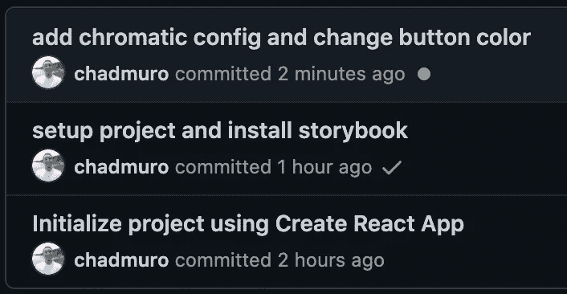

如果我们回到半音阶，我们会看到构件 3 有三个未被接受的更改:

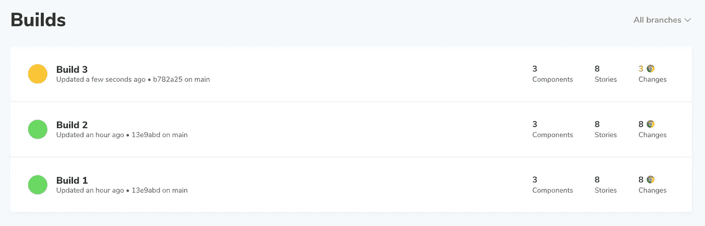

我们可以检查 Build 3 中主要按钮颜色的所有视觉变化。如果我们接受所有的更改并返回 GitHub，我们现在会在提交旁边看到绿色的勾号:

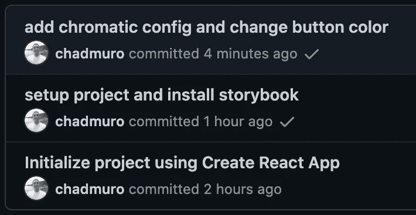

# 结论

请注意，在这个例子中，我将代码直接推送到主分支。如果你在一个团队中工作，你可能会处理一个特性分支，并且需要发送一个 pull 请求来将你的代码合并到主分支中。合并时，在功能分支中接受的任何更改也将在主分支中更新。

感谢阅读！我希望这篇文章对你开始使用 React 应用程序有所帮助。使用半音阶可以很容易地看到项目中的视觉变化。这是一个很好的协作工具，能够审查和讨论组件中的变更。

## **资源**

*   GitHub—[https://github.com/](https://github.com/)
*   故事书—[https://storybook.js.org/](https://storybook.js.org/)
*   半音阶—[https://www.chromatic.com/](https://www.chromatic.com/)

## **更多阅读**

[](https://javascript.plainenglish.io/introduction-to-testing-in-react-with-jest-and-react-testing-library-c1c32bb11739) [## React with Jest 和 React 测试库中的测试介绍

### create-react-app 中的 App.test.js 和 setupTests.js 文件是用来做什么的？

javascript.plainenglish.io](https://javascript.plainenglish.io/introduction-to-testing-in-react-with-jest-and-react-testing-library-c1c32bb11739)