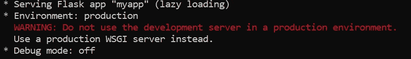

# WSGI 简介:Python 2 和 3 的 WSGI 服务器

> 原文：<https://betterprogramming.pub/introduction-to-waitress-a-wsgi-server-for-python-2-and-3-c77e20cb292b>

## 将您的 Flask 服务器自托管并提供给生产 WSGI 服务器


斯科特·韦伯在 [Unsplash](https://unsplash.com/s/photos/waitress?utm_source=unsplash&utm_medium=referral&utm_content=creditCopyText) 上拍摄的照片

如果您已经通过命令行运行了您的 [Flask](https://www.palletsprojects.com/p/flask/) 服务器:

```
python myapp.py
```

您将看到以下输出:



作者图片

当您公开运行时，强烈建议不要使用由 [Werkzeug](https://www.palletsprojects.com/p/werkzeug/) 提供的开发服务器，因为它不是用于生产的。开发服务器效率不高，不稳定，也不安全。

您可以选择将它部署在第三方主机上，如 [Heroku](https://www.heroku.com/) 或者用一个独立的容器自托管它。

[waste](http://docs.pylonsproject.org/projects/waitress/en/stable/)是这种容器的一个例子，它既适用于 Windows 又适用于 Linux。根据官方文件，女服务员应该是:

> “…一个生产质量的纯 Python WSGI 服务器，性能非常好。除了 Python 标准库中的依赖项之外，它没有其他依赖项。它在 Unix 和 Windows 上的 CPython 上运行。”

本教程包含三个部分:

1.  设置
2.  基本用法
3.  结论

# 1.设置

安装非常简单。强烈建议在通过`pip install`命令安装 waste 之前创建一个虚拟环境。

```
pip install waitress
```

你应该可以很容易地安装它，没有任何问题。让我们进入下一部分，了解更多基本用法。

# 2.基本用法

您需要首先通过以下命令导入`waitress`:

```
from waitress import serve
```

我将使用`app`作为 Flask 服务器的变量名。根据您设置的名称对此进行修改。

```
app = Flask(__name__)
```

注释掉主服务器中的`app.run`,并添加以下代码。

默认情况下，`Waitress`绑定到端口 8080 上的任何 IPv4 地址。您可以省略`host`和`port`参数，只使用 WSGI 应用程序调用`serve`作为单个参数:

```
if __name__ == "__main__":
    #app.run('0.0.0.0',port=server_port)
    serve(app)
```

如果您打算在特定的端口上提供它，您必须在参数中指定它。以下代码在端口 5000 上运行服务器。

```
serve(app, host='0.0.0.0', port=5000)
```

如果您正在使用 UNIX，并且希望通过 UNIX 域套接字为您的应用程序提供服务，您需要使用`unix_socket`参数调用`serve`。请注意，它不适用于 Windows。

```
serve(app, unix_socket='/path/to/unix.sock')
```

## 支持女服务员的理由

serve 最常用的参数如下:

*   `host` —监听的主机名或 IP 地址(字符串)，默认为`0.0.0.0`，表示“该主机上的所有 IP 地址”。不能与 listen 参数一起使用。
*   `port` —监听的 TCP 端口(整数)，默认`8080`。不得与`listen`参数一起使用。
*   `listen` —告诉服务员听一听`host:port`论点的组合。组合应该是用引号括起来的空格分隔的列表，如下所示:
    `listen=”127.0.0.1:8080 [::1]:8080"`
    `listen=”*:8080 *:6543"` 主机名的通配符也受支持，并将绑定到 IPv4/IPv6，具体取决于它们是启用还是禁用。支持 IPv6 IP 地址的方法是用括号将 IP 地址括起来。
*   `ipv4` —启用或禁用 IPv4(布尔型)。
*   `ipv6` —启用或禁用 IPv6(布尔型)。
*   `unix_socket`—UNIX 套接字的路径(字符串)。如果指定了套接字路径，则生成 UNIX 域套接字，而不是通常的 INET 域套接字。在 Windows 上不可用。默认值为无。
*   `threads` —用于处理应用逻辑的线程数(整数)。默认值为 4。

请查看官方[文档](https://docs.pylonsproject.org/projects/waitress/en/latest/arguments.html#arguments)以获得可用参数的完整列表。

## 命令行

最新版本为我们提供了一个直接从命令行运行它的选项。简单地调用`waitress-serve`，然后调用`port`和`python_file_name:flask_variable`。如果您有一个名为 myapp.py 的文件，并按如下方式初始化 Flask:

```
api = Flask(__name__)
```

您应该在命令行中启动服务器，如下所示:

```
waitress-serve --port=8080 myapp:api
```

您应该能够看到以下输出，表明服务器运行正常。

```
Serving on http://0.0.0.0:8080
```

# 3.结论

让我们回顾一下今天所学的内容。我们从在虚拟环境中通过`pip install`进行简单安装开始。

然后，我们详细探究了`waitress`的基本用法。我们导入了 Python 模块，只修改了一行代码，就可以使用 waste 代替普通的开发服务器。

可以通过`waitress.serve`中的参数设置`host`和`port`等附加参数。此外，最新版本还带有命令行选项，可以直接从终端运行服务器。

感谢您的阅读，希望在下一篇文章中再次见到您！

# 参考

1.  [铁塔项目——服务员](https://docs.pylonsproject.org/projects/waitress/en/latest/)
2.  GitHub 上的女服务员
3.  [女服务员的争论](https://docs.pylonsproject.org/projects/waitress/en/latest/arguments.html#arguments)