# 将构建配置从不可读的 Xcodeproj 文件提取到可读的 Xcconfigs 中

> 原文：<https://betterprogramming.pub/introduction-to-xcode-build-configurations-files-xcconfigs-6321bae5cb69>

## 使用 Xcode 构建配置文件(XCConfigs)


照片由[吉米·尼尔森·马斯](https://unsplash.com/@jimmynilssonmasth?utm_source=medium&utm_medium=referral)在 [Unsplash](https://unsplash.com?utm_source=medium&utm_medium=referral) 上拍摄

你改变或调整了 Xcode 中的构建设置了吗？有没有把 Xcode 构建设置更改推送到 git 的？调整 Xcode 构建设置可能是一件麻烦的事情。

假设您在同一个 Xcode 项目中与多个开发人员一起工作。查看对 xcodeproj 的更改可能很难阅读和理解。此外，在多个分支上更改构建配置会导致 xcodeprojs 中的冲突。解决冲突可能会导致丢失生成设置更改的风险。

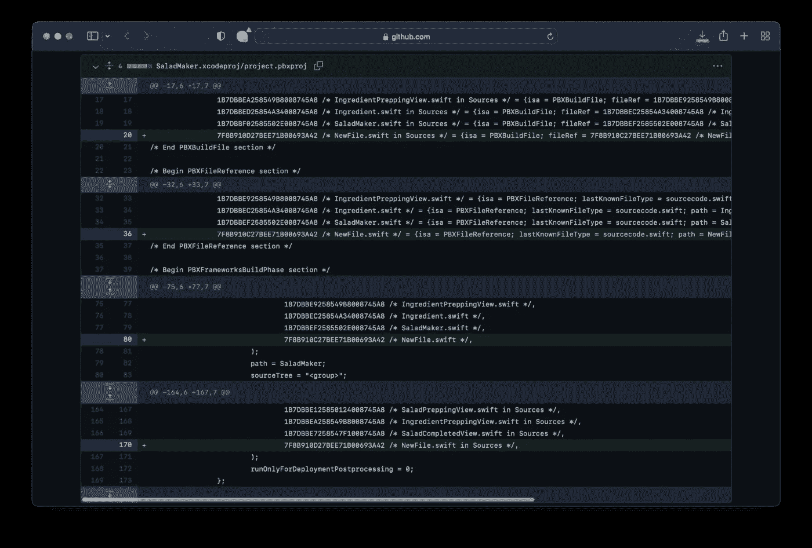

查看 xcodeproj 文件

那么，我们如何才能让开发人员更容易地阅读和审查对构建设置的更改呢？当 xcodeproj 冲突发生时，我们怎样才能使 derisk 有机会丢失构建设置更改？答案就在这篇文章的标题中:Xcode 构建配置文件。这些文件的扩展名是`.xcconfig`，因此这些文件通常被称为 xcconfigs。

XCConfig 是简单的文件，可以将构建配置存储在 xcodeproj 之外。此外，这些都是可读的，易于遵循。

在这篇文章中，我将向你展示如何将 xcodeproj 构建配置提取并保存到 XCConfig 中，并将它们链接到你的 Xcode 项目。在这篇文章中，我不会讨论什么是构建配置。我不会讨论不同的设置、值以及它们对你的应用程序的影响。我假设你理解这一点，并且熟悉 [Xcode 项目构建设置](https://help.apple.com/xcode/mac/11.4/#/dev382dac089)和[如何在 Xcode 项目](https://help.apple.com/xcode/mac/11.4/#/dev04b3a04ba)中配置构建。

*我在这篇文章中使用了 Swift 5.6 和 Xcode 13.3.1。*

# 将 xcodeproj 中的生成配置提取到 XCConfig 中

在这一节中，我将向您展示如何将构建配置从现有的 Xcode 项目提取到 XCConfig 文件中。然后我们会告诉 Xcode 使用这个 XCConfig 文件作为构建配置。

以下是我们将采取的步骤:

1.  下载入门包
2.  创建一个构建配置文件(xcconfig)
3.  将构建配置从 Xcode 项目提取到`xcconfig`文件中
4.  将 xcconfig 文件链接到我们的 Xcode 项目

## 1.下载入门包

让我们下载一个已经存在的 iOS 应用程序项目。打开终端并运行以下命令:

```
cd $HOME
curl [https://github.com/anuragajwani/CryptoNav/archive/refs/tags/starter.zip](https://github.com/anuragajwani/CryptoNav/archive/refs/tags/starter.zip) -o starter.zip -L -s
unzip -q starter.zip
cd CryptoNav-starter
open -a Xcode CryptoNav.xcodeproj
```

## 2.创建构建配置文件

接下来，让我们创建一个构建配置文件，我们将在其中捕获 CryptoNav 应用程序的构建设置。从菜单中选择 ***文件*** > ***新建*** > ***文件…***

然后在 iOS 选项卡内搜索并选择**配置设置文件**。

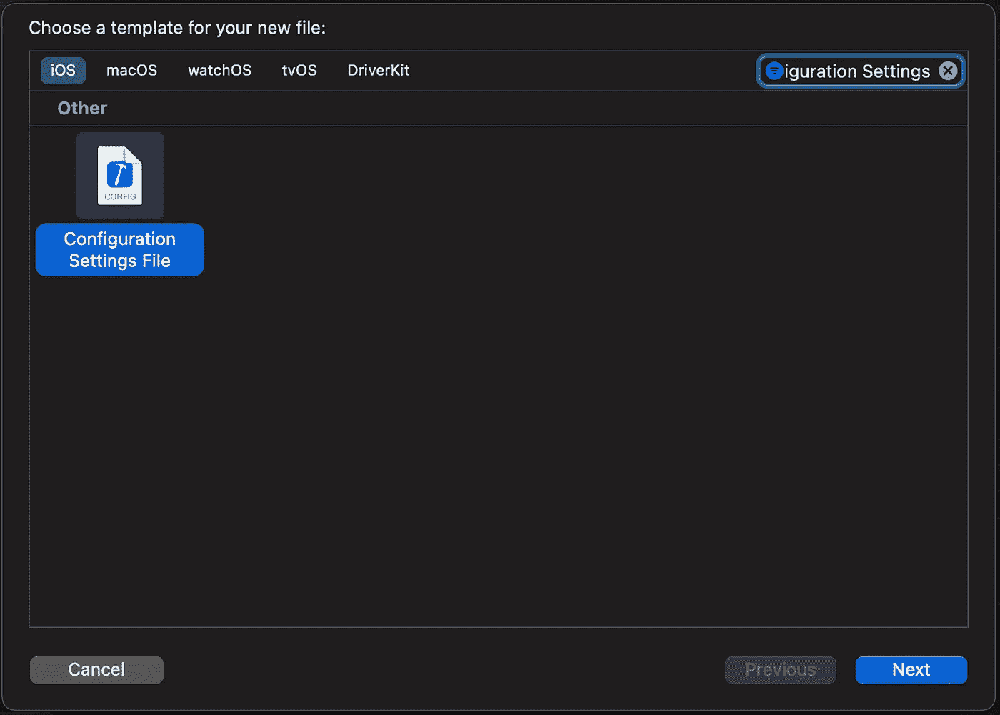

搜索并选择“配置设置文件”

然后点击 Next，最后将文件命名为 **MyConfig** 。

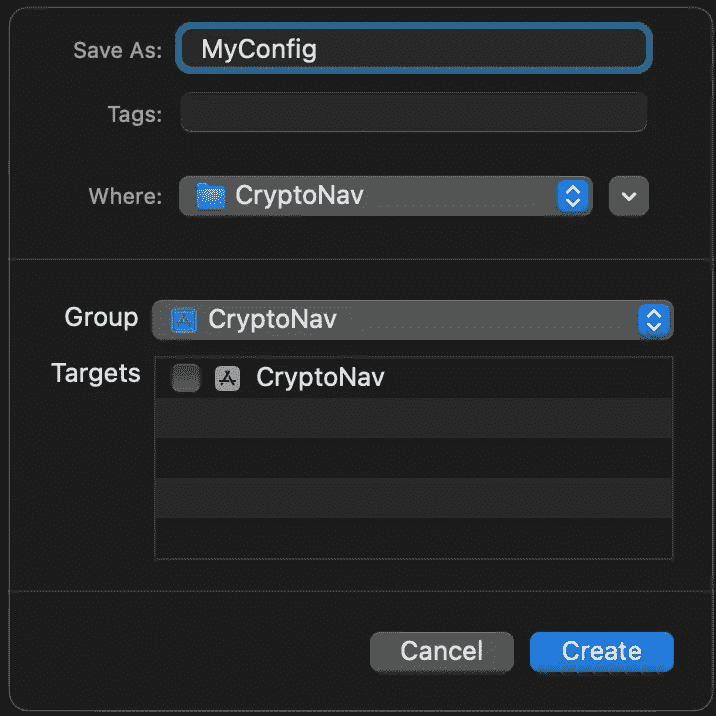

将文件命名为 MyConfig

创建的文件包含一个[有用链接，链接到 xcconfig](https://help.apple.com/xcode/#/dev745c5c974) 上的文档。

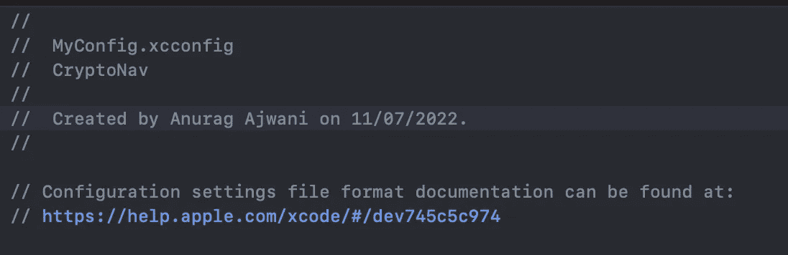

生成的文件上的文本示例

## 3.将构建配置从 Xcode 项目提取到 XCConfig 文件中

在这一节中，我们将把`CryptoNav`项目的一些构建设置捕获到一个构建配置文件中。首先让我们来看看 Xcode 中的一些配置设置。然后我们将复制`MyConfig.xcconfig`中的设置。

要查看构建设置，请导航到项目导航器。然后选择 CryptoNav 项目(左手边带有蓝色图标的顶级项目)。您可以在左侧窗格的第一个选项卡下找到它。

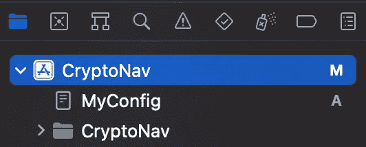

从项目导航器选项卡中选择 CryptoNav 项目

接下来，在主窗格中，选择目标部分下的加密导航。然后选择“构建设置”选项卡。

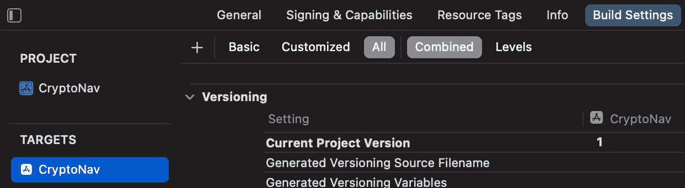

选择 CryptNav 目标，然后在主窗格中构建设置选项卡

在此窗格中，您会发现一堆设置和它们的设置值，如果没有设置，则为空。

在本教程中，我们将提取一个单独的设置。让我们以产品捆绑标识符为例。


我们需要找到这种设置的关键。那么我们如何找到钥匙呢？有两种方法:

1.  正在检查`xcodeproj`目录下的`project.pbxproj`文件(原始文本形式)
2.  [用](https://xcodebuildsettings.com/#product_bundle_identifier)[xcodebuildsettings.com](https://xcodebuildsettings.com)找出钥匙

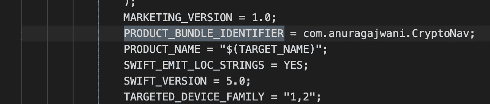

`project.pbxproj`中的产品捆绑标识符关键字和值

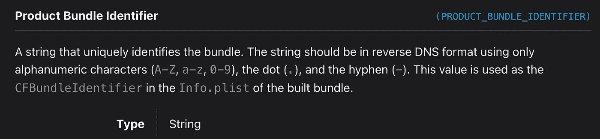

[xcodebuildsettings.com](https://xcodebuildsettings.com)中的产品捆绑标识符设置

接下来，让我们陈述`MyConfig.xcconfig`中产品捆绑标识符的键和值。我们将声明与项目中声明的值稍有不同的值，以便我们可以测试为这样的键设置值的`xcconfig`。

打开`MyConfig.xcconfig`并添加以下行:

```
PRODUCT_BUNDLE_IDENTIFIER = com.anuragajwani.CryptoNavTest
```

接下来让我们从 Xcode 项目中移除键值对。在终端中运行以下命令:

```
open -a TextEdit $HOME/CryptoNav-starter/CryptoNav.xcodeproj/project.pbxproj
```

然后搜索并删除任何包含`PRODUCT_BUNDLE_IDENTIFIER`的行。

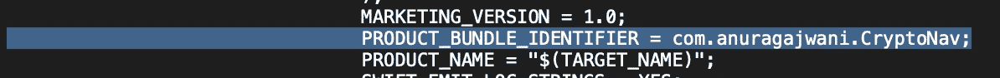

删除`PRODUCT_BUNDLE_IDENTIFIER`的所有条目

接下来让我们检查构建设置是否已经生效。再次打开 CryptoNav 项目，然后在主窗口中选择`CryptoNav`目标，接着选择构建设置选项卡。

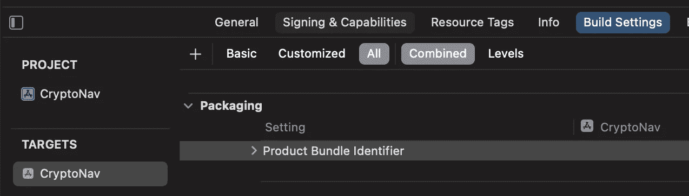

未设置任何值。为什么？我们没有告诉 Xcode 项目从我们的构建配置文件中读取。让我们接下来做那件事。

## 4.将 XCConfig 文件链接到我们的 Xcode 项目

在这一步中，我们将把构建配置文件`MyConfig.xcconfig`链接到 Xcode 项目。为此，从项目导航器中选择`CryptoNav`项目，然后在主窗格中选择“项目”下的`CryptoNav`。然后选择`Info`选项卡。

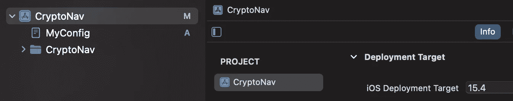

导航到 CryptoNav 项目设置

然后在配置下公开调试和发布。


最后，让我们将`MyConfig`设置为`CryptoNav` iOS 应用程序目标的调试和发布概要文件的构建配置。

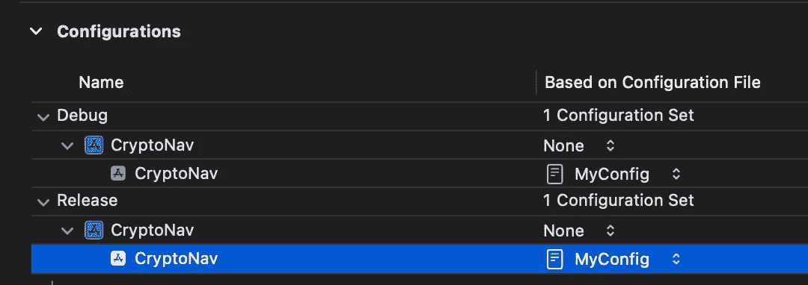

返回`CryptoNav`项目> `CryptoNav`应用目标>构建设置选项卡，搜索`PRODUCT_BUNDLE_IDENTIFIER`。您会注意到现在 Xcode 正在从我们的 MyConfig 文件中读取构建设置！

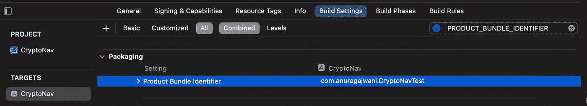

# 摘要

在这篇文章中，我们了解到:

*   什么是构建配置文件
*   为什么使用构建配置文件
*   如何创建生成配置文件
*   如何将生成设置提取到生成配置文件中
*   如何链接我们项目中的构建配置文件

# 最后的想法

在过去，我写过使用 [Xcodegen](/generating-xcodeprojs-with-xcodegen-7d291cfc2f46) 和 [Tuist](/generating-xcodeprojs-with-tuist-4f11134e9f5a) 生成 Xcode 项目。这些允许您在文件(不仅仅是构建配置)的配置中陈述您的项目，这些文件比 xcodeproj 文件更可读。

Xcode 项目文件通常很难理解，当出现冲突时也很难解决。因此，一般来说，将尽可能多的项目配置提取到单独的可读文件中是一个好主意。

```
**Want to Connect?**For more on iOS development follow me on [Twitter](https://twitter.com/anuragajwani?source=post_page---------------------------).
```