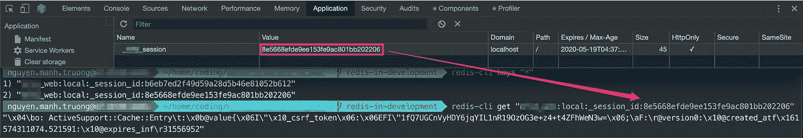

# 使用 Rails 和 design Gem 使所有用户会话无效

> 原文：<https://betterprogramming.pub/invalidating-all-user-sessions-with-rails-and-devise-gem-b457c15e0dc>

## 让我们弄清楚如何从后端终止用户的所有会话，以处理来自 IdP 的反向通道注销请求。

Vyshnavi Bisani 在 [Unsplash](https://unsplash.com?utm_source=medium&utm_medium=referral) 上拍摄的照片

在上一篇文章[管理用户会话和 OpenID 连接注销](/managing-user-sessions-and-openid-connect-logout-eb886facd321)中，我们了解到其他注销规范推荐使用反向通道注销，因为它不受阻止第三方 cookies 的影响。

然而，我们需要一种从后端管理用户会话的方法，这可能比简单地清除 cookies 和 HTML5 本地存储状态更复杂。在本文中，让我们看看如何使用 Rails 和设计 gem 来实现这一点。

# 如何设计使所有会话无效？

[device](https://github.com/heartcombo/devise)是一个流行的用于认证的 Rails 库。Devise 具有一种行为，即当密码被更改时，该用户的所有登录会话都被终止，但不是实时终止，而是在下一次向服务器发出请求时，该用户将被注销。让我们看看这个机制是如何工作的。

## 创建会话

下面是[创建会话的逻辑](https://github.com/heartcombo/devise/blob/14863ba4c92cd9781a961be0486f0ea7dfe84144/lib/devise/models/authenticatable.rb#L233-L240):

`to_key()`只是一个获取记录方法 id 的函数(get `user.id`)。`authenticatable_salt`是一个获取散列密码的前 30 个字符的函数。

用户成功登录后，Devise 将一对`record.to_key`和`record.authenticatable_salt`作为键和值写入 session_store。例如，我使用 Redis 作为 sesison_store，id 和 salt 不加密地存储在 Redis 中，只有会话的 id(Redis 记录的键)被写入 cookies。

## 读取会话

在对服务器的每个请求中，cookies 都随请求一起发送。session_store(在本例中是 Redis)通过键(cookies 值)获取会话信息。根据会话信息，设备决定用户是否登录。阅读课的逻辑是这样的:

`to_apdapter.get()`是一种通过 id 获取用户记录的方法。(`User.find()`)

如果密码被更改(或密码被重置)，数据库中的值`authenticatable_salt`将会改变，数据库中的 salt 和 cookies 中的 salt 之间的比较将会返回 false。设计注销用户并删除 cookies。

所以存储在会话 cookies 中的 salt 依赖于密码。如果我们想让一个用户的所有会话无效，默认情况下，Devise 提供了一种方法，那就是更改密码。这并不能满足我们的所有需求，因为我们还想在不更改密码的情况下终止所有会话。我们如何做到这一点？

# 用令牌扩展`salt`

将一个`session_token`列添加到您的设计模型(例如用户)中，并覆盖设计`#authenticatable_salt`方法以包含您的会话令牌:

现在在处理 Backchannel 注销的逻辑中，可以通过调用`current_user.invalidate_all_sessions!`重置用户的`session_token`来使会话 cookie 无效。

# 结论

在本文中，我们以 Rails 和 devise 为例，说明了如何终止用户的所有会话来处理来自 IdP 的反向信道注销请求。总的想法是在数据库中存储一个令牌，将它附加到 salt 中，在每次请求时将 cookies 中的 salt 与数据库中的 salt 进行比较。如果我们想使一个用户的所有会话无效，就改变令牌！

## 参考

*   [设计:使用户的所有会话无效](https://makandracards.com/makandra/53562-devise-invalidating-all-sessions-for-a-user)