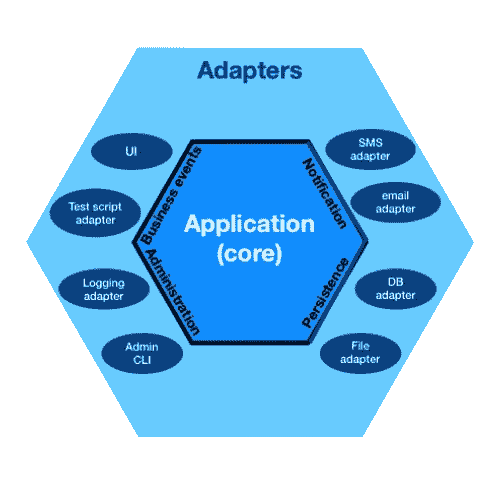
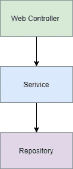
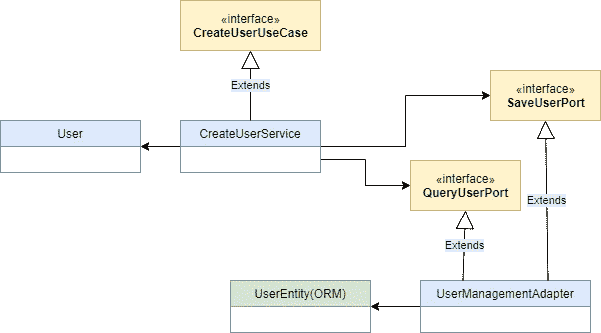

# 反转依赖关系:迈向六边形架构的一步

> 原文：<https://betterprogramming.pub/inverting-dependencies-a-step-towards-hexagonal-architecture-ee74e11877dd>

## 如何从传统的分层架构向六边形架构迈出第一步

照片由[格劳科·祖卡西亚](https://unsplash.com/@glzk?utm_source=medium&utm_medium=referral)在 [Unsplash](https://unsplash.com?utm_source=medium&utm_medium=referral) 上拍摄

> “您必须明白，当您将一个框架与您的应用程序结合时，您将在该应用程序的剩余生命周期中被该框架所束缚。不管是好是坏，生病还是健康，富裕还是贫穷，抛开所有其他，你都将使用这个框架。这不是一个轻易做出的承诺。”
> 
> ――罗伯特·c·马丁，“清洁建筑”

年轻时的我会对这个警告感到惊讶。因为年轻的我考虑过知道一个框架相当于拥有更高的学位。那时候，我只有一个目标，那就是找到一个完美的框架，只要我想继续从事这个行业，就坚持下去。

切换到不同的框架来做同样的事情对我来说是陌生的。但是我的这种态度并没有持续很久。因为很快我就意识到这个行业中的事情是多么的短暂——每天我们都被引入一门新的语言或一个新的框架，这可能会进一步减少我们的工作。

当我意识到这一点时，我经常想把我的代码移植到新的闪亮的框架中。但是我不能。因为框架代码在业务逻辑中根深蒂固，所以需要付出巨大的努力。

> "业务规则应该是系统中最独立和可重用的代码."
> 
> ――罗伯特·c·马丁，“清洁建筑”

这个问题的答案一直摆在我面前——也就是说，保持领域逻辑的解耦——但是有一种方法没有。但是最近，我遇到了一个架构，它提供了一个有趣的方法来解决这个问题。它被称为*六角形建筑。*

由 [Cth027](https://commons.wikimedia.org/w/index.php?title=User:Cth027&action=edit&redlink=1) 在[维基共享资源](https://commons.wikimedia.org/wiki/File:Hexagonal_Architecture.svg)上的插图

六角形架构背后的想法是将领域或业务逻辑保持在设计的中心。该域不应该有任何外部依赖性。在它的中心，我们有实体，围绕它的是用例。所有东西都包含在六边形内。只能通过输入/输出端口和**对其进行访问。**那么，我们如何实现这一目标呢？

在我回答这个问题之前，我想稍微谈一下*分层架构*和它的一些缺点。然后，我将向您展示如何从分层架构过渡到六边形架构，这将帮助我们克服这些缺点，并回答上面提出的问题。

分层架构

正如您在上图中看到的，服务层位于存储库层之上。很明显，我们的域代码——驻留在服务层——对存储库层有一个向外的依赖性。因此，在实现存储库层之前，我们不能开始服务层的工作。

同样因为这种层次结构，我们通常从建模数据库模式开始— *数据库驱动设计—* ，自信地认为我们已经完全理解了我们的领域，事实上，除非我们已经实现了我们所有的业务逻辑，否则我们永远也不会理解。然后我们发现自己又花了几个小时在 DB 模式和 ORM 代码上。

不是这个。还记得第一段中关于混合框架代码和业务逻辑的咆哮吗？这发生在服务层，因为 ORM 实体进入了服务层。“那有什么不好？”你可能会问。这些实体与我们数据库中的表完全相似——此外，它们包含元数据和映射信息，这意味着我们的域代码完全了解持久性 API 并与之耦合。

现在让我们看看迁移到六边形架构如何帮助我们解决这些问题。为此，我们需要我们的存储库层或持久层依赖于服务层或领域层。所以，基本上，我们需要颠倒依赖关系。

首先要反转依赖关系，我们需要一个没有任何 ORM 代码的实体。接下来，我们的域层需要公开一组名为*端口、*的接口，我们的持久层需要提供具体的实现。

将这些域实体转换成 ORM 管理的实体并执行所需的操作将是持久层的工作。这样，我们的域逻辑就没有任何持久性代码了。检查下面的 UML 类图以获得更多的清晰度。

不过，这种脱钩是有代价的。正如你所看到的，现在除了 ORM 实体之外，我们还需要管理域实体。

但是看看好的一面:会有很多收获。首先，我们的领域层是完全解耦的。此外，现在您可以自由地使用助手方法和大量构造函数来丰富您的域实体，否则您无法使用 ORM 实体来完成这些。这也允许我们以最纯粹的形式应用领域驱动设计(DDD)。

尽管如此，我们的领域层不会完全摆脱所有的框架代码，因为领域层中使用的接口需要提供具体的实现。

为此，我们仍然依赖我们的依赖注入(DI)框架，它将在运行时满足依赖性。所以所有的层仍然依赖于 DI 框架。但是通常情况下，DI 框架在代码上的足迹非常低，我们可以通过使用诸如构造注入之类的方法来进一步减少这些足迹。

就是这样！有了这个，我们向六边形建筑迈出了第一步。还有很长的路要走。但目前就这样了。

# 结论

六边形架构允许我们将域逻辑放在设计的中心。这是有代价的，但与我们的收获相比，这算不了什么。

此外，这篇文章可能会给你一种印象，那就是所有关于领域逻辑的解耦。但是还有更多。它允许我们克服分层架构的许多其他缺点，如胖服务、无包边界等。

这种设计真正允许开发人员在多个用例上并行工作。

感谢阅读！