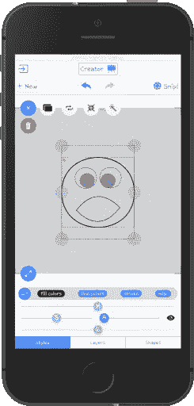
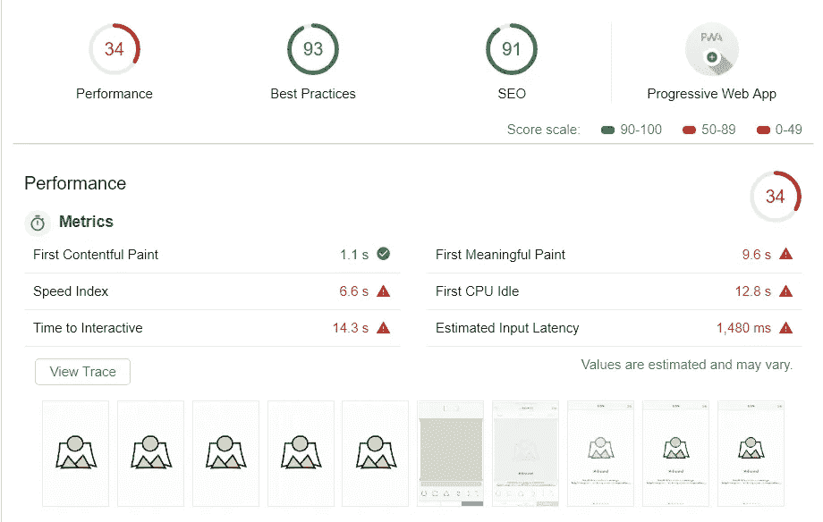
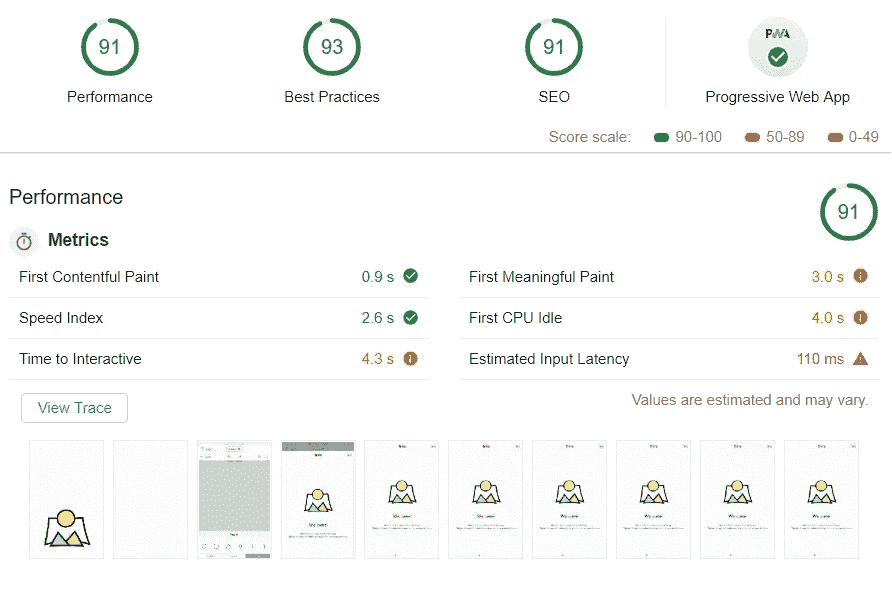

# 我从 Ionic 3 迁移到 Ionic 4 的经历

> 原文：<https://betterprogramming.pub/ionic-3-to-ionic-4-migration-gotchas-928174b5eb12>

Angular 7 中一个有用的学习过程

# 我为什么决定迁移？

不久前，作为学习 Angular 的一部分，我使用 Ionic 3 / Angular 5 开发了一个 web 应用程序(Progressive Web App)。应用程序被称为 **Morphistic** ，它是一个相当复杂的(对于网络应用程序来说)社交应用程序，可以从基本的贝塞尔曲线形状创建基于矢量的构图。

我想长期支持这个应用程序，因为应用程序中的一些错误与过时的依赖关系(rxjs，firebase)有关，我觉得将它更新到 Ionic 4 / Angular 7 框架是一个好主意。我还希望在这个过程中了解更多关于 Angular 7 的功能。

所以我更新的主要原因是:

*   转向获得长期支持的框架(LTS)
*   解决一些由于依赖不匹配而导致的讨厌的错误
*   获得更多开箱即用的东西，而不是拥有自己的定制代码(服务人员、环境配置等)
*   采用和学习更多 Angular(路由器等)

我的期望是在一周内完成这个迁移项目(与许多指南建议的一致)

# 准备步骤

为了简化迁移过程，我采取了三重策略:

## **第一步:迁移前学习离子 4 /角度 7**

*   深入研究 Ionic 团队的[迁移指南](https://ionicframework.com/docs/building/migration)
*   通读 Josh Morony 的所有教程(所有与 Ionic 4 相关的内容)
*   通读相关 [Angular.io](https://angular.io/) 文章(如路由器)
*   用开源代码研究 Ionic 4 apps 的实际代码: [Ionic Conference app](https://github.com/ionic-team/ionic-conference-app) (框架参考 App)和 [Fluster app 源码](https://github.com/fluster/fluster-app)(感谢 [David Dal Busco](https://medium.com/u/94f0c8061324?source=post_page-----928174b5eb12--------------------------------) 让他的 App 开源！)

## **第二步:准备用于迁移的 v.3 代码**

*   在仍然使用 v.3 代码的情况下实现任何和所有的更改，以便更容易迁移到 v.4(重写模式以期望承诺等)
*   创建新代码，并将其注释掉，直到迁移(styleUrls、providedIn 等类似的语法变化)
*   将所有项目依赖项(package.json)更新到最新版本，并验证构建过程仍然适用于 v.3

## **步骤 3:执行迁移**

*   为最大规模的工作寻找三到四个小时的安静时间:更新框架版本，启动新的“sidemenu app”(对我来说)，开始创建项目结构，一个接一个地添加页面和服务，修复导入等，旨在创建“可构建”的应用版本。
*   然后，在几周的时间里，偷偷抽出一到两个小时的时间来工作(因为我没有每天都在我的应用上工作的奢侈)，专注于具体的工作。返工所有页面的模板代码，组件也一样，返工服务人员注册代码，重新添加预构建脚本(例如自动版本碰撞)。
*   一旦应用程序接近完成，就要专注于完善和错误修复。

# 结果

## **迁移时间**

总的来说，我的计划还不错。我花了大约 30-40 个小时来完成整个项目(15 个页面，15 个以上的组件，10 个以上的服务)，但实际上并不像我预期的那么容易(尽管做了准备),因为你会在下面发现许多“陷阱”。事实上，大部分意想不到的时间都花在了模板代码(HTML/CSS)上，因为我大量修改了 v.3 中的一些组件(使用 CSS 选择器来修改组件的内部 HTML ),并且我对 v.4 组件的属性更改数量感到措手不及。然而，总的来说*在我的例子*中重构很多代码还是不错的。

## **性能**

当我使用 lighthouse 工具以非节流方式测量性能时，没有发生什么大的变化。我看到的大多数改进都是针对 3G / 4X CPU 减速模式的:

Ionic v3 PWA 性能:3G / 4X CPU 减速灯塔(匿名)

相对

Ionic v4 PWA 性能:3G / 4X CPU 减速灯塔(匿名)

因此，应用程序在较慢的连接和较慢的 CPU 上看到了更好的性能(第一次有意义的绘制时间快了 300%+300%！希望移动用户能从中受益)。我的 Ionic v.3 应用程序版本在过去实际上优化得相当好(因为我试图按照最佳实践达到 100 PWA 分数)，但在 v.4 中，我很高兴获得更好的性能和更小的包大小，而没有我在 v.3 中应用的任何优化(删除未使用的材料设计 CSS、未使用的组件、减少 Ionic CSS 颜色等)。)

## **获得利益**

这当然是主观的，但从高层次来说，这些是我真正欣赏的东西(也是为什么我很高兴进行这次迁移):

*   将依赖项更新到最新的稳定版本，主要问题和错误都已解决—成功！
*   整个应用程序的导航逻辑更清晰(路由器首先让人感到困惑，但现在我认为这是正确的选择！)
*   现成可用的性能优势和其他功能(服务工作者、web 工作者、环境配置、构建配置、自定义配置挂钩等，angular CLI 的强大功能—所有这些)。
*   更多的棱角，更少的离子遗产“雪花”(例如，旧的 navController，笨拙的懒惰加载组件假装它们是页面，等等)更多的棱角也意味着我可以获得更大的社区和支持。我认为这(提高代码可维护性)是目前为止最大的好处。
*   一旦我明白了它们是什么，我真的很喜欢模板中的整个“槽”的变化。阅读更多[此处](https://www.joshmorony.com/understanding-how-slots-are-used-in-ionic-4/)来自[约书亚莫罗尼](https://medium.com/u/bb8eea5f6816?source=post_page-----928174b5eb12--------------------------------)。
*   我的应用程序特有的一些愚蠢的小收获:支持自定义 SVG 图像的离子图标(事实上，我可以使用自己的应用程序创建)
*   希望不久我能在正式发布时更新到 [Ivy renderer](https://angular.io/guide/ivy)

底线——这是一个比预期更长的旅程，但绝对值得！

# **我学到的一些“窍门”**

最后，我想列出我在整个迁移过程中在笔记中记录的事情，这些事情对于任何愿意迁移的人都是值得一读的:

## **阴影 DOM & CSS 定制**

如果您在 v.3 中通过 css 修改了 HTML 模板(比如我使用`::after` css 选择器等设计了 ion-range 旋钮),您可能需要花更多的时间来调整您的模板(或者简化它们，或者如果可能的话去掉这样的定制),因为 v.4 Ionic 组件被重写为利用 shadow DOM 和 CSS 的纯 web 组件，现在定制只能通过 CSS 定制属性来实现。阅读 Josh 撰写的本教程中的更多内容。(更新:如果您迁移到 Ionic 5.2+,您可以利用影子部件对许多组件进行这样的定制。了解更多:[https://ionicframework . com/blog/customize-your-ionic-framework-app-with-CSS-shadow-parts/](https://ionicframework.com/blog/customize-your-ionic-framework-app-with-css-shadow-parts/))

## **生命周期挂钩变化**

有些变化，比如使用`ionViewDidLoad` 钩子，很容易实现(很容易转向`ngAfterViewInit`)，而有些变化，比如`ionViewCanEnter`——现在需要理解和实现应用路由器中的角度防护(`canLoad`、`canActivate`)。这里还有一个来自 Josh 的[好指南](https://www.joshmorony.com/prevent-access-to-pages-in-ionic-with-angular-route-guards/)。

## **组件的新属性**

不知何故，我错过了理解许多组件属性变化有多大的机会。我在应用程序中大量使用离子范围、离子幻灯片等东西，作为 v.4 重写的一部分，许多这样的组件重新调整了它们的属性。因此，花一些时间阅读 Ionic v.4 组件的文档并彻底研究什么发生了变化是值得的——尤其是按钮、后退按钮、ion-slides 等。

## **路由器变更**

在我阅读了 Josh 的[教程后，我认为在 v.3 代码库中我做了正确的事情——我放弃了 NavParams 方法并重写了代码，以利用共享服务在页面间传递数据。因此，在实际迁移过程中，我所要做的就是编写我的路由器并从:`this.navCtrl.push(“home”)`切换到`this.navCtrl.navigateForward(“/home”)`。我认为这为我节省了很多时间，并且使用共享服务的页面到页面导航可以在迁移争论之前在 v.3 中实现，这很好。](https://www.joshmorony.com/using-angular-routing-with-ionic-4/)

## **服务人员变更**

好消息是——我们现在可以利用 Angular 为我们提供的服务人员。对我来说，坏消息是我还使用了 firebase 相关的服务工作者，在 v.3 中，我只是将它们组合在一起作为 Ionic 3 / Angular 5，而不像 Angular 7 没有隐藏应用程序的服务工作者(Angular 6+在构建时从 JSON 配置中生成服务工作者。)现在有了 v.4，我不得不挖一点，找到一种方法来结合服务工作者。谢天谢地，这篇文章中有一个方法(见题为“休斯顿，我们有一个问题”的部分)。

## **迁移皮棉工具**

有离子的指南推荐的 [lint 工具](https://github.com/ionic-team/v4-migration-tslint)。我用过它，但是老实说(也许只是我)它并不值得。在我自己修复了一些模板之后，我已经知道我需要处理什么问题了。但是在迁移后运行一次可能是个好主意。

## **“离子发球”现为“伽发球”**

由于我想使用我的 iOS 设备测试 Ionic 4 代码，我自然希望通过访问 192.168.0.9:8100(我的本地 PC 地址)来查看我的 PWA，这是我在 v.3 中习惯做的事情(因为 Ionic 3 运行一个简单的 web 服务器作为 ionic serve 的一部分)。有了 ng serve，就不再有这么简单的网络服务器了，你需要自己安排。我发现“firebase serve”(firebase toolkit CLI)如果指向你的项目中的“www”库，对我来说正好可以。

## **自定义脚本**

我曾经在每个产品标志构建之前运行定制脚本，这会使应用程序版本跨越多个文件，所以我担心会对我的旧流程进行额外的返工。但实际上，这里有 nice，而且在我看来更干净的[配置方法](https://ionicframework.com/docs/cli/configuration)。我用它复制粘贴了我的脚本——它们没有问题，所以我跳过了安装 web-pack。

## **角度展开模式和变化检测**

作为一个业余开发人员，我意识到太晚了(更新到 Angular v.7 之后)我没有使用 Angular 开发模式(使用了`prodMode`)并且发现了相当多的类似*表达式改变之后的错误点。*我不得不花一些时间阅读[这篇文章](https://blog.angularindepth.com/everything-you-need-to-know-about-the-expressionchangedafterithasbeencheckederror-error-e3fd9ce7dbb4)(总之是一次有益的学习经历)来最终解决这些问题。

好了，我想这就是我想为这项事业所做的一切。总的来说，我对这次迁移的结果非常满意。我明确建议更新宜早不宜迟，因为一旦更多的变化(在 Angular 中，像 rxjs 这样的依赖关系)堆积起来，它实际上可能会变得更加痛苦。

干杯，感谢阅读！