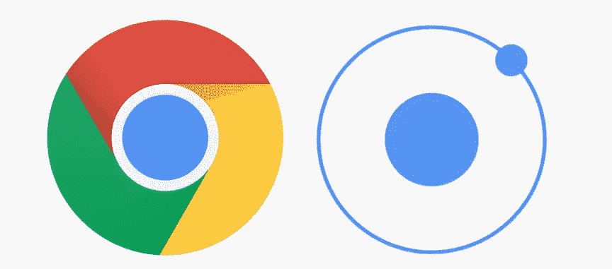
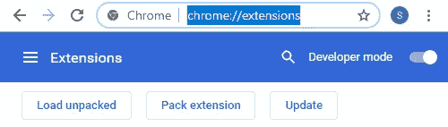
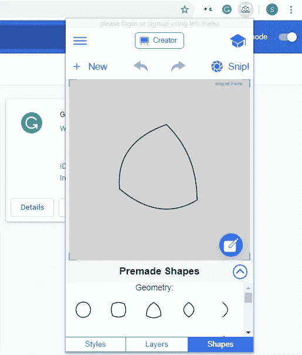

# 如何将你的 Ionic 4 网络应用变成 Chrome 扩展

> 原文：<https://betterprogramming.pub/ionic-4-web-app-as-chrome-extension-14e4d474d3b0>

## 将你的 Ionic 4 网络应用变成谷歌 Chrome 扩展的简单步骤



图片来自作者

# 第一步。Manifest.json

Chrome 扩展名以`manifest.json`文件开始。一个以浏览器为平台的 Ionic 4 应用默认会有一个这样的清单文件，但是 Chrome 扩展需要一个[不同的](https://developer.chrome.com/extensions/manifest):

```
{
 "name": "MyApp",
 "version": "0.9.321",
 "homepage_url": "[https://www.myapp.com](https://www.morphistic.com)",
 "description": "My Awesome App",
 "icons": {
  "16": "assets/img/favicon-16x16.png",
  "32": "assets/img/favicon-32x32.png"
 },
 "manifest_version": 2,
 "background": {
  "scripts": [
   "assets/js/background.js"
  ],
  "persistent": false
 },
 "browser_action": {
  "default_icon": {
   "16": "assets/img/favicon-16x16.png",
   "32": "assets/img/favicon-32x32.png"
  },
  "default_title": "MyApp",
  "default_popup": "index.html"
 },
 "permissions": [
  "notifications",
  "storage"
 ],
 "content_security_policy": "script-src 'self' 'unsafe-eval' [https://connect.facebook.net](https://connect.facebook.net) [https://www.googletagmanager.com](https://www.googletagmanager.com) [https://cdn.firebase.com](https://cdn.firebase.com) [https://*.firebaseio.com](/*.firebaseio.com); object-src 'self'"
}
```

这里我们使用的图标不同于 PWA `manifest.json`中的图标。我们还有`background.js` JavaScript 文件，它将监听扩展生命周期事件并根据需要执行动作。

如上所述，我们正在设计基于`browser-action`的 Chrome 扩展，这意味着，安装后，该扩展将在右上角可用，并且不依赖于特定的页面动作来激活。当然，你可以尝试其他选择。

最后，`content_security_policy`必须考虑你的用例(如 Firebase，脸书或谷歌标签管理器)，并提供必要的例外。

# 第二步。背景. js

我们在 Ionic 的`**src\assets\js**` 文件夹中创建了这个新文件，因为它在构建过程中一直存在，并且在构建完成后将在这个文件夹中可用。

```
chrome.runtime.onInstalled.addListener(function() {
    // here we can execute chrome specific APIs
 });
```

我们可以在以后，在这里，或者根据需要，开始添加能够与 Chrome API 交互的函数和方法。

# 第三步。用高度和宽度更新 index.html:

```
<head>
  <style type="text/css">
    body {
      overflow: hidden;
      min-width: 320px;
      max-width: auto;
    }
    html {
      overflow: hidden;
      min-width: 320px;
      max-width: auto;
      min-height: 568px;
    }
  </style>
</head>
```

我们必须添加这些样式配置，以防止 Ionic 应用程序折叠成一个一英寸的盒子。

# 第四步。加载并测试你的 Ionic 4 Chrome 扩展

现在，您需要像平常一样为浏览器构建应用程序，然后再将其部署到 web 主机上。

```
npm run build --prod
```

完成上述步骤后，您的 www 输出文件夹将包含所有静态文件，包括您的 manifest 和 assets 文件夹。打开这个文件夹，检查你的`manifest.json`，确保一切都设置好了。

现在在你的浏览器中输入 *chrome://extensions* ，启用开发者模式，然后点击 *Load unpacked* 按钮。



这将加载我们所有的静态文件作为解压缩的 Chrome 扩展。我们现在可以把它带到下一个层次，并在扩展库中发布。



简而言之，将 ionic 4 / Angular 应用程序作为 Chrome 扩展并将其作为应用程序的分发选项是相当容易的。