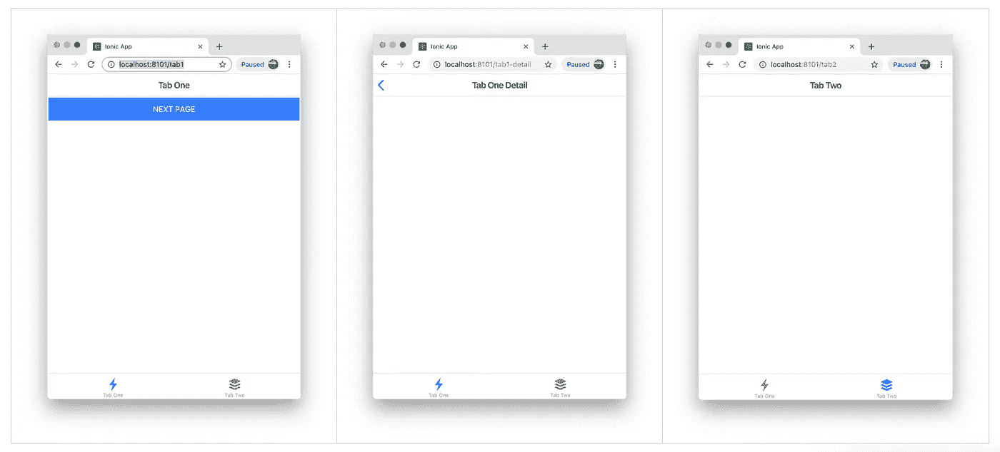

# 离子反应(测试版)标签:逐步

> 原文：<https://betterprogramming.pub/ionic-react-beta-tabs-step-by-step-51c25cfd369d>

## 使用新的 Ionic CLI 生成一个带有选项卡的应用程序，并在第二部分生成一个登录页面来演示身份验证流程

## 本例中使用的离子和反应成分:

*   [IonTabs 文档](https://ionicframework.com/docs/api/tabs)
*   [返回按钮](https://ionicframework.com/docs/api/back-button)
*   [React 路由器文档](https://reacttraining.com/react-router/web/guides/quick-start)

# 入门指南

要开始使用 Ionic CLI 构建您的应用程序，请确保您指定了 React。对于本例，我们将使用 tab starter 作为基线。然后，我们将移动一些东西来更好地构建代码，以获得额外的增强。

*关于如何开始使用 Ionic Framework 对 React.js 的 beta 支持的更多详细说明，请参见这篇* [*博文*](https://ionicframework.com/blog/ionic-cli-v5-brings-react-beta-support/) *。*

在终端控制台中输入以下命令，出现提示时，选择`tabs`作为启动模板:

## 房屋清洁

让我们清理其中的一些文件，为我们的应用程序创建一个更加结构化的起点。

创建一个名为`TabRoot.tsx`的新文件，将`App.tsx`中的`IonApp`元素中的所有内容复制到新组件中。完成后，`App.tsx`应该是这样的:

删除此行:

然后设置新的默认`Route`指向我们刚刚构建的`TabRoot`组件。这意味着当应用程序第一次启动时，它将转到`TabRoot`组件。

`TabRoot.tsx`在粘贴了我们从`App.tsx`中剪切的代码后，应该看起来像下面的代码。

***注*** *:看代码的时候为了节省空间，我把导入都去掉了。我还将标签的数量从三个减少到两个，我相信这足以说明我的观点。*

*请注意，关于 IonTabs 如何在 React 中工作的文档似乎不正确，*

现在应用程序已经设置好了，默认路径是呈现`TabRoot`组件，但是我们仍然需要告诉组件呈现哪个选项卡，我们希望它是`Tab1`:

## 何必呢？

随着应用程序变得越来越复杂，让所有默认路由都基于应用程序路由级别的选项卡可能会有问题。正如您将在后面的章节中看到的，当应用程序必须检查经过验证的用户和受保护的路由时，这种设置将是有益的。

## 清理选项卡 1

`Tab1`中有很多噪音，所以让我们通过将内容从`Tab2`复制到`Tab1`中，使其看起来像`Tab2`:

## 导航到详细页面

让我们复制文件`Tab1.tsx`，并将其重命名为`Tab1Detail.tsx`。完成后清理干净，使其看起来像这样:

在`Tab1`的`IonContent`部分增加一个按钮。该按钮将导航至我们刚刚创建的详细页面`Tab1Detail`:

所以你在`Tab1.tsx`做这个改动的时候会看到几个问题，第一个是:

*`*props.history*`*从哪里来？**

*我们可以使用 react-router `[withRouter](https://reacttraining.com/react-router/web/api/withRouter)`将`[history](https://reacttraining.com/react-router/web/api/history)`对象作为属性传递给组件，因为组件是由`[Router](https://reacttraining.com/react-router/web/api/Router)`呈现的。因此，让我们对文件进行以下更改:*

*然后添加一个参数，并将类型指定为`any`(暂时):*

*最后，我们需要将我们想要导航到的实际路线`/:tab(tab1-detail)`添加到`TabRoot`中的`Router`元素，因此添加新路线:*

*回过头来，我们需要首先将`IonBackButton`组件添加到`Tab1Detail`页面的工具栏中，就在`<IonTitle>`的上方:*

****注意*** *:有一个已知的问题是* `*defaultHref*` *不工作，所以我必须响应* `*onClick*` *事件才能使其工作。**

*如您所见，我们再次使用了`history`属性来返回到上一个组件，因此我们需要添加`withRouter`并正确地指定组件的参数。*

# *资源*

*源代码可从以下网址获得:*

*   *https://github.com/aaronksaunders/ionic-react-tabs-tut*

**原载于 2019 年 6 月 6 日*[*https://dev . to*](https://dev.to/aaronksaunders/ionic-react-beta-tabs-step-by-step-iij)*。**