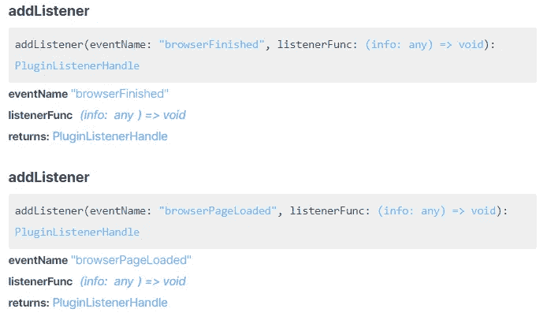
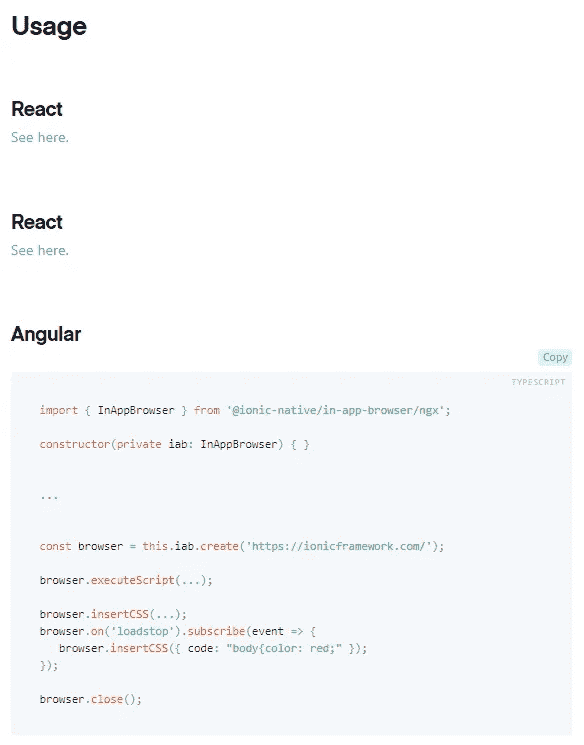

# 离子反应还没准备好

> 原文：<https://betterprogramming.pub/ionic-react-isnt-ready-yet-a064170e4dad>

## 分享我构建 Ionic React 应用的经验

# 一堂简短的历史课

Ionic 是一个构建混合移动应用的框架。当一个移动应用程序混合了 web 技术(如 HTML、CSS、JavaScript)和用于访问原生移动功能的库(如 Cordova 插件)时，它就是混合的 T2。

混合移动应用框架有着悠久的历史。第一个此类产品是 PhoneGap，由软件公司 Nitobi 创建。Nitobi 后来被 Adobe 收购，Adobe 将 PhoneGap 代码库捐赠给了 Apache。Adobe 保留了 PhoneGap 商标，但捐赠的软件被重命名为 Apache Cordova。

然后爱奥尼亚出现了。

Ionic 不是一个单一的框架。这是一个总括术语，指的是允许用户构建混合应用程序的工具集合。还有 [Ionic Framework](https://ionicframework.com/) ，这是一个 UI 库。还有 Ionic Native，它提供了对原生移动功能的访问，如 NFC、地理定位和摄像头。还有电容器，它将你的网络应用程序编译成 Android Studio 或 Xcode 项目。

最初，Ionic 只支持 AngularJS。然而，2019 年 10 月， [Ionic 宣布支持 React](https://ionicframework.com/blog/announcing-ionic-react/) 。作为一个 React 的狂热粉丝，我决定用这个框架构建一个附带项目。然而，我很遗憾地报告，我的开发人员对 Ionic React 的体验令人失望，因为 React 缺乏支持和文档。

# 开发经验

开始是轻而易举的事。Ionic 提供了一个 CLI，可以快速创建一个启动 Ionic React+TypeScript 项目。我可以运行“你好，世界！”几分钟之内我的浏览器中的应用程序。

当我不得不在应用程序中实现 OAuth 登录流时，我在 Ionic React 方面的问题就开始了。我必须找到一个应用内浏览器库，允许我在页面加载时提取 URL。结果是一场噩梦。

我先给了电容器的[浏览器](https://capacitorjs.com/docs/apis/browser)插件一个尝试。我能够打开应用内浏览器并在页面加载时附加一个监听器。然而，我没有从回调函数中得到任何东西，尽管文档中说会有一个`info`对象(如下所示):

截至 2020 年 10 月的电容器浏览器插件文档

在网上搜索了几天之后，我发现了这个[问题](https://github.com/ionic-team/capacitor/issues/3044)，它说`info`对象为空是预期的行为！我指出函数签名`info: any`有严重的误导性。幸运的是，维护人员注意到了这一点，并随后修复了文档。无论如何，插件是一个死胡同，因为它没有把网页的网址传给我。

然后我在应用浏览器库中尝试了 Ionic Native 的[，里面根本没有 React 的文档…](https://ionicframework.com/docs/native/in-app-browser)

截至 2020 年 10 月的 Ionic Native 应用浏览器插件文档

所以我必须从可用的小角度代码片段中拼凑出 React 的代码。在浏览器中开发时，我遇到了这个[问题](https://github.com/ionic-team/ionic-native/issues/3257)，其中我需要的一个函数没有定义。我花了几天时间试图诊断这个问题，但毫无效果。我后来发现，这个插件只是在浏览器中不能用，但在 Android 和 iOS 上可以用。所以我不得不放弃浏览器，转而在 iOS 模拟器中开发，这破坏了拥有一个通用框架的全部目的。

我实现应用内浏览器的经历并不是 Ionic 对 React 支持不足的唯一例子。例如，我也有关于 [ion-tabs 组件](https://ionicframework.com/docs/api/tabs/)的问题，当从 Angular 移植时，它[缺少一些记录的方法](https://github.com/ionic-team/ionic-framework/issues/19935)。一般来说，React 还没有文档和库支持，这导致了令人沮丧的开发体验。

# 很难得到帮助

在试图诊断我的问题时，我也注意到了 Ionic 社区的不活跃。Slack channel 和 Ionic forum 已经死了。通常需要几天才能得到回复，甚至不总是回答我的问题，在这种情况下，我不得不问另一个问题，只需再等几天才能得到答案(或没有)。

# 混乱的生态系统

此外，离子生态系统也让我非常困惑。人们应该选择[电容](https://github.com/ionic-team/capacitor)、[离子原生](https://github.com/ionic-team/ionic-native)或[科尔多瓦插件](https://github.com/apache?q=cordova-plugin)中的哪一个库并不总是很清楚。

继续我的例子，每个项目都有一个应用内浏览器库，它们之间有细微的差别。这导致人们在错误的地方提问，加剧了难以获得帮助的问题。我的意思是，我不怪他发疯。

# 该产品

总的来说，尽管开发人员的经历令人沮丧，但我对最终产品的性能很满意。这款应用感觉既简洁又稳定。也就是说，我的项目非常简单。只有一个登录屏幕，几个页面转换和几个网络呼叫。所以我真的不能证明 Ionic 的性能和原生能力。

# 结论

目前，Ionic React 的唯一主要竞争对手是 React Native，这需要您编写大量 React Native 特定的代码(除非您有 React Native Web，这是另一个时间讨论的内容)。这就是为什么 Ionic React 最初如此吸引我，因为它承诺成为一个真正的万能解决方案。

然而，实际上，Ionic React 仍然非常粗糙。在我自信地把它推荐给别人之前，它还需要更多的润色。在这个阶段，我建议 React 用户继续使用 React Native。