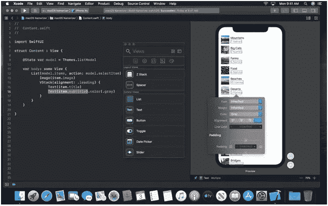

# 如何避免 UITableView 再次意外崩溃

> 原文：<https://betterprogramming.pub/ios-13-be-dynamic-with-diffabledatasource-56ed938a0325>

## 介绍`DiffableDataSource`

# **概述**

> 尝试将第 144 行插入节 0，但更新后节 0 中只有 0 行。

我想没有一个 iOS 开发者之前没见过这种崩溃。最后，在十多年后，苹果决定给出一个体面的解决方案，来解决我们在表格和集合视图上遇到的最令人沮丧的问题之一——动画化集合的变化。

# **苹果在这里混合了一点 SwiftUI 的概念**

与 SwiftUI 一起发布的`DiffableDataSource`并非巧合。旧的好的`UITableViewDataSource`协议基于两种方法——`cellForRow`和`numberOfRows`——只处理单元和索引路径，`DiffableDataSource`被附加到数据本身，并且可以在`Hashable`协议的帮助下区分数据项。

就像 SwiftUI 一样，`DiffableDataSource`有一种机制，可以在为您计算数据差异的同时应用更改，并几乎自动地将 UI 转换到新的状态，并带有漂亮的动画。

# **巧妙应用变化；这只是冰山一角**

苹果向我们出售`DiffableDataSource`作为 insertRowsAtIndexPath 崩溃的解决方案。事实上，它改变了集合处理数据的整个方式，从准备数据项、创建单元格、重新加载特定单元格开始，一直到处理刷新集合的外部服务。

当你第一次接近`DiffableDataStructure`时，你需要暂时忘记`UITableDatasource` / `UICollectionViewDatasource`是如何工作的，因为`DiffableDataStructure`是完全不同的东西。

以下是使用`DiffableDataSource`时的主要步骤:

1.  准备符合`Hashable`协议的数据项。
2.  创建为集合生成单元格的数据源。
3.  创建一个快照并用数据项填充它。
4.  通过修改快照并将其应用于数据源来响应更改。

# **数据项**

快照必须与符合`Hashable`的数据项一起工作才能发挥它们的魔力。这听起来可能微不足道，但事实并非总是如此。有时，开发人员创建更多的动态数据源，这些数据源依赖于一些逻辑，而不是结构或对象的列表。例如，`if indexPath.row == 0 { // show something // )`是一个常见的用例。在这里，我们需要创建数据项，并根据它们的类型定义数据源和快照。

不同数据源的模型

由于枚举成员值和 Swift 基本类型(String，Int..)都符合`Hashable`协议，完成这个任务并不难。

# **新数据源**

于是数据源对象替换了符合`UITableViewDataSource`的对象，使用起来非常简单。

你需要做的就是:

1.  声明数据源的两种类型—节类型和行类型。

2.分配数据源，并在闭包中根据行类型返回单元格。

创建数据源

保留对此数据源的引用，因为您将需要它来应用快照。

# **使用快照**

创建快照

我们创建了数据源，但是我们没有给它任何数据来处理。因此，如果您想填充数据源，快照是一个不错的选择。

创建一个与数据源使用相同类型的`NSDiffableDataSourceSnapshot`,将项目添加到快照中，并在数据源中应用更改。

快照不仅仅可以添加项目和部分。他们还可以移动、删除和重新加载数据源中的项目。

工作方法是您可以获取数据源中显示的当前快照并修改它，或者您可以创建一个新的快照并将其应用到您的数据源。

此外，您不必保留对传递到快照的对象的引用—一旦传递了这些对象，您的数据源和快照对象就有了对它们的引用。

现在，我们来谈谈常见的用例，以及如何用快照来实现它们。

## **为您的收藏创建初始数据:**

要显示数据，数据源对象需要快照。创建快照，向其中添加数据，然后将其添加到数据源。

注意:快照需要至少一个节才能工作，所以只需添加一个枚举值作为节，以防数据是平面的。

通常，最好创建一个既接受数据结构又接受快照的函数，并用条目填充快照。

## **添加、删除或移动快照中的项目:**

要更改当前列表，您不必创建新的快照。只需从数据源(`datasource.snapshot()`)中检索当前快照，并进行相关更改。

如果您想向快照添加一个项目，使用一个`snapshot.appendItems()`并传递项目列表和部分。

如果您想在列表中的特定位置插入一个项目，请使用`snapshot.insertItems`。

要删除项目，使用`snapshot.deleteItems()`并传递要删除的项目列表。

## **我想重新加载特定的单元格**

不过，重新加载一个单元格有点棘手。您可以将修改过的项传递给快照，但是当生成单元的闭包运行时，它将传递旧的项。(我不知道这是一个错误还是有意为之，但这就是它的工作方式。)解决方案是始终保留一个更新的数据存储，并在传递到快照之前按 ID 获取项目。

## **我想用新数据替换当前数据**

如果识别新的更改太复杂，或者您只想用新数据重新加载集合，只需创建一个新的快照，用您想要的内容填充它，并将其应用到数据源。如果当前快照中存在新快照中存在的项目，那么 datasource 足够智能，可以用一个漂亮的动画来应用这些更改。

## **如何响应选择项目、布局…？**

我们说`DiffableDataSource`只取代了`UITableViewDataSource`。您仍然可以在`DiffableDataSource`旁边使用`UITableViewDelegate`，并像以前一样实现`didSelectRow`。

## 计算变化似乎是一项繁重的任务。我能从后台线程调用它吗？

是的，你可以！不过我不确定这是否有必要，因为看起来苹果工程师在这方面做得很好。你只需要记得让它保持一致；如果从后台线程调用它，只需确保对特定数据源的所有调用都是从后台线程调用的。

# **我需要支持 iOS 12**

欢迎来到现实；在接下来的一年里，你可能需要支持 iOS 12 用户，所以关于向后兼容性的一些提示:

仅在 iOS 12 中将`UITableViewDataSource`设置为表格视图。否则，表格视图将在 iOS 13 中处理两个数据源，而这不是您想要的。

将`UITableViewDataSource`移动到不同的类别。这不是强制性的，但是当你需要支持两种不同的 API 时，最好让你的生活更简单。

如果 iOS 12 中的变化动画对你来说太复杂，就用`UITableView.reloadData()`的方法，给 iOS 13 用户留下更好的体验。iOS 13 新版本的采用速度非常快，几个月后 iOS 13 将成为最受欢迎的 iOS 版本。

# **所以，这就是不合适视图的稳定性问题的终结，对吗？**

嗯，差不多了。只要你采取有意义的行动，你就是安全的。但是你还是可以用`DiffableTableView`让应用崩溃。

如何使其崩溃的一些例子:

1.  向不存在的部分添加项目
2.  删除项目，然后重新加载它
3.  在根本没有节的情况下添加项目
4.  移动不在快照中的项目

我能想到更多的例子，但你明白了。不要在 App Store 上尝试:)

# **总结**

`DiffableDataSource`一定能让你的生活更轻松，给你的用户更好的用户体验。一些挑战随之而来——你需要调整你的应用模式(MVVM/MVP/VIPER/MVC)，看看它如何与新的 API 集成，对你的模型进行更改，当然，至少在明年仍然支持 iOS 12。