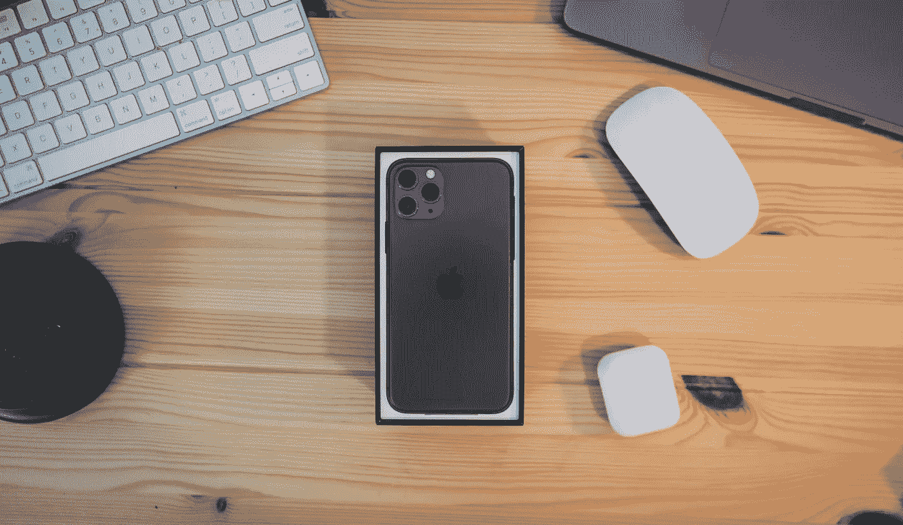
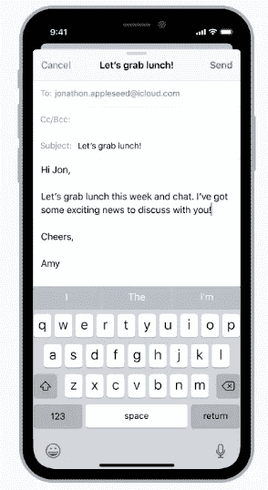
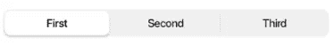
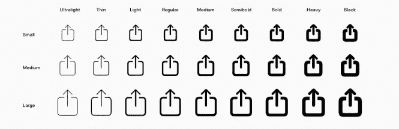
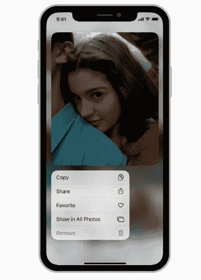
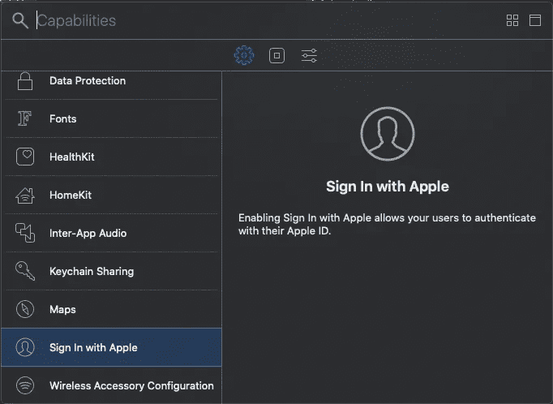
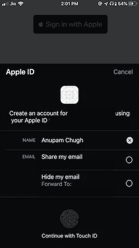
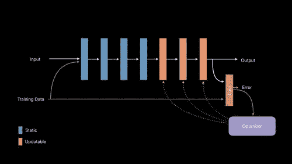

# iOS 13 开发者清单

> 原文：<https://betterprogramming.pub/ios-13-checklist-for-developers-ef47e413aad2>

## 为 iOS 13 发布下一款应用时可参考的清单



由[安迪·菲利西奥蒂](https://unsplash.com/@someguy?utm_source=unsplash&utm_medium=referral&utm_content=creditCopyText)在 [Unsplash](https://unsplash.com/s/photos/iphone-11?utm_source=unsplash&utm_medium=referral&utm_content=creditCopyText) 上拍摄的照片

[iOS 13](https://www.apple.com/ios/ios-13/features/) 终于向公众推出了，紧随其后的是 13.1。我相信你会用它来发布你的下一个应用程序更新，但首先，让我们来看一下基本事项的清单。

*   iOS 13 中发布了 **PencilKit** 框架。它允许开发人员通过 Apple Pencil 或用户手指输入内容，轻松集成手绘内容的绘图环境。
*   **设备上的语音识别**使用`SFSpeechRecognizer`允许开发人员进行离线转录、语音分析等工作。这肯定会推动基于语音的人工智能应用。
*   SwiftUI 框架今年吸引了最多的眼球。它让你以一种完全不同的方式构建酷的和创新的用户界面。你必须意识到这一点，除非你一直生活在岩石下。
*   **Combine** 是一个反应式编程框架。
*   **RealityKit** 框架用于轻松模拟和渲染 3D 内容。构建更好的 AR 应用程序！
*   **Project Catalyst** 允许我们轻松地将 iOS 应用移植到 macOS。只需勾选复选框，将 macOS 添加为目标。这个在 Mac OS 10.15 及以上应该可以。

现在，让我们离开那些制造噪音的流行框架，深入了解一下重要的更新。

# 视图控制器默认显示样式

在 iOS 13 中，苹果将视图控制器的默认呈现风格从 iOS 12 中的全屏改为模态表。模式表是一种类似于表单的卡片，可以通过拉下它来删除。如果你不想以这种方式关闭视图控制器，这会中断你的应用程序的流程。



来自苹果文档

## 我想要全屏视图控制器

从 iOS 13 开始，如果你想要全屏，你需要明确指定演示风格，如下所示:

```
vc.modalPresentationStyle = .fullScreen let navigationController = UINavigationController(rootViewController: vc) navigationController.modalPresentationStyle = .fullScreen present(vc, animated: true)
```

若要防止拉动以消除手势，请添加以下代码行:

```
vc.isModalInPresentation = true
```

通过使用`IAdaptivePresentationControllerDelegate`协议中新添加的功能，您甚至可以更好地控制模式表上的滑动以消除:

*   当`isModalInPresentation`为真并且用户仍然试图通过向下滑动来消除时，调用`presentationControllerDidAttemptToDismiss`。
*   `presentationControllerWillDismiss`可以在用户尝试上下滑动视图控制器时触发。
*   `presentationControllerDidDismiss`
*   `presentationControllerShouldDismiss`

# UINavigationBar 大标题样式更改

从 iOS 13 开始，大标题样式的 UINavigationBar 不再半透明。它现在是透明的。

我们可以像这样把样式改回半透明:

```
let appearance = UINavigationBarAppearance() appearance.configureWithDefaultBackground() UINavigationBar.appearance().scrollEdgeAppearance = appearance
```

`UINavigationBarAppearance`是自定义外观的新类。
`UINavigationBar`由三种内置外观类型组成:

*   `standardAppearance`
*   `compactAppearance`
*   `scrollEdgeAppearance`用于大标题导航条。

# 改进的 UISegmentedControl

新的 UISegmentedControl 具有 3d 效果。但更重要的是，`tintColor`属性*在 iOS 13 中不再起作用*。相反，我们需要使用`selectedSegmentTintColor`来改变所选片段的背景颜色。



UISegmentedControl 的新外观

# SF 符号

从 iOS 13 开始，UIImage 有了新的初始化器，`systemName`。您可以通过在 SF Symbols mac 应用程序中查找来将系统名称作为字符串传递，该应用程序包含 1000 多个系统图标。你可以在这里下载[。](https://developer.apple.com/design/resources/)

```
UIImage(systemName: trash.fill)
```



来自苹果文档

# SceneDelegate 支持多窗口

iPadOS 在同一个应用程序中提供了多窗口支持。现在，当你创建一个新的 Xcode 时，你会看到一个`SceneDelegate`文件。这是用于管理单个场景(窗口)。因此，AppDelegate 的 UI 相关职责现在由 SceneDelegate 接管。

像 AppDelegate 中的`applicationDidBecomeActive`这样的生命周期方法不再有效。相反，像`sceneDidBecomeActive`这样的 SceneDelegate 方法现在被触发。

> 要恢复旧的行为，从`info.plist`文件中移除`Application Scene Manifest`条目，并将窗口属性添加回`AppDelegate`中。

# 新上下文菜单

上下文菜单取代了只能在 3D 触摸设备上使用的 Peek 和 Pop。

另一方面，上下文菜单适用于所有设备。我们可以设置菜单，子菜单以及预览目标视图控制器。

菜单就在预览的上方或下方可见。



新的上下文菜单。图片来自苹果文档

为了在集合/表视图上实现上下文菜单，在委托中有一个新添加的函数，您需要覆盖它。

对于集合视图，它是:

```
func collectionView(_ collectionView: UICollectionView, 
contextMenuConfigurationForItemAt indexPath: IndexPath, point: CGPoint) -> UIContextMenuConfiguration?
```

我们可以定义自己的`UIMenu`并给它们分配动作。

要从预览中打开目标视图控制器，我们需要实现方法:

```
func collectionView(_ collectionView: UICollectionView, 
willPerformPreviewActionForMenuWith configuration: UIContextMenuConfiguration, 
animator: UIContextMenuInteractionCommitAnimating)
```

# 深色模式和动态颜色

我们可以在 iOS 13 中使用`traitCollection`的一部分`userInterfaceStyle`属性将用户界面定制为黑暗模式。
动态颜色现已推出，可用于深色或浅色模式。我们甚至可以为`lightAppearance`和`darkAppearance`分配我们自己的颜色或动态图像。

为了退出黑暗模式或将外观锁定为一种类型，我们在 info.plist 文件中将`UIUserInterfaceStyle`设置为亮/暗。

# 登录 Apple



Xcode 截图

从 iOS 13 开始，我们可以在应用程序中集成 Apple button 的登录功能。这是一种安全简单的登录方式，只需要用户名和电子邮件地址。

此外，用户可以选择在应用程序中隐藏他们的电子邮件地址。

要在您的应用程序中添加使用苹果按钮登录，只需`import AuthenticationServices`并在您的 ViewController 中添加以下代码:

```
let button = ASAuthorizationAppleIDButton()        button.addTarget(self, action: #selector(handleAuthorization), for: .touchUpInside)        
self.view.addSubview(button)
```

然后，您可以在单击按钮时处理授权和验证部分。请注意，这需要 Xcode 11。



使用苹果按钮和授权对话框登录。

# Vision API 获得核心 ML 提升

视觉 API 因包含*文档摄像机视图控制器*而得到提升。由于改进的机器学习模型，光学字符识别现在容易得多。此外，Vision API 现在推出了一个*宠物动物分类器*。是的，检测一只猫或一只狗不需要核心 ML 模型！只需使用`VNRecognizeAnimalRequest` ，它是`VNImageRequest`的一部分。

你知道吗？

*iOS 13 上的 Files App 现在内置了 PDF 扫描仪。之前只有 notes 应用有这个。它使用升级的 Vision API 和文档照相机控制器代理。*

# 基于设备个性化的 Core ML 3



来自 [WWDC 2019 视频](https://developer.apple.com/videos/play/wwdc2019/704/)

模型的设备训练是今年核心 ML 的一个关键发展。现在，您可以在设备本身上训练 ML 模型。

通常，这用于更新特定用例的模型。使用`coremltools` 3.0 及以上版本构建可更新的核心 ML 模型。

今年，NLP 框架有了重大的更新，比如单词嵌入和核心 ML 3 中的更多内容。

以上总结了 iOS 13 的大部分要点。

## 实施资源

这里有一个资源列表，包含上面讨论的一些特性的实现。

*   [上下文菜单和 SF 符号](https://medium.com/better-programming/ios-context-menu-collection-view-a03b032fe330)
*   [使用文档摄像头的视觉文本识别](https://medium.com/@anupamchugh/ios-vision-text-document-scanner-effc0b7f4635)
*   [视觉动物分类器请求](https://medium.com/@anupamchugh/ios-vision-cat-vs-dog-image-classifier-in-5-minutes-f9fd6f264762)
*   [如何使用 Core ML 3 创建可更新的模型](https://medium.com/better-programming/how-to-create-updatable-models-using-core-ml-3-cc7decd517d5)
*   [如何在设备上训练您的模型](https://medium.com/better-programming/how-to-train-a-core-ml-model-on-your-device-cccd0bee19d)
*   [铅笔套件介绍](https://medium.com/better-programming/an-introduction-to-pencilkit-in-ios-4d40aa62ba5b)、[带芯 ML](https://medium.com/better-programming/pencilkit-meets-core-ml-aefe3cde6a96) 、[带地图套件](https://medium.com/better-programming/cropping-ios-maps-with-pencilkit-da7f7dd7ec52)
*   [iPadOS 中的多窗口支持](https://medium.com/better-programming/implementing-multiple-window-support-in-ipados-5b9a3ceeac6f)

敬请关注更多更新。

[](https://medium.com/@anupamchugh/ios-14-checklist-for-developers-372bd6d2507e) [## iOS 14 开发者清单

### 让你的应用为 iOS 14 做好准备你需要知道什么

medium.com](https://medium.com/@anupamchugh/ios-14-checklist-for-developers-372bd6d2507e)