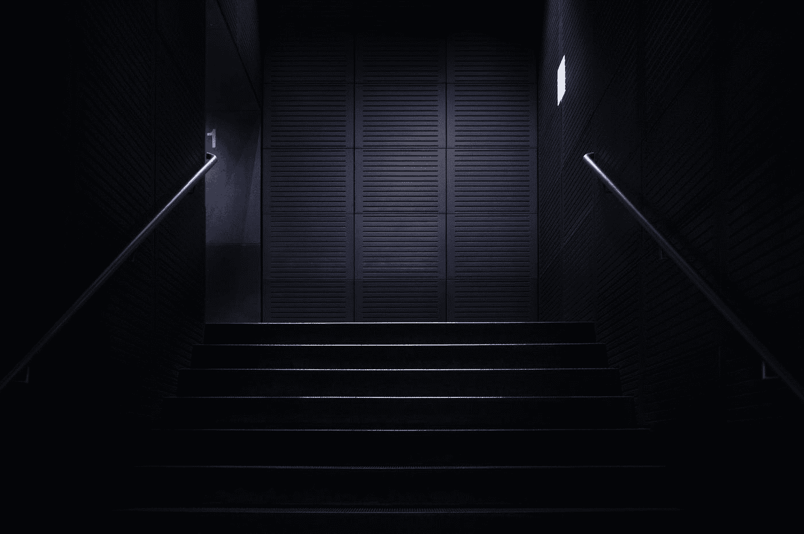
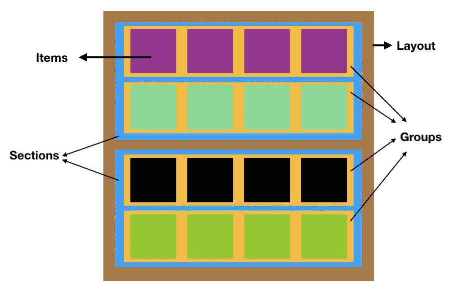
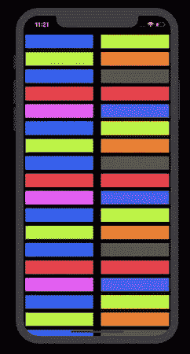
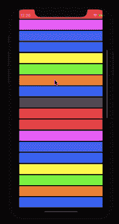

# iOS 13 集合视图中的合成布局

> 原文：<https://betterprogramming.pub/ios-13-compositional-layouts-in-collectionview-90a574b410b8>

## 探索用于编写复杂布局的强大的新 API



照片由[阿塔纳斯·特奥多西耶夫](https://unsplash.com/@teodosiev?utm_source=medium&utm_medium=referral)在 [Unsplash](https://unsplash.com?utm_source=medium&utm_medium=referral) 上拍摄

苹果今年在`CollectionView`布局上带来的进步证明了一个事实，尽管引发了风暴[swift ui](https://developer.apple.com/xcode/swiftui/),[UIkit](https://getuikit.com/)还没有结束。至少近期不会，因为 SwiftUI 目前甚至不支持`CollectionView`。

`UICollectionFlowLayout`在简单的布局中工作得很好，但是随着设计变得越来越多样化，需要构建定制的布局，这有它自己的问题。

样板代码和自调整单元格的挑战只是使构建高级设计变得麻烦的几个问题。

很高兴，在 WWDC 2019 期间，苹果推出了组合布局，目标是简化我们应用程序中复杂布局的开发过程。

# 构图布局:引擎盖下

组合布局是一种声明式的 API，它允许我们通过拼接较小的布局组来构建大型布局。组合布局有一个层次结构，包括:`Item`、`Group`、`Section`和`Layout`。



构图布局的层次

# 核心概念

要构建任何组合布局，需要实现以下四个类:

*   `NSCollectionLayoutSize` —宽度和高度尺寸属于`NSCollectionLayoutDimension`类型，可通过设置布局的部分宽度/高度(相对于其容器的百分比)或通过设置绝对或估计尺寸来定义。
*   `NSCollectionLayoutItem` —这是根据尺寸在屏幕上呈现的布局单元格。
*   `NSCollectionLayoutGroup` —它以水平、垂直或自定义形式保存`NSCollectionLayoutItem`。
*   `NSCollectionLayoutSection` —用于通过传递`NSCollectionLayoutGroup.`部分来初始化部分，最终组成组合布局。

# 履行

让我们来看看混合(确切地说，嵌入)上述每个组件来构建`CollectionView`的组合布局的代码。

```
private func createLayout() -> UICollectionViewLayout {//1
let itemSize = NSCollectionLayoutSize(widthDimension: .fractionalWidth(1.0),heightDimension: .fractionalHeight(1.0))let item = NSCollectionLayoutItem(layoutSize: itemSize)//2
let groupSize = NSCollectionLayoutSize(widthDimension: .fractionalWidth(1.0),heightDimension: .absolute(44))//3
let group = NSCollectionLayoutGroup.horizontal(layoutSize: groupSize,subitems: [item])let section = NSCollectionLayoutSection(group: group)let layout = UICollectionViewCompositionalLayout(section: section)return layout}
```

上面的代码是为`CollectionView`构建组合布局的一个非常基本的例子。让我们看看在几个关键点上发生了什么:

1.  通过将项目布局的`fractionalWidth`和`fractionalHeight`设置为 1，我们将项目分配为占据整个组的宽度和高度。
2.  类似地，组尺寸被设置为占据截面的整个宽度和绝对高度。
3.  该组的布局大小和子项被包装到 section 组件中，最终进入复合布局。

要将组合布局添加到我们的集合视图中，只需将其添加到初始化器中，如下所示:

```
collectionView = UICollectionView(frame: view.bounds, collectionViewLayout: createLayout())
```

# 团体是至关重要的

即使第一眼看上去不像，组也是最终决定物品高度的组件。此外，他们甚至可以覆盖项目的大小尺寸。

在下面的代码片段中，我们显式设置了每组的项目数，这将自动确定组中每个项目的大小并覆盖默认项目大小:

```
let group = NSCollectionLayoutGroup.horizontal(layoutSize: groupSize,subitem: item, count: 2)
```

# 项目间距

构图布局提供了很多增加空间的选择。它可以在项目或组上完成，如下面的代码片段所示:

```
item.contentSize = NSDirectionalEdgeInsets(top: 5, leading: 5, trailing: 5, bottom: 5)group.interItemSpacing = .fixed(CGFloat(10))
```

我们已经将我们的集合视图单元格映射到一些随机的`UIColors`，这最终给了我们这个:



带组和项目间距

只需几行代码，您就可以为复合布局带来全新的外观。在下一节中，我们将探索具有不同布局的多个部分。

# 多个部分，多种布局

除了我们之前看到的自顶向下定义布局的方式，我们可以使用闭包来初始化部分，并将它们返回到组合布局。

下面这段代码显示:

以上代码或多或少类似于我们之前看到的代码，除了我们正在创建部分提供者闭包并将它们返回到布局中。基于上面代码片段中的节号，我们设置了不同的列数。

`layoutEnvironment`包含与视图相关的有用属性。我们可以从这个参数中获取视图的宽度/高度，并基于此在不同的屏幕尺寸上设置每组的项目数。

在我们的例子中，我们在`CollectionView`中将段数设置为 3，并得到以下结果:



屏幕截图

因此，我们已经讨论了对于构建复合布局至关重要的各种组件。包含上述示例的完整源代码可以在这个 [GitHub 资源库](https://github.com/anupamchugh/iowncode/tree/master/iOS13CompostionalLayouts)中获得。

# 还有更多

我们可以通过在组合布局中使用补充视图和徽章来构建更有趣的布局。

[Diffable 数据源](https://medium.com/better-programming/applying-diffable-data-sources-70ce65b368e4)是在 WWDC 2019 期间推出的，可以很好地与组合布局配合使用，因为它使用类型安全标识符来识别其部分和项目。我们将在下一部分讨论这些。

这就结束了。我希望你喜欢读它。

# 下一部分

[](https://medium.com/better-programming/applying-diffable-data-sources-70ce65b368e4) [## 应用不同的数据源

### 再见 reloadData()和 performBatchUpdates()

medium.com](https://medium.com/better-programming/applying-diffable-data-sources-70ce65b368e4)