# 带有 Siri 对话框的 IOS 13 自定义意图

> 原文：<https://betterprogramming.pub/ios-13-custom-intent-with-siri-dialog-909d5d78e9ed>

## 通过应用程序中 Siri 的语音命令获得用户的输入


2018 年，在全球开发者大会上，苹果宣布了新的应用程序 Siri Shortcuts，允许 iOS 用户为他们的应用程序创建自定义语音命令。

一年后，在 2019 年全球开发者大会上，苹果赋予了 Sirikit 更多权限，可以通过 Siri 对话框在自定义意图中要求用户输入参数。

这让我非常兴奋。我看了相关的 WWDC 视频([介绍快捷方式的参数](https://developer.apple.com/videos/play/wwdc2019/213/)，[建立伟大的快捷方式](https://developer.apple.com/videos/play/wwdc2019/805/))，看了苹果提供的[示例应用](https://developer.apple.com/documentation/sirikit/soup_chef_accelerating_app_interactions_with_shortcuts)，但开始使用都有点棘手。我想要一个每一步的指南，但是我找不到。所以我正在自己写这个教程，包括我所面临的所有问题以及我是如何解决它们的。

# 我们开始吧

首先，iOS 13 有一个问题，Siri 只是将你重定向到 shortcuts 应用程序中的快捷方式，而不是要求输入参数。这个在 iOS 13.1 修复了，现在很神奇。

在这篇文章中，我们将构建一个简单的待办事项应用程序，它将从 Siri 中获取两个用户输入的语音参数(待办事项标题和描述)，您可以使用`UserDefaults`将其保存到您的应用程序中。

# 启用 Siri

要将 Siri 功能添加到您的项目中，请在项目导航器中选择您的项目并单击 Signing & Capabilities 选项，然后从+ capability 按钮添加 Siri。

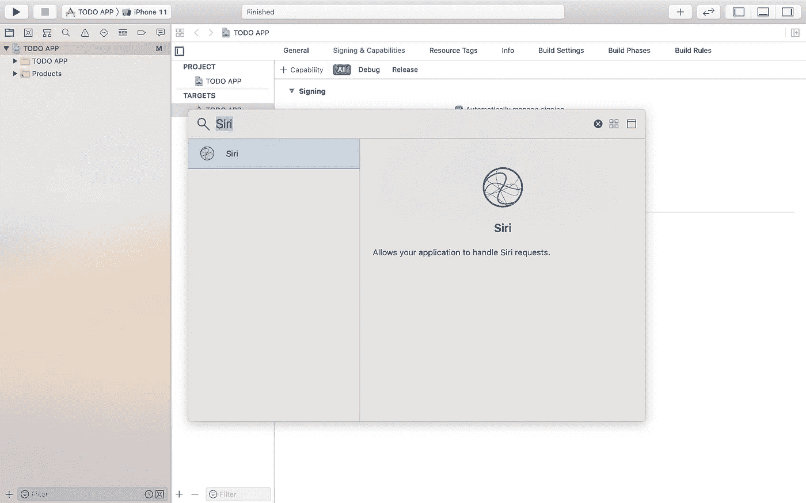

# 添加 Siri 意图和意图 UI

我们需要一个可以在应用程序之外运行的自定义意图，所以下一步是添加两个新目标。在 project navigator 中选择您的项目，添加一个新目标，选择 Intents Extension，命名该扩展，并确保选中“Include UI Extension”。

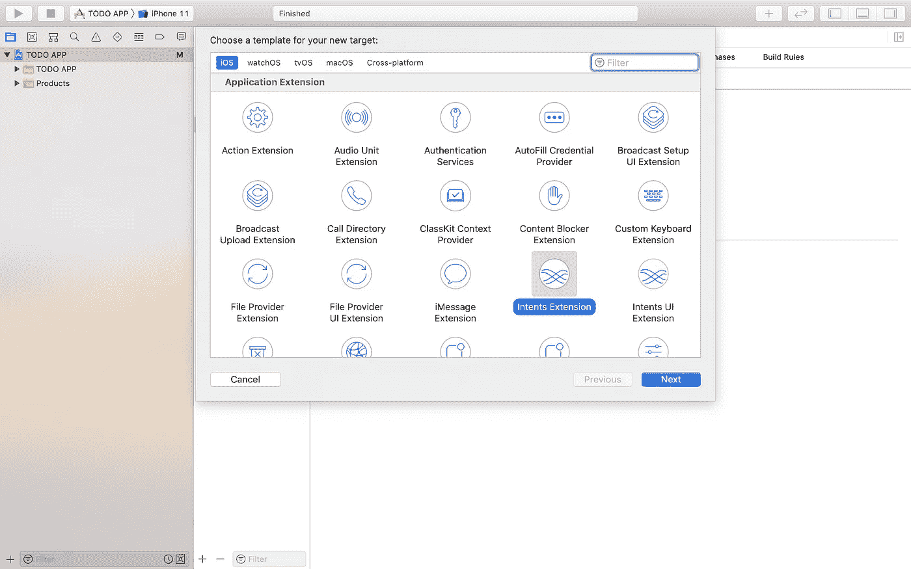

将出现两个弹出窗口来激活目标方案。点击“激活”。

# 意图定义

接下来，我们用 SiriKit 意图定义文件定义我们的自定义意图。

从“文件→新建”中，选择“SiriKit 意图定义文件”

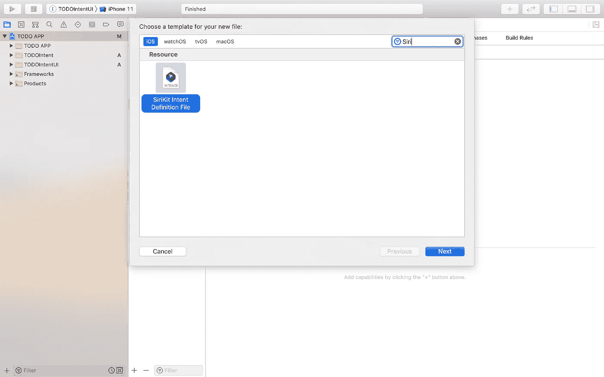

要添加一个新的意图，点击所示的+按钮，并给它起一个你想要的名字。

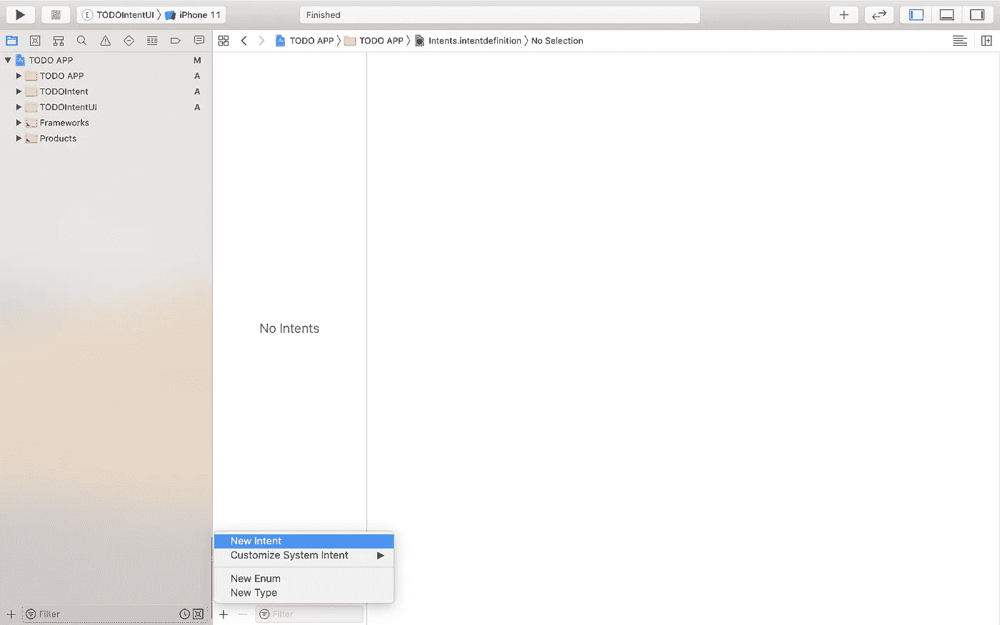

选择最能描述您意图的类别，然后添加描述。

现在到了激动人心的部分，我们添加了 Siri 稍后会要求用户输入的参数。

对于我们简单的待办事项应用程序，Siri 会要求用户输入标题和描述。Siri 会询问一系列已定义的参数。

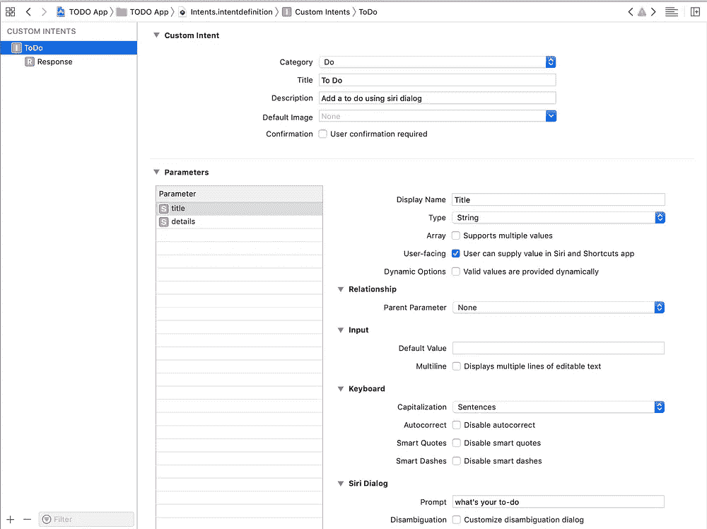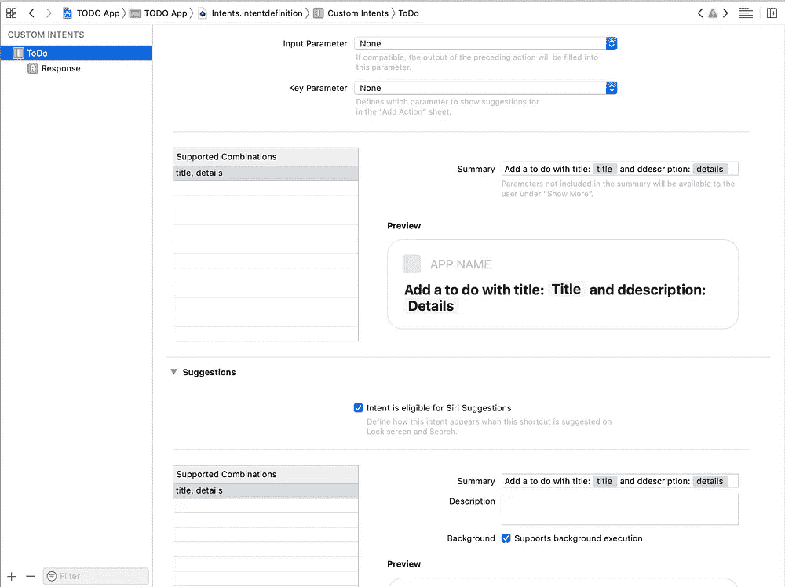

相应地配置每个输入参数，然后在 Siri 对话框部分添加提示信息，Siri 将在请求输入时朗读该信息。

接下来，我们配置 Siri 如何响应，在自定义意图导航器中使用“Response”。在这里，我们可以添加当我们的意图被执行时 Siri 将如何响应。

对于待办事项应用程序，响应将包含到目前为止创建的待办事项的数量。

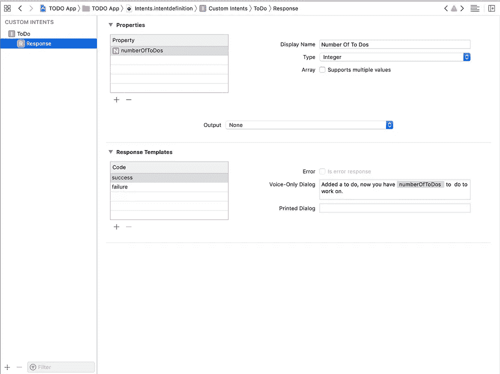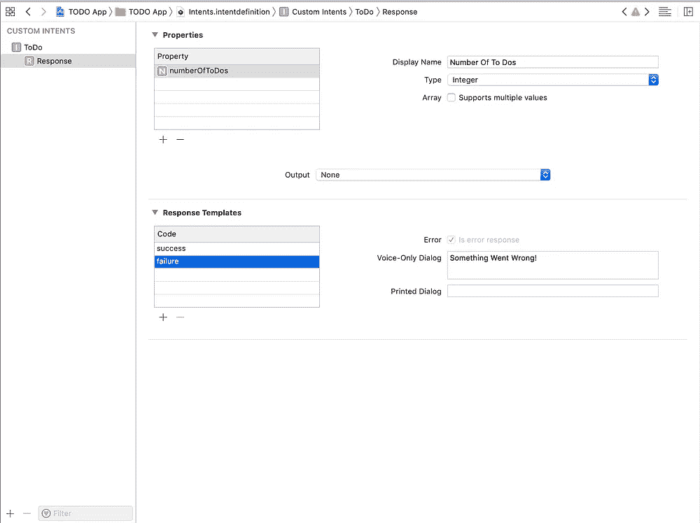

# 意图类生成语言

我面临的一个问题是 Xcode 自动生成 Objective-C intent 类，这给生成的类带来了一些可见性问题。为了避免这种情况，在项目导航器中选择您的项目并点击“构建设置”，选择“所有”过滤器，然后键入“intent class generation language”并选择“Swift”

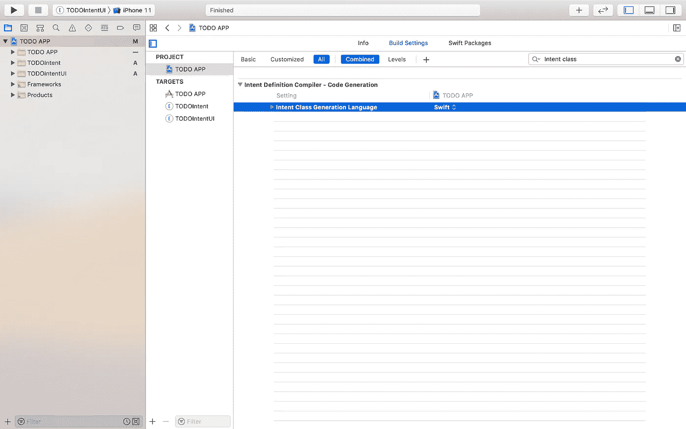

现在我们完成了配置。Xcode 将为每个意图定义生成一个类和协议。

# 处理自定义意图

在 project navigator 中，您将找到我们之前创建的 Intent Extension 和 Intent UI。在意向扩展中，你会找到 Xcode 为我们创建的`IntentHandler.swift`文件。这个文件处理所有的意图。将其代码替换为:

```
import Intents

class IntentHandler: INExtension {

    override func handler(for intent: INIntent) -> Any {
                guard intent is ToDoIntent else {
                    fatalError("Unhandled Intent error : \(intent)")
                }
        return ToDoIntentHandler()
    }

}
```

在这里，我们要确保我们处理的意图确实是我们的意图，然后才开始用我们的自定义意图处理程序来处理它。现在我们需要创建一个新的意图处理程序文件—在本例中是`ToDoIntentHandler.swift`。

```
import Foundation
import Intents

class ToDoIntentHandler : NSObject, ToDoIntentHandling {
    func resolveTitle(for intent: ToDoIntent, with completion: @escaping (INStringResolutionResult) -> Void) {
        guard let title = intent.title else {
            completion(INStringResolutionResult.needsValue())
            return
        }
        completion(INStringResolutionResult.success(with: title))
    }

    func resolveDetails(for intent: ToDoIntent, with completion: @escaping (INStringResolutionResult) -> Void) {
        guard let details = intent.details else {
            completion(INStringResolutionResult.needsValue())
            return
        }
        completion(INStringResolutionResult.success(with: details))
    }

    func handle(intent: ToDoIntent, completion: @escaping (ToDoIntentResponse) -> Void) {
        let listSize = addTODO(title: intent.title!, details: intent.details!)
        completion(ToDoIntentResponse.success(numberOfToDos: NSNumber(value: listSize)))
    }

    //implement this method to get the to-do list from UserDefaults, add to it, save it again to user defaults
    //and return its size
    func addTODO(title: String, details: String) -> Int{
    }
}
```

这里，我们添加四个方法。一个是处理，两个是参数解析方法，第四个是一个函数，如果存在的话，从`UserDefaults`获取一个先前保存的列表，向其中添加新的待办事项，更新`UserDefaults`中的列表，并返回它的大小供我们设置为我们在意图定义文件中预定义的响应属性。很抱歉我不能和你分享我的实现。

我们必须成功地解析所有的参数，在我们的例子中，我们需要用户输入所有的输入参数，所以我们使用了`.needValue()`，它将要求用户输入要解析的值，直到我们可以用意图值调用`.success()`。

在其他应用程序中，您可能需要其他参数解析器，[您可以在此查看所有其他分辨率及其用途。](https://developer.apple.com/documentation/sirikit/resolving_and_handling_intents/resolving_the_parameters_of_an_intent#2864163)

# 捐赠快捷方式

贡献快捷方式意味着向 Siri 提供它需要的信息，以便就用户最近完成的操作提出相关建议。

```
import UIKit
import Intents

class SceneDelegate: UIResponder, UIWindowSceneDelegate {

    var window: UIWindow?

    func scene(_ scene: UIScene, willConnectTo session: UISceneSession, options connectionOptions: UIScene.ConnectionOptions) {
        donateIntent()
        guard let _ = (scene as? UIWindowScene) else { return }
    }

    private func donateIntent(){
        let intent = ToDoIntent()
        intent.suggestedInvocationPhrase = "Add New To Do"
        let interaction = INInteraction(intent: intent, response: nil)

        interaction.donate { (error) in
            if error != nil {
                if let error = error as NSError? {
                    print("Interaction donation failed: \(error.description)")
                } else {
                    print("Successfully donated interaction")
                }
            }
        }
    }

}
```

编写一个方法来捐赠我们的自定义意图。创建一个`InInteraction`的实例，并用缺省的意图参数值进行捐赠。现在让我们称它为`SceneDelegate.swift`中的内部场景函数，不要忘记在顶部的`import Intents`。

现在，我们可以从快捷方式应用程序创建一个快捷方式。

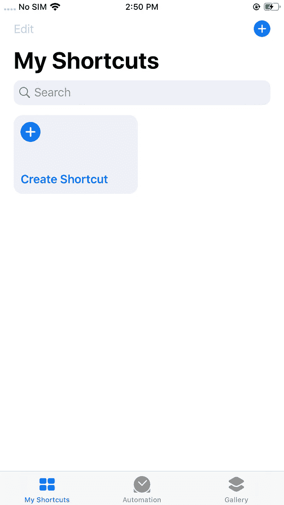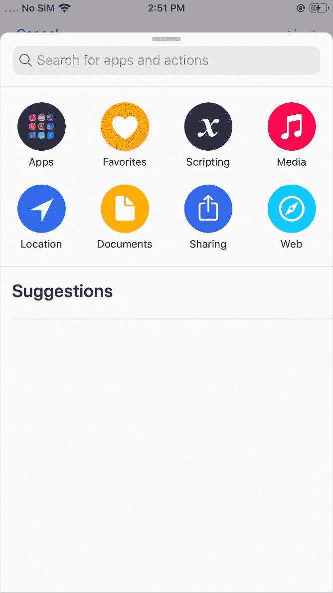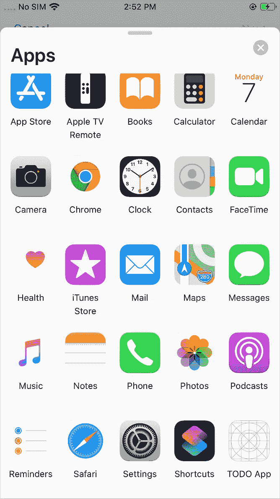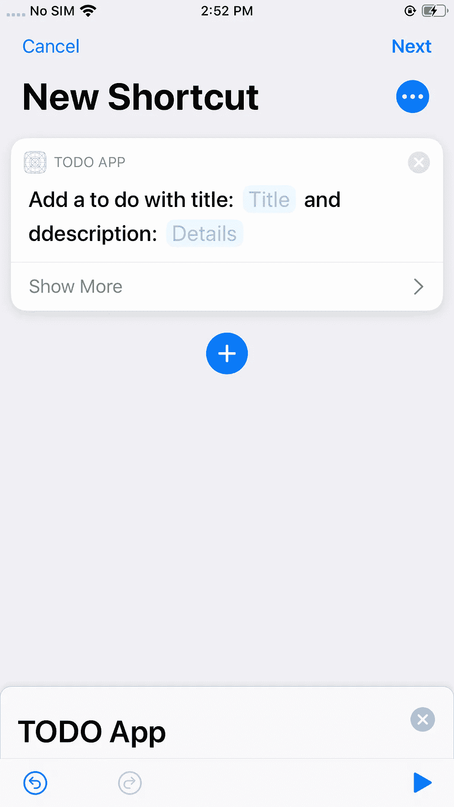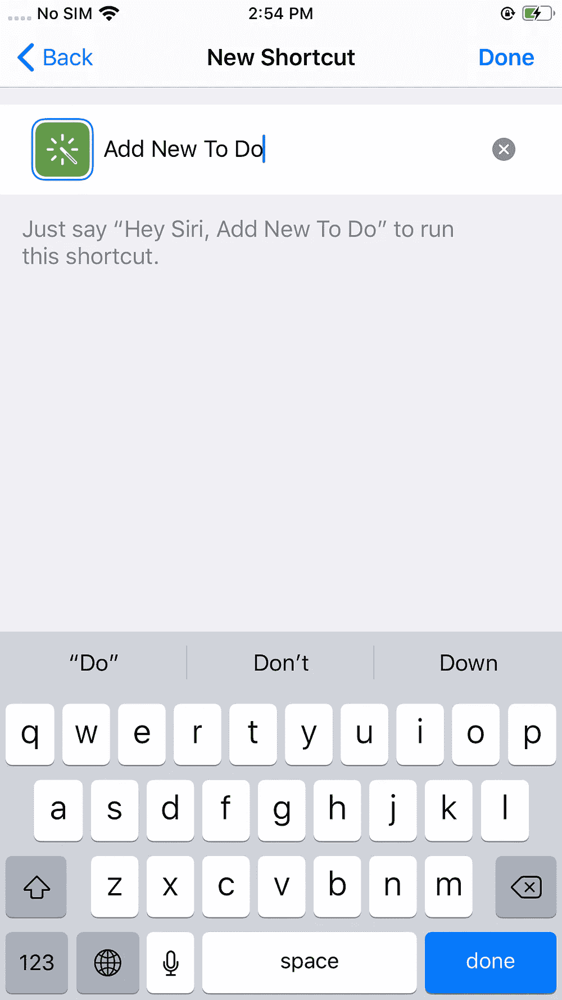

设置让 Siri 运行我们的自定义意图的短语

# 让我们试一试

当听到你在 Siri 的快捷方式应用中设置的短语时，Siri 应该运行我们的 intent，并使用在 intent 定义文件中 Siri 对话框提示中为每个参数指定的短语来请求输入参数。

就是这样！

如果您希望响应包含可视化元素，那么现在可以在 intent UI 上工作，为此，您可以在 Intent UI 中配置`MainInterface.storyboard`和`IntentViewController`文件。

# 结论

SiriKit 是一个非常强大的工具。有了它，你可以通过 Siri 语音命令要求用户输入，并让他们以一种全新的方式与你的应用程序交互。

我希望这篇文章是有帮助的。