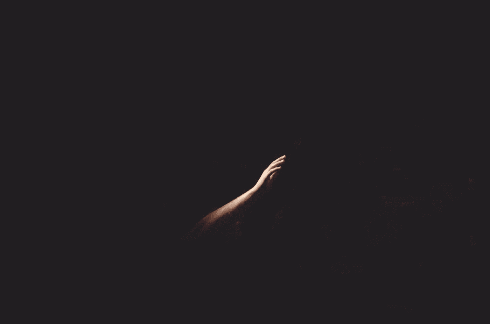
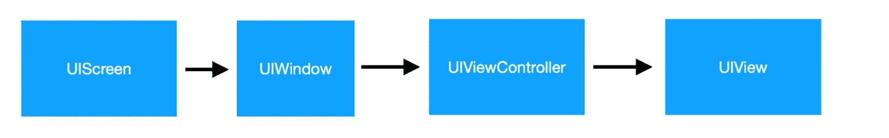
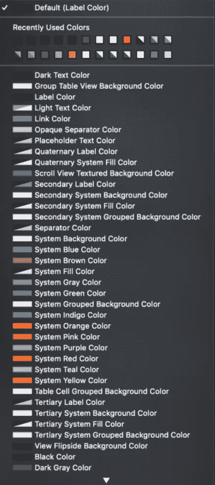
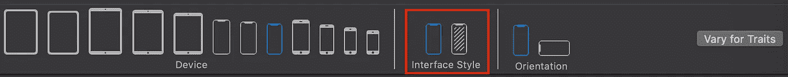
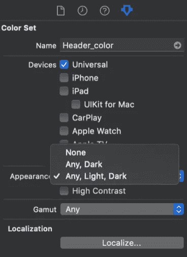
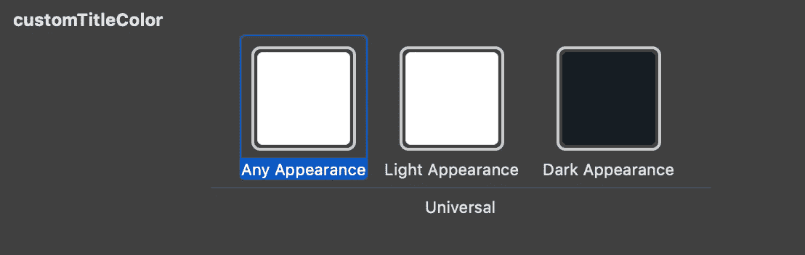

# iOS 13——你的应用准备好迎接黑暗了吗？

> 原文：<https://betterprogramming.pub/ios-13-is-your-app-ready-for-the-dark-6aa73adec14b>



# 关于本教程

黑暗主题在晚上对你的眼睛很好，是有机发光二极管屏幕上的电池节电器，除此之外，它在大多数应用程序中看起来都很棒。

为你的应用程序使用黑暗模式并不困难，尽管它可能需要几天时间，这取决于你拥有的 UI 元素的数量和屏幕的数量。

为了有效地做到这一点，您需要了解这个特性是如何工作的，以及如何处理棘手的问题。

在本教程中，我将解释特征集合如何与界面样式相关，什么是动态颜色和图像，以及如何处理向后兼容性。

# 这一切都始于特质收集

苹果在 iOS 8 中引入了`traitCollection`属性，以解决 iPad 和 iPhone 设备上的通用应用程序。

`traitCollection`属性是[ui termination](https://developer.apple.com/documentation/uikit/uitraitcollection)协议的一部分，该协议被几个类采用，分别是 [UIScreen](https://developer.apple.com/documentation/uikit/uiscreen) 、 [UIWindow](https://developer.apple.com/documentation/uikit/uiwindow) 、 [UIViewController](https://developer.apple.com/documentation/uikit/uiviewcontroller) 、[ui presentation controller](https://developer.apple.com/documentation/uikit/UIPresentationController)和 [UIView](https://developer.apple.com/documentation/uikit/uiview) 。

`traitCollection`包含对象所处界面环境的定义:设备类型(iPad/iPhone)、设备尺寸类别(紧凑型/常规型)和显示比例。

在 iOS 13 上，苹果增加了一个叫做`userInterfaceStyle`的东西，它决定了外观应该是亮还是暗。

```
if self.traitCollection.userInterfaceStyle == .dark {
     // you are in the dark!
 } else {
     // your are in the light!
 }
```

`traitCollection`配置按照界面层次结构流动，从 UIScreen 到 UIWindow，然后是 UIViewControllers 和 UIViews。



因此，正如您所看到的，每个 UI 元素的暗/亮主题的定义总是从其父元素继承而来，但是您总是可以自己覆盖它，以防您想要某个元素有所不同。

例如，您可以为某个 UIViewController 定义一个不同的外观，这个外观将继续流向它的所有子视图控制器及其 UIViews。

# 动态颜色

到目前为止，UIColor 只包含一种颜色数据。从 iOS 13 开始，UIColor 可以是动态的——这意味着它可以包含一组暗的 RGB 值，另一组亮的 RGB 值。

这是点连接的点——每当用户在其设备设置上更改为黑暗模式时，UIScreen trait 集合以及层次结构下的所有 UI 对象都会更改。如果此层次结构包含具有颜色的元素，如 UILables 和背景色，并且它们的颜色是动态的(包含暗值和亮值)，它将自动更改为适当的颜色。

只要你保持一切动态，它就会自动发生。听起来很棒，对吧？

# 如何打造动感色彩？

我们有几种方法可以做到这一点:

## **故事板/界面构建器**

嗯，这很简单。Apple 提供了一组预定义的动态颜色，如系统黑色、系统橙色等。它们中的每一个都包含两种颜色，一种是深色，另一种是浅色。在故事板中设置视图的颜色后，您不必运行应用程序来查看它的外观 xCode 中有一个新选项可以将界面构建器切换到黑暗模式。相当酷！



## **资产目录**

如果您不知道，有一个在资产目录上创建颜色集的选项，您可以稍后在代码和故事板中使用它们。创建新颜色集时，选择“属性”检查器，并从“外观”弹出式菜单中，确保选择了“任意、浅色、深色”选项。此时，你可以为不同的风格选择不同的颜色。



## **代码**

也可以用代码创建动态颜色。只需要用一个新的初始化方法*—init(dynamic provider:@ escaping(*[*UITraitCollection*](https://developer.apple.com/documentation/uikit/uitraitcollection?changes=latest_minor)*)->*[*ui color*](https://developer.apple.com/documentation/uikit/uicolor?changes=latest_minor)*)—*根据你得到的 trait 集合返回相应的值。

# 如何应对外观变化

每当用户改变他们的外观风格时，所有的视图控制器和表示控制器`viewWillLayoutSubviews`和`containerWillLayoutSubviews`方法都会被调用(相应的)。

此外，UIView `layoutSubviews`和 draw 方法也被调用。

因此，为了安全起见，您可以在这些方法中更改样式时进行任何更改。

相反，由于所有这些对象都符合`UITraitEnviroment`协议，`traitCollectionDidChange`也被调用。

在 UIView 中，`tintColorDidChange()`也被调用。

# 动态图像

像颜色集一样，图像也可以是动态的。您可以为浅色和深色样式定义不同的资源，这可以直接从资源目录中完成，与颜色集的方式相同。

当您选择右窗格上的*属性检查器*时，您会看到外观弹出菜单。只需选择“任何，亮，暗”，您将被要求为亮，暗以及每个分辨率和设备定义不同的资产(祝您好运)。

例如，您可以将日出设置为亮模式，将日落设置为暗模式。

如果到现在还不清楚，我会自动处理的。

# 棘手的问题

嗯，关于支持黑色主题，有几种东西你应该知道。

如果你在你的`init`和`viewDidLoad`方法上初始化定制的颜色和图像，你应该把它们移动到你的`layoutSubviews()`和`viewDidLayoutSubiews()`(相应地)，这样你就可以对主题的改变做出反应，因为我们说过当`traitCollection`改变时这些方法会被再次调用。

由于`CALayer`不是`UIKit`的一部分，它不会响应样式的改变，所以这是你需要注意的。

有时，您希望从动态颜色集中分离出实际的颜色。使用`UIColor`的`resolvedColor()`方法可以非常简单。

```
let dynamicColor = UIColor.systemBackground
let traitCollection = view.traitCollection
let resolvedColor = dynamicColor.resolvedColor(with: traitCollection)
```

活动指示器也发生了变化，现在它只包含两种类型——中型和大型。但是，界面风格将决定颜色。

在属性化文本中，你必须确保你为文本定义了一个动态的颜色，否则无论 UIView `traitCollection`有什么样的界面风格，系统给你的标签的默认颜色都是黑色，黑底黑字并没有真正显示出来。

# 我不想要黑暗模式

禁用它非常容易。

您可以通过在`info.plist`中将`UIUserInterfaceStyle`设置为`Light`来禁用整个应用程序。

您也可以使用 override `overrideUserInterfaceStylevariable`对某个 UIViewController/UIView(及其子视图)禁用它。

```
self.overrideUserInterfaceStyle = .dark // always dark
```

# 我有一个现有的应用程序。我从哪里开始？

对于一个新的 app 来说，以 iOS 13 为部署目标，一切都非常容易和顺利。

但如果你有一个现有的应用程序，这可能是一个相当大的挑战，特别是如果你已经有某种皮肤/主题管理。

如果您使用界面构建器和资产目录来设置颜色和图像，则支持旧版本很容易。用动态颜色就行了，老版本的话 iOS 会挑浅色版本的颜色。

如果您打算使用代码创建动态颜色，我的建议是用一个函数包装它，并将颜色的两个版本(深色和浅色)传递给该函数。在该函数中，版本检查并相应地初始化颜色。

此外，如果你的应用程序中有一个黑暗主题功能，你应该重新考虑维护这个功能，现在你已经有了它。