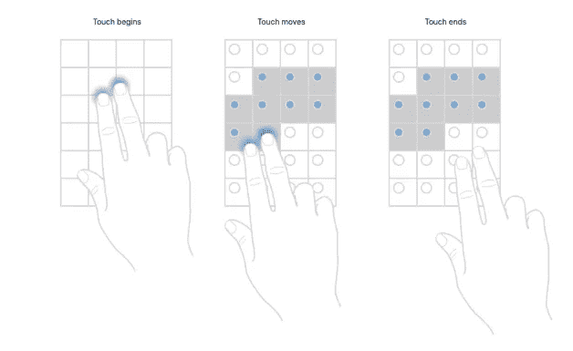
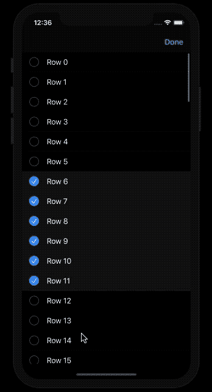

# 表格视图和集合视图中的 iOS 13 多选手势

> 原文：<https://betterprogramming.pub/ios-13-multi-selection-gestures-in-tableview-and-collectionview-619d515eef16>

## 使用新的委托方法加速项目选择

图片由 [Arek Socha](https://pixabay.com/users/qimono-1962238/?utm_source=link-attribution&utm_medium=referral&utm_campaign=image&utm_content=1872665) 在 [Pixabay](https://pixabay.com/?utm_source=link-attribution&utm_medium=referral&utm_campaign=image&utm_content=1872665) 上拍摄

WWDC 2019 在桌面上引入了一些有趣的新功能，同时增强了一些旧功能。虽然 SwiftUI 以其构建用户界面的直观方式震撼了社区，但在 cells 上引入了带有两个平移手势的多重选择，以加速用户的选择过程。

通过使用新引入的委托方法和属性`CollectionView`和`TableView`，我们可以加快用户选择项目的过程。

## 我们的目标

*   了解多重选择在`TableView`和`CollectionView`中是如何工作的
*   实现 iOS 13 新功能，从`TableView`中删除一批选择

# 使用两个平移手势进行多重选择

iOS 13 的`TableViews`和`CollectionViews`为项目的多重选择提供了双指平移手势。一旦视图识别出手势，它就启用编辑模式。用户甚至不需要点击编辑模式，因为手势会自动将视图置于编辑模式。

此外，多选不必是连续的。用户可以在某一点停止选择，并从`TableView`或`CollectionView`中的另一点开始手势。下图显示了它的工作原理。

[来自苹果文档](https://developer.apple.com/documentation/uikit/uitableviewdelegate/selecting_multiple_items_with_a_two-finger_pan_gesture)

为了支持`TableView`中的多项选择，需要启用`allowsMultipleSelectionDuringEditing`属性。此外，需要实现以下新的可选委托方法:

*   `didBeginMultipleSelectionInteractionAt`
*   `shouldBeginMultipleSelectionInteractionAt`
*   `tableViewDidEndMultipleSelectionInteraction`

双指平移手势还允许单指多选/取消选择一组已经选定的项目。

# 在 TableView 中实现多选

首先，创建一个新的 Xcode 项目。

下面的代码演示了一个在编辑模式下使用多指选择的`TableView`示例，以及一个删除所选项的选项。

在上面的代码中，在`didBeginMultipleSelectionInteractionAt`内部启用了编辑模式以标记多个选择。

在用户标记编辑完成后，`setEditing`处理该情况。在我们的例子中，我们从`TableView`中删除了所选项目的数组。

作为回报，我们在模拟器中得到 iOS 应用程序的如下结果。

实际应用中的一个例子

若要在模拟器上模拟手势，请按住 option 和 shift 键拖移触控板。

等效的委托方法也适用于`CollectionView`。

# 结论

所以我们在一个`TableView`上实现了新的 iOS 13 双指手势多选。苹果旨在通过这一功能加快用户对多个项目的选择。上述实现的源代码可以在这个 [GitHub 库](https://github.com/anupamchugh/iowncode/tree/master/iOS13TableViewAndCollectionView)中找到

iOS 13 还引入了其他值得注意的 UIKit 新增功能，比如`CollectionViews`中的复合布局。我们将在下一篇文章中讨论这个问题。敬请期待！

这一次到此为止。我希望你喜欢阅读。