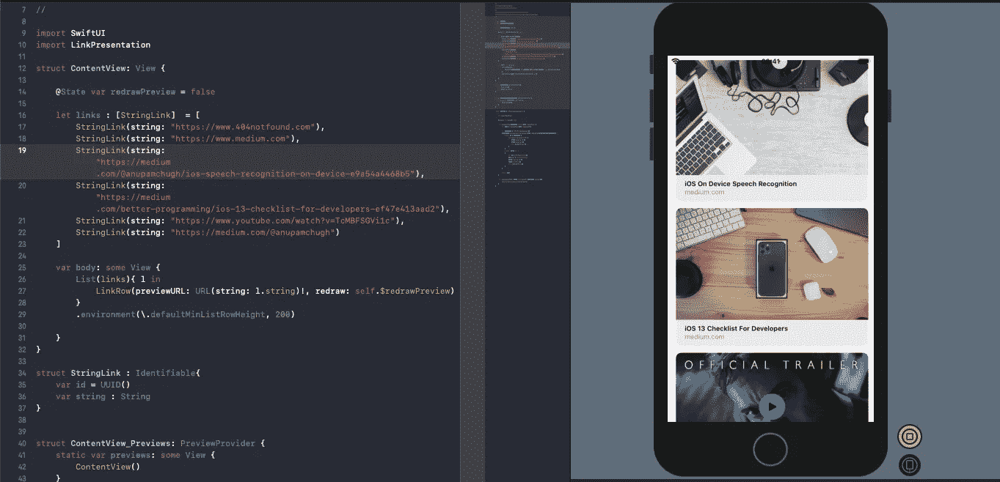

# 使用 SwiftUI 的 iOS 13 丰富链接预览

> 原文：<https://betterprogramming.pub/ios-13-rich-link-previews-with-swiftui-e61668fa2c69>

## 介绍新的 LinkPresentation 框架


苹果在 2019 年 WWDC 展会期间非常重视用户界面的现代化。无论是像 SwiftUI 这样的突破性变化，还是像新的 LinkPresentation 框架这样的微妙变化。

LinkPresentation 框架允许开发人员从 iOS 13 开始在他们的应用程序中集成视觉上丰富的预览链接，这种功能以前可以在苹果的消息应用程序中看到。

尽管今年没有像其他几个版本那样引人注目，LinkPresentation 在增强应用程序的用户体验方面可以发挥关键作用。

# 我们的目标

*   讨论 LinkPresentation 的工作方式。
*   在我们基于 Swift UI 的 iOS 应用程序中集成丰富的链接。

# LinkPresentation 框架

新引入的框架允许您在应用程序中嵌入基于内容的 URL 预览，这在整个操作系统中保持一致。

大体上，LinkPresentation 框架包括以下内容:

*   `LPMetaDataProvider` —该类用于从 URL 获取元数据。
*   `LPLinkMetaData` —充当元数据的容器。它负责存储富链接的内容、图标、图像和视频。或者，您也可以在该类中设置自己的自定义数据。
*   `LPLinkView` —这为我们嵌入内容和图像的链接提供了视觉上丰富的预览。
*   `LPError` —通常，这处理 LinkPresentation 框架的错误处理部分。

在幕后，LinkPresentation 框架使用 [WKWebView](https://developer.apple.com/documentation/webkit/wkwebview) 来获取元数据。

下面的代码片段展示了一个获取元数据并将其显示在`LinkView`中的示例:

```
import LinkPresentation

let metadataProvider = LPMetadataProvider()
let url = URL(string: "https://medium.com/@anupamchugh/")!

metadataProvider.startFetchingMetadata(for: url) { [weak self] metadata, error in
    guard let metadata = metadata else { return }

    let linkView = LPLinkView(metadata: metadata)
    self?.view.addSubview(linkView)
}
```

对于由于某种原因无法检索元数据的情况，我们可以将自己的自定义标题、图标、视频或 URL 设置为占位符:

```
let md = LPLinkMetadata()
md.title = "Custom title"
md.url = url
md.imageProvider = ....let linkView = LPLinkView(metadata: metadata)
```

在下一节中，我们将开发一个基于 SwiftUI 的 iOS 应用程序，该应用程序显示丰富的链接预览列表。让我们开始吧。

# 创建 UIView

是啊！我们将遵照`UIViewRepresentable`将我们的 UIKit 视图包装在 SwiftUI 视图中。

```
struct LinkRow : UIViewRepresentable {

    var previewURL:URL

    [@Binding](http://twitter.com/Binding) var redraw: Bool

    func makeUIView(context: Context) -> LPLinkView {
        let view = LPLinkView(url: previewURL)

        let provider = LPMetadataProvider()
        provider.startFetchingMetadata(for: previewURL) { (metadata, error) in
            if let md = metadata {
                DispatchQueue.main.async {
                    view.metadata = md
                    view.sizeToFit()
                    self.redraw.toggle()
                }
            }
            else if error != nil
            {
                let md = LPLinkMetadata()
                md.title = "Custom title"
                view.metadata = md
                view.sizeToFit()
                self.redraw.toggle()
            }
        }

        return view
    }

    func updateUIView(_ view: LPLinkView, context: Context) {
        // New instance for each update
    }
}
```

在上面的代码中，有一个`redraw`绑定实例。它通知 SwiftUI 视图在获取元数据后重新绘制富链接预览。

`sizeToFit()`用于自动调整单元格大小以适应丰富的链接预览。

# 创建我们的数据结构

接下来，我们为 SwiftUI 列表创建一个符合`Identifiable`协议的结构，通过其唯一标识符来标识每一行。

```
struct StringLink : Identifiable{var id = UUID()
var string : String}
```

在下一节中，我们将在`ContentView`中用 URL 字符串填充数组`StringLink`。

# 构建内容视图

最后，我们将数据传递给 SwiftUI `List`，它持有`UIView` `LinkRow`，如下所示:

```
import LinkPresentationstruct ContentView: View {

    [@State](http://twitter.com/State) var redrawPreview = false    
    let links : [StringLink]  = [] //add your url links here
    var body: some View {
        List(links){ l in
            LinkRow(previewURL: URL(string: l.string)!, redraw: self.$redrawPreview)
        }
        .environment(\.defaultMinListRowHeight, 200)

    }
}
```

我们可以像上面一样使用`environment`属性设置列表的默认高度和宽度。

作为回报，我们在 SwiftUI live 预览中得到以下结果。



屏幕捕获

# 还有更多

LinkPresentation 框架可用于通过预取 URL 链接的元数据来优化共享表，从而消除共享表弹出时的延迟。

您甚至可以缓存 URL 的元数据，以防止每次都向服务器发送相同的链接。

这就结束了。我希望你喜欢读它。