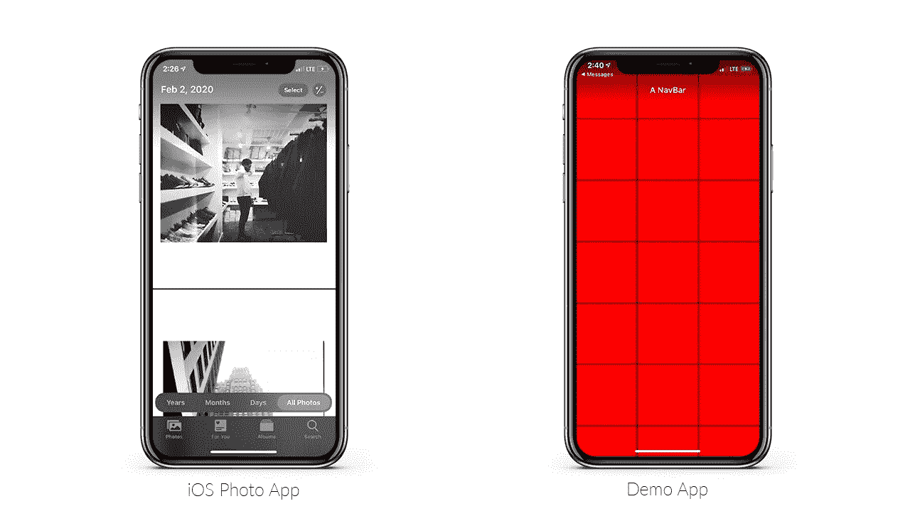
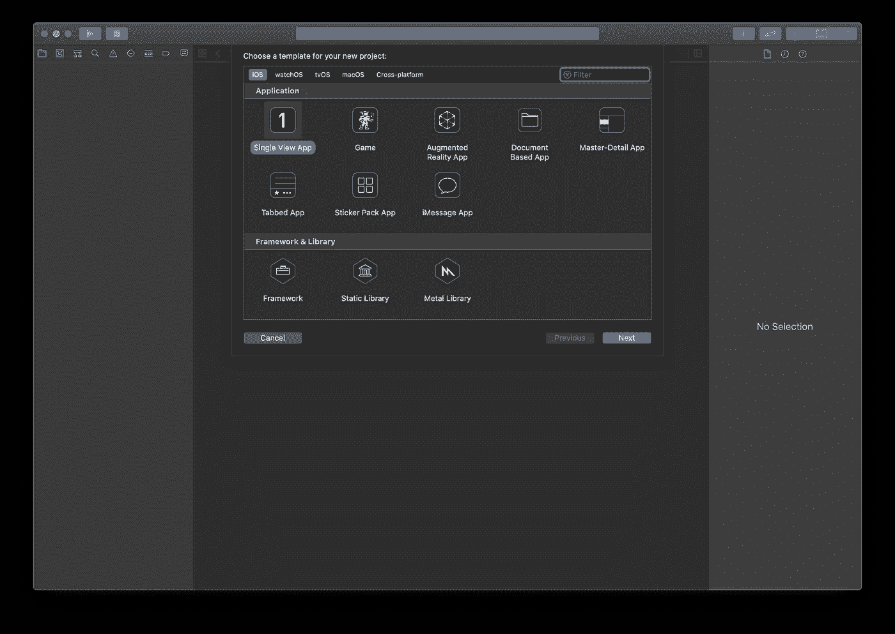
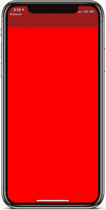
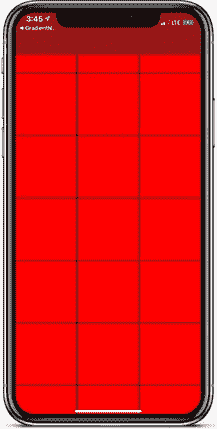
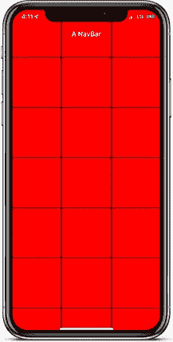
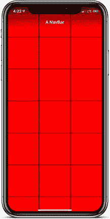

# 如何在 Swift 5 和 iOS 13 中创建渐变导航条

> 原文：<https://betterprogramming.pub/ios-13-swift-5-how-to-create-a-gradient-navbar-bb76e77a24ad>

## 给你的导航栏一个更好的设计



我记得当我第一次看到 iOS 13 中的 Photos 应用程序时，最突出的是渐变导航栏。非常简单，但非常优雅。我决定重新创作，并分享我是如何重新创作的。

旁注:一切都是通过编程完成的。

# 新建项目并设置 UINavigationController

让我们首先创建一个新项目作为单视图应用程序。



我们将首先在`SceneDelegate.swift`文件中设置`UINavigationController`，以编程方式将`rootViewController`设置为包装在`UINavigationController`中的`ViewController`。

在`willConnectTo`场景功能中，我们将设置`UINavigationController`。

如果您构建并运行该文件，您应该会看到`NavBar`显示。



我在 ViewController 类中将背景设为红色，以演示 NavBar 确实在工作

# 所需的变量和设置 UICollectionView

边注:虽然`UICollectionView`不是创建渐变`NavBar`所必需的，但我将快速创建一个，只是为了演示渐变会像它应该的那样工作，在本教程的后面。

这里是渐变所需的变量`NavBar`。

边注:如果不需要创建`UICollectionView`就跳过这一段。

这里是`UICollectionView`需要的变量和委托。

一旦你试图构建它，你将会有快速的编译错误，因为你需要符合`UICollectionViewDataSource`的协议。

但是，当我们添加必要的协议时，我们将添加其他的`UICollectionView`函数作为`ViewController`类的扩展。

一旦你运行这个，你会注意到`UICollectionView`没有出现。这是因为我们需要锚定它。我们可以创建一个函数`setupCollectionView`并在`viewDidLoad`函数中调用它。

如果您运行并构建代码，您现在应该得到:



# UIViewController 扩展

接下来就是明确`navBar`。我们将从创建一个`UIViewController`的扩展开始。

让我们创建一个新文件，并将其命名为`UIViewControllerExtensions` ，并添加一个函数来创建一个清晰的`navBar`。

旁注:当我们创建扩展时，它允许我们在这个项目的任何类中调用这个函数，而不是编写相同的函数，从而减少冗余。

既然我们在这个文件中，让我们也创建一个函数，`setupGradient`，它将返回一个渐变。我们以后会需要这个。

# 清除导航条和渐变

在`ViewController`类中，在`ViewDidLoad`函数中，我们可以调用我们在`UIViewControllerExtensions`文件中创建的`setupClearNavBar`函数。

为了验证`NavBar`是清晰的并且没有消失，我们可以在`ViewDidLoad`函数中给`NavBar`添加一个标题。

```
navigationItem.title = “A NavBar”
```



现在让我们添加渐变。我们所做的就是在`navBar`下面锚定`gradientView`来创建渐变。我们可以在`ViewController`类中创建`setupGradient`函数，并在`ViewDidLoad`函数中调用它。

确保您正在调用`viewDidLoad` 中的函数如下:

完成所有这些操作并运行应用程序后，它应该是这样的:



链接到 [GitHub Repo](https://github.com/ModernProgrammer/GradientNavBarDemo) 。

感谢阅读！