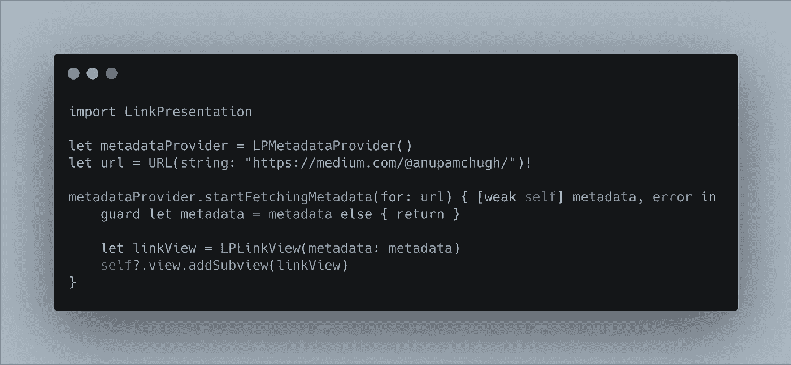

# iOS 13:2019 的无名英雄

> 原文：<https://betterprogramming.pub/ios-13-the-unsung-heroes-of-2019-f6eccb4a017>

## 庆祝 iOS 13 的 6 个鲜为人知的功能


塞尔日·库图佐夫在 [Unsplash](https://unsplash.com?utm_source=medium&utm_medium=referral) 拍摄的照片

苹果的 WWDC 2019 活动是一个启示。一方面，今年有许多公告抢了风头(SwiftUI、Combine 和 Core ML 3 领先)，同时，还有许多其他有趣的变化，我们不应该忘记。

在我们庆祝 iOS 13 的无名英雄之前，让我们先坐下来看看今年的主要功能。

## 主要公告

*   黑暗模式支持
*   iPad 的独立操作系统。它现在为同一个应用程序提供了[多窗口支持](https://medium.com/better-programming/implementing-multiple-window-support-in-ipados-5b9a3ceeac6f)。
*   [SwiftUI](https://medium.com/better-programming/swiftui-navigation-links-and-the-common-pitfalls-faced-505cbfd8029b) 。一个新的框架，用于快速简单地构建用户界面。
*   组合和 [PencilKit](https://medium.com/better-programming/an-introduction-to-pencilkit-in-ios-4d40aa62ba5b) 框架。一个新的反应和绘图框架。
*   [可更新的 Core ML 3 型号](https://medium.com/better-programming/how-to-create-updatable-models-using-core-ml-3-cc7decd517d5)带[设备培训](https://medium.com/better-programming/how-to-train-a-core-ml-model-on-your-device-cccd0bee19d)
*   [不同的数据源](https://medium.com/better-programming/applying-diffable-data-sources-70ce65b368e4)和[组合布局](https://medium.com/better-programming/ios-13-compositional-layouts-in-collectionview-90a574b410b8) —为 UIKit 表视图和集合视图提供更多功能
*   [催化剂](https://medium.com/better-programming/how-to-port-an-ios-app-to-macos-using-catalyst-196a9883e6f7)。在 macOS 上轻松转换 iOS 和 iPadOS 应用程序。
*   升级的愿景框架。凭借增强的人脸检测器请求和文本检测，这一框架将长期存在。 [2019 年回顾](https://heartbeat.fritz.ai/advancements-in-apples-vision-framework-2019-year-in-review-4c9d3ad5b138)

现在我们已经了解了 2019 年 WWDC 的亮点，让我们探索一下今年的其他一些发布，这些发布可能没有获得与上述功能相同的关注，但仍然至关重要。

# 1.MapKit 得到了很大的提升

苹果自己的 MapKit 框架得到了很多新的增强。也就是说，由于能够按类别过滤感兴趣的区域，它获得了更好的搜索能力。该框架中其他值得注意的新增功能包括用于在地图上绘制折线和形状的优化 API，以及使用`CameraBoundary`定制地图缩放级别和边界的新功能。要深入了解 iOS 13 中地图工具包的新功能，请查看以下内容:

[](https://medium.com/better-programming/exploring-mapkit-on-ios-13-1a7a1439e3b6) [## 在 iOS 13 上探索地图工具包

### 除 SwiftUI 之外，优化的覆盖图、兴趣点等等

medium.com](https://medium.com/better-programming/exploring-mapkit-on-ios-13-1a7a1439e3b6) 

# 2.设备上的语音识别

在 WWDC 2019 上，`SFSpeechRecognizer`框架得到了很大的升级。它现在支持设备上的语音识别——无数据和离线。与早期的功能相比，这是一个很大的飞跃，早期的功能只允许通过服务器进行识别，只有一分钟的限制和每天请求的数量。

虽然目前它只支持少数几种语言，但它很好地表明了苹果对基于语音的人工智能的重视程度。当前设备上语音识别的特征之一是能够识别语音中的标点符号，并相应地返回相应的转录文本。

要详细了解在您的应用中实现设备上语音识别所需的组件，请参考这篇文章:

[](https://medium.com/better-programming/ios-speech-recognition-on-device-e9a54a4468b5) [## iOS On 设备语音识别

### SFSpeechRecognizer 已在 iOS13 中更新，允许在设备上识别和分析语音，无需数据，并且…

medium.com](https://medium.com/better-programming/ios-speech-recognition-on-device-e9a54a4468b5) 

# 3.LinkPresentation 框架简介

从 iOS 13 开始，开发者可以集成丰富的链接预览，类似于你在 Messages 应用中看到的那些。`LinkPresentation`框架在引擎盖下使用了一个`WKWebView`，用于在你的应用程序中嵌入 URL，以及通过预取相关的丰富链接 URL 来优化共享表。



对于基于 SwiftUI 的应用中的`LinkPresentation`框架的工作实现，请看下面这段:

[](https://medium.com/better-programming/ios-13-rich-link-previews-with-swiftui-e61668fa2c69) [## 使用 SwiftUI 的 iOS 13 丰富链接预览

### 介绍新的 LinkPresentation 框架

medium.com](https://medium.com/better-programming/ios-13-rich-link-previews-with-swiftui-e61668fa2c69) 

# 4.后续行动

对于 iOS 12 和更早的版本，要使用故事板创建连续动作，通常需要在两个视图控制器之间创建一个连接，添加连续标识符，并在下面的函数中传递必要的数据:

```
override func prepare(for segue: UIStoryboardSegue, sender: Any?) {
  guard let secondVC = segue.destination as? SecondVC else {
    fatalError("Missing SecondVC")
  }
  secondVC.data = data
}
```

在 iOS 13 中，有一种更好的方式来创建 segues。您所需要做的就是用`@IBSegueAction`标记该方法，并在目标视图控制器的`init`方法中传递数据，如下图所示。


感谢 Swift 5，`return`关键字现在对于单个表达式函数是可选的。

# 5.TableView 和 CollectionView 上的多重选择手势

iOS 13 在`TableViews`和`CollectionViews`上引入了双指平移手势。通过启用这些手势，我们可以从我们的`TableViews`中快速选择和编辑一系列项目。

为了支持`TableView`中的多项选择，需要启用`allowsMultipleSelectionDuringEditing`属性。

下面的代码实现了表格视图中的多选:

[](https://medium.com/better-programming/ios-13-multi-selection-gestures-in-tableview-and-collectionview-619d515eef16) [## 表格视图和集合视图中的 iOS 13 多选手势

### 使用新的委托方法加速项目选择

medium.com](https://medium.com/better-programming/ios-13-multi-selection-gestures-in-tableview-and-collectionview-619d515eef16) 

# 6.WebSocket 协议

在 iOS 12 发布后，WebSockets 是社区中排名第一的开发者功能请求。苹果终于在 iOS 13 中推出了。

与长轮询相比，WebSocket 协议是一种更有效的替代方案，它包含在苹果自己的网络框架中，使得建立聊天和需要双向传输消息的多人应用程序更加容易。

以下内容展示了如何构建 WebSockets 来接收实时加密货币价格更新:

[](https://medium.com/better-programming/build-a-bitcoin-price-ticker-in-swiftui-b16d9ca566a8) [## 在 SwiftUI 中构建比特币价格行情

### 利用 iOS 13 的 WebSockets 显示实时加密货币更新

medium.com](https://medium.com/better-programming/build-a-bitcoin-price-ticker-in-swiftui-b16d9ca566a8) 

# 结论

我们已经探索了 iOS 13 中引入的一系列功能，鉴于 SwiftUI 和 WWDC 2019 的一系列其他重大宣布，这些功能可能会被错过。然而，这些都是 iOS 生态系统的重要组成部分，因此他们是我们的年度无名英雄。

这是今年的总结。我希望你喜欢阅读。