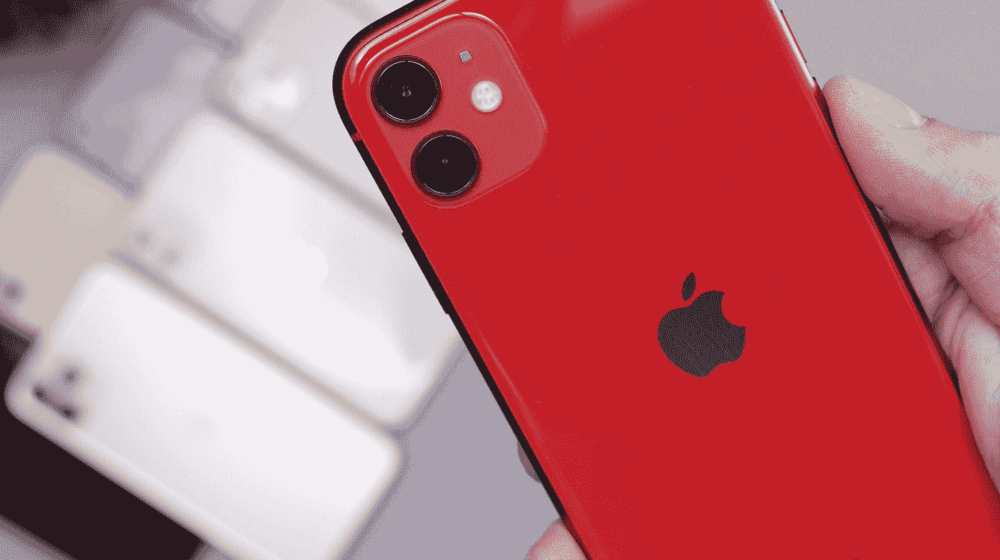

# 面向开发者的 iOS 14 清单

> 原文：<https://betterprogramming.pub/ios-14-checklist-for-developers-372bd6d2507e>

## 让你的应用为 iOS 14 做好准备你需要知道什么



丹尼尔·罗梅罗在 [Unsplash](https://unsplash.com?utm_source=medium&utm_medium=referral) 上的照片。

苹果在没有事先通知的情况下推出 iOS 14 让整个开发者社区大吃一惊。无论如何，又到了一年中为最新操作系统发布应用程序更新的时候了。

首先，下面是你应该知道的 iOS 14 的重大变化:

*   主屏幕上的小部件和应用程序剪辑介绍。
*   用新的[AppTrackingTransparency](https://developer.apple.com/documentation/apptrackingtransparency)框架取代 IDFA，用于选择性广告跟踪(在撰写本文时，苹果已将此推迟至 2021 年 1 月)。
*   新的视觉要求轮廓、轨迹检测以及手和身体姿态估计。
*   ARKit 为激光雷达扫描仪以及位置锚带来了新的深度 API，以便在特定的地方放置 AR 体验。
*   苹果的 PencilKit 框架引入了跟踪在`PKCanvas`上绘制的手势的速度和力度的能力。还有一个新的 Scribble `UITextField`，它使用设备上的机器学习来识别手写文本。

现在，让我们来挖掘一些跨不同苹果框架的重大更新和 API 的变化，以便您为 iOS 14 上的应用发布做好准备。

# 增强的纸板 API

苹果是数据隐私的领导者，通过最新的 iOS 更新，他们再次证明了这一点。

每次你的应用程序从剪贴板读取内容时，iOS 14 都会引入一个浮动通知。现在，为了防止您的应用程序不必要地访问粘贴板，有一个增强的`UIPasteboard` API，让您在实际读取其值之前确定`UIPasteboard`中存在的内容类型。

`detectPatternsForPatterns:completionHandler`和`detectPatterns(for:inItemSet:completionHandler:)`方法让你在不触发通知的情况下找到特定的模式。

同时，您可以利用`[UIPasteboard.DetectionPattern](https://developer.apple.com/documentation/uikit/uipasteboard/detectionpattern?changes=latest_major)`结构来确定粘贴板是否包含一个`[probableWebUrl](https://developer.apple.com/documentation/uikit/uipasteboard/detectionpattern/3618951-probableweburl?changes=latest_major)`(可能与深层链接相关)或一个`[number](https://developer.apple.com/documentation/uikit/uipasteboard/detectionpattern/3650233-number?changes=latest_major)`。

# 画中画模式

虽然 iPadOS 早先确实支持图片模式中的图片，但 iOS 14 终于将其带到了 iPhone 中。

通过使用`AVPictureInPictureController.isPictureInPictureSupported()`，您可以检查是否支持后台播放视频的功能:

```
AVPictureInPictureController(playerLayer: playerView.playerLayer)
```

如果你像我一样，在基于`AVPlayer`的 iOS 14 应用中采用画中画模式，你可能会遇到奇怪的错误——当应用在后台时，画中画不会自动启动。谢天谢地，[这个堆栈溢出页](https://stackoverflow.com/questions/63739978/avpictureinpicturecontroller-doesnt-automatically-start-picture-in-picture-when)通过在`AVPictureInPictureController`之前初始化`AVAudioSession.sharedInstance().setActive(true)`提供了一个解决方案。

# 有限的照片图库访问权限

在 iOS 13 和之前的版本中，允许应用程序访问你的照片库实际上就是允许他们访问你所有的相册和媒体资产。这很容易为隐私泄露打开大门，因为开发者可以将库上传到他们的云服务器。

在 iOS 14 中，苹果引入了有限的照片访问权限，允许用户只选择选定的照片或访问整个图库，从而保护隐私。这意味着 iOS 开发者有他们的工作要做。

因此，有了一个新的`PHAccessLevel`枚举属性，允许您将其定义为`readWrite`或`addOnly`:

```
let accessLevel: PHAccessLevel = .readWrite
```

要查询照片库的授权状态，只需在下面的函数中传递上面的枚举:

```
let authorizationStatus = PHPhotoLibrary.authorizationStatus(for: accessLevel)
```

从 iOS 14 开始，上面的`authorizationStatus`返回了一个新的`limited` enum 属性，这意味着开发者只能看到用户选择的照片。要请求有限的照片访问权限，请调用以下函数:

下面这段代码展示了图像选择选择器用户界面:

```
PHPhotoLibrary.shared().presentLimitedLibraryPicker(from: self)
```

用户选择/取消选择的图像可通过符合并注册`PHPhotoLibraryChangeObserver`协议在`photoLibraryDidChange`功能中进行监控。

现在，为了防止每次自动访问照片提示，在你的`Info.plist`文件中设置`PHPhotoLibraryPreventAutomaticLimitedAccessAlert`键为`true`。

# SwiftUI 带来了新的属性包装器、视图、修改器和应用生命周期

苹果新的声明式用户界面框架 SwiftUI 是 2019 年 WWDC 期间的热门话题，今年也不例外。在 iOS 14 的第二次迭代中，SwiftUI 现在包括了大量新的 UI 组件，从`VideoPlayer`到`Maps`、`Labels`、`Links`、`ColorPicker`和`ProgressView`。

更重要的是，iOS 14 通过改为使用`LazyHStack`和`LazyVStack`视图，引入了对`VStack`和`HStack`的延迟加载的支持。这意味着您不必担心`NavigationLinks`立即加载目的地视图。

还有一个新的`Grid`组件在某种程度上帮助复制`UICollectionView`和一个`matchedGeometryEffect`修改器来创建惊人的过渡和动画。

除了通过使用全新的属性包装器和协议引入 SwiftUI 的[自己的应用生命周期](https://medium.com/better-programming/swiftuis-new-app-lifecycle-and-replacements-for-appdelegate-and-scenedelegate-in-ios-14-c9cf4a2367a9)之外，iOS 14 还引入了`[WidgetKit](https://medium.com/better-programming/introducing-ios-14-widgetkit-with-swiftui-a9cc473caa24)`框架，让你完全使用 SwiftUI 来构建漂亮强大的小部件。

# 更强大的集合视图

虽然 CollectionView 在 WWDC 2020 期间没有在 SwiftUI 中首次亮相，但这并没有阻止它接收一些强大的新更新。

以下是您可以在使用 iOS 14 的应用中利用的主要变化:

*   `UICollectionViewCompositionalLayout.list`让你在`UITableView`中创建类似`UITableView`的外观，从而进一步增强定制合成布局的能力。我相信这强烈表明`TableViews`在未来可能会过时。
*   `UICollectionView.CellRegistration`结构带来了一种配置`UICollectionView`电池的新方法。所以您不需要再定义单元格标识符，因为新的结构在传递到`dequeueConfiguredReusableCell`内部时会自动处理单元格注册。
*   iOS 13 带来的`DiffableDataSources`现在也带来了`SectionSnapshots`来定制和更新每个部分的数据。

# 使用 CoreLocation 提高隐私性

虽然 iOS 13 带来了延期的“总是允许”和新的“允许一次”权限，但 iOS 14 通过允许用户授予访问大致位置的权限，进一步收紧了隐私。

这意味着有一个类型为`CLAccuracyAuthorization`的新属性，它有两个枚举用例— `fullAccuracy`和`reducedAccuracy`(返回一个近似值，而不是确切的位置)。

此外，`authorizationStatus()`函数现在已经过时，您应该使用`locationManagerDidChangeAuthorization`来查询位置许可状态。

# 核心 ML 模型加密

[Core ML](https://developer.apple.com/documentation/coreml) 是苹果的机器学习框架，让你初始化模型，运行推理，甚至进行设备上的训练。在 iOS 14 中，苹果通过引入模型部署提升了 Core ML。这意味着你可以即时更新你的机器学习模型，而无需更新应用程序。

Xcode 中还有一个改进的核心 ML 模型查看器，可以显示底层。但是突出的是模型加密。机器学习模型不容易建立，有时包含敏感信息。早些时候，你可以很容易地提取嵌入在应用程序中的`.mlmodelc`核心 ML 模型文件。

现在，一旦在 Xcode 12 中加密模型，这就不再可能了。这样做，核心 ML 将自动解密并加载到你的应用程序的内存中。

为了处理加密模型，iOS 14 带来了一个新的核心 ML 模型异步初始化函数:

模型只有在成功解密后才会加载。值得注意的是，旧的`init()`初始化核心 ML 模型的方式将在未来被弃用。

# 结论

虽然这些更新是让您的应用程序跟上速度的最重要的更新，但还有其他重要的变化，例如在自然语言框架中包含句子嵌入，以及支持使用 CreateML 训练风格转移模型。

这总结了开发者需要知道的 iOS 14 的主要变化。感谢阅读。