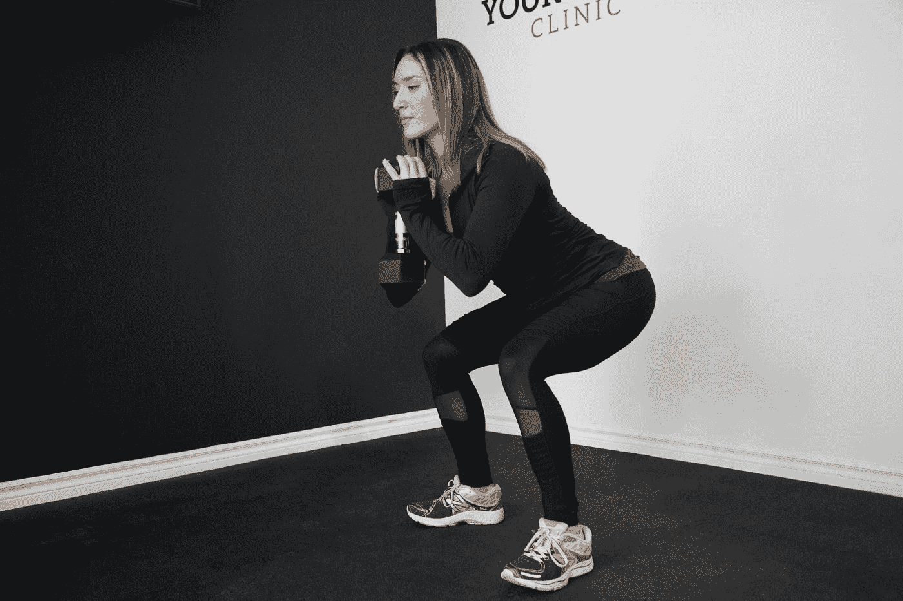
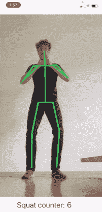
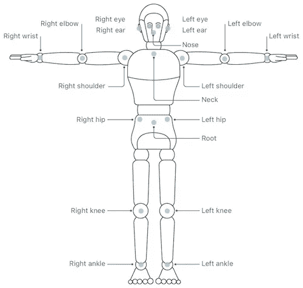
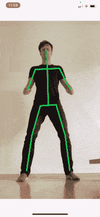

# iOS 14 Vision 身体姿势检测:在 SwiftUI 锻炼应用程序中计算深蹲次数

> 原文：<https://betterprogramming.pub/ios-14-vision-body-pose-detection-count-squat-reps-in-a-workout-c88991f7cad4>

## 使用苹果的视觉框架建立一个人工智能健身 SwiftUI 应用程序，以检测人体姿势

Sergio Pedemonte 在 [Unsplash](https://unsplash.com?utm_source=medium&utm_medium=referral) 上拍摄的照片。

在本文中，我们将探索一个移动 ML 用例，并围绕苹果的`VNDetectHumanBodyPoseRequest`构建一个实际应用。这种预训练模型在 WWDC20 期间推出，是实时检测身体点的强大工具。

在疫情期间，家庭健身行业一直在蓬勃发展，因此我们的应用程序将成为一种家庭锻炼镜子，可以计算深蹲重复次数，并提供关于我们姿势的有用线索。

作者创作的 GIF

在我们深入研究代码之前，让我们花一些时间思考一下我们在这个任务中使用的模型。`VNDetectHumanBodyPoseRequest`返回给定图片中 19 个不同位置的 2D 坐标。我们将在 SwiftUI 应用中实现这一请求，然后构建一个基于逻辑的方法来寻找我们身体位置的变化。您现在可能想知道为什么我们不使用 Create ML Action 分类器。我们可以捕捉一些蹲视频，并创建 ML 将训练一个定制的模型，以身体位置为特征。这将有助于判断我们是否在蹲着。问题是它需要固定长度的视频输入。例如，如果我们将捕获长度设置为 3 秒，我们将获得该时间窗口的预测，但不计算蹲的次数。所以我们宁愿在`VNDetectHumanBodyPoseRequest`之上建立我们自己的小逻辑。

继续创建一个新的 SwiftUI 项目。第一步将是访问我们 iPhone 的前置摄像头。由于 SwiftUI 不支持直接摄像头访问，我们将使用带有`AVCaptureSession`的 UIKit 视图控制器。我不会为这一步提供太多的细节，因为已经有无穷无尽的教程介绍如何在 SwiftUI 中捕捉相机输出。在我们的应用程序中，我们还想显示来自我们相机的实时预览，所以我们让`UIViewController`管理一个带有类型为`AVCaptureVideoPreviewLayer`的根层的`UIView`。

在视图控制器的`viewDidAppear`调用中，我们初始化`AVCaptureSession`并将前置摄像头设置为输入。由于我们的模型处理单个图像，我们需要从视频输出中获取样本帧。这是通过`SampleBufferDelegate`完成的，这也是我们到 SwiftUI 的交接点。

我们将`CameraViewController`包装在一个`UIViewControllerRepresentable`中，并分配一个类型为`PoseEstimator`的变量作为我们接收样本帧的委托。

现在我们来看看`PoseEstimator`的细节。它实现`captureOutput`以符合`AVCaptureVideoDataOutputSampleBufferDelegate`。代码非常简单。由于我们将接收一系列图像，我们需要创建一个`VNSequenceRequestHandler`并让它对每张图像执行一个`VNDetectHumanBodyPoseRequest`操作。

结果由`detectedBodyPose`函数接收，该函数获取第一个观察值并将其分配给`bodyParts`变量。该字典属于`[VNHumanBodyPoseObservation.JointName : VNRecognizedPoint]`类型，包含 19 个预定义身体点的置信分数和位置。

很好。只需几行代码，我们现在就可以使用前置摄像头图像进行实时推断，并拥有一个发布器，可以不断发送识别出的身体点的新预测。

来源:[苹果开发者文档](https://developer.apple.com/documentation/vision/vnrecognizedpointkey/body_landmarks)

应用程序的 ML 部分实现后，我们现在将使用已识别的身体部位来构建两个功能:

1.  从身体点画一个简笔画，并把它放在相机视图上。
2.  数蹲起次数，检查身体姿势。

对于简笔画，我们首先需要一种在身体点之间画线的方法。这可以通过 SwiftUI 形状来实现。请记住，到目前为止，我们使用的是从 Vision 返回的归一化点。当绘制形状时，我们需要缩放和平移这些点以匹配相机视图。size 变量是摄像机视图的帧大小，将从顶层视图传递下来。

在一个新的视图中，我们为所有的身体部位绘制木棒。最初，`bodyParts`变量是一个空字典，所以我们需要检查它是否已经填充了推理结果。此时，我们还可以检查置信度得分，以避免绘制不准确的线条或定制线条的大小/颜色。但是我们会保持简单，用绿色画出每一条线。下面是右腿的一个例子:

现在让我们将`CameraViewWrapper`和`StickFigure`都添加到`ContentView`中。我们给`ZStack`视频输出的帧比率(1920x1080)以保持正确的纵横比。在运行应用程序之前，我们需要将`Privacy Camera Usage Description`添加到我们应用程序的`.plist`中。然后把手机放在地上的某个地方，你会在你的全身自拍上面看到一个绿色的简笔画。

作者创作的 GIF

是时候添加计算重复次数和检查我们姿势的逻辑了。为了计算深蹲的次数，我们需要知道我们是在低位还是高位。通过查看上面的片段，我们可以看到，在下蹲运动过程中，以下值会发生变化:

*   上身相对于小腿的高度
*   髋关节角度
*   膝关节角度

幸运的是，我们都可以比较不同`CGPoints`的高度，并使用三角学计算角度。在我们的例子中，我们比较了臀部的高度和膝盖的高度。如果臀部在膝盖下面，我们假设在下蹲位置。对于上下蹲姿势，我们不能比较身高，所以我们用膝盖角度来代替。假设膝盖角度超过 150 度，说明腿是伸展的，暗示处于上位。将以下函数添加到`PoseEstimator`类中:

最后，让应用程序检查我们在下蹲过程中的姿势。我不是健身专家，但我曾经被告知，我应该确保我的膝盖比脚踝宽。这实际上很容易用给定身体部位的坐标来实现。我们可以比较这些点的 *x* 坐标，就像我们比较臀部和膝盖的高度一样。但是手机可能会倾斜，所以我们将使用第三种技术，同时考虑 *x* 和 *y* 坐标。在对`CGPoint`的扩展中，我们定义了一个使用勾股定理计算两点间距离的函数。

我们添加一个新变量`isGoodPosture`，比较膝关节和踝关节之间的距离。

现在，每当我们获得对`bodyParts`的新预测时，都需要调用`countSquats`函数。我们为此使用 Combine，因为它允许我们删除 publisher 的初始值，并避免在位置的强制展开期间出现问题。将以下内容添加到`PoseEstimator`类中:

我们快完成了。最后一步是在摄像机视图下添加一个`HStack`。每当姿势不好的时候就会弹出一个红色的警戒三角。

继续运行应用程序。我们现在已经实现了我们的小 AI 健身教练。这绝对不是一个生产就绪的应用程序，但我希望你了解如何在 SwiftUI 中分析身体运动。3D 姿态估计模型将提供更大的分析潜力，但是可能不会实时运行。

让我知道你还能想出哪些用例。感谢阅读。

完整代码可从以下网址获得:

 [## 菲利普·盖尔克/蹲起计数器

### 在 GitHub 上创建一个帐户，为 philippgehrke/SquatCounter 的开发做出贡献。

github.com](https://github.com/philippgehrke/SquatCounter/tree/main)