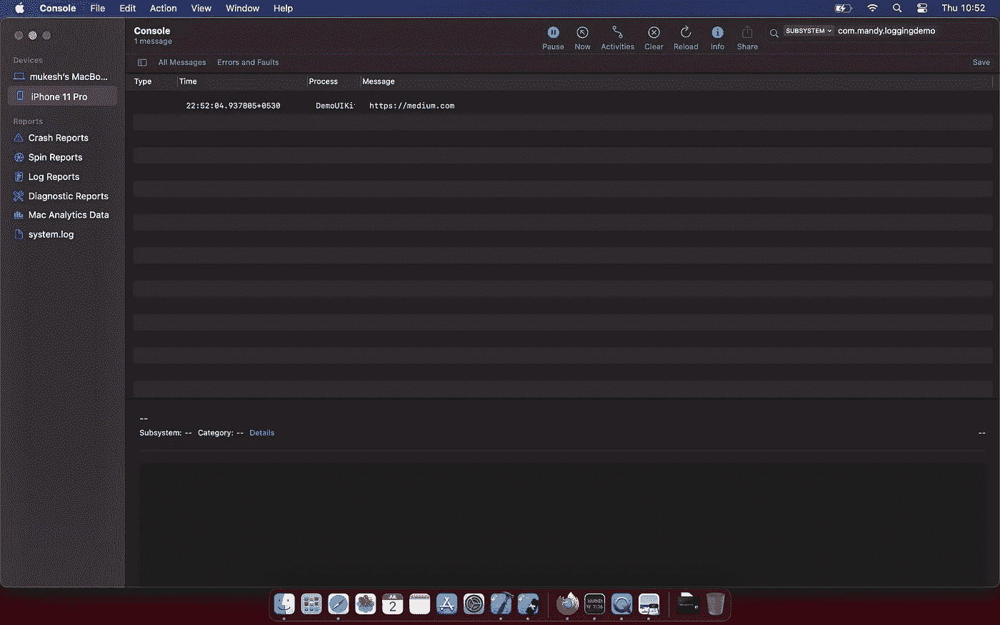
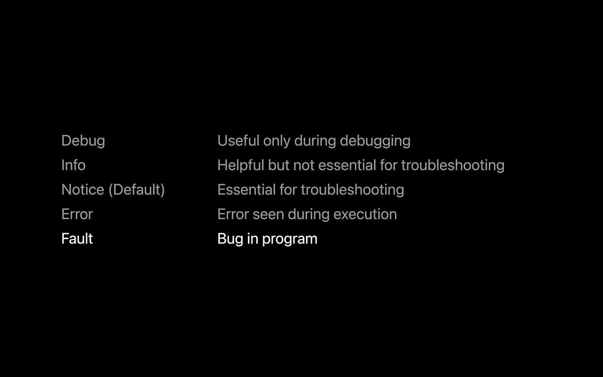
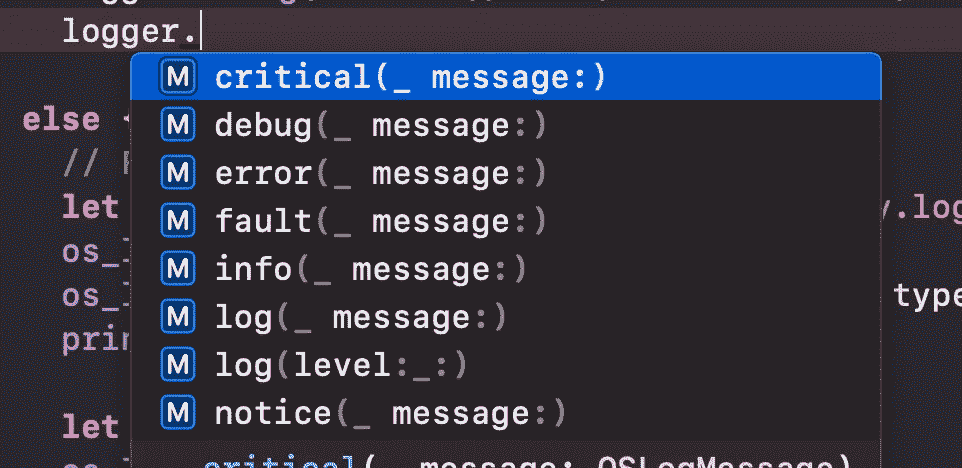
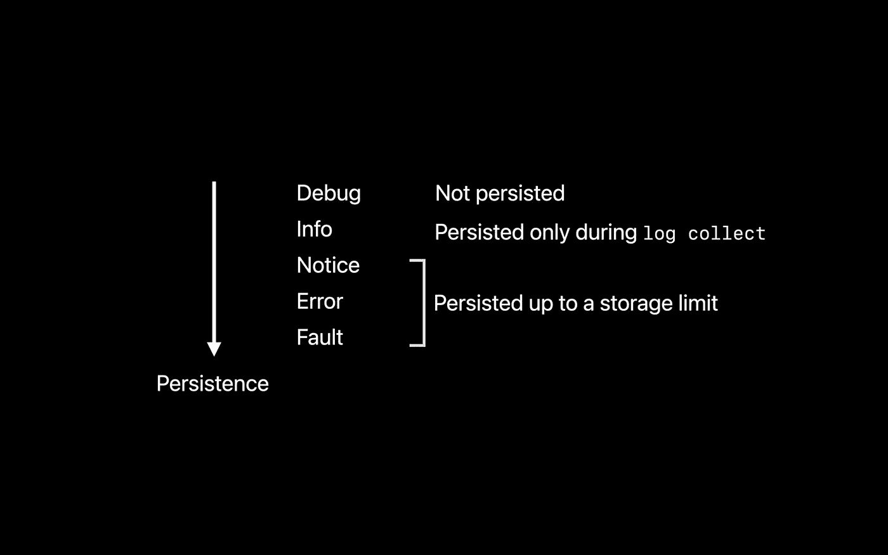
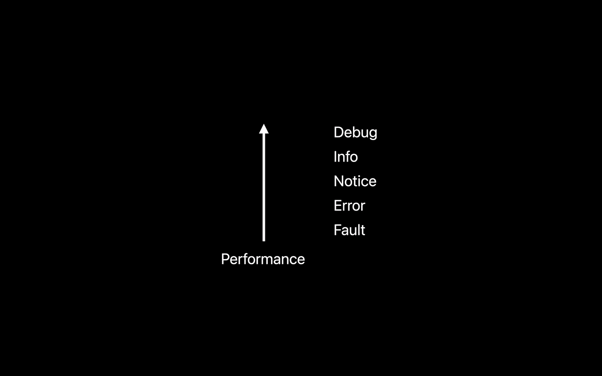

# iOS 14 的新日志 API 与 OSLog

> 原文：<https://betterprogramming.pub/ios-14s-new-logger-api-vs-oslog-ef88bb2ec237>

## 在 WWDC 20 上，苹果宣布了一个新的统一日志 API 来收集、处理日志信息，并帮助调试意外行为


照片由[威廉·胡克](https://unsplash.com/@williamtm?utm_source=unsplash&utm_medium=referral&utm_content=creditCopyText)在 [Unsplash](https://unsplash.com/s/photos/mobile-phone?utm_source=unsplash&utm_medium=referral&utm_content=creditCopyText) 上拍摄

# 我们开始吧

简而言之，我们将从现有的`print`日志迁移到新的苹果日志 API。

然后我们将重温`OSLog` API，并检查现有的旧`OSLog`和新 iOS 14`Logger`API 之间的差异。

首先，让我们转换一个简单的打印语句，我们在项目中经常使用它来记录消息:

```
print(“Start network call”)
```

对此:

```
let log = OSLog.init(subsystem: "com.mandy.loggingdemo", category: "main")
os_log("Start network call", log: log)
```

记得为此使用`os_log` API；你得写`import os.log`声明。自 iOS 10 以来，统一日志系统一直是苹果的日志标准。(这是在 WWDC 2016 宣布的[。)](https://developer.apple.com/videos/play/wwdc2016/721/)

您可以将**子系统**视为您的应用程序的唯一捆绑 id，将**类别**视为应用程序模块。

现在，在 iOS 14 中，苹果推出了新的`Logger` API。要使用这个 API，我们必须编写相同的`import os.log`语句，但是语法与`os_log` API 完全不同。

```
let logger = Logger.init(subsystem: "com.mandy.loggingdemo", category: "main")
logger.debug("Start network call")
```

您可以在调试模式下的 Xcode 控制台以及 Mac 控制台应用程序中查看`os_log`和`Logger`日志。

控制台 app 很强大；我会推荐使用它，因为你可以使用**子系统**和**类别**过滤值，并更广泛地调试你的应用程序。

当您想要调试设备问题并导出**日志文件**时，它也会有所帮助。归档文件将在控制台中打开，并帮助您确定问题。下面是一个例子，我们登录了 iPhone 11 Pro，并用子系统 *com.mandy.loggingdemo.* 过滤了这个简单的日志



与`print`语句相比，`os_log`和`Logger` API 具有相同的优势。在本文中，我们将主要关注它们的用法以及这两个 API 之间的区别。我还在文章末尾添加了一些好的参考资料，带你浏览一下`os_log`和`Logger` API。让我们深入探讨一下。

# 统一日志 API 的优势

*   低性能开销；
*   字符串插值(从 iOS 14 开始，`os_log`也支持该功能)；
*   不同的日志类型(调试、信息、警告、错误、故障、通知)用于不同的用途；
*   持久有效的日志记录——我们甚至可以调试设备中罕见的情况下的 bug 并修复它们；
*   许多格式化和表达选项在运行时没有成本；和
*   可见性选项。

让我们来看看一些关键的不同之处。

# 字符串插值和格式化字符串

`os_log`iOS 14 之前接受格式化字符串:

```
let count = 0
let log = OSLog.init(subsystem: "com.mandy.loggingdemo", category: "main")
os_log("Start %d network call", log: log, type: OSLogType.debug, count)
```

***注*** *:从 iOS 14 开始，* `os_log`、*中也有所有的字符串插值方法。*

新的`Logger` API 支持开箱即用的字符串插值，与旧的 C 风格格式化相比，更像 Swift 风格。一些例子是

*   数字数据类型，如 Int 和 Double
*   带描述的对象；和
*   符合`CustomStringConvertible`的任何类型。

```
let count = 0
let logger = Logger.init(subsystem: “com.mandy.loggingdemo”, category: “main”)
logger.debug(“Start \(count) network call”)
```

# 不同的日志记录类型

`os_log`和`Logger`都支持不同的记录类型。下面是一些类型及其用途的示例。



在 iOS 14 之前，我们用`os_log`用`type`参数声明。果然是`OSLogType`枚举:

```
let count = 0
let log = OSLog.init(subsystem: "com.mandy.loggingdemo", category: "main")
os_log("Start %d network call", log: log, type: OSLogType.debug, count)
```

从 iOS 14 开始，苹果已经使 Logger API 对开发者更加友好、直接和简单，以促进其使用。



```
let count = 0
let logger = Logger.init(subsystem: “com.mandy.loggingdemo”, category: “main”)
logger.debug(“Start \(count) network call”)
```

既然我们谈到了这个主题，让我们来看看这些日志记录类型的不同属性，在您的应用程序中使用它们时会很方便。

## 坚持的

这些日志消息根据其类型存储在磁盘中。调试不持久化，信息仅在`log collect`选项期间持久化，其余的持久化直到存储限制。



## 表演



# 能见度

当消息被记录时，即使当应用程序被部署时，如果一个人可以物理地访问设备，他们也可以被查看。因此，开发者有责任不公开这些敏感信息。

在`os_log`中，我们可以用格式选项设置可见性，如下图所示。我们将`%{private}s`设置为 private，就像我们将它设置为 public 一样。默认情况下，在`os_log`中，动态值是私有的。

```
let log = OSLog.init(subsystem: “com.mandy.loggingdemo”, category: “main”)
 os_log(“Bank account number %{private}s, “, log: log, type: .info, 00011112222)
```

让我们看看`Logger`。除了可见性选项之外，这个 API 还为我们提供了更多的定制选项。默认情况下，在`Logger`中，动态值是私有的。

借助`os_log`这样的隐私参数，我们可以将值设置为公共或私有。

```
logger.log(“Bank account number \(XXXXXXXX, privacy: .private)”)
```

我们还可以屏蔽敏感信息:

```
logger.log(“Bank account number \(XXXXXXXX, privacy: .private(mask: .hash))”)
```

# 日志归档

考虑一个场景，您想要调试一些罕见的场景错误或 bug，这些错误或 bug 不会在您的桌面计算机上或在调试时出现。假设你的 QA 遇到了一些独特的问题，他不知道重现它的具体步骤。

我们可以连接他的设备，导出错误发生时应用程序的日志存档，并在控制台中打开以调试这种情况，前提是我们已经在应用程序中添加了适当的日志记录。

## 导出归档文件的命令

```
log collect --device --start '2020-06-22 9:41:00' --output yourapp.logarchive
```

在控制台中打开此档案，并使用子系统和类别进行过滤以找到问题。

我希望这篇文章能帮助你理解 Logger API 的强大之处，并帮助你认识到现在是时候将我们的项目从传统的日志记录机制切换到新的 Apple APIs，以便进行更好、更可靠的调试。

# 参考资料和好读物

*   【OSLog 的 Rayweinderlich】
*   [WWDC 2016 年奥运会(OSLog)](https://developer.apple.com/videos/play/wwdc2016/721/)
*   [WWDC 2020(记录者)](https://developer.apple.com/videos/play/wwdc2020/10168/)