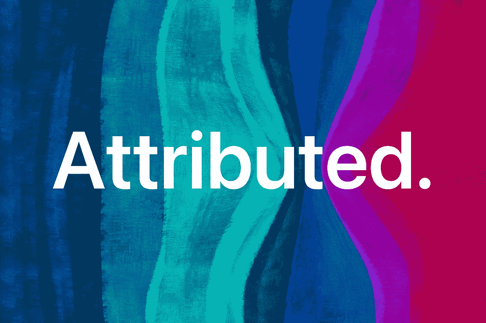
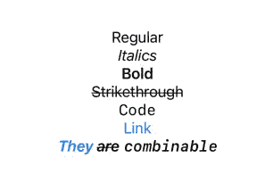
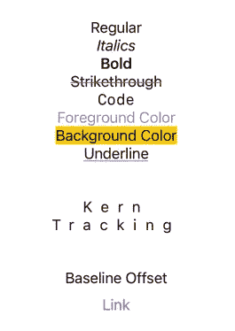

# iOS 15 为 SwiftUI 带来了属性化字符串

> 原文：<https://betterprogramming.pub/ios-15-attributed-strings-in-swiftui-markdown-271204bec5c1>

## 降价、颜色和格式—从未如此简单

图片来源:作者

属性化字符串总是很难处理。在 UIKit 中，最基本的实现应该是这样的:

这已经够糟了，但对 SwiftUI 来说更糟。关于堆栈溢出的[当前接受的答案](https://stackoverflow.com/a/59531265/14351818)使用了`UIViewRepresentable`和其他一些不必要的复杂代码。然而，这是唯一的方法——直到 WWDC21。

# 降价

Markdown 无处不在:在 GitHub 上，堆栈溢出，Discord 的消息气泡…现在，令人敬畏的格式化语言来到 SwiftUI！一切正常，包括链接:

按作者输出

它与`Text`的内置多行支持配合得很好，这也很好。你甚至可以继续使用视图修改器，比如`.padding()`。

按作者输出

这里有一个快速降价备忘单:

*   *斜体*
*   **加粗**
*   删除线`~Strikethrough~`
*   代码``Code``
*   链接`[Link](https://apple.com)`

降价的唯一限制是你不能控制颜色。所以，让我们来看看实际的属性字符串…

# 属性字符串

还记得本文开头的那个`NSAttributedString`烂摊子吗？下面是等价的，使用了[新的](https://developer.apple.com/documentation/foundation/attributedstring) `[AttributedString](https://developer.apple.com/documentation/foundation/attributedstring)` [结构](https://developer.apple.com/documentation/foundation/attributedstring)。

按作者输出

你可能会想，*但是我可以用* `*.foregroundColor(.blue)*` *来做这件事！你说得对。但是如果你也想把中间的单词“归因”变成红色，那就不行了。*

有了`AttributedString`，就可以简单的使用`[range](https://developer.apple.com/documentation/foundation/attributedstring/3813128-range)` [方法](https://developer.apple.com/documentation/foundation/attributedstring/3813128-range)。

按作者输出

我还有一个方便的扩展，你可以用它来代替`makeAttributedString()`函数。

按作者输出

当然，颜色不是你唯一能用`AttributedString`控制的东西。还有很多。

按作者输出

…而这仅仅是开始。您可以在 [SwiftUIAttributes](https://developer.apple.com/documentation/foundation/attributescopes/swiftuiattributes) 和 [FoundationAttributes](https://developer.apple.com/documentation/foundation/attributescopes/foundationattributes) 文档中找到更多信息。

# 结论

认识一下`NSAttributedString`的替代者:在`Text`和`AttributedString`结构中的降价支持。这些将从 iOS 15、macOS 12、tvOS 15 和 watchOS 8 开始提供。你还需要 Xcode 13。

现在比以往任何时候都更容易刺激你的琴弦。