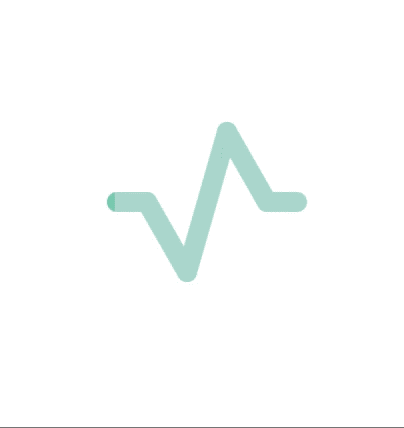
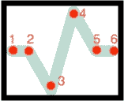
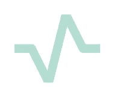
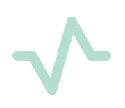
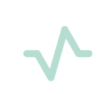
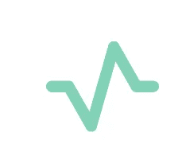
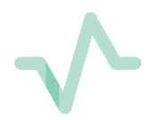

# 以蛇的形式构建一个 iOS 活动指示器

> 原文：<https://betterprogramming.pub/ios-activity-indicator-in-the-form-of-a-snake-7dd85c1baec9>

## 如何使用 SwiftUI 使您的活动指示器不同于所有其他指示器

照片由[奥占·阿克多安](https://unsplash.com/@jeffgry?utm_source=unsplash&utm_medium=referral&utm_content=creditCopyText)在 [Unsplash](https://unsplash.com/s/photos/loading-screen?utm_source=unsplash&utm_medium=referral&utm_content=creditCopyText) 上拍摄

# 介绍

在过去的几年里，开发者一直在使用活动指示器来让用户知道他们需要等待应用程序做一些事情。为了照亮这段时间并脱颖而出，开发人员定制了他们的活动指示器。在本文中，我们将使用 SwiftUI 创建自己的活动指示器。

活动指示器

# 履行

该任务可以分为两个子任务:

*   创建活动指示器的形状。
*   添加动画。

让我们从创建形状开始。为此，创建一个`ActivityIndicatorShape`结构，并使其符合`Shape`协议:

`path(in: CGRect) -> Path`函数是描述形状所必需的。这是符合`Shape`协议所需的功能。

为了绘制我们的形状，我们将把它分成五行，如下所示:

活动指示器周围的黑线是我们视图的边界。五行中每一行的长度等于视图的宽度除以五。然后你可以初始化每一行的起点，还有第六个点，也就是第五行的终点。

接下来，我们连接这些线，使线宽为 10，并添加舍入:

我们的形状采用以下形式:

活动指示器

您可能会注意到，一些线条的边缘看起来并不完全符合我们的需要。这是因为视图切断了超出它的一切。原来我们需要把左、上、右、下的线减少舍入半径的大小。这个半径等于线宽的一半，在我们的例子中是 5。因此，我们的代码采用以下形式:

形状现在看起来像这样:

活动指示器形状

在成功实现第一部分后，我们开始制作动画。

有很多方法可以实现这个动画。我将描述其中之一。

首先，我们在彼此下面画两个`ActivityIndicator`,并给它们不同的颜色:

所以我们画了一个活动指示器，看起来像这样:

然后，我们在第一个活动指标下绘制第二个活动指标。我们的活动指标将如下所示:

请注意，活动指示器的颜色略有变化。这是因为我们看到第二个有不同的颜色，第一个在它下面的层上。

接下来，我们需要限制第二个活动指标的可见区域:

结果看起来像这样:

活动指示器

我们已经学习了如何显示第二个活动指示器的一部分。我们所要做的就是将可见部分动画化。这可以通过以下方式实现:

我们已经创建了`struct Animation`，添加了`repeatForever`，并在`func animation(_ animation: Animation?)`***->***`some View`***中传递了它。*** 可见部分的移动是用 offset 实现的。

# 结论

在本教程中，我们研究了一种创建自己的活动指示器的方法。乍一看好像很复杂，其实不然！

使用 SwiftUI 的这个活动指示器的完整源代码可以在这个 GitHub [存储库](https://github.com/VPavelDm/ProgressBar)中找到。

我希望你喜欢阅读本教程。