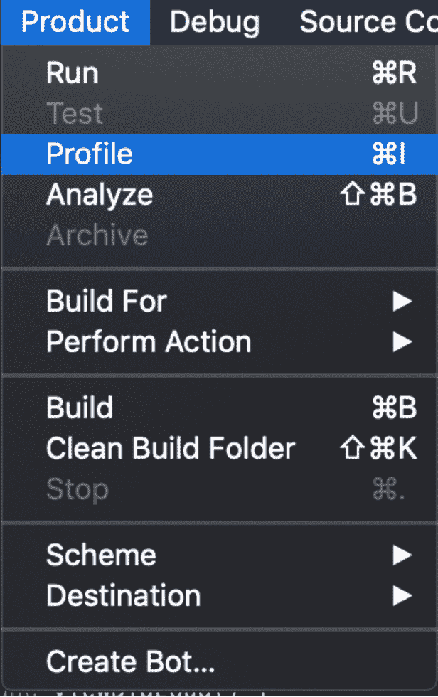
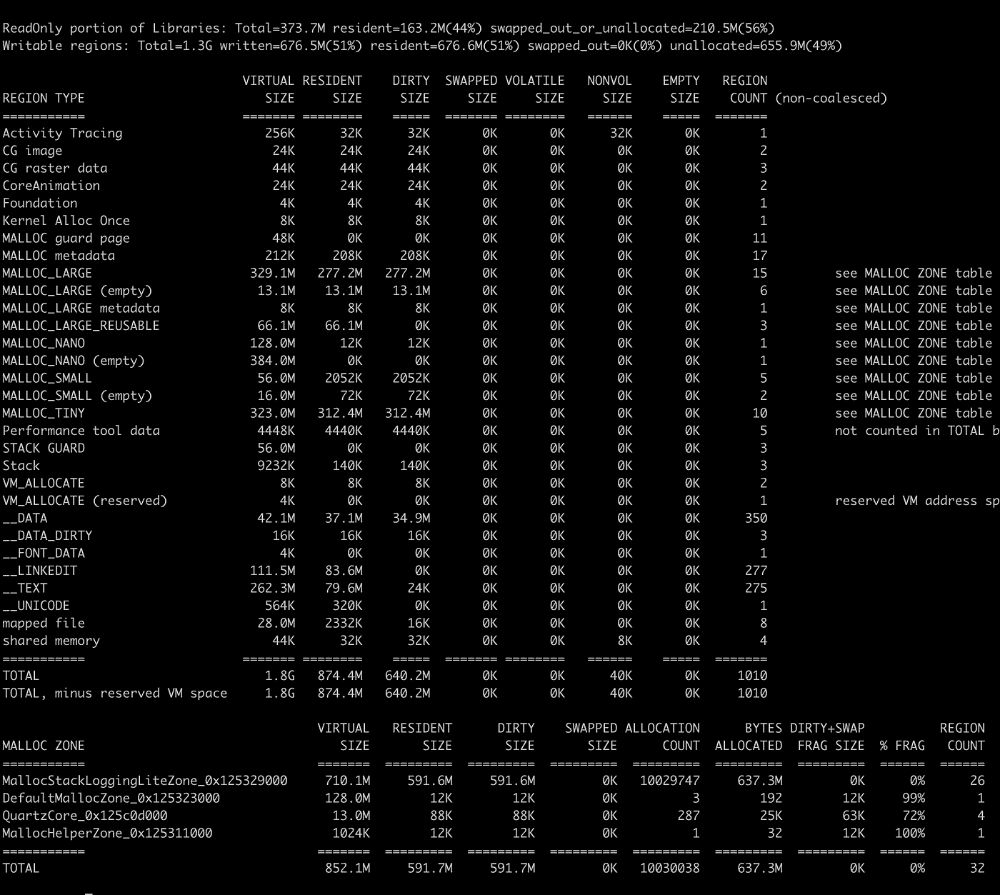
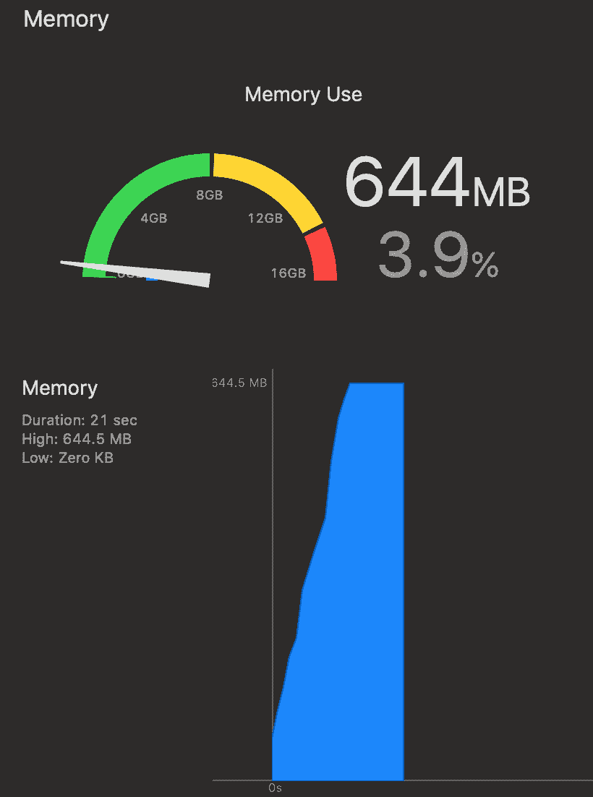
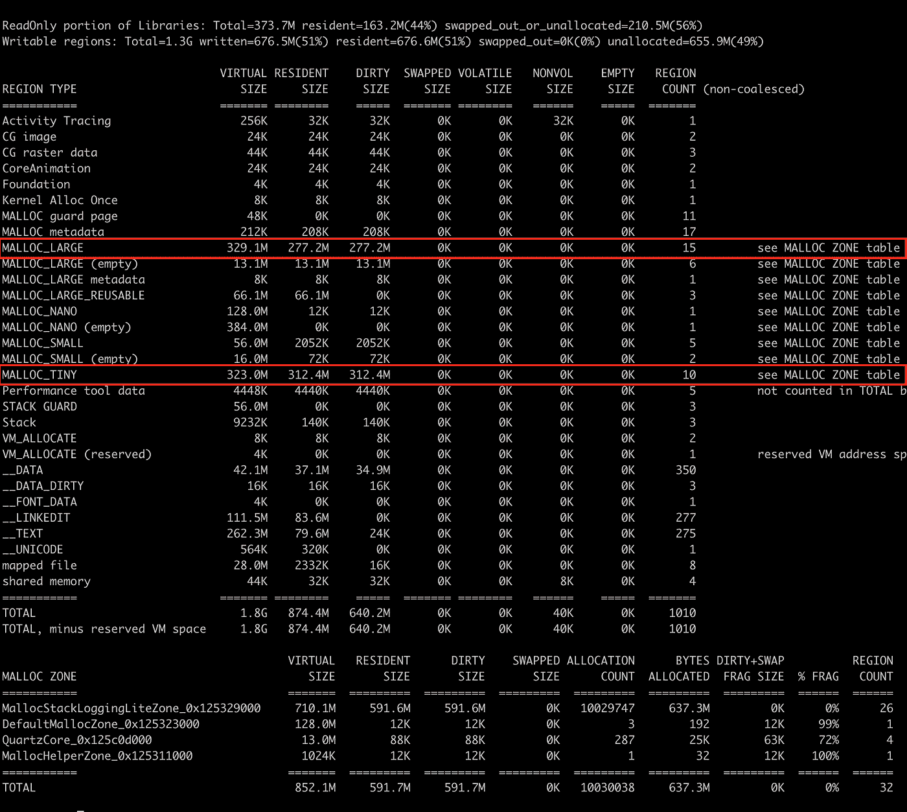
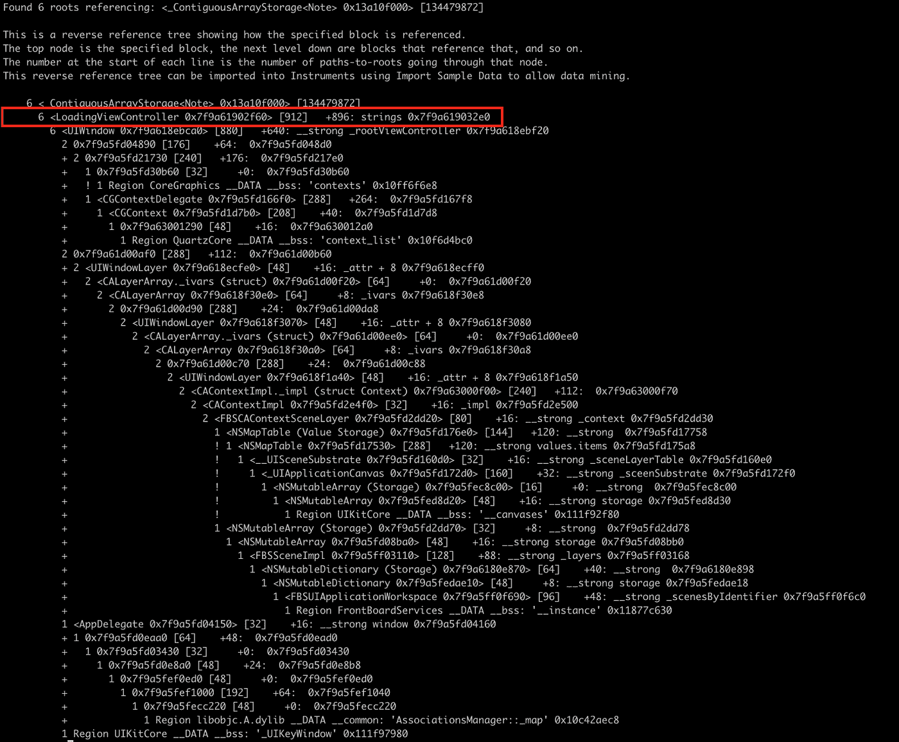

# iOS —面向大众的高级内存调试

> 原文：<https://betterprogramming.pub/ios-advanced-memory-debugging-to-the-masses-24d25852a91c>

## 深入挖掘虚拟内存


# 概观

在“[如何降低你的应用程序的内存占用](https://medium.com/better-programming/reducing-your-apps-memory-footprint-b7afcb9f3749)”中，我解释了如何降低你的应用程序的内存。但有时，我们需要更深入地了解问题的根源。为了做到这一点，我们需要知道什么是虚拟内存，我们有什么调试工具，因此，一般提示来帮助我们完成这项任务。

# 什么是虚拟内存？

不同的设备有不同数量的 RAM，将不同的 RAM 系统抽象为一个统一的地址系统的技术称为虚拟内存。

虚拟内存并不是 iOS 独有的。事实上，所有现代操作系统都使用虚拟内存，这是 60 多年前开发的！

虚拟内存地址是“虚拟的”意味着它们不必与您拥有的任何物理地址对齐。事实上，虚拟内存地址只受您的处理器架构的限制—32 位处理器可以处理 4GB 的地址，64 位处理器可以处理 18eb，即 19，327，352，832 GB！

# iPhones 没有 19,327,352,832 GB

你不应该对此感到惊讶，但 iPhones 没有这么大的内存。事实上，你需要超过 10 亿台新的 MacBook pros 才能达到这个内存大小。

但从 app 的角度来看，其实并不重要。应用程序中的每个进程都获得这个虚拟内存空间，并且可以访问该空间中的每个地址。

您应该考虑到每个虚拟内存空间都有相同的地址列表。一个进程中的相同地址在其他进程中是不同的物理地址，因此该进程不能访问其他进程上的内存块。

每个虚拟内存空间都将一个虚拟地址映射到一个物理地址。由于没有 18eb 的设备，系统可能会遇到限制。与 OSX 不同，iOS 没有后备存储，这意味着 iOS 不使用磁盘来保存内存数据，因此系统仅受限于其物理 RAM 大小。

# 干净和脏的页面

虚拟内存将其空间划分为称为页面的块。页面是 16KB 的块，可以保存任何类型的数据。

数据也可以包含在几个页面中，一个页面可以容纳多种数据。

这里需要知道的最重要的一点是，页面可以被标记为脏、干净或压缩。

干净内存可以从磁盘加载(“页面调出”)，包含框架、可执行代码和只读文件。

脏内存是由应用程序、堆分配、单例、全局初始化器和堆栈写入的任何内存。

压缩内存包括未访问的页面，可以根据您的应用程序使用情况进行压缩或解压缩。

底线—您正在使用的内存是您的脏内存+压缩内存。你可以很容易地忽略干净的记忆，因为你可以随时恢复它。

# 调试内存的工具

现在我们知道了所有重要的术语，如虚拟内存、脏内存和干净内存以及分页，我们可以更好地理解我们用来调试内存问题的高级工具。

# 虚拟机跟踪器

虚拟机跟踪器是分配工具的一部分。

若要在 Instruments 中描述应用程序，请在 Xcode 中选择“产品”->“描述文件”。或者，您可以长按“播放”按钮，然后选择“个人资料”。



仪器打开后，选择“分配”,并运行 profiler。

现在您将看到两个工具——一个是堆分配，另一个是 VM 跟踪器。虚拟内存跟踪器可以帮助您跟踪您最感兴趣的内存类型:脏内存。

大多数时候，一开始你不会在虚拟机跟踪器上看到任何数据。那是因为 VM Tracker 不会持续显示你的虚拟内存状态。你必须拍快照来分析你的记忆。如果您点击虚拟机跟踪器行，窗口底部会显示一个“快照”按钮。点击此按钮将允许您设置快照间隔，甚至手动拍摄快照。

有了快照后，您可以看到一段时间内的脏内存状态。您还可以看到哪些对象占用了您的大部分脏内存。如果您想更深入地了解，可以使用 VMMap，它非常适合高级内存调试。

# 命令行工具— VMMap

除了 Heap 和 Leaks 之外，VMMap 是一个很棒的命令行工具，旨在调试虚拟内存环境中的内存对象。

为了使用它，VMMap 需要您的应用程序的内存图形文件。生成一个很容易——在 Xcode 中，通过点击窗口底部的“调试内存图”按钮来停止应用程序运行，然后在“文件”菜单下，选择“导出内存图”。该选项将生成一个可用于 VMMap 的内存图文件。

使用 VMMap 的第一步是获取虚拟内存映射的概要。

在终端中写入:

```
VMMap -summary <memgraph file>
```



`*__TEXT*` —包含可执行代码和常量

`*__DATA*` —嗯，数据:)

`*__OBJC*` —如果您的应用程序包含目标 C 代码，则此区域包含目标 C 运行时库代码

`Shared Memory` —与其他应用程序共享的系统库，如 Cocoa 和 OpenGL

`Mapped file` —该区域包含经常访问的文件内容，这些内容被映射到虚拟内存，以便能够更快地访问

`Stack` —包含堆栈存储器，包括每个函数调用的参数。

# 脏与干净

我们之前提到了脏内存和干净内存，但这意味着什么呢？最简单的解释是，干净内存是指，如果丢失了，你可以从代码或存储器中恢复。

在 VMMap summary 报告中，您可以看到`__LINKEDIT`区域占用了超过 100MB 的虚拟内存，但却占用了 0MB 的脏内存，这是因为`__LINKEDIT`区域引用了保存在文件中的符号表，因此可以恢复。

从结果可以看出，使用中的内存真的只是脏内存。

# 让我们调试内存问题

那么如何利用内存命令工具呢？

假设我们的应用程序内存有问题:



你可以看到，我们的应用程序启动后需要 644MB。

在我们生成一个内存图文件后，我们将使用 VMMap 来了解是什么类型的内存导致了这个问题。

```
VMMap -summary data.memgraph
```



我们注意到`MALLOC_LARGE`和`MALLOG_TINY`区域总共占用了 589MB。如果我们想查看关于`MALLOC_LARGE`区域的更多细节，我们可以使用`verbose`标志和`grep`来查看内存块列表:

```
vmmap --verbose data.memgraph | grep "MALLOC_LARGE"
```

因此，我们找到了一个有趣的块，它占用了我们大约 76MB 的空间。为了追踪那个对象，我们需要使用`Leaks`工具，带有`traceTree`标志和地址:

```
leaks -traceTree 0x0000000014210f00 data.memgraph
```



现在，显示的跟踪树可以告诉我们，问题出在名为`LoadingViewController`的视图控制器中的一个类名为“Note”的数组上。对我们有好处！

总结一下-

步骤 1-将内存图导出到文件。

步骤 2 —使用带有`— summary`标志的`vmmap`运行该文件的概述信息

步骤 3 —跟踪一个大的脏区域，并使用`— verbose`标志对其进行检查

步骤 4-找到一个大数据块，并使用`Leaks`命令找到其来源。

这真的很棒，但是如何从一开始就防止应用程序中的脏内存变大呢？

# 减少脏内存

为了减少脏内存，我们需要记住我们在应用程序中动态创建并保留的数据是脏内存。

此外，请记住，如果缓存用 CPU 换取内存，您可以用内存换取更多的 CPU 工作或本地存储。

减少应用程序中脏内存的技巧:

*   尽量使用常量而不是变量:出于安全考虑，Swift 鼓励您尽可能使用`let`，但是使用`let`也可以减少您的脏内存。事实上，当 country 应用程序内存时，`let`对象根本不算数，因为它是代码的一部分，因此它被认为是干净的内存。
*   将大数据对象保存到本地存储，并在需要时加载它们:如果可以将数据保存到缓存文件中，并在需要时加载，就可以释放脏内存。可以把它想象成大块信息的全球存储器。
*   在堆栈中分配变量:在堆栈中分配变量，也就是说，将它们作为方法变量进行分配，并不计入脏内存列，但是一旦方法完成了它们的运行，这些内存就被释放了。
*   尽可能使用最小的数据类型:默认的`Int`数据类型基于 CPU 架构。在 64 位设备中，这几乎是今天所有的活动设备，默认的`Int`实际上是`Int64`。所以尽可能使用`Int8` / `Int16`。
*   使用延迟加载:只在需要的时候分配对象总是最佳实践。Swift 中的延迟加载就是为了这个。如果你实现了它，有可能这些对象根本不会被分配。

所有这些技巧看起来都微不足道，但是通过将它们结合起来，你可以节省大量的内存，并改善你的用户体验。

# 摘要

你可以悄悄地忽略这篇文章，继续开发 iOS 应用程序，但了解这些材料可以帮助你调查与内存问题相关的问题，并在第一时间防止它们，因此，给你的应用程序带来用户体验的巨大提升。