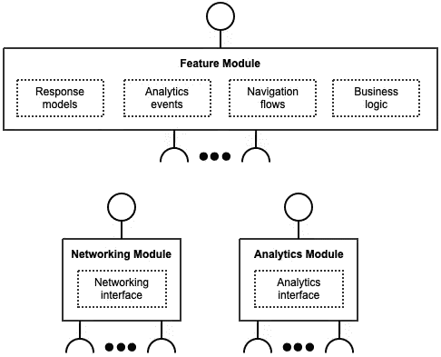
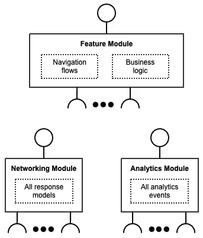
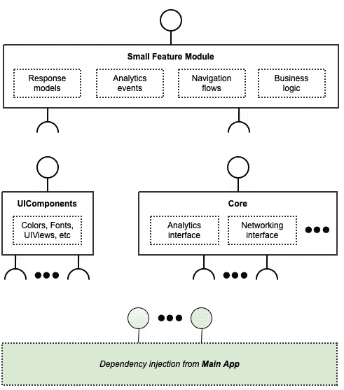
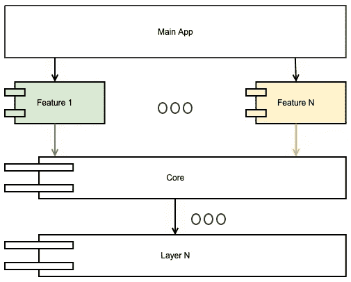
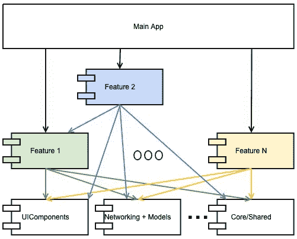
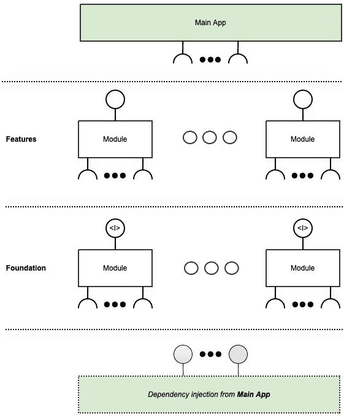
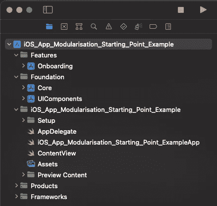

# iOS 应用模块化——起点

> 原文：<https://betterprogramming.pub/ios-app-modularisation-the-starting-point-1419db0474ed>

## 从哪里开始？app 如何划分模块？有哪些选择？


Ashkan Forouzani 在 [Unsplash](https://unsplash.com?utm_source=medium&utm_medium=referral) 上的照片

这篇文章是基于我的经验，我试图找出一个现有的 iOS 应用程序项目的模块化的起点。我试图把我的想法、推理和技巧放在一起，这样可以帮助其他开发人员。对于一个现有的项目来说，进行模块化可能很困难，所以希望这篇文章能给你一些启发。

# 介绍

## 主要思想

根据使用案例和个人偏好，可以从不同的角度实现应用模块化。我认为，理想情况下，每个模块应该尽可能地独立，模块需要的依赖关系应该通过接口(aka 协议)而不是直接访问，具体的实现应该通过依赖关系注入来注入。通过接口(aka 协议)隐藏实现并不总是可能或实际的，但这仍然应该是目标。

另一件重要的事情是，模块应该是自包含的，这意味着与模块相关的所有功能都应该在一个模块中，而不是分布在不同的模块中。例如，onboarding 模块应该具有模块内部的整个流程、所有网络请求和响应模型，以及分析跟踪事件，其中通过接口(aka 协议)使用网络和分析，并注入具体的实现。



独立且自包含的功能模块|图片由作者提供

我有时会看到相反的情况，网络模块有具体的响应模型，而分析模块有特定功能所需的具体事件，这样做会破坏模块独立性和独立的思想。



非独立功能模块|作者图片

# 开始

开发人员希望应用模块化的原因有很多:更快的增量构建、关注点分离、代码更改影响透明度等。但遗憾的是，没有具体的方法来使应用程序模块化，开发人员留下了一个即兴创作的游乐场和形状奇怪的拼图，它们不一定按照预期的方式组合在一起。

独立于 iOS 的代码可以提取到一个单独的项目(或目标)中，产生一个框架。知道这一点很好，但对于试图找出如何将应用程序分解成小的独立模块没有什么价值。

## 从哪里开始？

通常，有一个已经存在的项目变得有点太大，需要打破它。这里有一个例子可以说明这一点。

创建一个`UIComponents`框架。有许多颜色、自定义字体、UI 视图、与 UI 构建相关的扩展，以及构建功能所需的其他内容。因此，移动它的一部分作为第一步肯定是有用的。通常将实现隐藏在接口(即协议)后面是一个好主意，但是对于 UI 来说这是不实际的，因为它包含了太多不同的小块和大块。

将小特性提取到模块中的概念验证是一种很好的方式，可以了解模块化将如何进行，并确定主要的难点。选择一个对其他功能没有太多依赖的小功能，并尝试将其提取出来，作为一个独立的专用功能模块。小功能应该有几个屏幕，一些网络和分析。这个 POC 特性将依赖于`UIComponents`，但是仍然会有不同的 UI 相关的东西丢失，需要移动。

下面是一个可以遵循的简单行动计划:

1.  创建一个功能框架项目，并将其作为子项目添加到主项目中
2.  将与功能相关的文件复制到功能项目
3.  创建一个`TEMP.swift`文件，从主项目复制类、协议等，直到特性框架构建完成。复制代码的实现可以被注释掉或者被存根化。这个临时文件的主要目的是获得一个要构建的功能框架，并对需要的东西有一个全面的了解。
4.  重复步骤 3，构建特征框架。
5.  用缺失的 UI 相关代码扩展 UIComponents。可以删除`TEMP.swift`中与 UI 相关的复制/存根代码。
6.  创建一个核心框架。此时，UI 相关的代码应该在 UIComponents 中，但是网络、分析和其他代码仍然在 TEMP.swift 中，需要提取。创建某种核心框架来保存那些与 UI 无关的依赖项。这里的关键是，网络、分析和其他所需的依赖关系将隐藏在接口(又名协议)下的核心框架中，并通过主应用程序的依赖注入来注入。
7.  用功能框架替换主应用程序中的功能代码。此时，功能框架应该在主应用程序中工作并可用。因此，功能代码应该从主应用程序中删除，并替换为功能框架代码。

以上步骤将为您开启应用模块化之旅提供一个起点。此外，它应该产生三个拉请求:

*   拉动请求:针对`UIComponents`分机。大部分的改变是将现有文件转移到`UIComponents`并添加公共注释
*   拉请求:核心框架(网络、分析和其他与 UI 无关的东西)。具体实现要从主 app 注入。
*   拉取请求:用于依赖于`UIComponents`和核心框架的功能框架/模块，并在主应用中使用



提取到特征模块的小特征|作者的图像

# 警告

**将实现隐藏在接口**(又名协议)之后应该是那些将要创建的框架/模块的方向，尽管这不是一件容易的事情。对于功能模块，这可能不实际，因为主应用程序会暴露大量代码。但对于那些基础模块(核心、网络、分析等)，它应该是目标。

分析界面足够小，但是由于实际使用的分析跟踪器提供的具体实现，并不是所有的东西都可以容易地抽象出来。最大的痛苦是事件属性的值可以是`Any`，但是它会导致主应用程序中令人讨厌的桥接实现。但是有一种解决方法，乍一看似乎有点奇怪，但是可以大大简化桥接。

```
analyticsTracker.track(
    event: "Complete Payment", 
    properties: 
        "Amount": .value(payment.amount),            // Double
        "Product Name": .value(payment.productName), // String
    ]
)
```

事件属性值的抽象:

**联网**也有点麻烦，因为理想情况下，你希望功能模块自包含请求和响应模型以及模块内部的错误处理。为了实现这一点，需要进行一些权衡，特别是在错误的外观和处理方式方面。为了概括错误，您需要有某种通用的错误对象，例如，`StandardError`,它包含(错误)代码、来源(微服务标识符)和原始响应(以防万一)。这应该足以在特征模块中实现适当的错误处理。

**App-Bridging-Header.h** 在主 App 中添加那些框架/模块非常方便，因为你不需要在每个使用它们的地方都导入它们。这很有帮助，尤其是当将 UI 相关的代码转移到`UIComponents`时，因为应用程序中几乎所有的 UI 代码都需要来自 UIComponents 的东西，并且在许多地方添加这些导入会变得非常快。

**依赖注入**是在接口(又名协议)背后提供具体实现的好方法。用服务定位器和属性包装器可以很容易地实现它。

如何通过属性包装使用注入的依赖项:

```
@Injected private var analyticsTracker: AnalyticsTracking
@Injected private var apiWorker: Networking
```

属性包装实现的示例:

服务定位器示例:

**静态与动态链接**是处理 Xcode 项目时需要理解的一个重要概念。当您在 Xcode 中创建一个框架项目时，您会创建一个动态链接的框架，当您创建一个静态库时，您会创建一个静态链接库。

实际上，动态链接意味着无论你将 Framework 添加到不同的目标多少次，你都只有一个 Framework 实例。例如，如果您有动态框架的`Core`模块，并且在许多特性模块中使用，那么您将有一个在所有特性模块之间共享的`Core`模块的单个实例。

另一方面，如果你有一个`Module`，那就是一个静态库。它将被每次复制，你将有它的许多实例。听起来动态框架似乎是一个显而易见的选择，但事实并非如此。主要原因是动态框架会影响应用程序的启动时间，因为在应用程序启动时需要执行额外的链接。你应该考虑新的`Module`是否会被多次使用，因为如果你只是默认动态框架选项，你会慢慢增加应用程序的启动时间。

# 后续步骤

当你开始使用`UIComponents` (UI 代码)和`Core`(非 UI 代码)框架时，你可以开始探索如何前进，以及如何在应用程序中更大规模地应用模块化。特性越大，就越难将其移动到模块/框架中。此外，通常较大的功能对其他功能有更多的依赖性，这只会增加复杂性，但另一方面，尝试解决这些大难题也很有趣。

声明:在撰写本文时，我并没有超越 UIComponents 和核心框架，但是我想分享一些可能有价值的考虑和想法。然而，当事情向前发展的时候，应该会有第二部分。

# 外面是什么？

据我所见，通常来说，应用模块化有两种方式——分层模块化或粒度模块化或介于两者之间的方式。

## 分层模块化

分层模块化的主要思想是，您拥有某种所有功能模块都在使用的单核层。此外，`Core`层可以有其他依赖关系，但它们是不可见的。这使得我们可以非常快速地将大量代码从主应用程序转移到核心，并改进增量构建。

但最后，它最终形成了一个巨大的核心(与巨大的`ViewController`相同)。因此，这通常是一个短期解决方案，需要重新审视，从长期来看需要更多的粒度。



分层模块化|作者图片

## 粒度模块化

粒度模块化的主要思想是拥有尽可能多的粒度。这听起来很合理，但是如果应用到极端，可能会导致模块爆炸，不同的模块依赖于其他模块。尽管它是一个高度模块化的最终解决方案，但由于每个模块都有多个交叉依赖项，因此具有高度的耦合性。特别是，如果模块没有通过接口公开它们的功能，并且没有使用依赖注入。



粒度模块化|作者图片

在这种模块化方法中，我有时还会看到一个`Core/Shared`模块，它包含了一些小的可共享代码，通常是以扩展的形式，这些扩展太小而不能作为单独的模块。这样做是为了防止特性模块中的代码重复，但是会在使用`Core/Shared`模块的每个模块中产生微小位的高耦合。

此外，一些奇怪的东西(扩展)可能会出现在这里，只是因为有人认为这是一个好主意，可以在许多地方使用，即使它只是在一个地方。因为 Core/Shared 没有具体的目的(除了收集随机的可重用代码之外),所以很难控制它包含了什么。

# 高层次愿景

对特定项目中的理想解决方案有一些高层次的设想，然后做一些妥协，使其尽可能接近理想，这很重要。如果以相反的方式开始，那么就很难感觉模块化是否朝着正确的方向发展，因为最终目标太抽象了。

这是一个如何想象模块化应用程序的例子。主应用程序由`Feature`模块构建而成，那些`Feature`模块依赖于一组`Foundation`模块。`Foundation`网络、分析等模块。，只暴露接口(即协议),具体实现从主应用程序注入。

因此，基本上这些`Foundation`模块内部没有实际的实现，它们只是为如何联网、分析等创建一个标准接口。应该在`Feature`模块中完成。当然，并不总是那么理想。例如，`UIComponents`是一个`Foundation`模块，但是它被直接用在`Feature`模块中，因为几乎不可能将它隐藏在接口下。



模块化应用视觉|作者图片

## 相互依赖的特征

看起来你会有一个完美的高层次的愿景，你会去实现它，但事实上，这是不可能的。最令人困惑的部分是那些`Feature`模块，它们在 app 内被用作独立功能，而其中的一部分被用在其他功能中。

例如，账户和卡功能模块是应用程序中用于管理支付账户和卡的独立功能，但账户和卡选择器(它的一部分)作为智能 UI 组件用于其他支付流程。这只是一个例子，但在现实中，根据功能和它们之间的联系，应用程序中可能有很多这样的情况。

在写这篇文章的时候，我还没有一个针对相互依赖的特性模块的具体解决方案，但是我希望在第 2 部分的文章中，当应用程序的模块化推进时，会有一些指导。

# 最后的想法

对于如何模块化应用程序，可能没有放之四海而皆准的解决方案，但最重要的是要有一个清晰的高层次愿景，以及你对什么是模块的定义。了解应用程序中不同类型的模块是什么，以及它们如何相互依赖也很有帮助。此外，还需要做出妥协，但至少应该明确这是妥协，而不是应该采取的方式。

然而，你的目标是什么？只是让增量构建时间更快？或者制作每个跨职能团队都可以在对其他团队影响最小的情况下工作的功能模块？

根据这些答案，您可以决定模块化要走多远。也许只有单个`Core`模块就足够了；也许有 2-3 个就足够了，功能可以存在于主应用程序代码库中。可能项目这么大，团队人数这么多，你想在特色模块上投入时间。

没有什么是免费的，无论如何你都需要付出代价。如果你决定目前一个非模块化的应用足够好，你将需要付出更高风险的代价来影响应用的其他领域，并由于能够使改变更容易而做出突破性的改变。如果你决定让应用程序模块化(无论模块化到什么水平)，你将需要付出更大的代价来做出改变，但对受影响的东西有更多的控制。

# 示例项目

这是一个示例项目，展示了使用`UIComponents`和`Core`框架的起点实现在现实中是什么样子，以及一切是如何连接在一起的。

[https://github . com/JAMA gas/iOS _ App _ modular ization _ Starting _ Point _ Example](https://github.com/Jamagas/iOS_App_Modularisation_Starting_Point_Example)



示例项目结构|作者图片