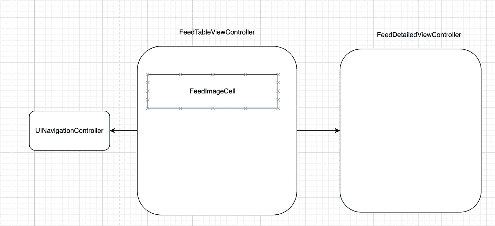
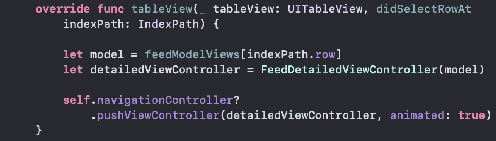
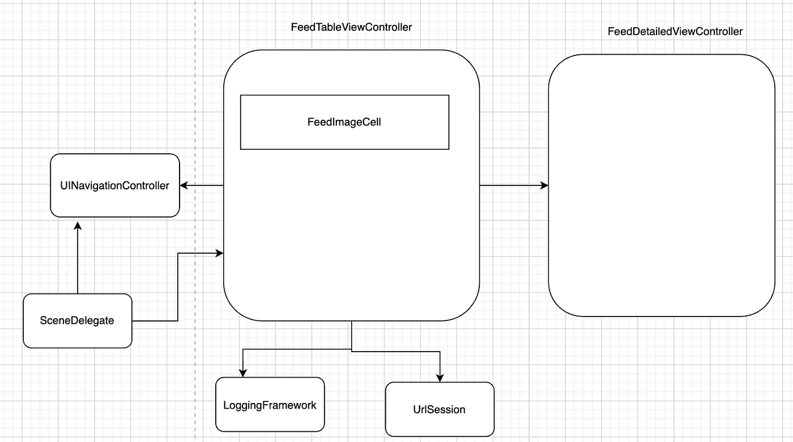
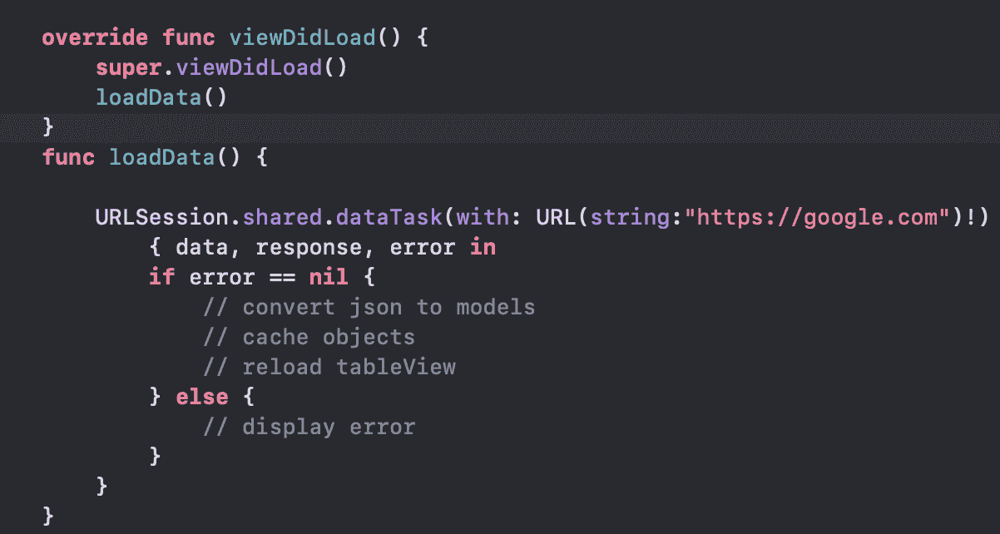
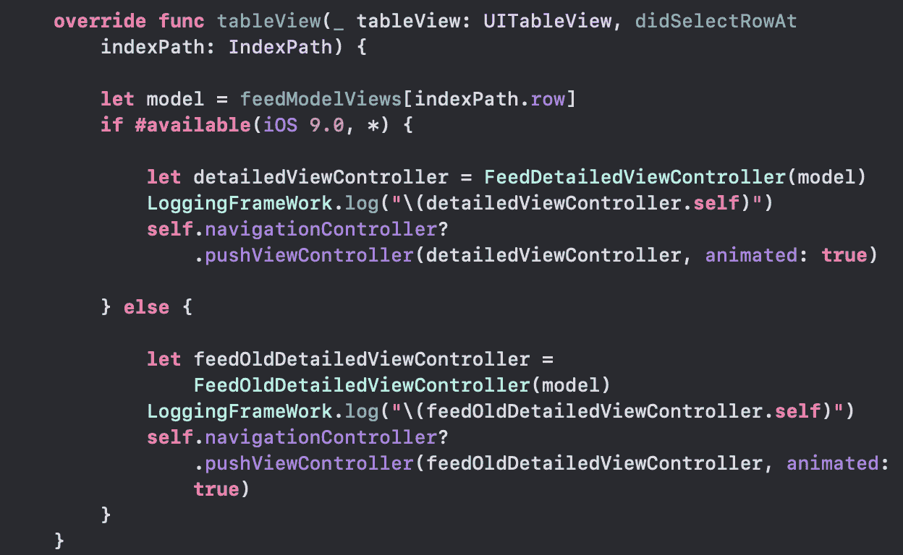
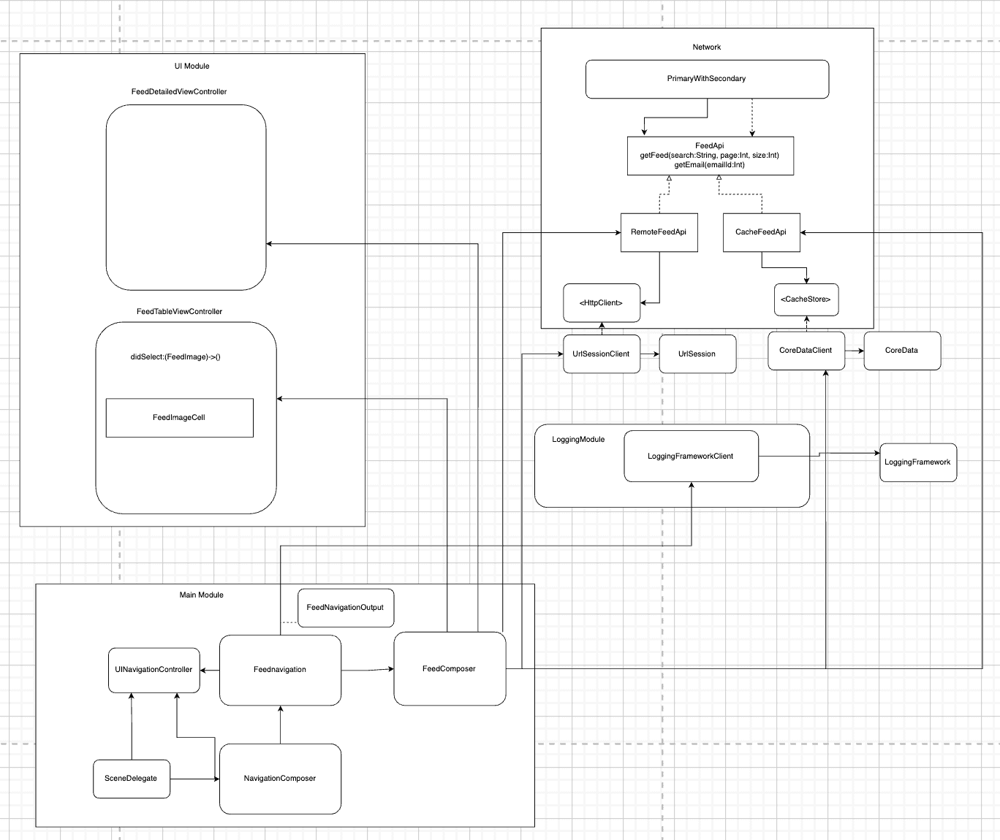
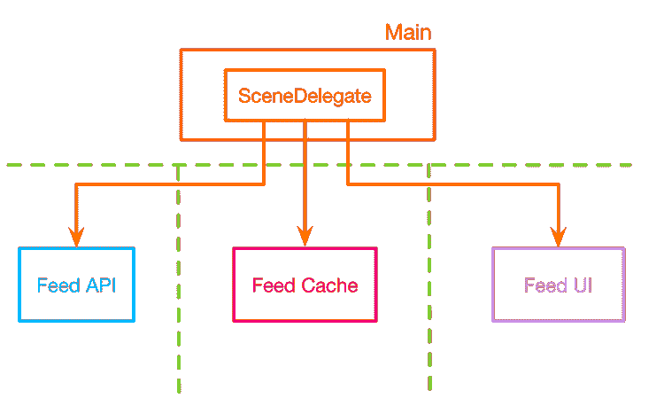

# iOS 中依赖太多？使用复合根模式

> 原文：<https://betterprogramming.pub/ios-architecture-is-not-mvc-mvvm-m-5b34a04beb98>

## iOS 架构不仅仅是 MVC、MVVM、M*


资料来源:Undraw

如果你问一个 iOS 工程师，“你会用哪种架构来设计 X 应用？”，通常他们用 MVC，MVVM，MVP 等来回应。

这篇文章将解释为什么这些流行的缩略语不能完全回答这个问题，并将展示一个替代的解决方案。

MVC、MVVM、MVP 是 UI 层设计或 UI 架构，而不是系统架构。

它们描述了 UI 层中的数据流和职责分离。它不回答任何关于导航、网络、缓存、业务逻辑等的问题。

将这些职责添加到 UI 层会创建具有大量依赖图的整体应用程序。这导致了重写，不可测试的代码，以及变更的高成本。

解决方案是将整体分解成模块化组件，并在“组合根**”**处将它们组合在一起。例如，您想要创建一个类似于 Instagram 的图片 feed 应用程序。

一个常见的 UI 架构可能是这样的。



用户选择一个`FeedImageCell`并期望导航到一个`FeedDetailedViewController`。



上面的代码是一个常见的策略，它要求视图控制器负责导航和创建其子视图控制器。

现在，假设您的需求发生了变化，您现在需要实现日志功能，从远程或本地存储库中检索资源，并支持旧的操作系统。



您使用`URLSession`并在`viewDidLoad`加载数据，如下所示:



当用户选择一个项目时，您检查以确定导航到哪个控制器并记录它。



这些微小的变化需要开发者修改`FeedViewController`。这违反了打开/关闭原则，因为可能的导航路径在编译时很早就确定了。

即使我们通过构造注入注入依赖来延迟`FeedViewController`的行为，我们仍然需要注入它创建的任何子视图控制器的依赖。

如果子视图控制器有子视图控制器，我们就必须在根视图控制器中注入这些职责，并向下级联它们。这可能会在大型复杂的应用程序中无限期地持续下去，并给大量的依赖图带来严重的问题。

通过将`FeedViewController`与`LoggingFramework`和`URLSession`耦合，您已经可以看到在`FeedViewController`周围形成的依赖网络。它的孩子拥有的任何依赖也将是它的依赖。

# **满足构图根**模式**模式**

复合根模式延迟了关于组件如何交互的决策，并允许我们拦截和修改行为。

它存在于`Main`模块中，这个概念对于大多数 iOS 工程师来说是陌生的。

让我们来看看如何在主模块中组成组件，以及如何分解这个整体。



现在，`FeedViewController`不再负责其子节点的创建和导航。

`FeedComposer`组成了`FeedViewController`，并把它和它所有的依赖项组装在一起。使用闭包，我们可以注入行为，而无需将 UI 模块组件与`Networking`或`Logging`模块耦合。

`FeedNavigation`处理路由，并通过其代表通知`Logging`模块。

注意依赖关系的流动。主模块依赖于所有其他模块，而没有模块知道彼此。

通过创建模块化代码并在组合根上将组件组合在一起，我们创建了模块之间的虚拟边界。



假设我们希望我们的 Feed 应用程序在 Apple Watch 或 Mac OS 上运行。最初的方法是将 UI 层中的所有东西耦合起来，并将其命名为 MVC/MVVM/M*，这需要完全重写。

使用我们的新方法，我们只需要重写`FeedUI`模块，并在 Main 中的组合根处连接组件。所有的业务逻辑、网络、日志都将被重用。这就是模块化设计的力量。

感谢您的阅读。完整的源代码可以在 GitHub 库中找到

```
**Want to Connect?**You can reach out to me on [Twitter](https://twitter.com/itsEthanKeiser).
```