# iOS 架构解释:哪个最适合我的项目？

> 原文：<https://betterprogramming.pub/ios-architectures-explained-which-one-best-fits-my-project-94b4ffaad16>

## 并且知道何时使用 MVC、MVVM、VIPER 和协调模式

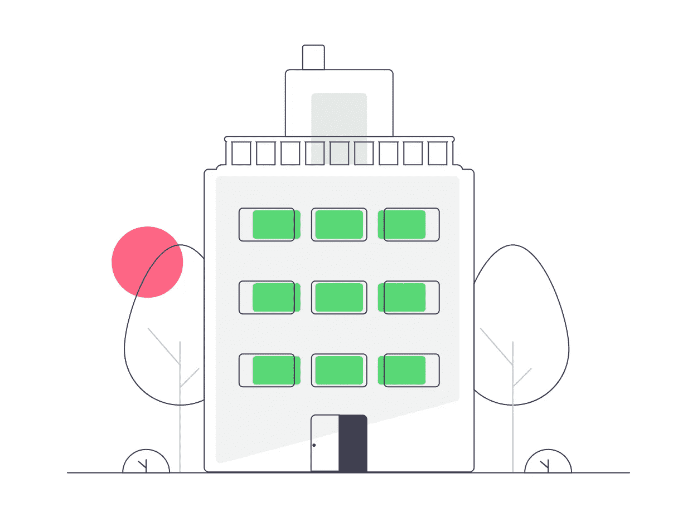

资料来源:Undraw

当你计划构建一个应用程序时，最重要的决定之一(如果不是最重要的)是选择如何构建应用程序的核心。

更好的说法是，您需要决定您应该采用哪种架构来构建所有的屏幕、功能和上下文。你需要知道如何组织你的应用程序，以使它长期可维护，可测试，可伸缩，并能被后来参与项目的任何人理解。

# 良好架构的好处

*   建立一种清晰的语言来理解你的特征中的每一种责任。
*   将每个职责与其他职责分开，以便更容易地进行测试，并增加对场景的理解。
*   使你的项目长期可维护
*   减少类和组件之间的耦合。
*   填写您的项目复杂性预期
*   将 UI 与业务规则分开(必需)

现在你明白了每个移动项目都需要一个好的架构，你一定知道一些事情。人们总是问我哪种架构是最好的，他们应该避免哪种设计模式。

对于这个问题，有一个非常简单的答案:没有最佳选择。

这个问题取决于很多变量，比如你的项目的业务类型，它的复杂性，你将如何组织你的模块，以及以后的发展方向。

由于这个问题没有确切的答案，我将在本文中举例说明所有最著名的 iOS 架构，以及它参与的项目类型及其主要问题。我希望你喜欢它！

# 1.模型-视图-控制器(MVC)

这种架构是开发世界中最标准的架构，因为它在许多语言中使用，如 Java、Swift 和 Python。这也是苹果项目中使用的默认模式，因为我们已经有一些本地类依赖于它的层。

顾名思义它由三个核心层组成:模型、视图和控制器。让我们来看看每个人负责什么:

1.  它囊括了一个场景的所有商业规则。所有数据模型及其操作和用例都必须保存在这一层中。主要保存屏幕的逻辑状态(`ViewController`)
2.  `View`:它由一个 UI 组件组成，该组件包含多个子视图，这些子视图的层次结构和状态根据业务逻辑操作的输出而变化。您可以将这一层解释为 Xib 文件、故事板，它们包含一些 UI 层次结构、约束和属性。`UIView`子类也属于视图层。

注意，前两层分别实现了业务和表示操作，但是既然它们是独立的，如何将它们链接起来呢？

3.控制器:这一层接收来自业务和 UI 世界的输出，并传递这些输出以更新另一层。基本上，当它通过一个`IBAction`检测到一些用户交互时，它将消息传输给模型来更新逻辑。当在模型中获得一些结果时，它必须根据它的状态更新视图

看一下图表:

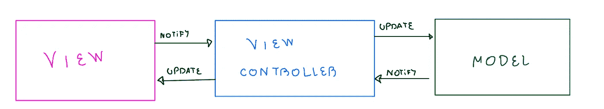

默认情况下，苹果已经为我们提供了这个架构的 Swift 原生类(`UIViewController`和 UIView)

## MVC 的问题

*   大多数人将大量的业务和表示规则放在 ViewController 中，使它变得庞大。
*   ViewController 负责各种类型的任务，如服务、监听视图交互、实现委托和导航逻辑
*   难以测试
*   调试起来真的不简单
*   建立子视图控制器时甚至更混乱

## 什么时候用？

*   当你有一个非常简单的项目，像一些 iOS 功能演示或在样本模板中测试一个应用程序功能
*   当你有琐碎的商业规则时

# 2.模型-视图-视图模型(MVVM)

这种架构通过将场景的一些职责分离到一个新的层中来解决 MVM 的主要问题:视图模型。现在你的模型层没有任何逻辑，因为它只包含简单的数据，它通常是一个结构。

看一看:

1.  视图:现在它同时包含了视图和来自 MVC 的`ViewController`。它只是一个进行 UI 更新操作和布局的地方。
2.  模型:只是原始数据，这一层没有任何功能，只是对对象状态的一种记忆。
3.  ViewModel:负责业务和表示规则。它是放置所有变量的地方，您将从 ViewController 读取这些变量来更新 UI。您可以将这些属性视为屏幕的状态。如果需要，它还可以与 API 服务进行通信

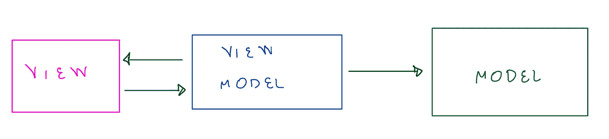

## 与 MVVM 的问题

*   `ViewModel`的多重责任
*   `ViewController`的多重责任
*   仍然没有任何导航图层
*   还是不好考(就那个`ViewModel`？)

## 什么时候用？

*   当您的项目有一些需要测试的简单业务逻辑时
*   不太复杂的用例
*   没有大量的屏幕
*   这款应用仍处于概念阶段，你无法确切知道它在遥远的未来会是什么样子

# 3.协调模式

尽管不是架构而是设计模式，但我不能忽视这个解决方案，因为它解决了 MVC 和 MVVM 这样的耦合架构中的大多数问题。

还记得我之前提到的一些话题吗？没有一个图层可以在两个屏幕之间进行转换？这正是协调员所要做的。

基本上，它维护一个对场景视图控制器的引用，通过它，它可以把一个新的视图控制器推送到它的导航控制器(所有视图控制器都可以拥有一个导航控制器作为一个快捷的可选选项)，或者可以有模式地呈现一个新的屏幕。有些人甚至喜欢通过协调器显示定制的警报和其他子组件。

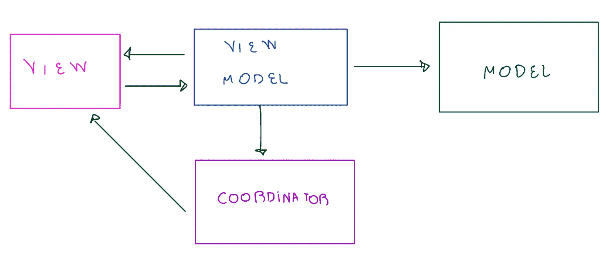

协调器必须访问 ViewController 才能更改上下文

## 什么时候用？

*   任何时候你想把导航逻辑从场景中分离出来

# 4.毒蛇

VIPER 是架构耦合的决定性解决方案。这次你可以在每个类中分离所有类型的逻辑。通过这种方式，你可以更容易地进行完全独立的测试、构建模拟、侦查和检测错误。

VIPER 缩写代表 5 个不同的层:

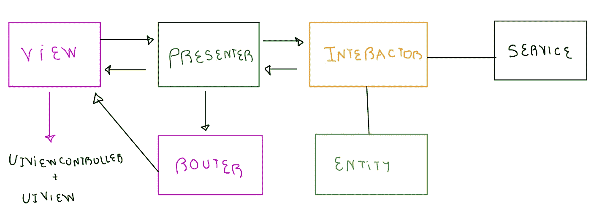

1.  `Interactor`:所有的业务规则都在这里，从数据模型处理操作到 API 调用或者错误处理。这是基于用例的更好的说法。值得一提的是，这一层是完全独立于 UIKit 的，这意味着它只处理业务逻辑，不知道任何关于接口的事情。
2.  `Presenter`:负责展现逻辑。它总是在`ViewController`中监听用户交互，处理(如果需要)像`viewWillAppear`、`viewDidLoad`、`IBActions`这样的事件，有时实现一些数据源协议(像`UITableView`和`UICollectionView`)或其他 UI 组件委托。它还负责接收`Interactor`的用例输出，以便将其转换成 UI 结构显示在视图中。`Presenter`还决定何时改变环境。
3.  `Router`(或线框):这一层与协调器设计模式的想法相同，但现在是 VIPER 架构中包含的强制层。这个类可以访问上下文`ViewController`或导航控制器，通过这种方式，它可以通过将新的`UIViewController`实例推送到堆栈或有模式地呈现它来将其更改为另一个屏幕。需要强调的是，路由器结构必须能够以多种方式管理屏幕环境。通常，有一个路由器超类，它实现了改变简单上下文的各种操作
4.  View:这一层是 ViewController 和`UIView`(或者 xib/storyboard)。这里没有逻辑让它变得完全愚蠢。视图只接收来自`Presenter`的命令，根据 ViewModel 数据结构呈现一些内容。始终避免在这一层使用 if/else 或 loop 语句。
5.  实体:这只存在于与屏幕用例相关的数据模型中。只有交互者可以访问实体。通常，由于它们是简单的数据模型，它们总是作为值类型的结构。

我们甚至有服务层，在我看来，它不应该与场景耦合，因为不同的场景可以为另一个用例重用相同的端点。与前端用例相比，`Service`与后端更相关，但这是另一篇文章的主题[。](https://pedroalvarez-29395.medium.com/clean-architectures-inner-and-outer-scene-layers-38e6de923f07)

请注意，层流内部的所有通信都是双向的。视图向呈现者通知一些用户交互事件，这可能触发交互者中的用例，发出或不发出 API 请求，向呈现者返回一些输出，这些输出可以按照一些 UI 规则显示在视图中。

演示者还通过路由器决定何时更换屏幕。同样重要的是要知道，并不是所有时候演示者都会为一个逻辑用例调用交互者，因为一个交互只能触发一个简单的屏幕改变或者纯粹在演示规则中改变一些数据。

## VIPER 的问题

*   它并不真正参与一个非常简单的项目，因为它的主要优势是业务逻辑处理。在一个小项目中，Interactor 可能几乎每次都是空的，您可能只有一些导航规则需要路由器。
*   有些人很难区分什么是业务规则，什么是表示规则，以及如何正确地分离层。
*   由于呈现者是完全集中的，并且可以处理不同的任务，不需要每次都调用交互者，所以呈现者可能有点耦合。

## 什么时候用？

*   你有一个大项目，它依赖于许多复杂的业务规则，有许多屏幕或模块
*   并不是 UI 中的所有交互都会触发用例，所以在这种情况下，只有演示者可以参与其中(不要放弃仍然存在的业务逻辑)
*   数据模型有不同的格式:一个用于 API 获取数据的对象(`Decodable`)，一个用于在交互器中操作业务规则，另一个用于在 UI 中呈现(`ViewModel`)
*   你的团队的目标是一个好的测试框架，让所有的层和职责完全独立

# 5.VIP (Clean Swift)

许多人认为这种架构是所有项目的最佳架构，但我强烈反对这种观点。事实上，它解决了强耦合表示器的毒蛇问题，但是它带来了其他副作用，我将在这里介绍。

让我们从定义这个架构与 VIPER 的区别开始。与 VIPER 一样，这个缩写也代表视图-交互者-演示者，但这次没有双向流，而是一个循环:

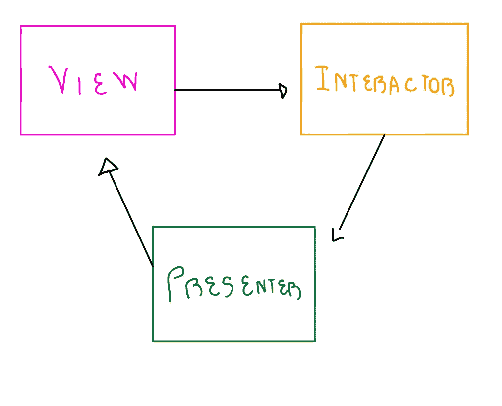

正如您所看到的，核心层与 VIPER 相同，这次我们有一个不同的流程:每次 ViewController 检测到一些用户交互时，它可能会通知交互器启动一些业务规则操作，当输出完成时，它会被发送到 Presenter，它会将此输出转换为用户友好的格式，以便在视图中再次显示。总是这样。

但是，等等，协调器/路由器在哪里？我应该使用哪种设计模式？没有具体说明。其实我不是故意描述整个架构结构的。正如我在开始提到的，每个公司/团队可能有不同的应用架构的方式，这不是一成不变的。根据我自己的经验，我曾以两种不同的方式与重要人物共事，每种方式都将协调者置于不同的位置。两者都依赖于我们将数据传递给另一个上下文的方式。我们将介绍它们:

## 5.1 数据存储

VIP 的第一种模式是数据存储。这种架构将协调者和`ViewController`放在一起，这样做的好处是，如果我们想要改变一个上下文，我们不需要通过交互者和呈现者来进行转换。

但是，等等，如果我们需要将一些数据传递到下一个屏幕，那么由于协调器不知道交互器，我们该如何做呢？这就是我们引入数据存储概念的地方。

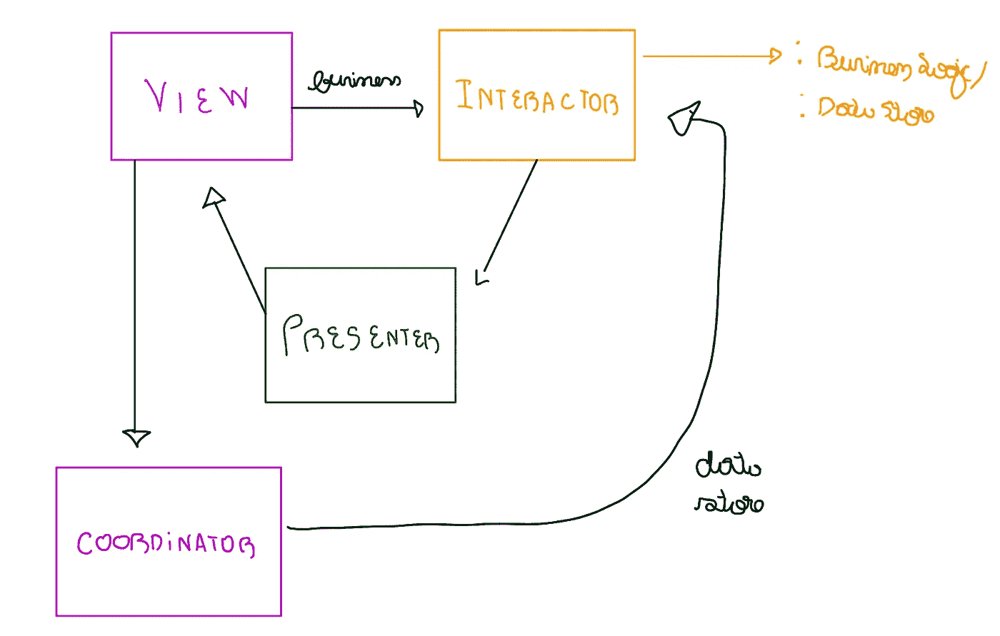

这里发生的事情是，交互器可以通过协议以两种形式被看到:业务逻辑，由触发业务逻辑的视图看到，以及数据存储，这是一个保存变量的协议，我们可以将这些变量传递到另一个上下文或从前面的上下文接收。

这样，您可以将交互器视为一个容器，用于在其他场景之间传递和接收不同格式的数据。因此，如果我想转换到另一个屏幕，传递我的一些交互器属性，我只需要我的视图调用协调器，协调器从交互器(数据存储)获取必要的数据，并实例化下一个屏幕，将数据传递到它自己的数据存储:

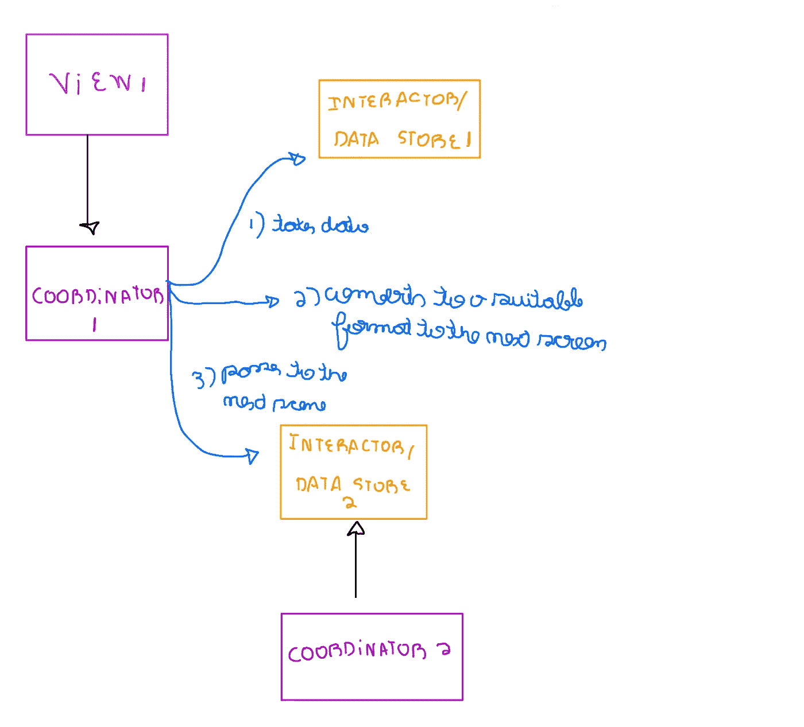

## 5.2 演示者-协调员

这种模式你可能已经很熟悉了。这包括将协调者和展示者结合起来，这个流程现在代表了视图-交互者-展示者-协调者。当您通过保存逻辑和数据的交互器时，您不需要一个协议来允许协调器访问交互器，因为它随流程一起提供给表示者和协调器。

这种模式的唯一缺点是，您总是强迫用例遵循相同的流程，即使我们不执行任何业务规则，只是改变屏幕:

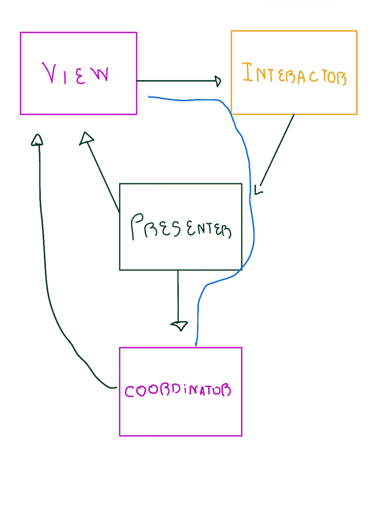

## VIP 问题

*   与 VIPER 一样，它不适用于小项目，因为没有必要划分这样简单的逻辑。
*   如果你决定使用 VIP-C，即使没有必要，你也必须每次都遵循相同的流程。
*   如果您决定使用数据存储，您会发现各层之间有太多的关系。

## 何时使用

*   你有一个庞大的项目，有非常复杂的业务规则和大量的用例。
*   当您几乎每次触发一些用户交互时都必须触发业务规则时

## 设计模式

为了拥有一个强大的、可重用的、可伸缩的和可测试的架构，对设计模式的良好使用总是受欢迎的，并且结合许多设计模式可以使你的编码方式多年来都是可行的和可理解的。想想所有的架构，不管干净与否，让我们看看在构建场景时你应该期望的主要设计模式:

1.  工厂:顾名思义，这种模式代表了一种构建和链接一组相互依赖的对象的方式。这是一个非常常见的解决方案，用于实例化每个层类并分配它们的代理和其他依赖项。当您使用[异构表视图](https://pedroalvarez-29395.medium.com/tableview-factories-an-useful-tool-for-heterogeneous-lists-600db092dbca)时，工厂设计模式也是一个不错的选择。

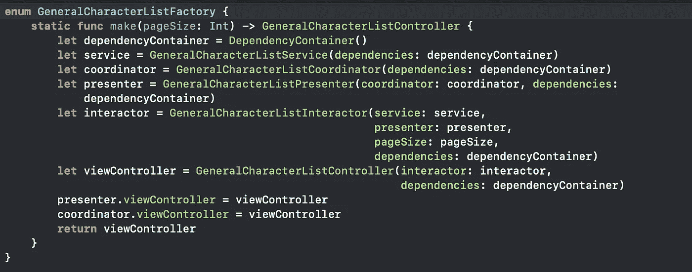

所有层都根据所选的架构进行实例化和链接

2.Facade:这种模式代表一种容器，它将多个依赖项重新组合在一个地方。通过这种方式，你可以从应用程序的任何地方访问所有重要的资源。此外，您可以使用这种方式在单个类中保存多个相关对象，以构建一个强大的生态系统，并促进与此相关的业务规则的应用

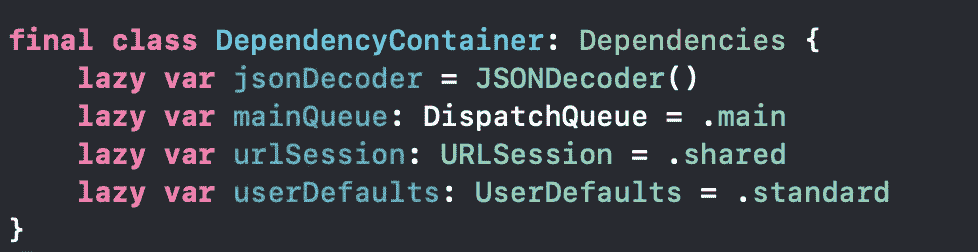

3.适配器:如您所见，架构的每一层都以不同的方式看待数据模型。因此，当您需要将某个模型转换为视图模型时，最好用模型对象来实例化视图模型，为每个属性分配与前一个对象相关的属性

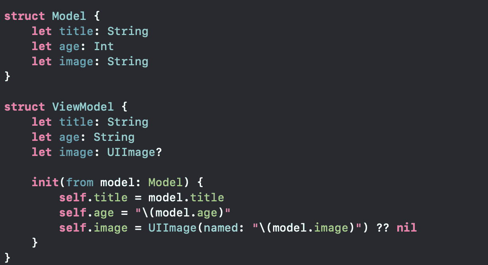

4.协调者:我们之前已经描述过这种模式，但是现在继续:这应该以一种允许转换的方式来保持你的屏幕 UI 上下文。

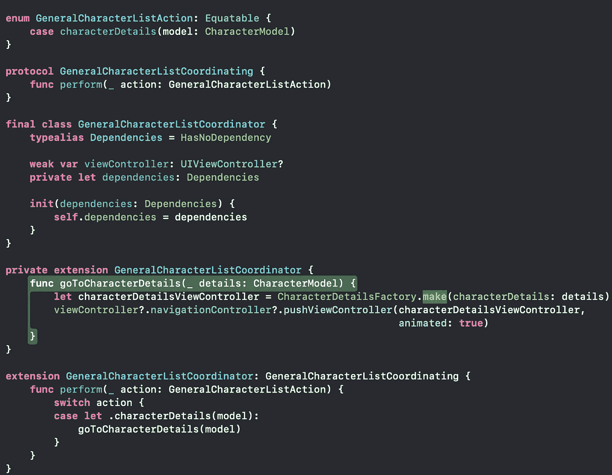

5.依赖注入:这种模式允许我们让每一层都将其他层作为属性，并且您可以通过初始化器注入其他层类型的对象。每一层都引用另一层作为协议类型，这允许我们不公开该类型的具体实现，只公开它的契约。提供一个传递具体类型的默认初始化器是一个不错的选择，这样可以避免我们每次实例化该类时都要编写它:

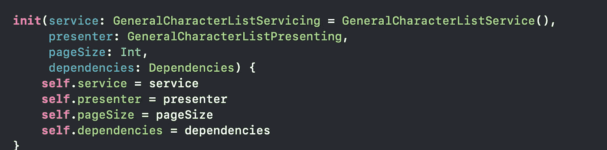

6.依赖倒置:这种模式与依赖注入直接相关。由于这些层通过协议相互通信，您不必注入另一层的确切具体类型。

例如，如果您正在测试您的交互器或视图模型，您可以注入一个模拟服务，您可以在其中定义您期望的结果，以避免您的服务干扰您实际测试的逻辑

## 结论

在本文中，我们看到了科技公司大多数 iOS 项目中使用的主要架构的更深入的概述。

我们描述了每种方法的主要优点和缺点，但是一般来说，如果我可以给你一个信息，我会这样继续这个内容:如果你只是创建一个应用程序来测试一个新的特性或者只是一个样本，MVC 是你最好的选择，因为你只是测试一个独立的 iOS 概念(或者一个 Swift Playground 可以为你工作)。

如果你有一个应用程序，它有一个非常小的领域，并且在未来几年不会变得太复杂，但如果你需要对你的所有功能进行强大的测试，MVVM 将是一个不错的选择。

如果你有大量的屏幕，并且需要一些实用的和可重用的方法来改变你的上下文，考虑应用协调模式。

现在，如果你有一个大型项目，你想测试业务和表示逻辑中的所有单行代码，你考虑长远，你的应用程序将会增长很多，构建一个好的干净的架构(VIPER 或 VIP)是必要的。这是我想传递给你的内容。

我希望你喜欢它。