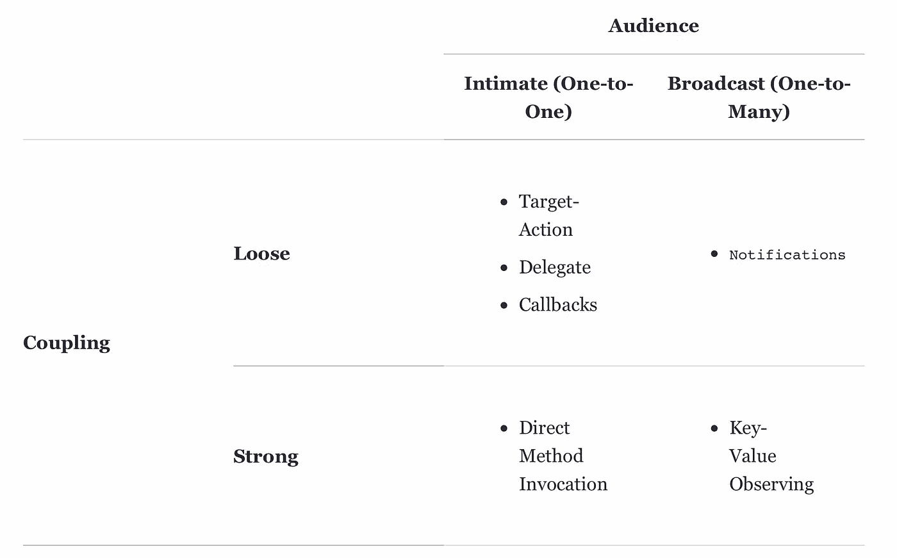

# iOS 通知—全部真相

> 原文：<https://betterprogramming.pub/ios-basic-questions-88e668cc95c7>

## 通知和通知中心的好处


虽然每篇文章都解释了 iOS 中通知的实现和用法，但很少有人充分强调基础知识。在这里，我试图强调这些被忽略的要点。

使用`NotificationCenter`,你可以将数据从应用程序的一部分传播到另一部分。它使用*观察器模式*在通知到来时通知注册的观察器，使用中央调度器`NotificationCenter`。

`*NotificationCenter*`到底是怎么工作的？

它有三个组成部分:

*   监听通知的“监听器”，称为*观察器*
*   当事情发生时发送通知的“发送者”
*   通知中心本身，它跟踪观察者和通知

NSNotificationCenter 可以处理一对多和多对多的通信。

## 什么时候用`NotificationCenter`？

*   当没有正式连接的应用程序的两个或多个组件之间需要进行通信时
*   当交流需要重复和一致地发生时
*   当使用一对多或多对多通信时



## 如何注册观察员？

```
NotificationCenter.default.addObserver(self, selector: #selector(onDidReceiveData(_:)), name: .didReceiveData, object: nil)
```

`addObserver(_:selector:name:object:)`函数有四个参数:

*   第一个参数`observer`是未命名的*。*您为它提供一个对象的引用，该对象是这个通知的*观察者*，通常是`self`。
*   第二个参数`selector`是通知发生时调用的函数。它的工作原理类似于*目标-行动模式。*
*   第三个参数`name`是您想要监听的通知的名称，类型为`Notification.Name`。
*   第四个参数`object`是一个可选对象，您希望接收其通知，所以如果您设置了它，您将只接收来自那个“发送者”的通知

## 如何添加通知？

```
extension Notification.Name {     
static let didReceiveData = Notification.Name("didReceiveData")     static let didCompleteTask = Notification.Name("didCompleteTask")     static let completedLengthyDownload = Notification.Name("completedLengthyDownload") 
}NotificationCenter.default.addObserver(self, selector: [selector], name: .didCompleteTask, object: nil)
```

## 如何发布通知？

```
NotificationCenter.default.postNotification(name: .didReceiveData, object: nil)
```

`onDidReceiveData(_:)`功能看起来是这样的:

```
@objc func onDidReceiveData(_ notification: Notification)  
{     if let data = notification.userInfo as? [String: Int]     
      {         
           for (name, score) in data         
           {             
               print("\(name) has sent \(score) points!")         
           }     
      } 
} 
```

在上面的例子中，情况是这样的:

*   首先，你使用*条件绑定*到*向下转换*的类型`userInfo`到`[String: Int]`与*类型转换操作符* `as?`。因为`userInfo`的类型是`[AnyHashable: Any]?`——基本上是*任何字典*——你可以将它的类型向下转换为你期望的字典类型。那是字符串键，上面例子中的整数值。如果转换成功，那么`data`包含`userInfo`的值作为类型`[String: Int]`。
*   然后，使用一个`for-in`循环，迭代`data`字典中的条目。我们使用元组`(name, score)`来分解字典条目的键和值。
*   最后，在循环内部，我们打印出名字和分数。

要发布包含数据的通知，我们需要执行以下操作:

```
let scores = ["A": 5, "B": 3, "C": 42]  NotificationCenter.default.postNotification(name: .didReceiveData, object: self, userInfo: scores)
```

这个类可能是这样的:

```
class API  
{     
        static let shared = API()      
        func getData() 
        {                                    NotificationCenter.default.postNotification(name: .didReceiveData, object: self, userInfo: ...)       
        }
}
```

# **总结**

*   首先，用`addObserver(_:selector:name:object:)`注册一个通知的观察者
*   然后，发布一个通知，内容为:`postNotification(name:object:userInfo:)` …
*   …之后会调用您的*选择器*
*   不要忘记用`removeObserver(...)`移除观察器

使用`NotificationCenter`进行重复、一致的一对多或多对多通信。

## **通知与代表**

通知更像是无线电广播。从任何对象广播；任何其他文件都可以收听该通知，观察它并调用一个操作。重要的是要记住通知是没有保证的。如果文件已被取消初始化，它将不再侦听通知广播，您的应用程序可能无法正常工作。

委托允许我们向创建子视图的类发送信息。只要将子类的委托设置为父类，然后在需要传递信息时调用子类内部的委托方法，就可以保证信息流。与通知不同，父节点肯定会收到来自子节点的信息，因为如果父节点被取消初始化，子节点也会被取消初始化。

感谢阅读！

即将推出:代表团—全部真相