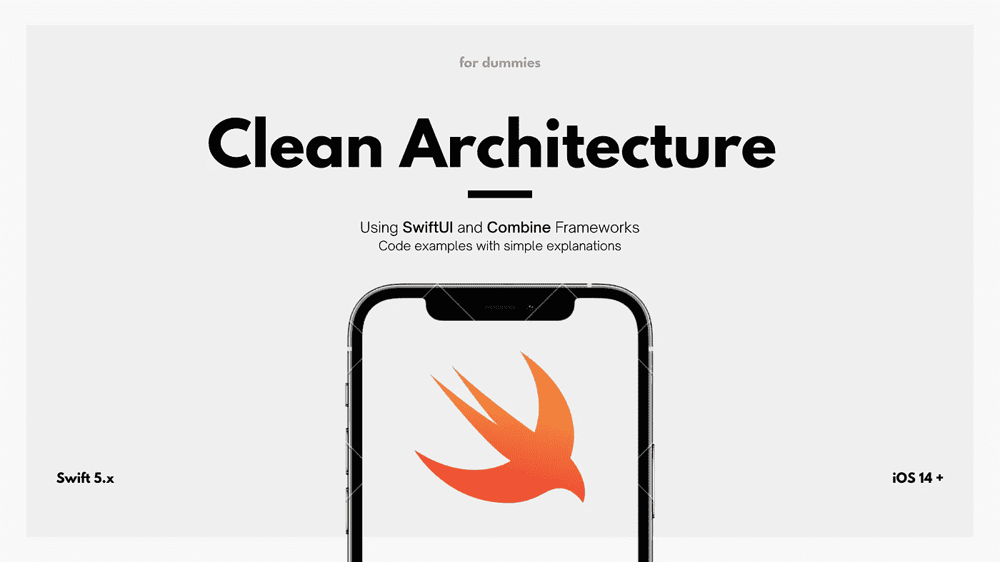

# iOS:使用 SwiftUI、Combine 和依赖注入清理架构

> 原文：<https://betterprogramming.pub/ios-clean-architecture-using-swiftui-combine-and-dependency-injection-for-dummies-2e44600f952b>

## 使用简单示例实现

Clean architecture 是一种软件设计理念，它将应用程序的关注点分成不同的层，每层都有特定的职责。它被称为“干净的”,因为它促进了易于阅读、测试和维护的代码，并且不依赖于特定的框架或技术。

在使用 SwiftUI 和 Combine 框架用 Swift 编写的 iOS 应用程序环境中，clean architecture 可能看起来像这样:

*   **表示层**，最外层，负责处理用户输入和显示输出。这一层将包含定义应用程序用户界面的`SwiftUI`视图。
*   **领域层**，位于架构的中心，负责实现 app 的核心业务逻辑。这一层将包含定义数据模型、业务规则和应用用例的类。
*   **数据访问层**是最内层，负责访问和存储数据。这一层将包含从网络或本地数据库获取数据并将其提供给域层的类。

每一层都有明确的、定义良好的职责，并通过一组定义良好的接口与其周围的层进行通信。这允许不同的层彼此独立地被开发、测试和维护，并且使得在不影响其他层的情况下添加新特性或对应用进行改变变得容易。

例如，如果应用程序需要添加一个涉及从新的数据源获取数据的新特性，开发人员只需在数据访问层中添加一个实现必要接口和方法的新类。这不会影响域层或表示层，它们会像以前一样继续工作。

总的来说，在用 Swift 编写的 iOS 应用程序中使用 clean architecture，结合 SwiftUI 和 Combine 框架，有助于创建结构良好、可维护和可扩展的应用程序。

## 代码适应

我们将从这个简单的例子开始，说明使用 SwiftUI 和 Combine 框架的 iOS 应用程序如何实现 clean 架构:

在这个例子中，表示层中的`MyView`结构定义了应用程序的用户界面，并使用域层中的`MyViewModel`类来显示数据。

`MyViewModel`类使用数据访问层获取数据，数据访问层由`DataFetcher`协议和实现它的`NetworkDataFetcher`和`DatabaseDataFetcher`类组成。

该体系结构的不同层被清楚地分开，它们之间有明确定义的接口。这使得添加新功能或对应用程序进行更改变得容易，而不会影响其他层。

例如，如果应用程序需要从新的数据源获取数据，开发人员只需添加一个实现`DataFetcher`协议的新类，并在`MyViewModel`类中使用它。这不会影响数据访问层中的`MyView`结构或其他类，它们会像以前一样继续工作。

# 依赖注入

理论上，**依赖注入**是一种实现依赖倒置原则的技术。这个原则声明高级模块不应该依赖于低级模块，而是两者都应该依赖于抽象。

在 iOS 应用程序的上下文中，依赖注入意味着依赖于另一个对象的对象，例如依赖于模型对象的视图控制器，被给予对它所依赖的对象的引用，而不是创建对象本身。这使得依赖于另一个对象的对象更加灵活，也更容易测试，因为在测试期间可以给它一个模拟对象来使用。

## 代码适应

下面是一个在 iOS 应用中使用 SwiftUI 和 Combine 框架的简单例子:

在这个例子中，`UserListView`取决于`UserViewModel`，而`UserViewModel`取决于`NetworkManager`。

不是直接在`UserViewModel`中创建`NetworkManager`，而是将对`NetworkManager`的引用传递到`UserViewModel`的初始化器中。

这使得`UserViewModel`更加灵活，因为它可以被赋予任何符合`NetworkManager`协议的对象，而不仅仅是`NetworkManager`的特定实现。这使得测试`UserViewModel`变得更加容易，因为在测试过程中可以注入一个模拟对象。

现在，我们将尝试把干净的架构和依赖注入混合在一起，使用我们在前面例子中的知识来获得一个完整清晰的观点。

## **代码适应**

**基于第一个示例代码，以及我们对 DI 的了解:**

**域层中的`MyViewModel`类是用`DataFetcher`协议的一个实例构造的，该实例是在创建时注入其中的。**

**这允许`MyViewModel`类使用注入的`DataFetcher`实例从网络或本地数据库获取数据，而不需要知道或关心使用的是`DataFetcher`协议的哪个具体实现。**

**本例中依赖注入的使用有助于进一步分离架构的不同层。**

**`MyViewModel`类没有紧密耦合到`DataFetcher`协议的特定实现，可以独立于数据访问层中的其他类进行测试和维护。这使得添加新功能或对应用程序进行更改变得更加容易，而不会影响其他层。**

# **奖金**

**现在，您已经理解了 DI 和 CleanArch 是如何在幕后工作的，您可能想要自动化在您的`ViewModel`中注入大量`DataFetcher`实例的过程。**

**但有时这可能需要大量的工作。接下来，一些构建良好的 Swift 软件包可以帮助我们实现流程自动化，比如我个人最喜欢的 [Resolver](https://github.com/hmlongco/Resolver) 。**

## ****解析器用途****

**知道我们大多数人都懒得阅读文档，我使用`Resolver`转换了我们之前使用的同一个例子。**

**在这个例子中，域层中的`MyViewModel`类用`@Injected`属性标记，以表明它需要在创建时将`DataFetcher`协议的一个实例注入其中。**

**使用注入的`DataFetcher`实例，`Resolver`包用于注册`MyViewModel`类并指定如何构造它。**

**当应用程序运行时，`Resolver`包将自动创建一个`MyViewModel`类的实例，并根据`Resolver`扩展中指定的注册将`DataFetcher`协议的适当实现注入其中。**

**然后，`MyViewModel`类可以使用注入的`DataFetcher`实例从网络或本地数据库获取数据，而不需要知道或关心正在使用的是`DataFetcher`协议的哪个具体实现。**

**在这个例子中使用`Resolver`包有助于进一步分离架构的不同层，并使管理和测试它们之间的依赖关系变得容易。**

**`MyViewModel`类没有紧密耦合到`DataFetcher`协议的特定实现，并且可以独立于数据访问层中的其他类进行测试和维护。这使得添加新功能或对应用程序进行更改变得更加容易，而不会影响其他层。在我的下一篇[文章](/testing-a-swiftui-combine-ios-app-using-clean-architecture-f7dee1ba5342)中，会有更多关于相同例子的测试。**