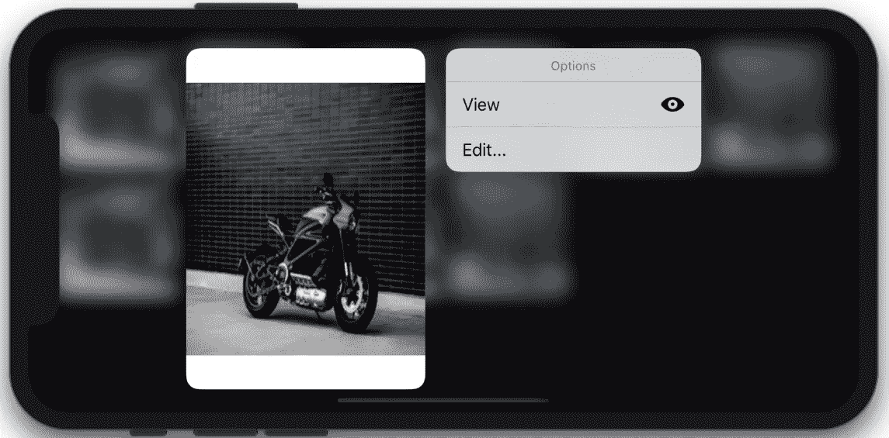
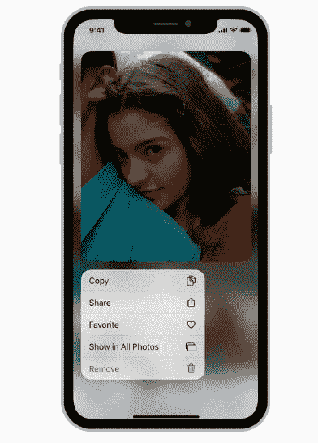
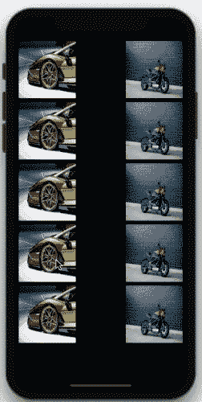

# iOS 13 上下文菜单和 SF 符号

> 原文：<https://betterprogramming.pub/ios-context-menu-collection-view-a03b032fe330>

## 3D Touch 的替代品将会长期存在



本教程结束时我们的最终结果

上下文菜单是今年 iOS 13 WWDC 2019 的重要发展之一。作为 3D touch 的替代产品，它将一直存在！

本文的目标是实现上下文菜单和 SF 符号。所以让我们开始吧。

# 行动（或活动、袭击）计划

*   我们将讨论使用集合视图实现上下文菜单。
*   我们将使用 SF 符号，它提供了大量的系统映像名称。

# 上下文菜单与查看和弹出

iOS 13 引入的上下文菜单与 3D Touch Peek 和 Pop 手势不一样。

以下是主要区别:

*   Peek 和 Pop 适用于支持 3D Touch 的设备，而上下文菜单适用于所有设备。
*   上下文菜单在长按或强制触摸时显示(如果设备支持)，而查看和弹出菜单仅在强制触摸时显示。
*   Peek 和 Pop 菜单需要你向上滑动才能看到菜单，而上下文菜单就在你长按的地方。

要在视图上设置 ContextMenu，我们需要在它上面设置`UIContextMenuIteraction` 。同样，我们需要符合`UIContextMenuInteractionDelegate`

# 视图上上下文菜单的基本设置

让我们看一下`UIContextMenuInteractionDelegate`协议中重要的委托方法:

# 上下文菜单的初始化

要初始化上下文菜单，我们需要设置三个参数(都是可选的):

*   `identifier` -您可以在此设置字符串 id。
*   `previewProvider` -下一个视图控制器的预览
*   `actionProvider` -我们在这里创建菜单按钮和动作。

SFSymbols 是一个新推出的 Mac 应用程序，本质上是一个系统图标名称的百科全书。我们可以在 iOS 13 引入的`UIImage(systemName:)`初始化器中传递这些名字。

# 定制系统图标

我们可以通过传递如下所示的配置参数来自定义系统图标的大小/样式:

```
let config = UIImage.SymbolConfiguration(textStyle: .largeTitle)UIImage(systemName: "paperplane", withConfiguration : config)
```

# 运行中的上下文菜单和集合视图

在接下来的部分中，我们将在`UICollectionView`上实现`ContextMenu`。



来自苹果文档

iOS 13 为上下文菜单引入了一些新的`UICollectionViewDelegate`方法。为了在用户长按`CollectionView`单元格时显示`ContextMenu`，使用了以下函数:

```
func collectionView(_ collectionView: UICollectionView, contextMenuConfigurationForItemAt indexPath: IndexPath, point: CGPoint) -> UIContextMenuConfiguration? {

        let configuration = UIContextMenuConfiguration(identifier: nil, previewProvider: nil){ action in
            let viewMenu = UIAction(title: "View", image: UIImage(systemName: "eye.fill"), identifier: UIAction.Identifier(rawValue: "view")) {_ in
                print("button clicked..")
            } let rotate = UIAction(title: "Rotate", image: UIImage(systemName: "arrow.counterclockwise"), identifier: nil, state: .on, handler: {action in
                print("rotate clicked.")
            }) let delete = UIAction(title: "Delete", image: UIImage(systemName: "trash.fill"), identifier: nil, discoverabilityTitle: nil, attributes: .destructive, state: .on, handler: {action in

                print("delete clicked.")
            })
            let editMenu = UIMenu(title: "Edit...", children: [rotate, delete])

            return UIMenu(title: "Options", image: nil, identifier: nil, children: [viewMenu, editMenu])
        }

        return configuration
}
```

我们已经创建了一个`UIMenu`，它也包含一个子菜单。下面简单介绍一下`ContextMenu`和`CollectionView`的工作情况:


最终结局 Gif。尝试旋转设备以获得不同的外观。

# 上下文菜单和预览提供者

在这一节中，我们将在预览中显示目标视图控制器以及按下单元格时的`ContextMenu`。

为了显示菜单，我们需要在`PreviewProvider`中设置目标视图控制器，如下所示:

```
func collectionView(_ collectionView: UICollectionView, contextMenuConfigurationForItemAt indexPath: IndexPath, point: CGPoint) -> UIContextMenuConfiguration? {let configuration = UIContextMenuConfiguration(identifier: "\(indexPath.row)" as NSCopying, previewProvider: {
            return SecondViewController(index: indexPath.row)
        }){ action in//add your uimenu as earlier
}
}
```

为了在预览点击上打开视图控制器，我们需要实现下面这个在`UICollectionViewDelegate`协议中新加入的方法。

```
func collectionView(_ collectionView: UICollectionView, willPerformPreviewActionForMenuWith configuration: UIContextMenuConfiguration, animator: UIContextMenuInteractionCommitAnimating) {

        let id = configuration.identifier as! String

        animator.addCompletion {
            self.show(SecondViewController(index: Int(id)), sender: self)
        }
}
```

使用`configuration.identifier`检索之前设置的`identifier`。

在我们的`SecondViewController`中，我们为`UIImageView`中显示的每个图像设置了不同的`CIFilter`。

下面给出了实际应用程序的输出:



上下文菜单和集合视图。

你注意到了吗？显示的视图控制器可以向下滑动以关闭。这是 iOS 13 开始默认的视图控制器样式。

总结了 iOS 13 的这个特点。上下文菜单和系统图标一起看起来最好。完整的源代码可以在[这个 GitHub 库](https://github.com/anupamchugh/iowncode/tree/master/iOS13ContextMenu)中找到。

更多 iOS 13 功能，参考我的文章“ [iOS 13 开发者清单](https://medium.com/better-programming/ios-13-checklist-for-developers-ef47e413aad2)”