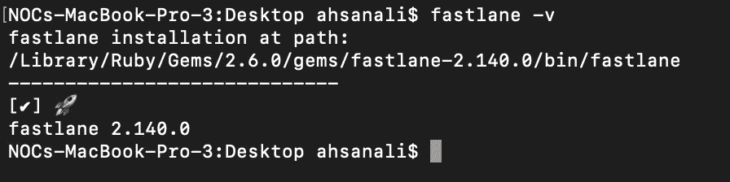
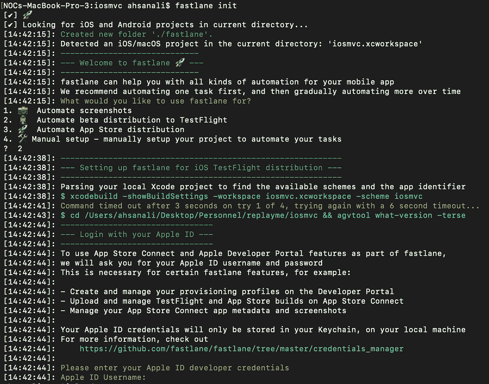
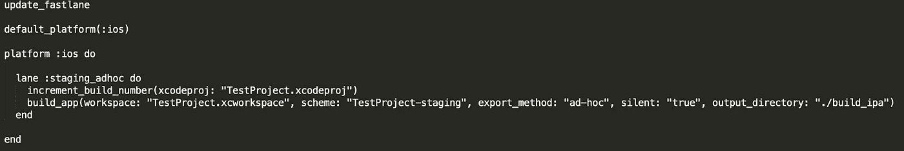
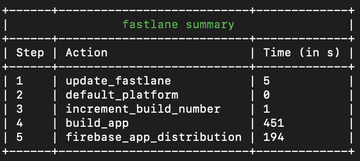

# 使用浪子和 Firebase 在 iOS 上持续交付的指南

> 原文：<https://betterprogramming.pub/ios-continuous-delivery-guide-with-fastlane-firebase-beta-builds-distribution-platform-ddfe2f76e800>

## 配置一次，每次发布时节省 30 分钟


照片由 [Guillaume Jaillet](https://unsplash.com/@i_am_g?utm_source=unsplash&utm_medium=referral&utm_content=creditCopyText) 在 [Unsplash](https://unsplash.com/s/photos/fast?utm_source=unsplash&utm_medium=referral&utm_content=creditCopyText)

在本文中，我们将了解持续交付及其在 iOS 生态系统中的实现。

连续交付(CD)是使用一些外部工具/软件自动化构建的过程，它减少了开发人员创建构建的手动工作，因此您可以立即可靠地共享构建。

通常情况下，持续集成(CI) 也是用 CD 实现的，但不强制两者同时实现。

在 CI **、****中，开发者的代码被不断合并，始终保持最新的可部署代码。CD 对于单独开发人员和大型团队一样有效，因为您必须共享/部署构建。**

**因此，在本文中，我们将重点关注使用[浪子](https://fastlane.tools/)和 [Firebase](https://firebase.google.com/products/app-distribution) 来实现 iOS 平台的连续交付，以便与测试人员/客户共享测试版本。**

**这里是一些我们每次共享构建时重复的典型任务。**

1.  **在不同的环境中构建应用程序(试运行/生产)。**
2.  **根据指定的环境对构建进行签名。**
3.  **导出应用程序并手动配置构建设置。**
4.  **上传到发布平台(如 [Diawi](https://www.diawi.com/) 、 [TestFlight](https://developer.apple.com/testflight/) 、 [Crashlytics](https://firebase.google.com/products/crashlytics) )。**
5.  **与发行说明共享可安装的构建链接(在某些情况下)。**

**通过连续交付，您可以自动执行上述所有步骤。**

# ****大纲****

**这些是我们将在文章中实现的一些步骤。**

*   **设置浪子——我们将在系统上安装浪子，然后用 iOS 项目配置浪子。浪子负责自动部署任务。**
*   **配置浪子—我们将针对所需目标实施我们的配置(试运行或生产等。一个可能有两个以上的记录)。Fastfile 将告诉浪子关于编译的信息。**
*   **导出构建——我们将使用 Fastfile 中指定的配置通过终端导出构建。**
*   **设置应用程序 Firebase 分发—我们将在 Firebase 控制台上配置应用程序，我们可以为应用程序添加测试人员或组，以便与测试人员或客户共享。**
*   **自动化构建推至 Firebase —我们将配置浪子文件，因此构建销毁过程变得自动化。**
*   **享受咖啡:是的，我们已经实现了流程自动化，节省了一些时间。**

**您还可以查看我们在裁谈会流程中使用的工具。**

*   **[浪子](https://fastlane.tools/)**
*   **[Firebase 应用分发](https://firebase.google.com/products/app-distribution)**

**让我们开始游戏。**

# ****建立浪子****

**首先，你必须在你的系统上安装浪子工具。**

**安装最新的 Xcode 命令行工具:**

```
xcode-select --install
```

**使用以下工具安装浪子:**

```
*# Using RubyGems*
sudo gem install fastlane -NV*# Alternatively using Homebrew*
brew install fastlane
```

**安装后，您可以使用以下命令验证浪子工具的安装。**

```
fastlane -v
```

****

**安装工具后，您必须将终端目录更改为项目目录，然后使用以下命令初始化浪子工具:**

```
fastlane init
```

**在该命令中，您必须选择使用浪子工具的目的。之后在终端上登录苹果账号。**

****

**在浪子初始化之后，您将在您的项目目录中看到一个浪子命名的目录，包含我们将在其中配置元信息的 Fastfile。**

## ****配置浪子****

**我们将不得不配置我们将使用浪子工具自动化的步骤。**

****

```
increment_build_number(xcodeproj: "TestProject.xcodeproj")
build_app(workspace: "TestProject.xcworkspace", scheme: "TestProject-staging", export_method: "ad-hoc", silent: "true", output_directory: "./build_ipa")
```

**我们将实现自动化 beta 测试的过程，并据此配置`build_app`的参数。如果有多个目标，可以像`production_adhoc`等设置多个车道。**

*   **`scheme`:项目的目标名称。**
*   **`export method`:输出`app-store`、`ad-hoc`、`development`等建筑作品的方法。**
*   **`output_directory`:将放置导出的`.ipa`的位置。**
*   **`silent`:建造时隐藏所有不必要的信息。**
*   **探索其他浪子参数。**

## ****导出构建****

**一旦您为部署配置了 lane，您只需运行下面的构建导出命令:**

```
fastlane staging_adhoc
```

**用您的车道名称替换`staging_ahoc`。**

**它将在终端上显示消息。ipa 文件被导出。**

**现在你可以手动地通过不同的来源共享`.ipa`文件，比如 Diawi、TestFlight、Firebase 应用分发。**

**我们的下一步是自动化构建共享过程。浪子支持许多构建共享的发布平台，在本教程中我将使用 Firebase。**

# **重火力点**

## ****设置 app Firebase 分布****

**假设您已经使用 iOS 项目从控制台配置了 Firebase 项目。**

**通过从 iOS 项目的根目录运行以下命令，将应用分发添加到您的浪子配置中:**

```
fastlane add_plugin firebase_app_distribution
```

**安装 Firebase 插件后，您必须配置浪子文件。**

****

```
increment_build_number(xcodeproj: “TestProject.xcodeproj”)
build_app(workspace: “TestProject.xcworkspace”, scheme: “TestProject-staging”, export_method: “ad-hoc”, silent: “true”, output_directory: “./build_ipa”)
firebase_app_distribution(
 app: “Your firebase App Id”,
 groups: “internal-tester, clients”,
 release_notes: “Lots of amazing new features to test out!”,
 firebase_cli_path: “/usr/local/bin/firebase” )
```

*   **`app`:Firebase App 的 App ID，可以从 Firebase 控制台获取。**
*   **`group`:你可以指定你想要共享构建的组，比如我已经创建了一组测试人员用于内部测试，另一组用于客户共享。**
*   **`release_notes`:在构建中实现的任何变更或更新，您都可以与测试人员分享。**
*   **`firebase_cli_path` : `firebase_cli_path`如果我们没有显式更改 Firebase 工具的安装路径，也是一样的。**

## ****自动化构建推送至 Firebase:****

**一旦我们更新了 Fastfile，我们必须将 Firebase 登录到控制台。登录后，运行下面的命令。**

```
bundle exce fastlane staging_adhoc
```

**用您的车道名称替换`staging_adhoc`。**

# **咖啡时间**

**恭喜，我们已经实现了部署和分发流程的自动化。在 Firebase 上的构建成功发布后，你会在最后看到一个浪子摘要。**

****