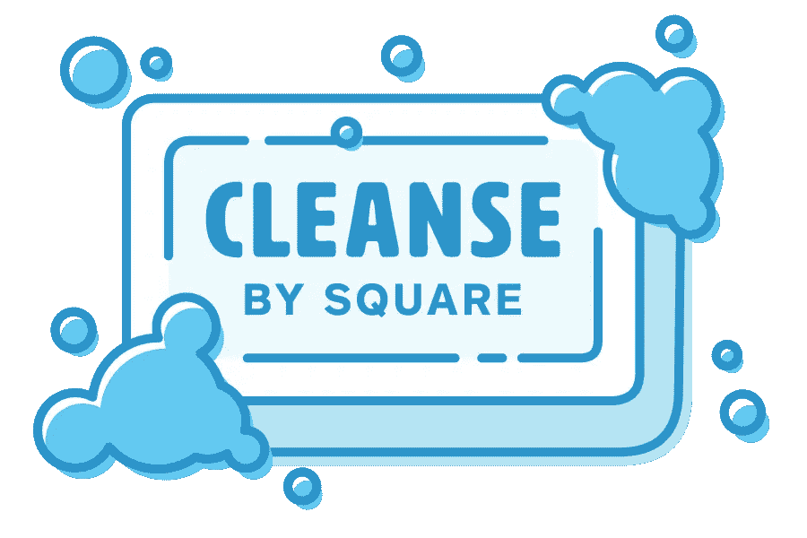

# 带有清理的 iOS 依赖注入:第 2 部分

> 原文：<https://betterprogramming.pub/ios-dependency-injection-with-cleanse-part-2-f6b49bee2ada>

## 注入网络服务并绑定数据集合

照片来自[https://github.com/square/Cleanse](https://github.com/square/Cleanse)。

又见面了。

这是我们关于[清理](https://github.com/square/Cleanse)的依赖注入教程的第二部分(先阅读[第 1 部分](https://medium.com/better-programming/ios-dependency-injection-with-cleanse-1ef495e390a2))。你可以在 GitHub 上找到这个教程[的代码。](https://github.com/g20ready/CleansePlayground)

这是我们将在这一部分学习的内容:

*   网络服务的注入
*   使用多绑定提供数据集合
*   使用辅助注入来传递参数以及图形对象(例如，主-详细信息流中的选定项目)

最后但同样重要的是，我将表达我对您是否应该使用 Cleanse 作为您项目的 DI 框架的想法。

# 网络服务

在我们开始之前，将以下依赖项添加到您的 Podfile 并点击`pod install`。

Podfile。

对于这个例子，我们将使用 [HackerNews API](https://github.com/HackerNews/API) ，并获取和显示头条新闻。当用户选择一个，我们将显示一个详细的页面，并在一个`WKWebView`渲染故事。首先定义我们的模型结构。根据 API 和一些研究，它应该是这样的:

HNStory.swift。

现在，是时候定义我们的服务了，应该如下所示:

TopStoriesService.swift

到目前为止还不错，但是一些实际的代码呢？让我们编写我们的第一个类，这将是我们的`HttpClient`，它实现了我们刚刚定义的服务。

HttpClient.swift

我们的 HTTP 客户端看起来很简单，对吗？它的实例化只有两个依赖项:我们 API 的基本 URL 和一个`SessionManager`，这是 Alamofire 对`URLSession`的方便包装。我们添加一个助手函数，给定一个`URLRequestConvertible`，返回给定类型的可观察值。对象的这个接口可以转换成一个`URLRequest`。`URLRequest`当然是可兑换的，但是我们仍然缺少我们服务的实现。现在我们来补充一下。

我不会在这里详细介绍 RxSwift，但我们所做的只是从 Top Stories API 中获取前十个对象。现在，我们希望我们的服务实现能够出现在我们的图表中。因此，我们需要定义我们的`HttpClient`模块。

HttpClientModule.swift。

我们到了吗？不完全是。如果你看我们的`HttpClient`，它需要一个`TaggedProvider`和一个`SessionManager`。而这些都还没有提供。我们将首先提供 URL 模块。

BaseApiURLModule.swift

在这里，我们提供了一个新的标签，`BaseApiURL`。它的元素 typealias 是一个 URL，这意味着当我们调用 get 时，这个`TaggedProvider`将返回一个 URL。接下来，我们定义将我们的基本 URL 注入到我们的图中的模块。这段代码可能包含关于您是去开发领域还是生产领域的逻辑。

看来我们还缺少我们`HttpClient`需要的`SessionManager` 。创建另一个文件并添加以下内容:

CoreNetworkModule.swift。

这段代码做了很多工作，但是第 19 到 21 行是`SessionManager`被实例化并提供给我们的图表的地方。这是我们的图的一个单例，从我们的活页夹的范围中定义。`SingletonBinder`是`Binder<Singleton>`的类型别名。其中一个`SessionManagers`构造函数需要一个`URLSessionConfiguration`、一个`SessionDelegate`和一个`ServerTrustPolicyManager?`。我们从第 7 行到第 17 行提供了所有这些依赖关系。现在修改`HttpClientModule`如下所示:

最后一个要连接的点和我们的`TopStoriesService`的实现`HttpClient`，将在我们的图形中可用，以供其他对象使用。打开你的`MainComponent` ，在`configure`功能里面添加`binder.include(module: HttpClient.Module)` 。

# 视图模型和视图控制器

现在我们已经设置了网络层，是时候使用它了。添加一个名为`TopStoriesViewModel`的新文件。它应该是这样的:

TopStoriesViewModel.swift。

嗯，我知道由于 RxSwift 部分，这可能看起来有点复杂，但忽略它。您只需要知道它获取数据并通过输出传递给我们的`ViewController`。重要的是我们的`ViewModel`是用我们之前定义的`TopStoriesService`实例化的。接下来，我们要添加我们的`ViewController`。用一个`xib`文件创建一个新的`ViewController`(最好命名为`TopStoriesViewController`)并添加以下内容:

TopStoriesViewController.swift。

下面是`viewDidLoad`中定义的两个设置功能的扩展。虽然这无关紧要，但下面几行将填充我们的列表。这是你与 [RxSwift](https://github.com/ReactiveX/RxSwift) 和 [RxCocoa](https://github.com/ReactiveX/RxSwift/tree/master/RxCocoa) 合作的好处之一。

TopStoriesViewController.swift。

该单元格是一个带有三个标签的自定义单元格。你爱怎么处理就怎么处理。该单元的代码如下:

最后，我们将定义一个模块，该模块将在每次请求时向我们的图中注入这个`ViewController`的一个实例。这一次，我们将使用`UnscopedBinder`，它是`Binder<Unscoped>`的 typealias，主要是因为拥有单一视图控制器没有意义。该模块将如下所示:

等等，什么？我们告诉我们的绑定器，它应该将我们的`TopStoriesViewController`绑定到它的超类类型和`intoCollection()`？

第 11 行和第 12 行实际上做的是，它们告诉 Cleanse 将从工厂返回的`ViewController`放入一个`UIViewController`对象数组中，并提供该数组。第 14 行简单地将 TopStoriesViewController 包装在一个`UINavigationController`中并返回它。我们将使用注入的数组作为我们的`TabBarController`的`viewControllers`属性。

我们即将看到黑客新闻 API 的头条新闻。我们现在需要做的就是添加我们的`MainTabBarViewController`，它应该是这样的:

现在是最后一次，打开您的`MainComponent`文件并替换其内容，如下所示:

点击运行，你会看到一个列表中的热门故事。

# 辅助注射

还有最后一件事我们没有谈到。假设我们希望用户选择一个`UITableViewCell`并导航到一个`StoryViewController`，在这里我们将所选故事对象的`url`属性加载到一个`WKWebView`中。事实是，我们不能将故事注入到我们的图表中，因为它是用户生成的事件。这就是辅助注射的用武之地。从`ViewModel`开始，创建一个新文件并添加以下内容:

同样，跳过 Rx 部分，专注于构造函数。这很简单——它所需要的只是一个`HNStory`对象。现在创建您的`StoryViewController`(这里不需要 nib 文件)并添加以下代码:

而我们`StoryViewController`的模块看起来是这样的:

这里我们定义一个`AssistedFactory` ，种子为`HNStory`，用户选择的故事。这个`AssistedFactory` 会为我们构建一个`StoryViewController`的元素。怎么会？这个问题的答案是我们模块的`configure`函数。这里我们告诉 binder 应该绑定了一个`StoryViewController`的工厂。下一行`.with(AssistedFactory.self)`是一个方向，告诉 Cleanse 在图中注入一个类型为`AssistedFactory`的工厂。给定种子(`HNStory`，这个工厂将为我们提供`StoryViewController`实例。

打开`TopStoriesViewController`并添加以下几行:

我们还应该在`setupViewModel`函数中添加点击处理:

在第 10 行，我们调用`storyFactory.build`将我们选择的故事的一个参数传递给工厂，它返回一个`StoryViewController`的实例。完全像是过度杀戮。其实不是。通过利用辅助工厂特性，我们还可以在图中使用 get dependencies。假设我们想从`StoryViewModel`访问我们的服务。然后我们要做的就是在构造函数中定义它。

StoryViewModel.swift。

并更新模块来传递参数。

storyviewcontrollermodule . swift。

仅此而已。我们现在传递用户选择的故事项，并从我们的图表中获取服务。

我想我们已经完成了第二部分。接下来，我将和大家分享我对 DI 的看法。

# 结论

正如你在本教程中看到的，清理是相当复杂的。它肯定有一个学习曲线，但是如果你熟悉其他的 DI 框架(例如 dagger) **，**，那么你会发现集成它更容易。

如果你在一个组织的不同部门与多个团队一起工作一个大项目，那么你必须有一个标准的方法来注入你的依赖关系。否则，事情最终会变糟——即使你雇佣了最有才华的工程师。为了准确，你做的每件事都必须有一个记录的方法。拥有一个框架来处理依赖性管理是一个需要处理的问题。

## **优点**

就特征而言，清洗是完整的。

它处理图形构造的方式是安全的，这意味着如果您的设置出错，您会在早期崩溃。

它的文档很好(我只是通过阅读和查看示例代码来集成它)，并且它正在被积极地维护。

## 骗局

初级开发人员需要努力理解框架的核心概念。

重构一个庞大的代码库需要花费大量的时间，但是可以逐步完成。

目标-C 支持是实验性的。

堆栈溢出只有三个关于清理的问题。

但是如果你和 2-3 个开发人员一起做一个相对较小的项目，虽然集成起来会更容易，但是你必须仔细考虑是否值得在你的开发中增加这种开销。

如果你对 Cleanse 或 DI 有任何问题或想法，请在下面的评论区自由表达。

感谢您花时间阅读本文。