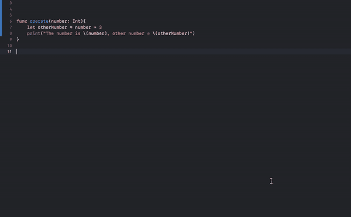
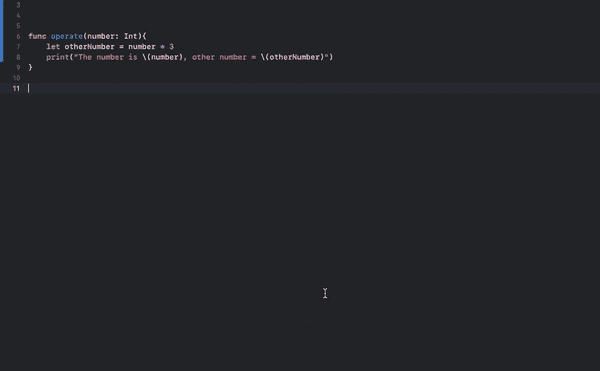
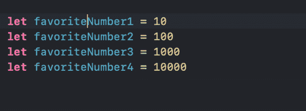
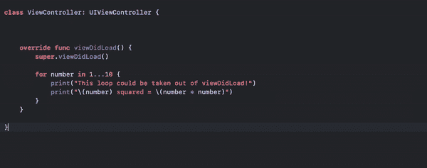
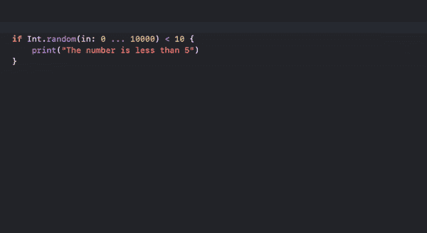
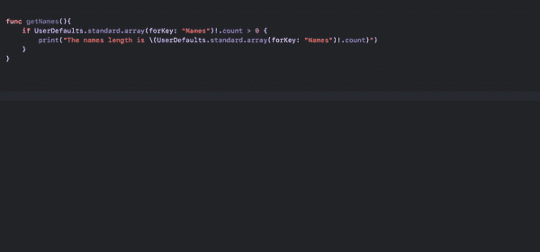
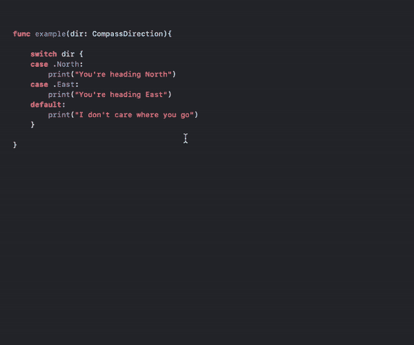
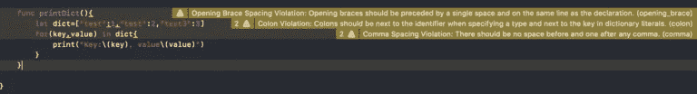

# 2023 年 10 个 iOS 开发技巧:Swift 和 Xcode

> 原文：<https://betterprogramming.pub/ios-development-tips-f44dd0a70886>

## 使用这些生产率提示成为更高效的 iOS 开发人员


布莱克·康纳利在 [Unsplash](https://unsplash.com?utm_source=medium&utm_medium=referral) 上拍摄的照片

你想在 2022 年成为下一个顶尖的 iOS 开发者吗？那么一定不要错过这 14 个很棒的编码技巧。

这些技巧可以帮助你节省时间和资源，这样你就可以花更多的时间关注那些重要的代码部分。

这个列表没有特定的顺序。

# 1.检查所有项目是否符合标准

当您想要检查集合中的所有元素是否满足某个条件时，您可能会遍历列表，并通过分别检查每个元素来累积结果。

例如:

输出:

```
true
```

然而，这样做是一件很平常的事情，以至于 Swift 自带了一个用于检查所有元素是否满足某个条件的函数。这是`[allSatisfy()](https://developer.apple.com/documentation/swift/array/2994715-allsatisfy)`功能。

`[allSatisfy()](https://developer.apple.com/documentation/swift/array/2994715-allsatisfy)`函数将闭包作为参数，对集合中的每个元素进行条件检查。

例如，让我们重复上面的程序，检查是否所有年龄都在 18 岁以上:

输出:

```
true
```

为了澄清代码，`allSatisfy()`函数遍历集合并将每个元素逐个存储到`$0`中以执行检查。

如果你不熟悉 Swift 中闭包的工作方式，请阅读本文。

# 2.Where 关键字

在 Swift 中，您可以通过使用`where`关键字来检查条件，从而使您的代码更具可读性。

通常，您可能会使用 if 语句来检查条件是否成立。

例如，让我们遍历一个数字数组，只打印奇数:

但是您可以使用`where`关键字将 if-check 链接到 for 循环声明中:

# 3.元组析构—交换两个变量，不带第三个变量

在 Swift 中，您可以使用 tuple 析构将值从一个 tuple 中分离到单独的变量中。

```
let (a, b, c) = values
```

让我们看看这有什么帮助。

通常，您可以通过指定元素的名称，使用点符号来引用元组的元素。

例如，给定一个具有 x、y 和 z 坐标的元组，您可以通过以下方式提取这些坐标值来分隔变量:

然而，您可以使用元组析构来完成完全相同的工作，而不那么费力。

这个特性的一个有趣的应用是，您可以使用元组析构来交换两个变量，而不需要第三个变量。

例如:

输出:

```
2 1
```

这是一个经典的面试/考试问题；)一定要钉牢！

# 4.从结构中移除 init()方法

如果您在 Swift 中处理过类，您知道您需要实现`init()`方法来初始化类实例。

这对于结构也是可能的。但是，如果只想将初始值赋给结构的属性，则没有必要。

例如，让我们用一个`init()`方法创建一个`Fruit`结构:

但是你可以把`init()` 的方法一起去掉:

这是因为结构会自动为结构创建一个成员式初始值设定项方法。

请记住，这不适用于课堂！你总是需要在 Swift 中将`init()`方法实现到一个类中。

# 5.重命名属性— Xcode 重构工具

在 Swift 中，有一个内置的重构工具，相当神奇。使用它可以避免一些重复性的手工工作。

下一组技巧与使用 Xcode 重构工具有关。

## 5.1.使用“重命名”功能重命名属性

“重命名”功能可以找到突出显示文本出现的每个位置，并根据您的需要进行重命名:



编辑所有使用“数字”变量的地方的引用。

## 5.2.编辑范围内的所有内容

您也可以在 Swift 中重命名特定文件中的属性，方法是按住 command 键单击并重命名属性，如下所示:



与第 5.1 节中重命名功能的区别。这只会更改当前文件中的属性名，而不会更改代码库中的其他位置。

# 6.多光标编辑— Xcode 重构工具

您知道吗，您可以使用 Xcode 的多光标功能在 Swift 代码中添加多个光标？



要激活多光标功能，请按下**shift**+**control**+鼠标左键

您可以通过以下 4 种方式轻松地使用多光标编辑代码:

*   **shift**+**control**+鼠标左键点击为每次点击创建一个新光标。
*   **shift**+**control**+arrow up 在上面一行创建一个新光标
*   **shift**+**control**+向下箭头在下一行创建一个新光标
*   **选项** +鼠标拖动在你拖动光标的地方创建新的光标到新的行。

# 7.将代码提取到方法中——Xcode 重构工具

为了提高代码质量，您应该将较长的代码提取到不同的方法中。

为此，您可以手动将一段代码复制粘贴到一个函数中。

但这是一件很常见的事情，Xcode 中有一个内置的重构特性叫做“提取到方法”来完成这项工作。

例如:



# 8.提取到变量— Xcode 重构工具

类似于前面的例子，您将一段代码提取到一个单独的方法中，您可以将一个表达式提取到一个变量中。

为此，请使用 Xcode 中内置的“提取到变量”功能。

例如:



您也可以使用“提取所有出现”功能将所有相同的表达式提取到一个单独的变量中:



查找 user defaults . standard . array(forKey:" Names ")！并为它们创建一个变量

# 9.添加缺少的开关案例— Xcode 重构工具

如果您在`switch`语句中使用`default`案例，Swift 编译器不会在案例未被覆盖的情况下显示错误。这意味着可能有一个`case`你应该检查，但你忘记这样做了。

这就是 Xcode 内置重构工具的用处。您可以使用它来扩展缺失的案例。

例如:



# 10.使用 SwiftLint 的自动代码样式

理解代码可能很难。

为了使过程尽可能顺利，代码必须是高质量的。

加强代码质量的一种方法是遵循一些通用的代码样式指南。

但是谁来确保您的代码遵循那些最佳实践呢？那些最佳实践是什么？

这就是棉绒帮助你的地方。您可以使用 linter 来实施通用的编码风格和最佳实践。您还可以为您的项目指定特定于团队的最佳实践。

棉绒可以:

*   显示警告。
*   自动修复代码以消除警告！

下面是一个在代码中显示警告的 linter 示例:



在 Swift，最常见的棉绒被称为 [SwiftLint](https://github.com/realm/SwiftLint) 。很容易设置。我已经写了一篇关于这个话题的 [5 分钟指南](https://medium.com/codex/swift-automatic-code-styling-tool-in-2021-971531595651)。你一定要学会如何使用棉绒。

如果你在团队中开发软件，linter 是你 100%会用到的东西。

# 结论

感谢阅读。我希望您在开发例程中发现了一些新的有趣的东西。

编码快乐！

附注:一定要把我的新帖子收进你的收件箱。 [***做到这里***](https://artturi-jalli.medium.com/subscribe) *！还有，想在 Medium 上阅读更多世界级的故事，可以考虑* [***成为会员***](https://artturi-jalli.medium.com/membership) *。每月只需 5 美元。此外，你的写作也能赚钱。当我开始的时候，* ***我用编程文章在前 6 个月赚了 5000 美元*** *。通过注册* [***与此链接***](https://artturi-jalli.medium.com/membership) *，你将支持我与你的费用的一部分，没有额外的费用给你。如果你这样做了，非常感谢！*