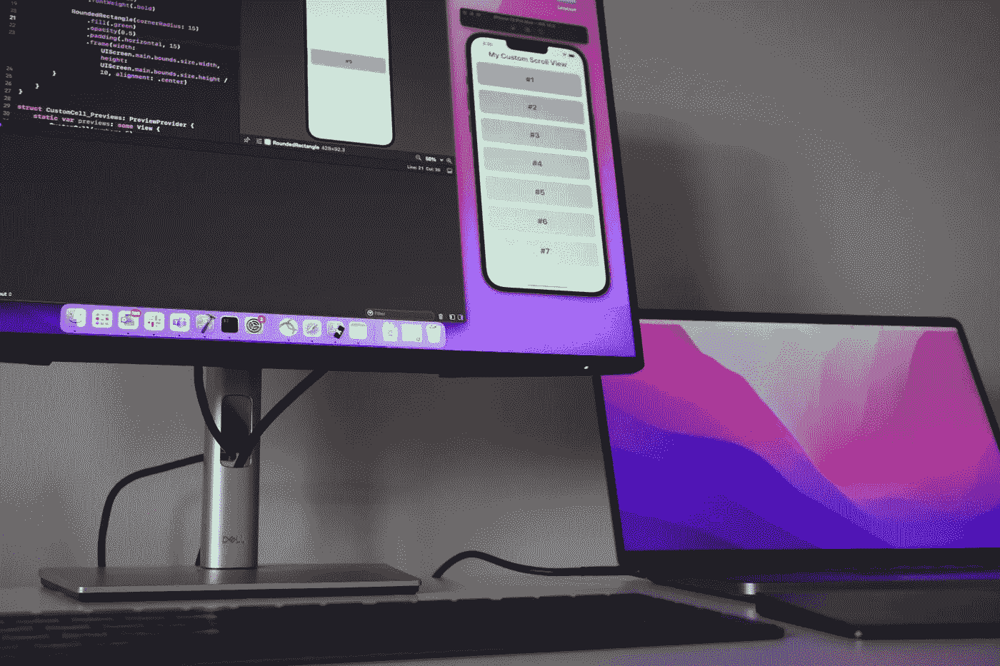
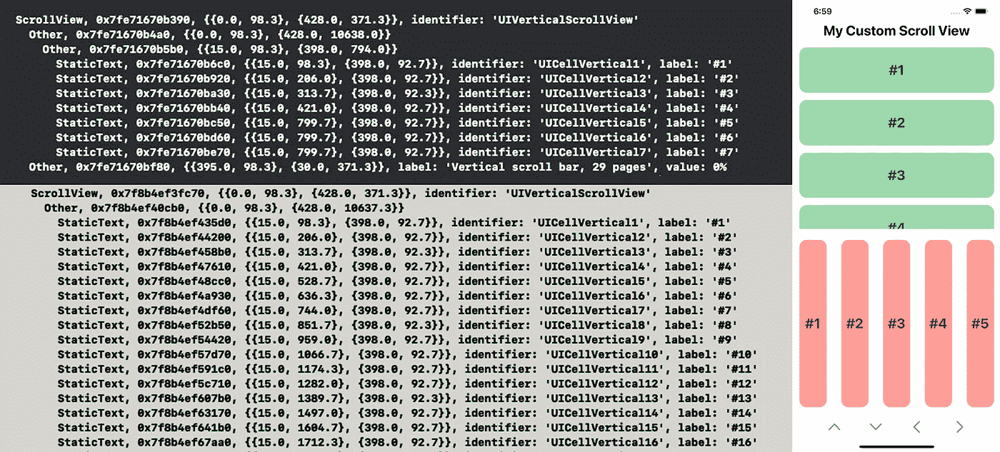
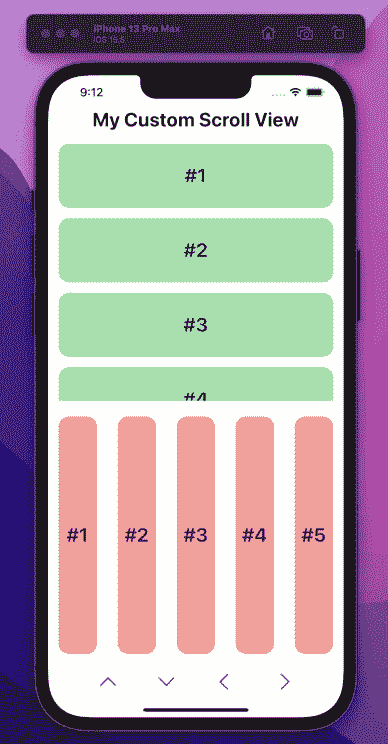

# 在 SwiftUI iOS 应用中提取延迟加载的元素进行 UI 测试

> 原文：<https://betterprogramming.pub/ios-extracting-lazily-loaded-elements-for-ui-testing-5541ea190586>

## 构建强大的 SwiftUI 应用

延迟加载是在线应用程序使用的一种强大的优化技术，其中数据是按需加载的，而不是整体加载的。在线应用程序不断地发送和接收数据，任何减少不必要的交易数据量的方法对最终用户和应用程序本身都有好处。这款应用的后端服务器承受的压力较小，最终用户也不会一直等待数据加载。那么问题出在哪里？

*快速提示:如果您想直接跳到函数&的实现，请跳到“创建自定义滑动函数”*

## 寻找延迟加载元素的挑战

当运行 iOS 的自动化 UI 测试时，非常重要的一点是要注意，我们本质上被应用程序的可访问性层次结构所提供的东西所束缚。就 iOS 和`XCUITest`而言，可访问性层次结构是应用程序用户界面的文本表示。当我们在自动化 UI 测试中使用断言函数来检查元素的存在时，这就是我们正在测试的。

这实际上是我们的真实来源，应用程序内代码中设置的元素可以通过改变其作为可访问性对象的状态来包含或排除在层次结构之外。延迟加载视图和堆栈导致的问题是，预期的元素可能会加载，也可能不会加载。如果它还没有被加载，它可能存在，但是就你的 UI 测试而言，它不存在。我们需要一种方法来找到我们需要的东西。

## 可访问性层次结构示例:LazyVStack 与 VStack

上面显示的是我们将要测试的应用程序的可访问性层次结构。这些层次表示已知的包含绿色单元格的堆栈。当捕获这个层次结构的快照时，对于延迟加载和正常加载的 VStacks，我们处于完全相同的应用程序状态；只不过，其中一个提供了更多的信息。

我们的灰色示例向下延伸，列出了 VStack 包含的所有 99 个元素，而黑色的顶部只列出了`LazyVStack`中加载的内容。出于测试目的，检查常规 VStack 中是否存在单元格“n”将非常容易，所有内容都已加载！然而，在现实世界中，你不太可能遇到这种有利于考试的情况。

## 目标

*   **我们如何找到一个卸载的细胞？:**我们将通过向预期元素的方向滑动来找到它。这样做会更新层次结构。
*   我们如何安全地找到它？:我们创建了一个定制的、可配置的滑动方法来搜索我们的目标元素，直到找到为止。

我们想要创建一个定制的刷卡功能而不是使用现有的`swipe{Direction}()`功能的原因是，使用默认功能迫使我们在达到期望值之前硬编码一组刷卡次数。相反，我们想要能够模拟用户行为并找到所需元素的东西。

这个应用程序的源代码可以在这里[克隆。](https://github.com/martusheff/lazy-loading-ui-testing)

## 熟悉应用程序

这个应用程序(GIF'd below)有 4 个主要部分，都与我们之前发现的问题相关并具有示范性。

1.  简单文本标题“我的自定义滚动视图”
2.  LazyVStack(绿色)
3.  LazyHStack(红色)
4.  自动滚动按钮，按顺序；绿色堆栈开始，绿色堆栈结束，红色堆栈开始，红色堆栈结束。

这个应用程序为我们提供了一个测试四个方向滑动功能的平台。

## 设置我们的测试环境

下面是起始代码，也可以在上面链接的库的主分支上找到。在进行测试之前，我们在这里设置了一个非常简单的页面对象模型设计模式。
 *如果您想直接跳转到最终代码，请从关联回购中检出“已完成”分支。*

这里我们使用 3 个主要的类:

1.  `LazyLoadUITests`:我们的 UI 测试类，我们的测试函数在其中运行和执行。
2.  `BasePage`:参考我们的应用程序的基础页面。
3.  `LazyLoadPage`:**`BasePage`的一个扩展，所有与 LazyLoad 屏幕相关的东西都将驻留在这里。**

**这是 POM(页面对象模型)的一个非常简单的例子。POM 的高级描述如下:将所有与元素声明和属性检索相关的内容保存在页面类中(`BasePage`，`LazyLoadPage`)，让 UI 测试类在页面类的帮助下处理断言。**

## ****创建我们的自定义刷卡功能****

1.  **`**e**lement`:传入的第一个参数是目标元素，或者换句话说，是我们试图寻找的元素。如果找到，该功能将返回并停止向上滑动。**
2.  **`maxAttempts`:我们想要在视图上滑动的最大次数。这是可配置的，可以防止测试永远停留在寻找不存在的东西。**
3.  **`velocity`:我们每秒刷过的像素数。**

**我们的自定义滑动功能将会借用现有的由`XCTest`提供的`swipe{Direction}()`功能。我们将重复这个动作，直到两件事情中的一件发生；找到了目标元素，或者我们已经达到了最大尝试次数。我们正在滑动的元素是`self`，因为我们是从一个`XCUIElement`延伸出来的。**

**这意味着我们将要调用这个助手函数的元素是包含目标视图的视图/元素。另外，请注意，一旦找到该函数，它不会返回任何内容…这是有意的。很像最初的`swipe{Direction}()`功能，它独立工作。测试全流程示例，包括`swipeDownTo(...)`的使用，如下所示。**

**这是该函数的完整运行情况！**

*   **首先看看#1 是否存在。**
*   **使用我们创建的函数滑动到#67，直到找到为止，然后检查它。**
*   **点击向下按钮，将我们带到堆栈的底部。**
*   **检查#99 是否存在。**
*   **使用类似的功能向下滑动，直到找到#17，然后检查它。**
*   **点击向上按钮，让我们回到堆栈的顶部。**
*   **检查#1 是否存在。**

**请随意优化，让它完全符合您的需求！我发现这个功能非常有用，可以避免因为视图变大而导致我们失败的不稳定测试的不断更新。随着这些视图中的单元数量/大小的增加，默认的`swipeUp()`不再让模拟器到达需要完成测试的地方。这个函数提供了一些灵活性。**

## **挑战**

**你可能会注意到我没有完成文章中的左/右滑动部分。我把这作为一个挑战，虽然如果你想要解决方案，它将在`completed` 分支*上提供。***

**回购链接:**

** [## GitHub-martusheff/lazy-loading-ui-Testing:iOS:为 UI 测试提取延迟加载的元素

### 此时您不能执行该操作。您已使用另一个标签页或窗口登录。您已在另一个选项卡中注销，或者…

github.com](https://github.com/martusheff/lazy-loading-ui-testing) 

提示/窍门:

*   在测试函数中的一行上放置一个断点，并输入`po print(XCUIApplication().debugDescription)`来打印应用程序的可访问性层次结构，并访问元素的标识符。
*   如果在克隆回购时遇到任何构建错误，请将“签名和功能”下的捆绑包标识符和团队更新到您的信息中。**