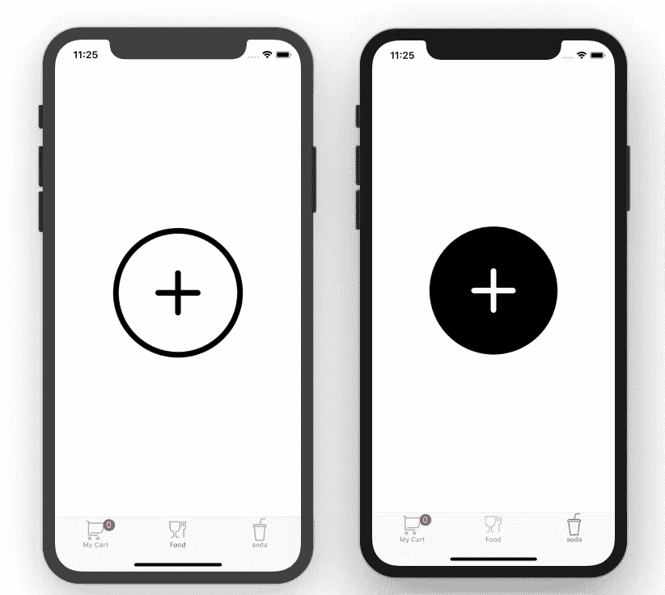

# iOS:实现通知/观察者通信模式

> 原文：<https://betterprogramming.pub/ios-lets-implement-that-notification-observer-communication-pattern-fc513f61b33e>

## 通过案例研究解释这种模式

[丹尼斯·布伦德尔](https://unsplash.com/@dnnsbrndl?utm_source=unsplash&utm_medium=referral&utm_content=creditCopyText)在 [Unsplash](https://unsplash.com/search/photos/ios?utm_source=unsplash&utm_medium=referral&utm_content=creditCopyText) 上拍摄的照片

首先，让我们解释什么是通知/观察者通信模式，以及它是如何工作的。后者是一个非常简单易懂的概念。

*   观察者:等待通知被触发的接收者，执行您希望它执行的任何代码。
*   通知:每当我们希望观察者执行某个动作时，它将被触发的实际通知。此外，我们可以在整个应用程序中获得任意多的通知。

因此，通过这一点，我们理解观察者/通知是一种基于多对一的通信模式。通过*多个*，我们指的是通知，通过*一个*我们指的是观察者。

容易吗？实际上是。

案例研究将帮助我们理解:

假设我们有一个商店应用程序，它有一个购物车视图和其他视图，购物车视图有一个通知标记，我们可以在其他视图中购买想要的产品。每当用户购买一个新的项目，它将被添加到他的购物车，同时更新徽章。

让我们直接进入代码。

首先，请继续并[下载项目](https://github.com/MoussaHellal/NotificationObserverSample)，这样我们就不会浪费时间开始一个新项目并构建一些样板视图。因此，我们只能关注本文中重要的内容。

为了简单起见，这个项目:

*   是一个选项卡式的应用程序。
*   有三个非常简单的观点。

简单视图:

*   我的购物车视图:什么都没有，只有一个徽章，显示购买了多少产品。
*   另外两个观点:食物和汽水。

从`before`文件夹启动项目。否则，你可以从`after`文件夹开始这个项目，然后跟着我做我们将要做的事情。

作为第一步，我们将把我们的`Notification.Name`对象全局添加到`GlobalVariables`文件中，这样我们就可以随时访问它:

现在，我们将创建我们的观察者和函数，我们将在`TabBarController`中触发通知时执行该函数:

然后，让我们将`createObservers()`函数添加到同一个文件`TabBarController`中的`viewDidLoad()`中。

我们已经将我们的`createObservers(`函数添加到了`viewDidLoad()`中，因此每当`TabBarController`被分配到内存中时，观察者就会被创建。

目前，我们的`TabBarController`文件必须是这样的:

现在是我们在视图控制器`Food`和`Soda`上放置通知的时候了:

打开`SodaController`文件。将这一行添加到按钮动作`addImaginarySoda()`中。

对`FoodController`做同样的操作，但对`addImaginaryFood()`做。

最后，运行应用程序，点击*食物*或*汽水*视图上的*添加*按钮:

请注意，在您点击*添加*按钮后，*我的购物车*图标顶部的徽章会通过`setBadge()`功能进行更新。

一个更新:
请不要忘记将这个添加到你的视图控制器中，它保存了从内存中释放它的观察器:

就这样，谢谢你阅读我的第一篇关于媒介的文章。