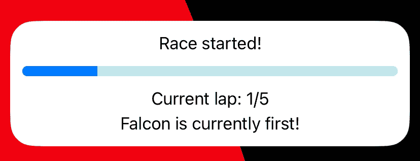
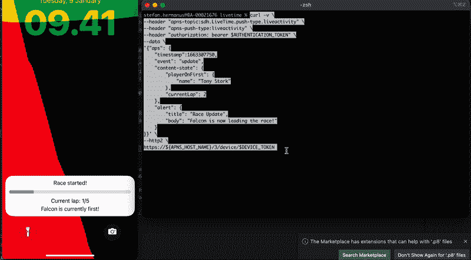

# iOS 16 实时活动:使用推送通知远程更新

> 原文：<https://betterprogramming.pub/ios-live-activities-updating-remotely-using-push-notification-34911a1bcc5e>

## 在您开始实时活动时接收推送令牌，并使用它通过远程推送通知更新或结束您的实时活动



苹果预定在 iOS 16.1 版本发布直播活动。

随着围绕这一新功能的大肆宣传，世界各地的 iOS 开发者已经准备在他们的 iOS 应用程序中采用这一功能。

考虑到已经讨论了足够多的基本实现，本文将专门帮助您使用推送通知更新您的实时活动。

我们正在开发一个应用程序，提供复仇者联盟之间比赛的实时更新。我们实时活动的内容状态如下所示:

```
struct ContentState: Codable, Hashable {
     var playerOnFirst: String
     var currentLap: Int
}
```

根据苹果的文档[这里](https://developer.apple.com/documentation/activitykit/update-and-end-your-live-activity-with-remote-push-notifications)，使用推送通知更新我们的直播活动需要我们的。aps 有效负载看起来像这样:

因此，让我们尝试更新我们的生活活动。

*   首先，我们需要让我们的应用程序能够接收推送通知。你可以通过进入你的 Xcode 项目，选择你的目标，在**签名&功能、**下选择**推送通知**来添加一个新功能。然后，去你的[苹果开发者网站](https://developer.apple.com/account/resources/authkeys/list)，确保你已经为你的应用注册了推送通知键。如果您还没有，请使用您的应用程序捆绑包 ID 创建一个。将您的密钥文件下载到一个您容易记住的地方，复制密钥 ID 并粘贴到某个地方，因为我们将在接下来的步骤中需要它。
*   通过根据我们的活动请求生成您的实时活动的推送令牌来准备它。

*   现在，让我们通过命令行发送我们的推送通知(关于来自苹果的更详细的文档，请参考这里的)。**对于实时活动，我们的 apn 推送通知将使用基于令牌的身份认证。**这意味着我们将需要一个使用令牌传入的授权头。为此，还要准备好这些:
*   **团队 ID** :这是你打开[开发者网站](https://developer.apple.com/account/resources/certificates/list)时，位于你名字旁边右上角的 ID。
*   **令牌密钥文件路径**:这是检索上一步下载的密钥文件的路径。示例:`/Users/stefan.hermanus/downloads/{fileName.p8}`
*   **认证密钥 ID** :这是您在前面的步骤中创建密钥时收到的 10 位密钥标识符
*   现在让我们在最终能够发送推送通知 POST 请求之前设置这些 shell 变量。在您的终端上逐一运行这些行。用您事先准备好的值替换花括号中的值。

```
% export TEAM_ID={your TEAM ID}
% export TOKEN_KEY_FILE_NAME={Token Key file path}
% export AUTH_KEY_ID={your Auth Key ID}
% export DEVICE_TOKEN={myToken from the activity push token}
% export APNS_HOST_NAME=api.sandbox.push.apple.com
```

*   接下来，要生成您的身份验证令牌，也要设置这些 shell 变量。如果您已经正确设置了上一步中的变量，您可以直接在您的终端上一个接一个地复制和粘贴这些变量。(除了 *%* 标志)

```
% export JWT_ISSUE_TIME=$(date +%s)% export JWT_HEADER=$(printf '{ "alg": "ES256", "kid": "%s" }' "${AUTH_KEY_ID}" | openssl base64 -e -A | tr -- '+/' '-_' | tr -d =)% export JWT_CLAIMS=$(printf '{ "iss": "%s", "iat": %d }' "${TEAM_ID}" "${JWT_ISSUE_TIME}" | openssl base64 -e -A | tr -- '+/' '-_' | tr -d =)% export JWT_HEADER_CLAIMS="${JWT_HEADER}.${JWT_CLAIMS}"% export JWT_SIGNED_HEADER_CLAIMS=$(printf "${JWT_HEADER_CLAIMS}" | openssl dgst -binary -sha256 -sign "${TOKEN_KEY_FILE_NAME}" | openssl base64 -e -A | tr -- '+/' '-_' | tr -d =)% export AUTHENTICATION_TOKEN="${JWT_HEADER}.${JWT_CLAIMS}.${JWT_SIGNED_HEADER_CLAIMS}"
```

现在您已经保存了所有的变量，最重要的是您的认证令牌。让我们生成旋度，它看起来有点像这样:

使用您自己的应用程序的捆绑 Id 替换`{Your App Bundle ID}`。如果您正在开发自己的应用程序，请调整 aps 有效负载以适应您自己的需求。

对于您的`aps`中的时间戳，确保您有一个更新的 epoch 时间戳。要生成更新的时间戳，请转到这里的。

现在我们已经有了 curl，在确保您的实时活动已经启动并运行之后，继续在您的终端上点击这个 curl。就是这样！

如果您通过 curl 成功地点击了 POST 请求，您将看到您的实时活动更新。

