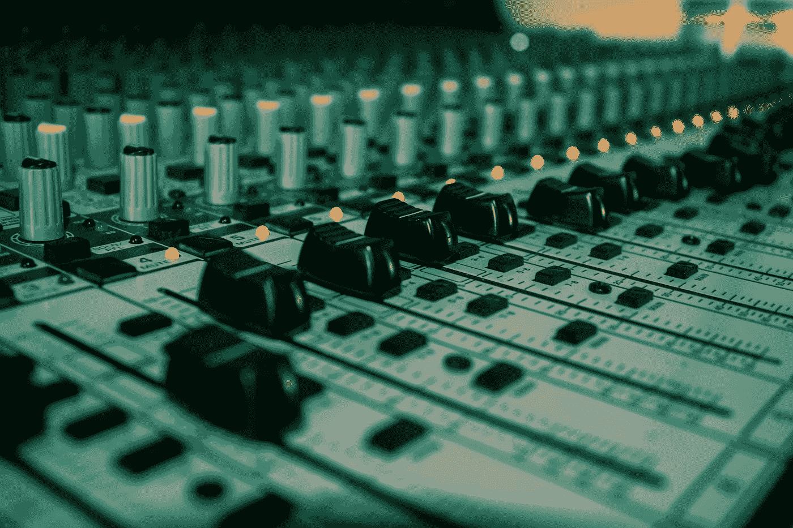
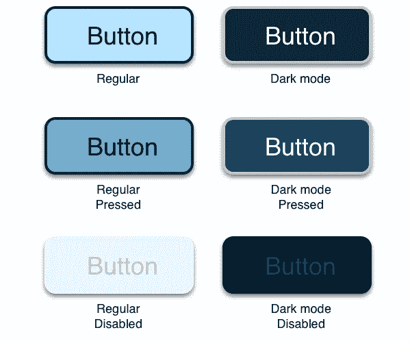
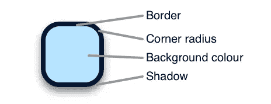
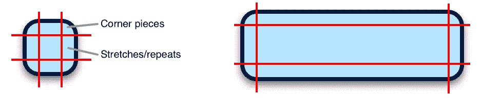
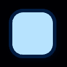
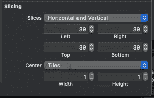
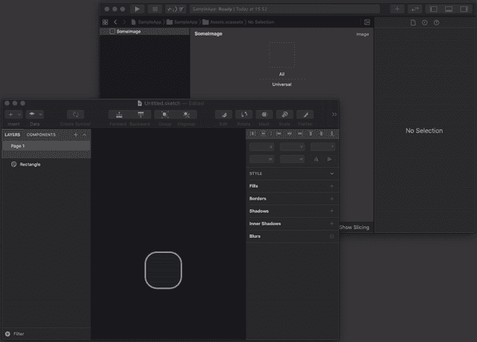
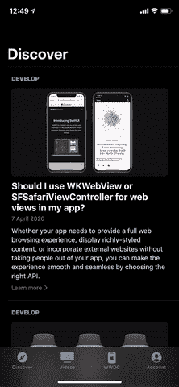

# 如何在 Swift 中更轻松地设计按钮

> 原文：<https://betterprogramming.pub/ios-make-styling-your-buttons-easier-36106931689c>

## *使用 XCAssets 是管理和更新按钮设计的简单方法*



在 [Unsplash](https://unsplash.com?utm_source=medium&utm_medium=referral) 上[印卡·阿迪奥蒂](https://unsplash.com/@willyin?utm_source=medium&utm_medium=referral)的照片。

所以，你在使用 XCAssets？太好了！在按钮中使用图像可以将阴影、边框和背景色等方面结合在一起。虽然我们将使用按钮作为例子，但是几乎所有东西都可以用在其他 UIKit 组件上。

假设我们出色的设计师提出了以下按钮设计:



让我们暂时把文本样式放在一边。该按钮由以下元素组成:



这些元素中的一些可以在故事板/xib 文件的界面构建器中进行样式化。所有这些部分都可以使用代码进行样式化:

假设你在一个 [XCAsset](https://medium.com/@krmblr/why-you-should-start-using-xcassets-to-manage-your-interface-design-ccfc73fbc6a5) 文件中用漂亮的名字定义了你的颜色，这就是你需要的。

不太难，对吧？但是这给我们留下了一些问题:

*   当按钮状态改变(禁用、按下等)时，属性不会更新。
*   当界面改变时(即从亮模式变为暗模式)，属性不会更新。

这就是我们的设计师想要的，那么我们该怎么做呢？

# 使用图像代替

使用图像让这一切变得简单多了。让我们看看我们的按钮。基本上，它由以下部分组成:



左:简单的按钮图像。右图:调整大小时应该如何拉伸。

那么我们如何在 Xcode 中设置它呢？要跟进，请下载以下图片并将其放入 Xcode:



buttonNormal@3x.png

现在，选择图像并转到右侧属性检查器的最底部。在“切片”下，选择“水平和垂直”。



Xcode 会在开始重复中心之前，尝试自动检测它应该保持不变的边缘大小。因此，39 意味着它将从该边向内移动 39 个像素。根据您的图像，您可能需要稍微调整一下。
您还可以选择是拉伸还是平铺中心。在我们的情况下，这无关紧要。

您可以将图像作为背景添加到按钮中:

```
button.setBackgroundImage(UIImage(named: "image"), for: .normal)
```

对于其他控制状态，如`.highlighted`和 `.disabled` ，用各自的图像重复这些步骤即可。

就是这样！如果你不确定如何为其他特征集添加特定图像，如黑暗模式，请查看本文。

# **奖励提示**

## 素描

如果您使用的是 Sketch，请使您的图层可导出，并简单地将其拖放到 XCAsset 文件中。您可以使用它来添加新资产或更新现有资产。

此外，如果您使用矢量图像，您只需要提供一个图像大小。向量数据将被保留，以便让 Xcode 为您呈现不同的大小。为此，在 Xcode 中，在“图像属性”检查器的“比例”下拉列表中选取“单一比例”。

对于 Xcode 11 及以下版本，您将需要将图像导出为 PDF，从 Xcode 12.0 及更高版本开始，您也可以直接使用 SVG 图像！



从草图直接拖到 Xcode。

## 在亮暗模式之间切换

您可以直接从控制中心切换模式:

