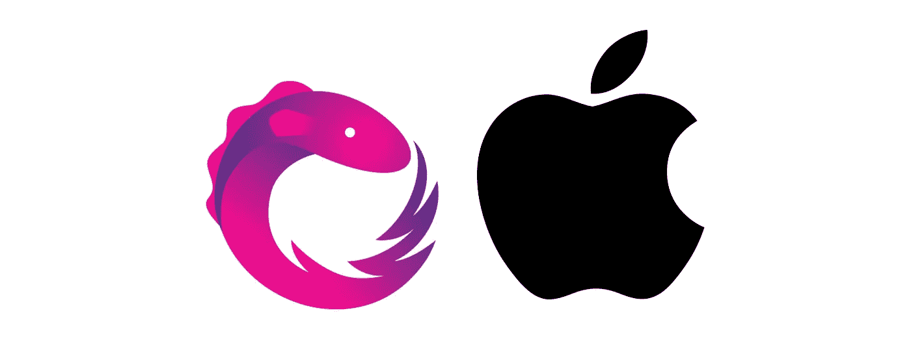
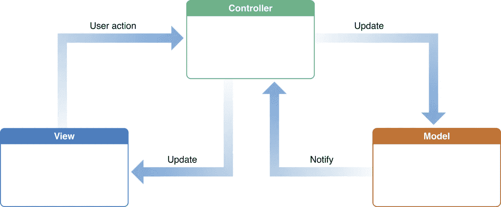
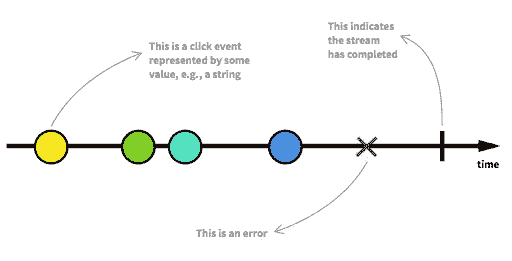

# 使用 RxSwift 实施 MVVM

> 原文：<https://betterprogramming.pub/ios-mvvm-with-rxswift-part-1-ff9f8102a3c9>

## 架构设计和实现

Rx +苹果

# 介绍

大家好。这一系列文章将是关于我最喜欢的两项技术， [RxSwift](https://github.com/ReactiveX/RxSwift) 和 MVVM。

我从 2015 年开始使用 Rx，并在过去一年中与 MVVM 一起在一个拥有超过 80，000 名用户的生产应用程序中广泛使用，分享我获得的知识是正确的。

首先，第一部分的内容是:

*   建筑模式介绍。
*   MVC、MVVM 和主要区别。
*   MVVM 与纯雨燕的例子。
*   同样的例子还有 MVVM、RxSwift 和 [RxCocoa](https://github.com/ReactiveX/RxSwift/tree/master/RxCocoa) 。

# 建筑模式

正如我们所知，从软件的早期开始，我们就可以识别出作为开发人员所面临的问题中的一些模式，并且似乎有一些解决这些问题的方案比其他方案更合适。

随着软件技术的发展，这些解决方案采取了一种事实上的方式来解决特定的问题，因此被称为*架构模式*。

现在，大多数软件框架在它们的堆栈中包含了这些模式，即使你从未听说过它们，你也一直在使用它们。一个简单的例子是 [Django](https://www.djangoproject.com/) 和许多其他 web 框架已经采用 MVC 作为它们的架构模式。

但是，什么是架构模式呢？

> “一个**架构模式**是一个**通用**，**可重用**，**解决方案**，用于解决给定**上下文**中软件架构中**常见的问题**。”—维基百科

让我们来分解这个定义中突出显示的部分。

## **通用且可重复使用**

*   意味着架构模式应该是*平台和语言*不可知的。相同的模式可以用于不同的软件框架。如果我们每次转换环境都需要发明一种新的模式，那就没什么意义了。
*   此外，我们应该能够在任何类型的软件或系统中使用模式，从命令行界面、web 应用程序、由多个子系统组成的复杂航空电子软件、等等。一个很好的架构模式的例子是[分层模式或分层架构](https://www.oreilly.com/library/view/software-architecture-patterns/9781491971437/ch01.html)，这种模式很容易适应前面提到的所有项目结构。通过使用这种架构模式，您可以在一个层的基础上实现关注点的分离，而不必受限于任何特定的技术、编程语言或项目类型。

## **语境**

意味着问题的本质。

如果你想在一个系统的不同部分甚至不同系统之间进行相互通信，那么你的问题的上下文或*域*就是通信和数据交换，因此，你必须寻找一种模式来解决这个问题，例如[发布-订阅模式](https://en.wikipedia.org/wiki/Publish%E2%80%93subscribe_pattern)。

## 结论

总之，我认为架构模式是解决问题的良方。就像一份烹饪食谱一样，在实现过程中，有空间进行微小的修改，以更好地适应您的编程风格、框架、语言等。

但是你必须小心，引入太多的修改，你最终会得到一个新的“模式”,尽管它适合你当前的项目，但可能不像需要的那样通用，也不太适合你的下一个项目。

永远记住模式的定义，它应该是通用的和可重用的。

我不是想阻止你定制图案。除此之外，我们已经看到了这样的定制或者以一种好的方式对原始模式的增强，最终作为后继者留下来。考虑 MVVM 协调器(我们将在本系列的后面讨论它)作为这样一个例子。

# UI 架构模式

在软件工程的早期，计算机程序是由穿孔卡来表示的，穿孔卡中既有程序，也有运行程序的数据。

随着计算机的发展，输入和输出设备也在发展。如今，我们有各种各样的输出设备，从小型移动显示器到虚拟现实耳机。

前端软件开发(包括移动应用)的典型过程是加载一些数据，将其呈现给最终用户，并处理用户输入。

这是一个乏味的任务，我们将在整个应用程序中的许多场合做，因此需要用一些严格的规则来构造它。

这种结构将帮助我们在类之间分配职责，这意味着任何工程师都能够回答:“哪个类负责给定的任务？”对于任何给定的屏幕，即使我们之前没有看到这段代码。

如下，代码将更容易理解，也更容易维护。

## 模型-视图-控制器

苹果的 MVC

也被称为 Massive-View-Controller，它受到了苹果公司的青睐，并在一定程度上内置于 iOS 中。

当我们为一个应用程序添加一个新的屏幕时，一个名为`ViewController`的新文件及其伴随的`.xib`就会生成——除非你使用故事板，在这种情况下，故事板将包含界面定义。

MVC 将关注点分成三组类。

*   模型-将存储您的数据的模型。
*   查看— `.xib`或`.storyboard`文件。
*   控制器——模型和视图之间的中介，负责加载和呈现数据以及处理用户输入。

虽然它在应用程序不太复杂的早期就发挥了作用，但现在已经有一段时间了，所以我们可以肯定它是不可扩展的。

随着应用程序的增长，根据应用程序的复杂程度，最终视图控制器可能会有数千行代码。

此外，由于您的代码驻留在`ViewController`中，很难进行单元测试。

## 模型-视图-视图模型

MVVM 把对象分成三组，就像 MVC 一样。这些组如下:

*   模型——在 MVC 中，模型将存储您的数据。
*   视图-视图控制器和 XIB。
*   ViewModel——在`View`和`Model`之间的*中介*。

查看这些类类型，我们清楚地看到`View`不再仅仅是一个 XIB，而是`ViewController`和伴随的 XIB 文件的组合。这听起来好多了。

然而，MVVM 让它如此不同的关键因素是`ViewModel`对`View`一无所知。相反，`View`观察`ViewModel`数据的变化并自我更新。

这种观察是通过 KVO、通知甚至关闭来实现的。我发现这三个都很不方便，因为你必须写很多样板文件。让我们看一个相当简单的闭包例子。

ViewModel.swift

我知道！38 行代码，用于拥有一个计数器并能够递增它。如果您想拥有可维护和可伸缩的代码，这是您必须承受的负担。你不能跳过样板部分。

但是也有一个好处。我们可以很容易地对我们的`ViewModel`进行单元测试。

最后，查看这里充当视图的`ViewController`，我们看到它负责绑定到`ViewModel`属性变更。

我一直在说视图约束或观察了`ViewModel`，但是我还没有解释为什么这是 MVVM 如此重要的一部分。这种观察模式以这样一种方式解耦了我们的代码，即`ViewModel`不是你的应用程序中任何特定屏幕的一部分。

相反，例如，当你想在列表中显示电影时，可以单独使用加载电影的`ViewModel`，或者当你想通过加载电视节目的`ViewModel`在 iPad 屏幕上显示电影时，可以与其他`ViewModel`结合使用。

视图控制器

总而言之，很明显，MVVM 通过在类之间分配责任来帮助我们编写干净的代码。`ViewModel`负责数据准备，而`View`负责展示。此外，我们还可以轻松地对我们的功能进行单元测试。

MVVM 的缺点是我们需要编写额外的代码来将`View`类粘合到`ViewModel`。对于我们需要存储的每个变量，我们必须声明一个闭包。

也许如果我们使用 KVO 或通知，我们可以跳过这一部分，但仍然，我们必须写一些代码来观察变化，然后更新用户界面。老实说，样板代码对所有架构模式都是必要的，不管你是做 MVP 还是 VIPER。

# 采用 RxSwift 的 MVVM—消除样板文件

通过利用 RxSwift 的功能，我们可以摆脱这种样板文件。Rx 提供胶水。

## Rx 是什么？RxSwift？

> " Rx 是一个用于**异步编程**和**可观察** **流**的 API。"—[react vex . io](http://reactivex.io/)

Rx 是一组严格定义的规范，而不是具体的实现。另一方面，RxSwift 是这种编程范式的实现*，它尊重这种语言的习惯用法*。

在 Rx 世界中，反应模式是由`Observable` ( `[Single](https://github.com/ReactiveX/RxSwift/blob/master/Documentation/Traits.md#rxswift-traits)` [、](https://github.com/ReactiveX/RxSwift/blob/master/Documentation/Traits.md#rxswift-traits) `[Completable](https://github.com/ReactiveX/RxSwift/blob/master/Documentation/Traits.md#rxswift-traits)` [、](https://github.com/ReactiveX/RxSwift/blob/master/Documentation/Traits.md#rxswift-traits) `[Maybe](https://github.com/ReactiveX/RxSwift/blob/master/Documentation/Traits.md#rxswift-traits)` [是`Observable`的特质](https://github.com/ReactiveX/RxSwift/blob/master/Documentation/Traits.md#rxswift-traits)——或变体)实现的。

Observable 为各种观察者提供了订阅的方法，以及处理异步操作的方式，例如读取文件内容、从网络获取数据，甚至进行一些繁重的计算都可能是这样的异步操作。

此外，还有一些操作符可用于过滤、转换和合并您的流。

事实上，Rx 太棒了，苹果已经编写了自己的框架， [Combine](https://developer.apple.com/documentation/combine) ，作为基于数据流和发布/订阅模式的 iOS 13 的一部分。

Combine 和 Rx 的概念非常相似，Combine 目前在功能性方面落后，但我想这是公平的。罗马不是一天建成的，Rx 在五年前，也就是 2015 年 4 月首次发布。

## RxCocoa

RxCocoa 引入了一组新的特征，`[Driver](https://github.com/ReactiveX/RxSwift/blob/master/Documentation/Traits.md#rxcocoa-traits)` [，](https://github.com/ReactiveX/RxSwift/blob/master/Documentation/Traits.md#rxcocoa-traits) `[Signal](https://github.com/ReactiveX/RxSwift/blob/master/Documentation/Traits.md#rxcocoa-traits)` [，](https://github.com/ReactiveX/RxSwift/blob/master/Documentation/Traits.md#rxcocoa-traits) `[ControlEvent](https://github.com/ReactiveX/RxSwift/blob/master/Documentation/Traits.md#rxcocoa-traits)` [，](https://github.com/ReactiveX/RxSwift/blob/master/Documentation/Traits.md#rxcocoa-traits) `[ControlProperty](https://github.com/ReactiveX/RxSwift/blob/master/Documentation/Traits.md#rxcocoa-traits)`来缓解处理异步操作和 UI 更新的问题。

简单来说，如果你开始写 Rx，`DispatchQueue.main.async {}`很快就会被弃用。

最重要的是，RxCocoa 通过`rx`代理为`UIView`的公共属性(如`isHidden`和`alpha`)提供绑定，甚至为一些更具体的属性(如`UILabel`的`text`和`attributedText`)提供绑定。

就像这样，你现在可以将一个字符串的可观察对象绑定到一个标签的文本上，当可观察对象发出新的值时，标签的文本也会改变。

让我们看看第一个例子中的视图控制器是什么样子的，用 Rx 重写。

RxViewModel

我告诉过你，样板文件是你无法摆脱的，但你肯定可以消除它。在我的 MVVM 实现中，我决定将`ViewModel`的输入和输出分成两个结构。

在输入中，我们声明了一个名为`PublishRelay`的新变量。Out 按钮将触发该继电器，进而触发`scan`。但是什么是`scan`？Scan 是一个类似于`reduce`的运算符。

给定一个种子和一个累加器，函数将在每个项目上触发函数。区别它们的细节是,`scan`将在每次触发时发出结果，而`reduce`将在给定的可观察结果完成时发出。

瞧，这是我们的视图控制器的代码。我们所要做的就是将按钮点击绑定到`PublishRelay`输入，将输出绑定到标签的文本。

视图控制器

感谢您花时间阅读这篇文章，我期待在下面的评论区看到您的想法。

敬请关注，在本系列的下一部分中，我们将讨论网络，进行一些适当的错误处理，并且我将向您展示当连接恢复时，如何从无网络错误中恢复。