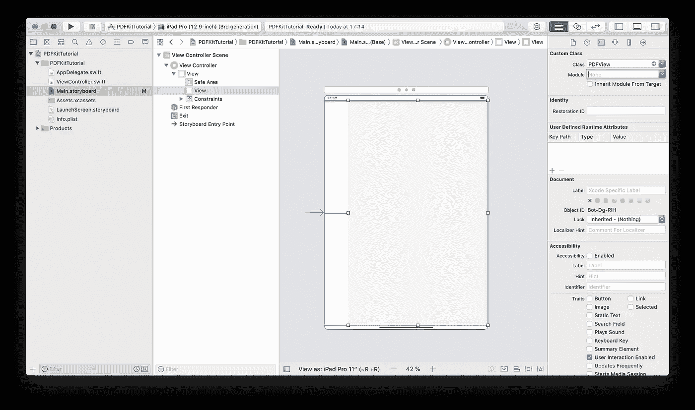
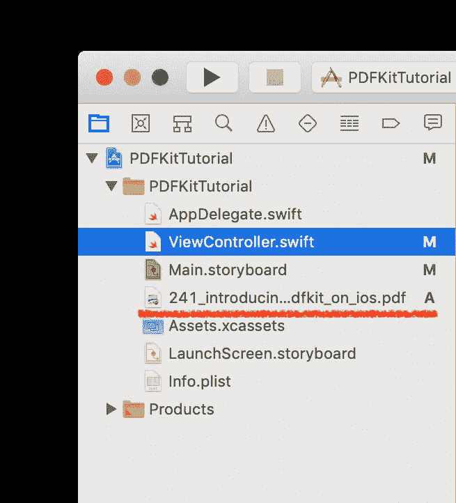
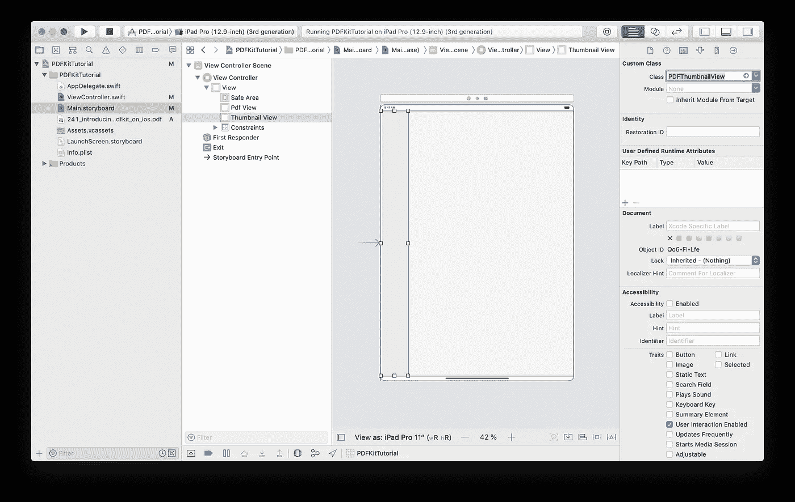
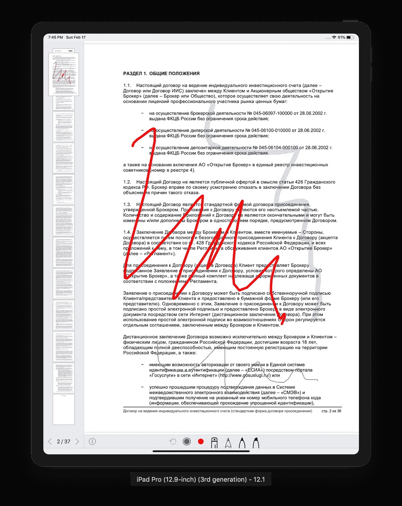

# iOS PDFKit 墨迹注释教程

> 原文：<https://betterprogramming.pub/ios-pdfkit-ink-annotations-tutorial-4ba19b474dce>

## 苹果 pdf 包完全指南

照片由 [Suganth](https://unsplash.com/@suganth?utm_source=medium&utm_medium=referral) 在 [Unsplash](https://unsplash.com?utm_source=medium&utm_medium=referral) 上拍摄

这是我第一篇关于苹果 PDFKit 的文章。我们将从 PDFKit 基础开始，并在本教程的最后创建第一个墨迹注释。

*   第二个是关于铅笔工具、文本注释和自动保存。
*   第三篇[文章是关于在设备上创建 PDF 文档，以及插入和删除页面](https://medium.com/@artempoluektov/ios-pdfkit-create-document-insert-delete-pages-2c53829de6c8)

我的团队最近开始了一个新项目:开发一个内置 PDF 浏览器的新 iOS 应用程序。

这个浏览器的主要特点是能够用手指或苹果铅笔给 PDF 文件添加注释。当然，我们知道这不是一项容易的任务，但我们从未想象过它会有多么具有挑战性。

乍一看，`PDFKit`看起来像 iOS SDK 中包含的任何其他苹果的框架。它包括 PDF 文档和缩略图视图，内置手势支持和大量动画。它实际上似乎是一个“神奇”的框架，只用几行代码就解决了我们的任务。

然而，我花了很多时间让绘图、润色和注释像预期的那样工作。我们还发现了一些导致崩溃的错误(在`Framework`内部)，以及缺乏文档和教程或例子。

所以我才给你做了这个教程！

# 针对 iOS 13 更新

本教程更新至 iOS 13，你还会在[第二部](https://medium.com/@artempoluektov/ios-pdfkit-tutorial-text-annotations-more-d0175436b28b)中找到一些关于`PencilKit`、`PKCanvasView`和`PKToolPicker`的有用信息，以及如何添加文本注释。

## 任务

任务非常简单:

*   将 PDF 文件下载到设备。
*   查看 PDF 文档并允许用户在页面间导航。
*   使用用户的手指或 Apple pencil 向 PDF 添加墨迹注释
*   保存 PDF 文档并将其上传到服务器。

看起来很容易，不是吗？我们不需要教你如何使用 Alamofire 下载和上传文件——我们将直接使用 PDFKit。

*注意:在本教程中，我将构建一个 iPad 应用程序，但 PDFKit 也适用于 iPhone。*

# PDFView

PDFView 是 PDFKit 中的关键对象。它是 UIView 的一个子类，主要用途是显示 PDF 文档。要将一个添加到您的`ViewController`视图中，您可以使用`Storyboard`或代码内初始化。就我个人而言，我更喜欢`Storyboard`的，所以这就是我在这里使用的。

## **将 PDFView 添加到 ViewController 的视图中**

*   只需添加新的 UIView
*   设置限制(我将在左侧留出一些空间用于缩略图视图)
*   转到检查器面板(在右侧)，选择 Identity 选项卡并输入类名`PDFView`。

将 PDFView 添加到 ViewController 的视图中

现在我们可以建立`PDFView`:

*   使用界面构建器为您的`ViewController’s`类创建`@IBOutlet`
*   别忘了`import PDFKit`
*   以下是我的 PDFView 设置代码:

第一行非常简单——您的`PDFView`可以有垂直或水平滚动方向。

第二行非常有用。默认情况下，`PDFView`使用内置的`UIScrollView`来实现整个文档的连续滚动。但是，您可以激活`PageViewController`模式，这样`PDFView`在屏幕上只显示一页。当然，缩放是默认支持和启用的。

我发现`.autoScales`设置包含一个 bug。当屏幕旋转时，它在 iPad 上不起作用。要解决这个问题，您必须添加这个调用:

另一个具有意外行为的方法是`.backgroundColor`。它只在代码中起作用，当你试图在界面构建器中设置它时不起作用。我花了很长时间试图理解我做错了什么！

最后，我找到了原因:调用`pdfView.document = ...`会将`PDFView`的背景颜色重置为默认值。所以，在`pdfView.document = ...`之后调用`pdfView.backgroundColor = ...`。

完成`PDFView`设置后，让我们将一个示例 PDF 文档添加到您的项目中(将其拖放到左侧面板):

创建`PDFDocument`并将其添加到您的`PDFView`中:

那很简单！

现在，我们的应用已经启动并运行，具备了以下开箱即用的特性:

*   用双指手势缩放。
*   滚动。
*   长按手势调用复制菜单。
*   `ThumbnailView`支持。

这是我的`viewDidLoad`方法在这一步之后的样子:

*注意:把这么多行代码放在你的* `*viewDidLoad*` *里并不是最好的办法，但这是教程，就这样吧！*

# PDFThumbnailView

创建缩略图很容易。就像我们在上一步中做的那样:

*   将新的`UIView`添加到你的`ViewController’s`视图中(不是`PDFView’s`子视图)。
*   设置约束。
*   在右侧面板的 Identity Inspector 选项卡中将`PDFThumbnailView`设置为类名。
*   为你的`ViewController`代码创建`@IBOutlet`。

创建缩略图视图

在您的`viewDidLoad`方法中使用这段代码来设置您的新`Thumbnail View`:

这段代码很清楚。不得不提的是`PDFThumbnailView`和`PDFView`一样，不尊重`.backgroundColor`界面建筑设置。但是，它会存储您设置的颜色，因此您不必在每次调用`pdfView.document = ...`时重置它。

不幸的是，当用户试图添加注释时，我们在 iOS 12 上遇到了`PDFThumbnailView`崩溃。在一种情况下，用户可以画一个小时而不崩溃，但在其他情况下，应用程序在第一次注释后崩溃。在 iOS 13 中好像已经修复了。

# 接收触摸事件

最初，为了实现用户输入，我试图添加透明的`UIView`作为`pdfView's`子视图。我发现透明视图不接收触摸事件。

然后我将 alpha 设置为 0.01，这是`view`接收触摸的最小 alpha。然而，我仍然有缩放和滚动手势的问题。我希望我的透明视图接收一个手指手势，并将其他(两个手指)手势转发给它的父视图(`pdfView`)。我最终发现这种方法行不通。

所以，最后，我实现了自己的自定义手势识别器。它只适用于一个手指的手势，如果手势有多个手指，它就会失败。代码如下:

首先，我实现了`touchesBegan`方法，它分析它接收到的触摸。

如果是 Apple Pencil 和单指手势，我将手势识别器状态设置为`.began`并继续接收触摸事件。您可以注释`Pencil`行，让这段代码在 iOS Simulator 上运行。不幸的是，你不能在 Mac 上模拟`Pencil`。如果是多点触摸手势，我将手势识别器状态设置为`.failed`，以便其他`pdfView's`手势识别器工作。

在`touchesBegan`中，我还通知我的代理，我们收到了一个新的触摸事件，因此它可以创建新的`PDFAnnotation`。在`touchesMoved`方法中，我只通知代理新的触摸位置。

最后，在`touchesEnded`方法中，我发送最终触摸位置并通知我的代理触摸已经结束。

这是协议参考，非常简单:

通过将此代码添加到您的`ViewController`的`viewDidLoad`方法中，将此手势识别器添加到您的`PDFView`中:

# **聚结和预测触摸**

来自我们的手势识别器的每个触摸事件(`UIEvent`)也具有合并的和预测的触摸阵列。由于不同的设备硬件以及为了提高性能，手势识别器仅实时接收一些触摸事件。

如果您的应用程序需要更高的精度，您可以通过检查`UIEvent`的`coalescedTouches`属性来访问所有触摸。iOS 还会尝试预测用户手指或铅笔的移动，并为每个`UIEvent`创建一个`predictedTouches`数组。

根据苹果的文档，你可以存储`coalescedTouches`并使用它们来绘图。但是，当您接收到下一个触摸事件时，您必须从`predictedTouches`中删除任何绘图使用的数据。

我们试图不仅将当前触摸的位置，而且将合并的和预测的触摸的数组转发给手势识别器的代表。然而，这导致了性能问题，所以在最终的实现中，我们决定坚持只使用常规的触摸事件，并跳过合并和预测触摸。以我们的情况来说，最终并没有影响用户体验。

# 绘图实现

创建手势识别器后，我们需要实现绘图。我将尝试遵循单一责任原则，创建另一个类来处理绘图。姑且称之为`PDFDrawer`:

我们的`PDFDrawer`应该保存一个对`PDFView`的引用，我们向其中添加注释。`Path`用于存储单个手势中的所有触摸事件。`CurrentAnnotation`还需要引用，因为每当用户移动 Apple Pencil 时，我们都会向路径添加新的点，因此我们需要更新它。对于用户在一个页面开始一个手势，然后意外地移动到下一个页面的情况，也需要`CurrentPage`。

这里我应该解释一下`PDFDocument`是如何工作的。文档包含由`PDFPage`类表示的页面。每个页面都包含自己的类`PDFAnnotation`注释。因此，如果用户在一个页面上开始一个手势，然后将触摸移动到另一个页面，我们必须在初始页面上继续绘制。

`PDFDrawer`是手势识别器的代表，所以我们需要实现`DrawingGestureRecognizerDelegate`协议的三个方法。首先，在用户第一次触摸时调用一个:

在这里，我们存储当前页面引用并为新绘图创建新的`UIBezierPath`。

当用户移动手指或铅笔时，调用以下方法:

这将检查当前页面引用是否存在，向我们的路径添加一个新点，并添加绘图注释。稍后我将提供`drawAnnotation`方法实现。

当用户完成触摸时，会调用完全相同的代码。或者至少，在教程的这个阶段是一样的，但是我们将在后面添加一些特定的代码来实现橡皮擦。

很简单，对吧？最初，我试图在开始、移动和结束事件中重用一个注释。我每次都通过调用`PDFAnnotation`的`.add(UIBezierPath)`方法给当前注释添加一个新的`UIBezierPath`。然而，我们发现这个应用程序在`PDFKit`框架内的某个地方崩溃了。

因此，我没有在一个注释上调用`.add`，而是在每次触摸移动时创建一个新的注释，并删除旧的注释。这(添加和删除)在 iOS 模拟器上是可见的，但在真正的 iPad 上可以流畅地工作。这是我发现的唯一防止崩溃的解决方案。

下面是我创建注释的代码:

迫使我们使用这个解决方案的另一个问题是来自我们客户的特性请求。他们不仅希望用全彩绘制，还希望能够用透明色(带 alpha 组件)绘制。

几乎没有路径的默认`PDFAnnotation`看起来真的很糟糕。因为它由几条透明的路径组成，所以一条路径的终点和另一条路径的起点比直线更亮，因为有交叉点。因为所有的绘图都是在`PDFKit`内进行的，我们无法改变这一点。这就是我们使用我们的解决方案的原因。

最后，为了让事情顺利进行，我们需要在我们的`ViewController`中创建一个`PDFDrawer`属性:

例如，在`viewDidLoad`中添加这个设置调用的方法:

# 长按手势识别器

正如我上面提到的，`PDFView`包含了很多内置的手势识别器。在一些罕见的情况下，我们的自定义手势识别器与用于复制动作的内置长按手势识别器冲突。我们还没有找到`PDFView`的任何设置来禁用它，所以我们必须实现`PDFView`的这个子类:

# 自定义 pdf 目录

我们还试验了定制的 PDFAnnotations。正如我上面提到的，在收到新的触摸事件后，我们需要删除和添加新的 PDFAnnotation。

我们试图从手势的开始到结束使用单个注释，以提高绘图性能。因此，我们创建了一个带有 path 属性的定制注释类，并覆盖了`draw()`方法。

然而，我们不能强迫 PDFKit 在每次修改路径时重画注释，因为`PDFAnnotation`不是`UIView`并且没有任何方法来重画注释。

最后，我们决定在每次收到新的触摸事件时在页面中添加和删除相同的注释(不创建新的事件)。通过自定义`draw`方法，我们实现了可视化绘图性能的显著提升，从而改善了用户体验。下面是`draw()`的方法:

为了消除绘图伪像，我们向`draw()`方法添加了一些额外的设置:

为了使这个方法线程安全，我们在`draw()`方法中替换了 path 副本:

# 自定义注释和性能

在第一次发布之后，我们发现了另一个性能问题。使用我们的自定义注释，用户在滚动和缩放 PDF 文档时经历了冻结。有些甚至由于内存警告而崩溃——即使是系统内和第三方应用。

为了解决这个问题并保持良好的绘图体验，我们决定在用户绘图时使用自定义注释，并在用户完成触摸后立即用系统`PDFAnnotation`替换它。我们还添加了新的边界计算机制，以最小化最终注释的边界大小，减少内存使用并提高绘图性能。我要提醒您的是，在绘制过程中，我们使用了整个页面大小作为自定义注释的界限——用户可以快速、流畅地绘制整个页面。

更新`PDFDrawer` `gestureRecognizerEnded`方法:

在这个方法中，我们仍然更新路径，然后删除旧的(自定义)注释并创建最终的(系统)注释:

就是这样。在绘图和预览过程中表现出色。如果您要使用我的代码，不要忘记将`UIBezierPath+.swift`文件添加到您的项目中。您可以在本教程底部的示例代码中找到它。

# 橡皮擦

我们还需要实现一个橡皮擦工具。然而，我们无法使用由`PDFPage`提供的`annotation(at:CGPoint)`方法，因为它基于注释的边界，即使当用户点击边界内的空白区域`rect`时，也会返回注释。

在我们的例子中(用户可能用 Apple Pencil 写文本),它没有像用户期望的那样工作。我们需要找出路径是否被窃听，而不是路径的边界。首先，我们用可计算的`hitPath`属性实现了`PDFAnnotation`子类(稍后会有更多细节)，这是注释的最终路径。出于性能原因，仅在路径完成时才进行计算。

我们发现在关闭`PDFDocument`并再次打开它之后，这种方法不起作用，因为所有之前创建的类`PDFAnnotationWithPath`的注释都变成了常规的`PDFAnnotation`。因此，我们不得不牺牲一点性能，创建一个扩展来代替`subclass`:

值得注意的是，我们在这里使用了`PDFAnnotation`的`paths`属性——确保将您的最终路径放在那里。我们还使用 10 磅作为所有线条的默认描边宽度，使用户更容易用橡皮擦点击路径。

我们还实现了`PDFPage`扩展来调用`contains`方法:

最后，我们需要更新`PDFDrawer`方法来支持橡皮擦工具:

是一个枚举，包含了我们所有的绘图工具。用户可以在 UI 中选择具有不同线宽和颜色的不同工具。我们将它存储为`PDFDrawer`的属性。

对`gestureRecognizerEnded`方法进行同样的修改:

下面是`removeAnnotationAtPoint`的实现:

# **保存文档**

添加完所有需要的注释后，保存您的`PDFDocument`也非常容易:

这是我们应用程序的最终视图:

# 示例代码

对于演示项目，请[检查存储库](https://github.com/poluektov/pdfkit-ink-annotations/)。

我没有故意创建一个库或框架。主要是因为所有使用 PDF 的应用程序/项目都非常不同，需要大量的定制。所以，伙计们，请随意使用我的示例代码作为您自己项目的基础。

# 继续阅读

要了解更多关于`PDFKit`的信息，包括使用`PencilKit`，添加文本注释，以及替代解决方案，请继续阅读[第二部分](https://medium.com/@artempoluektov/ios-pdfkit-tutorial-text-annotations-more-d0175436b28b)。