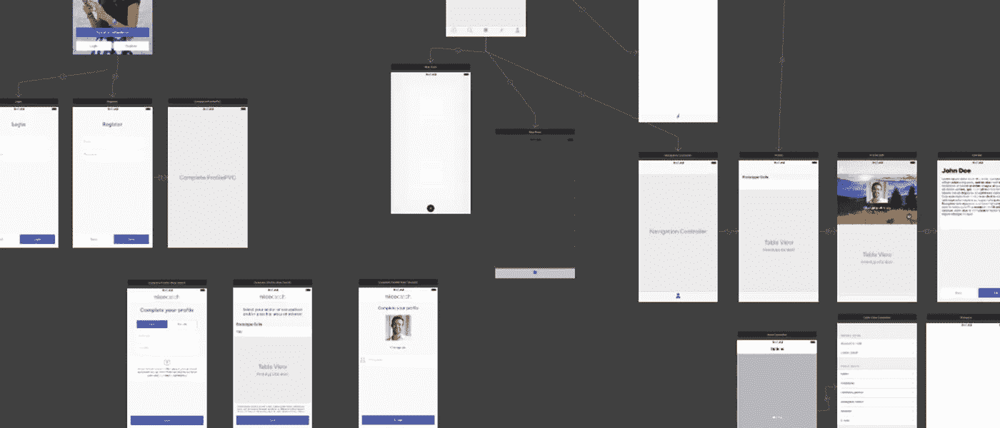
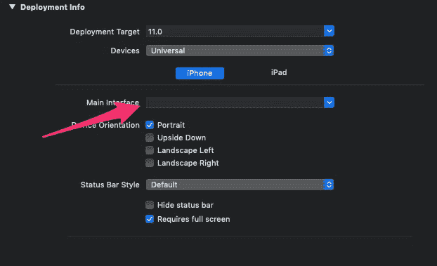

# Swift 中的故事板导航与程序导航

> 原文：<https://betterprogramming.pub/ios-programming-storyboard-navigation-vs-programmatic-navigation-cfd363de3618>

## 你应该使用哪一种，为什么？

当你的 iOS 应用成为挑战时，Xcode 故事板似乎不是正确的选择。当您实现控制器和视图时，Xcode 故事板开始感觉加载缓慢和不清晰，结果开始看起来像连接框之间的大量令人费解的箭头。多亏了 Cocoa 框架和 UIKit 框架，你可以选择不使用故事板，通过编码构思一个导航模式，通过推动控制器和呈现只在 Swift 中编码的模态(或者 Objective-C，如果你是一个怀旧的程序员)。



谁能读懂一个复杂的故事板呢？

# Xcode 故事板的限制和缺点

Xcode storyboard 是旧的 Interface Builder 的自然演变，这是一个被弃用的应用程序，开发人员用来创建视图、`IBOutlets`和`IBActions`(直到今天仍保留 IB 前缀)。旧的界面生成器本身是一个应用程序，完全独立，自 Xcode 5 发布以来已经停止使用。然后，Xcode 中引入了新的`.storyboards`文件，这是一个突破——在现代 iOS 应用程序开发中，这是一个构思导航模式的有用模式。

故事板是一个很好的工具，因为它们给了开发者一个很好的展示应用程序如何整体工作的方法。越来越多的人使用自动布局功能，这种功能能够将视图转换为某种响应视图，可以适应今天苹果设备的大小显示器。但是毕竟..

> 我发现故事板很难被阅读，当你的应用程序不断增长，而我却被缓慢的加载时间所困扰时，故事板很有用。很快，你将完全失去对你的故事板的控制，它变得一团糟。

## 我应该切换到 Swift 驱动的导航吗？

第一:如果你的应用是由几十个控制器组成的，那当然可以。我发现当控制器之间有很多连接时，Swift 驱动的导航更好。对我来说，有时候代码甚至比故事板更易读。通过使用故事板，你可以用一种友好和智能的方式来声明控制器之间的连接，但我们喜欢快捷，打开模态或推动控制器只需一两行代码就可以完成。此外，**将数据传递给你正在推动的控制器是一种非常常见的模式，所以如果不编码**，你真的不能让一个应用导航。是的，“准备继续”的方法可以做到这一点，但是当你有复杂的逻辑，你必须切换你要着陆的控制器时，它们看起来很烦人。

## 那么，我如何停止使用故事板，使用快捷导航？

首先，在没有“主界面”的情况下，通过点击项目标题和简单地删除故事板引用来设置你的目标。



将你的主界面设置为无以避免应用崩溃

不要忘记一旦你的应用程序被激活，就将 UIViewController 设置为 rootViewController，这里我们从一个基本的 splash UIViewController 开始:

```
func application(_ application: UIApplication, didFinishLaunchingWithOptions launchOptions: [UIApplicationLaunchOptionsKey: Any]?) -> Bool { self.window = UIWindow(frame: UIScreen.main.bounds)
        **self.window?.rootViewController = Splash()**
        self.window?.makeKeyAndVisible()
        self.window?.backgroundColor = .white
}
```

然后，只要您需要呈现新的 ViewController，就可以开始编码了。
我将向您展示一些代码示例，让您明白这一点:

```
// present a modal with an embed UINavigationController
let rvc = MyNewController()
let vc = UINavigationController(rootViewController: rvc)
vc.modalPresentationStyle = .overFullScreen
present(vc, animated: true, completion: nil)
```

简单，*你甚至不需要安装一个 UINib 或者引用一个 bundle* 。在你当前的`UINavigationController`上推一个`ViewController`也是一样:

```
let vc = MyPushedNewController()
vc.param = value
navigationController?.pushViewController(vc, animated: true)
```

## 最终考虑

1.  如果你的程序很简单，你不需要复杂的导航模式或者把参数传递给下一个控制器，那么继续使用故事板。
2.  故事板可能会导致更快的实现，但同样，只有在你的应用程序不复杂的情况下。
3.  如果你喜欢编码，就切换到 Swift 驱动的导航。你总是可以使用自定义类来包装导航或者构建`ViewControllers`来推送。

享受您的 iOS 应用程序，无论大小！