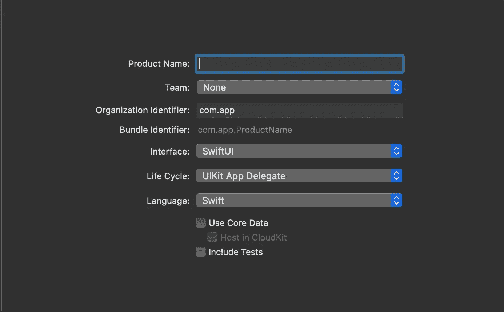
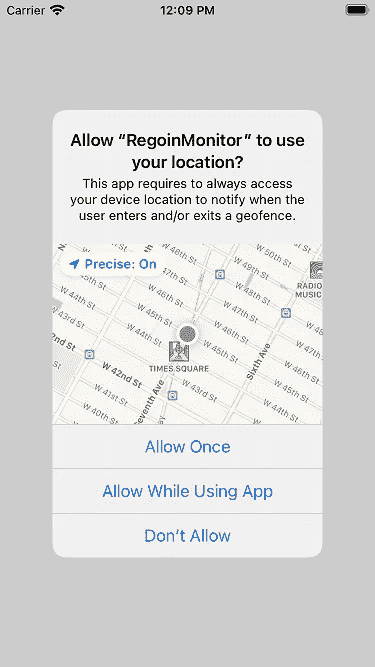
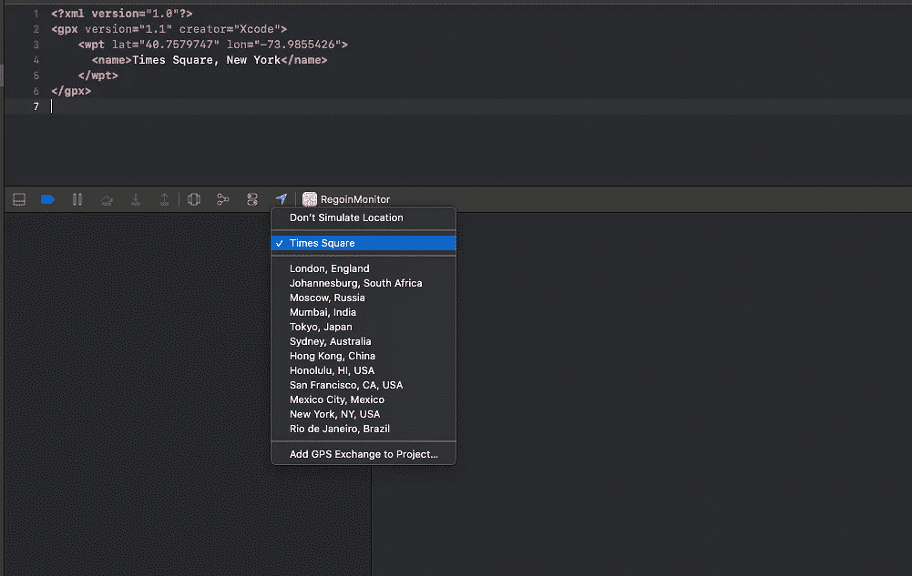
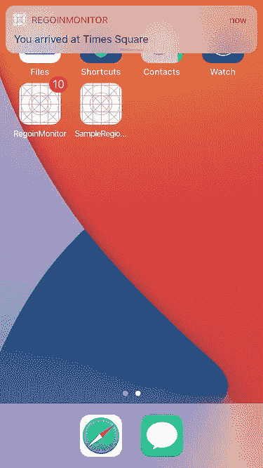

# 使用 SwiftUI 监控 iOS 区域

> 原文：<https://betterprogramming.pub/ios-region-monitoring-with-swiftui-b1028fa8b95f>

## 【Swift 简化了地理围栏

照片由[威廉·胡克](https://unsplash.com/@williamtm)在 [Unsplash](https://unsplash.com/photos/9e9PD9blAto) 上拍摄

好吧！让我们开始吧。我将在 Xcode 中创建一个带有 SwiftUI 界面的新 Swift 项目。我决定使用 UIKit 应用程序代理生命周期，因为在本教程中设置核心位置和通知代理会更容易。

Xcode 项目设置

# **入门**

核心位置框架的`[CLLocationManager](https://developer.apple.com/documentation/corelocation/cllocationmanager)`使开发者能够监控用户的位置，并触发应用程序的位置相关事件。让我们看看如何使用它在用户进入/退出给定区域时向用户显示通知。

# **设置位置管理器**

我们将初始化我们的`SceneDelegate.swift`文件中的`CLLocationManager`。当您注册一个地区并开始监控时，即使应用程序进入后台，iOS 也会继续监控这些地区。如果应用程序没有运行，操作系统将唤醒或重新启动应用程序，并尝试交付事件。这使得`SceneDelegate`成为处理它们的理想场所。

位置管理器属性

为了接收与区域监控相关的事件，我们需要向用户请求“始终打开权限”:

请求“始终在位置”权限

注册`SceneDelegate.swift` 来接收位置管理器事件。下面的委托方法`[locationManager(_:didEnterRegion:)](https://developer.apple.com/documentation/corelocation/cllocationmanagerdelegate/1423560-locationmanager)`和`[locationManager(_:didExitRegion:)](https://developer.apple.com/documentation/corelocation/cllocationmanagerdelegate/1423630-locationmanager)`将处理 geofence 的进入/退出事件。现在，您可以将方法保留为空。我们稍后将实现它们。

位置经理代表

确保在`info.plist`文件中包含`NSLocationAlwaysAndWhenInUseUsageDescription` 和`NSLocationWhenInUseUsageDescription` 按键的描述。如果没有这些条目，您的应用程序将不会请求位置权限。

如果您现在构建并运行您的应用程序，您应该会看到您的应用程序请求位置访问，如下所示:

请求位置访问

# **创建区域**

现在我们的 location manager 设置已经完成，我们可以开始监控该地区了。我们可以使用`[CLCircularRegion](https://developer.apple.com/documentation/corelocation/clcircularregion)`对象定义一个区域。区域基本上是以给定地理坐标为中心的圆形区域。我们可以通过提供纬度、经度和半径(以米为单位)来定义一个区域。半径将决定边界。

出于本教程的考虑，我们将在`SceneDelegate`中注册该地区，这样我们可以在应用程序启动后立即开始监控该地区。

创建区域对象

# 注册区域

我要监控的位置是`Times Square, New York`。你可以选择任何你喜欢的地方。

为了开始监控，我们需要将区域注册到我们的`[CLLocationManager](https://developer.apple.com/documentation/corelocation/cllocationmanager).`中，我们通过调用`[startMonitoring(for:](https://developer.apple.com/documentation/corelocation/cllocationmanager/1423656-startmonitoring))`方法来完成。

注册 CLCircularRegion

# 监听事件

为了监听地理围栏事件，我们将使用前面讨论过的`[locationManager(_:didEnterRegion:)](https://developer.apple.com/documentation/corelocation/cllocationmanagerdelegate/1423560-locationmanager)`和`[locationManager(_:didExitRegion:)](https://developer.apple.com/documentation/corelocation/cllocationmanagerdelegate/1423630-locationmanager)`委托方法:

这里，如果应用程序是活动的，我们只更新我们的`ContentView` 上的简单文本视图。如果应用程序未激活，将向用户显示本地通知。您可以在此决定您希望如何使用您的应用程序:

更新 geofence 事件的用户界面

# 测试您的应用

测试应用程序实际上很容易。我们可以使用一个定制的`.GPX`文件，模拟 iOS 模拟器的位置，或者你正在构建和运行你的应用的实际设备。

纽约时代广场的经度和纬度

只需用。gpx 格式并添加上述内容。您可以将 lat，long 值更新为您喜欢的任何值。然后启动一个模拟器或者连接你的测试设备，构建并运行你的应用。

运行应用程序后，将其最小化，然后单击底部工具条上的模拟位置按钮。现在选择您的自定义位置。

在 Xcode 上模拟位置

几秒钟后，您应该会收到通知。如果您需要测试退出事件，只需从列表中选择任何其他默认位置。

本地通知消息

就是这样！您已成功将 iOS 上的地区监控与 Swift 集成。直到下次，保持安全！

# **资源**

你可以从 GitHub 下载[示例项目。](https://github.com/sachi911/region-monitoring-ios)