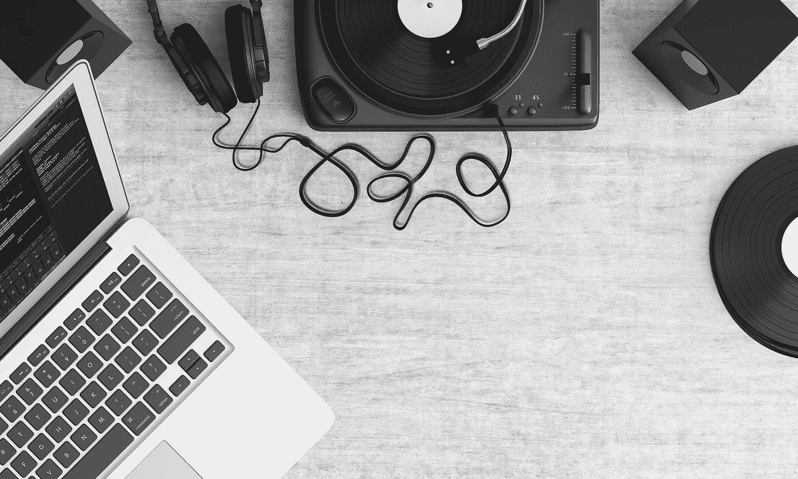
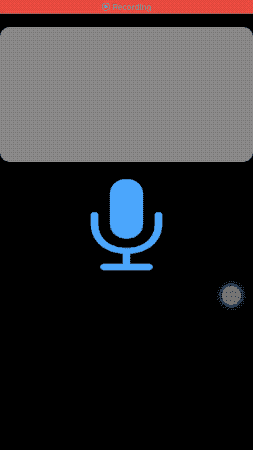
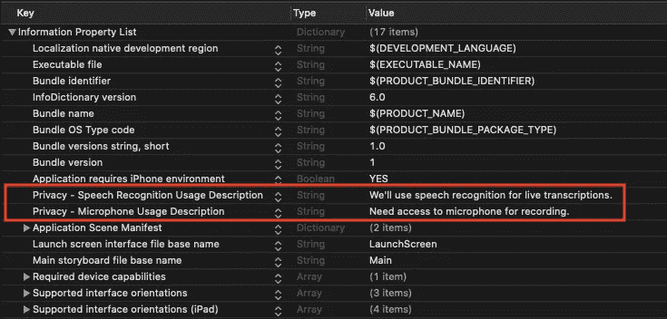
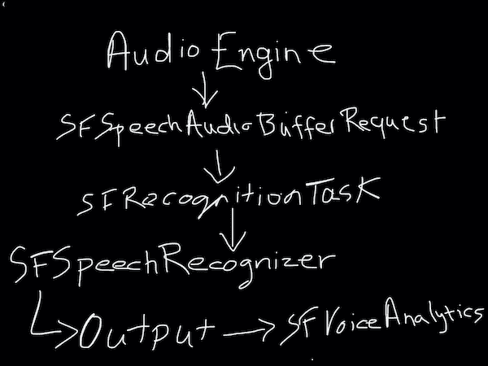

# iOS 设备上的语音识别

> 原文：<https://betterprogramming.pub/ios-speech-recognition-on-device-e9a54a4468b5>

## SFSpeechRecognizer 已在 iOS13 中更新，允许在设备上、无数据和离线的情况下识别和分析语音



图片由 [Becca Clark](https://pixabay.com/users/theglassdesk-149631/?utm_source=link-attribution&utm_medium=referral&utm_campaign=image&utm_content=1109588) 从 [Pixabay](https://pixabay.com/?utm_source=link-attribution&utm_medium=referral&utm_campaign=image&utm_content=1109588) 拍摄

苹果在今年的 WWDC 2019 期间展示了其在机器学习和人工智能领域的进步。iOS 13 中的设备上语音识别功能就是一个展示他们野心的功能。

# 范围

设备上的语音识别通过将用户的数据保存在云之外来增加用户的隐私。苹果公司试图通过这种增强的语音识别来大大推动基于语音的人工智能。

新升级的语音识别 API 允许您做各种事情，如使用语音分析指标跟踪语音质量和语音模式。

从提供基于录音的自动反馈到比较个人的语音模式，在人工智能领域，使用设备上的语音识别可以做很多事情。

当然，对于这种新的设备上语音识别，需要考虑某些权衡。没有像你在云上那样的持续学习。这可能会导致设备精度降低。此外，语言支持目前仅限于大约 10 种语言。

尽管如此，设备上的支持让您可以无限期地进行语音识别。这是对之前服务器一分钟记录限制的一次重大胜利。

`SFSpeechRecognizer`是驱动语音识别的引擎。

iOS 13 SFSpeechRecognizer 足够智能，可以识别你讲话中的标点符号。

说一个点加一个句号。类似地，逗号、破折号和问号将返回相应的标点符号: (，—？).

# 我们的目标

开发一个录制实时音频的设备上语音识别 iOS 应用程序。下面举例说明了我们在本文结束时将实现的目标:



我们应用程序的屏幕截图。

你注意到了吗？

*上面的截图是在飞行模式下拍摄的。*

不再浪费时间，让我们打开麦克风，开始构建设备上语音识别应用的旅程。

在接下来的章节中，我们将跳过 UI 和美学部分，直接进入语音和音频框架。让我们开始吧。

# 添加隐私使用说明

首先，您需要在您的`info.plist`中包含麦克风和语音识别的隐私使用说明，如下所示。



不添加它肯定会导致运行时崩溃。

接下来，在您的`ViewController`类中使用`import Speech`来访问您的应用程序中的语音框架。

## 请求权限

为了使用语音识别，我们需要请求用户授权。以下代码为您完成了这项工作:

```
SFSpeechRecognizer.requestAuthorization{authStatus in

            OperationQueue.main.addOperation {
               switch authStatus {
                    case .authorized:
                    case .restricted:
                    case .notDetermined:
                    case .denied:
               }
            }
}
```

`SFSpeechRecognizer`负责通过`SFSpeechRecognitionTask`生成你的转录。为此，我们必须初始化我们的`SFSpeechRecognizer`:

```
var speechRecognizer = SFSpeechRecognizer(locale: Locale(identifier: "en_IN"))
```

在上面的代码中，您需要传递在整个电话中使用的地区标识符。我的情况是英语(印度)。

# 语音识别:幕后

设备上语音识别的工作原理如下图所示:



语音识别流程

从上图可以看出，任何语音识别应用程序都有四个支柱:

*   `AVAudioEngine`
*   `SFSpeechRecognizer`
*   `SFRecognitionTask`
*   `SFSpeechAudioBufferRecognitionRequest`

在接下来的章节中，我们将会看到它们在构建我们的语音识别应用程序中所扮演的角色。

# 履行

## 设置音频引擎

`AVAudioEngine`负责接收来自麦克风的音频信号。它为语音识别提供我们的输入。

```
let audioEngine = AVAudioEngine()
let audioSession = AVAudioSession.sharedInstance()
try audioSession.setCategory(.record, mode: .measurement, options: .duckOthers)
try audioSession.setActive(true, options: .notifyOthersOnDeactivation)

let inputNode = audioEngine.inputNode

inputNode.removeTap(onBus: 0)
        let recordingFormat = inputNode.outputFormat(forBus: 0)
        inputNode.installTap(onBus: 0, bufferSize: 1024, format: recordingFormat) { (buffer: AVAudioPCMBuffer, when: AVAudioTime) in
            self.recognitionRequest?.append(buffer)
        }

audioEngine.prepare()
try audioEngine.start()
```

上面的代码在`inputNode`上安装了一个 tap，并设置输出的缓冲区大小。

一旦该缓冲区大小被填满(通过您说话或录音时的音频信号)，它就会被发送到`SFSpeechAudioBufferRecognitionRequest`。

现在让我们看看`SFSpeechAudioBufferRecognitionRequest`如何与`SFSpeechRecognizer`和`SFSpeechRecognitionTask`一起工作，以便将语音转录为文本。

## 启用设备上的语音识别

以下代码在电话上启用设备上的语音识别:

```
recognitionRequest.requiresOnDeviceRecognition = true
```

将`requiresOnDeviceRecognition`设置为`false`将使用 Apple Cloud 进行语音识别。

请注意，设备上的语音识别只能在 iOS 13、macOS Catalina 和更高版本的设备上使用。它需要苹果的 A9 或新处理器，该处理器在 iOS 中受 iPhone6s 及以上设备的支持。

## 创建语音识别任务

SFSpeechRecognitionTask 用于通过`SFSpeechRecognizer`运行`SFSpeechAudioBufferRecognitionRequest`。作为回报，它提供了结果实例，从中我们可以访问不同的语音属性。

在上面的代码中，发生了很多事情。让我们把它分解成几块。

*   首先，当按下`startRecording`时，我们取消任何先前的识别任务。
*   接下来，我们使用 SFSpeechRecognizer 和识别请求创建识别任务。
*   将`shouldReportPartialResults`设置为 true 允许在每次发声期间访问中间结果。
*   `result.bestTranscription`返回可信度最高的转录。在它上面调用`formattedString`属性给出转录的文本。
*   我们可以访问其他属性，如`speakingRate`、`averagePauseDuration`或`segments`。

## SFVoiceAnalytics

`SFVoiceAnalytics`是一个新引入的类，它包含一组语音指标，用于跟踪语音结果中的音调、闪烁和抖动等特征。

可以从转录的段属性中访问它们:

```
for segment in result.bestTranscription.segments {
                    guard let voiceAnalytics = segment.voiceAnalytics else { continue }

                    let pitch = voiceAnalytics.pitch
                    let voicing = voiceAnalytics.voicing.acousticFeatureValuePerFrame
                    let jitter = voiceAnalytics.jitter.acousticFeatureValuePerFrame
                    let shimmer = voiceAnalytics.shimmer.acousticFeatureValuePerFrame
}
```

## 开始录音和转录

现在我们已经定义了四个组件中的每一个，是时候合并支柱了，以便开始在`UITextView`中记录和显示转录。下面的代码片段可以帮你做到这一点。

# 结论

上面的实现步骤应该会返回一个类似于本文开头的屏幕截图的结果。该应用程序的完整源代码可以在这个 [Github 资源库](https://github.com/anupamchugh/iowncode/tree/master/iOS13OnDeviceSpeechRecognition)中找到。

这就是我对 iOS 13 中的设备语音识别的总结。当与声音分类器和 NLP 一起使用时，这个新的升级将会很方便。

我希望你喜欢读这篇文章。现在开始使用新的`SFSpeechRecognizer`构建你自己的基于语音的人工智能应用。