# iOS 中的 UIGestureRecognizer 简介

> 原文：<https://betterprogramming.pub/ios-tutorials-introduction-to-uigesturerecognizer-60b66f47f77d>

## 看看这 6 种类型及其各自的作用

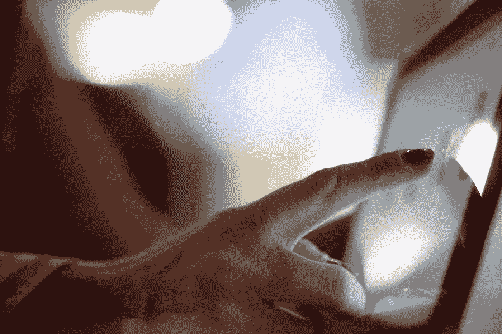

[timothy muza](https://unsplash.com/@timothymuza?utm_source=unsplash&utm_medium=referral&utm_content=creditCopyText) 在 [Unsplash](https://unsplash.com/s/photos/touch?utm_source=unsplash&utm_medium=referral&utm_content=creditCopyText) 上拍摄的照片

# UIGestureRecognizer

UIGestureRecognizer 跟踪用户解释的屏幕上的触摸行为，如点击、挤压、旋转、滑动、平移和长按，并根据编写的操作方法对识别进行操作。

随着 UIGestureRecognizer 的引入，它肯定会为您节省更多编写额外代码的时间。

手势识别器有六种类型:

1.  `UITapGestureRecognizer` —识别敲击声。
2.  `UIPinchGestureRecognizer` —识别挤压(放大/缩小)。
3.  `UIRotationGestureRecognizer` —识别用户的输入旋转。
4.  `UISwipeGestureRecognizer` —识别刷卡。
5.  `UIPanGestureRecognizer` —识别拖动。
6.  `UILongPressGestureRecognizer` —识别长点击。

# 1.UIPanGestureRecognizer

使用`UIPanGestureRecognizer`，你可以在屏幕上移动一个物体。下面的例子显示了一只鸡在屏幕上移动

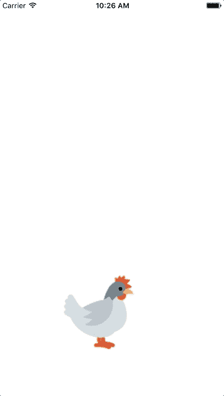

这可以通过以下指令轻松实现:

1.  在`Assets.xcassets`中存储一个鸡的图像。
2.  将图像视图拖到`Main.storyboard`上，注意右上角的屏幕，根据您在`Assets.xcassets`中的图像名称对其进行命名，并在检查器面板中勾选*启用用户交互。*

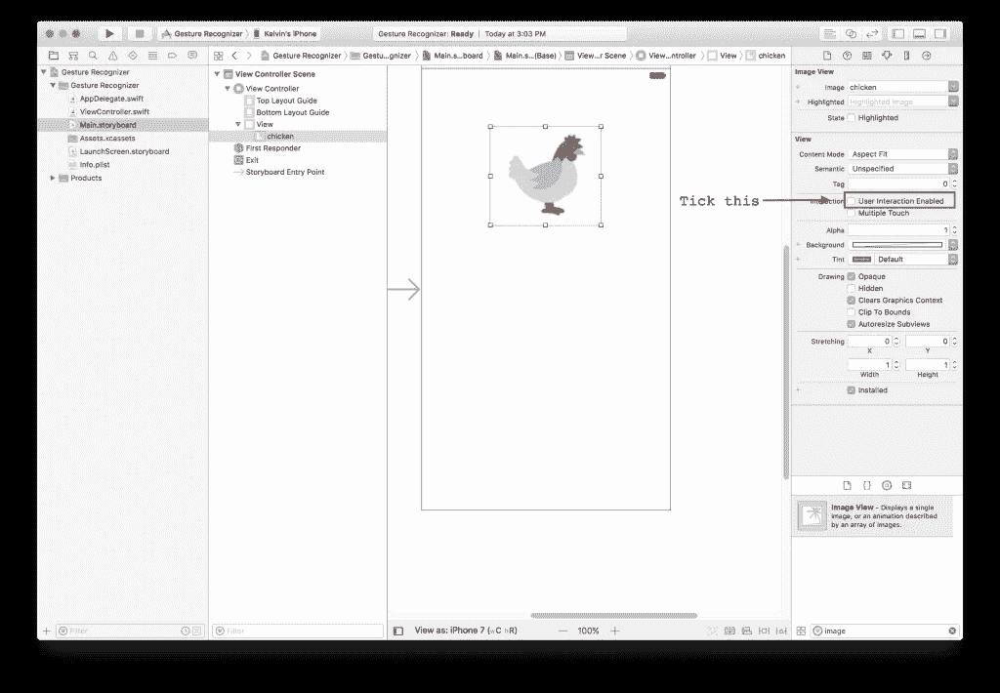

3.将平移手势识别器拖到图像上。


4.编写一个动作和控件，并将平移手势识别器拖动到视图控制器。选择*发送动作*下方的按钮。它应该看起来像下面的图像。

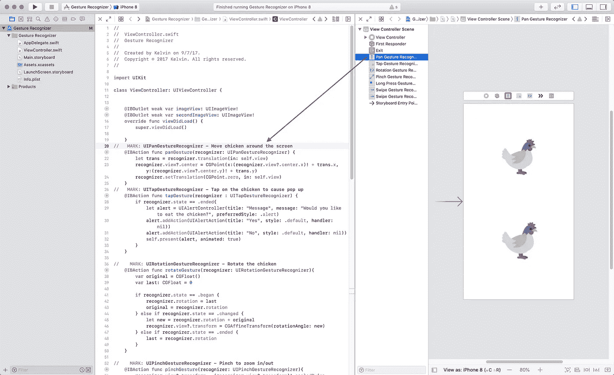

5.在操作方法中编写代码。

通过调用这里的`translation(in:)`，你可以通过手指检测到移动。当用户将手指从对象上抬起时，为了让图像停留在那个位置，我们必须将平移设置为零，否则对象将被抛出屏幕。

```
@IBAction func panGesture(recognizer : UIPanGestureRecognizer) {
   let trans = recognizer.translation(in: self.view)
   recognizer.view?.center = CGPoint(x:(recognizer.view?.center.x)! + trans.x, y:(recognizer.view?.center.y)! + trans.y)
   recognizer.setTranslation(CGPoint.zero, in: self.view)
}
```

# 2.UITapGestureRecognizer

使用`UITapGestureRecognizer`，您可以跟踪用户的触摸。您可以跟踪触摸的不同状态有:

*   `Possible` **—** 这是默认状态，其中手势尚未被识别，但正在评估触摸事件。
*   `Began` **—** 该手势被识别为连续手势。
*   `Changed` **—** 该手势被识别为连续手势的变化。
*   `Ended` **—** 该手势被识别为连续手势的结束。
*   `Canceled` **—** 该手势被识别为连续手势的取消。
*   `Failed` **—** 此手势不识别任何多点触摸。

我们将在这个例子中实现`.ended`,因为我们将只检测每一次点击。结果应该如下图所示。

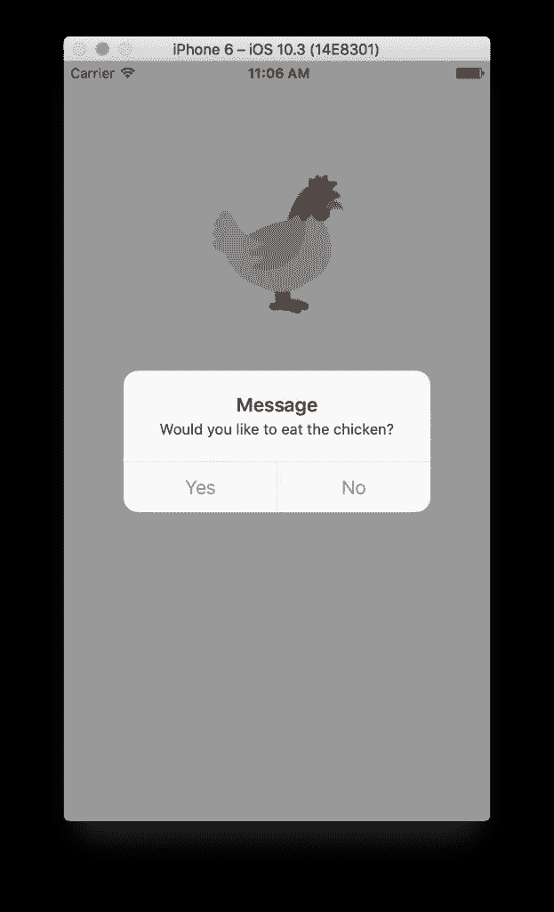

1.  将点击手势识别器拖到图像上，按住 CTRL 键并将点击手势识别器拖到视图控制器上，然后单击该动作。(确保你已经写好了`IBAction`方法。)

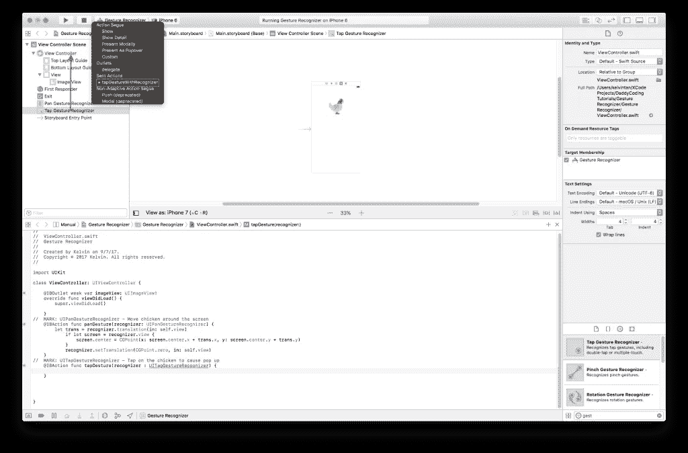

2.写代码。

# 3.UIRotationGestureRecognizer

使用`UIRotationGestureRecognizer`，你可以旋转任何你想要的东西。在这种情况下，我们将旋转鸡，如下例所示。

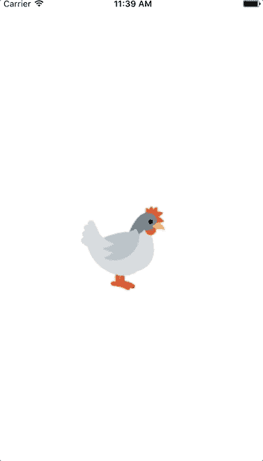

1.  将旋转手势识别器拖到图像上，按住 CTRL 键并将旋转手势识别器拖到视图控制器上，然后选择动作。(确保你写了你的函数。)

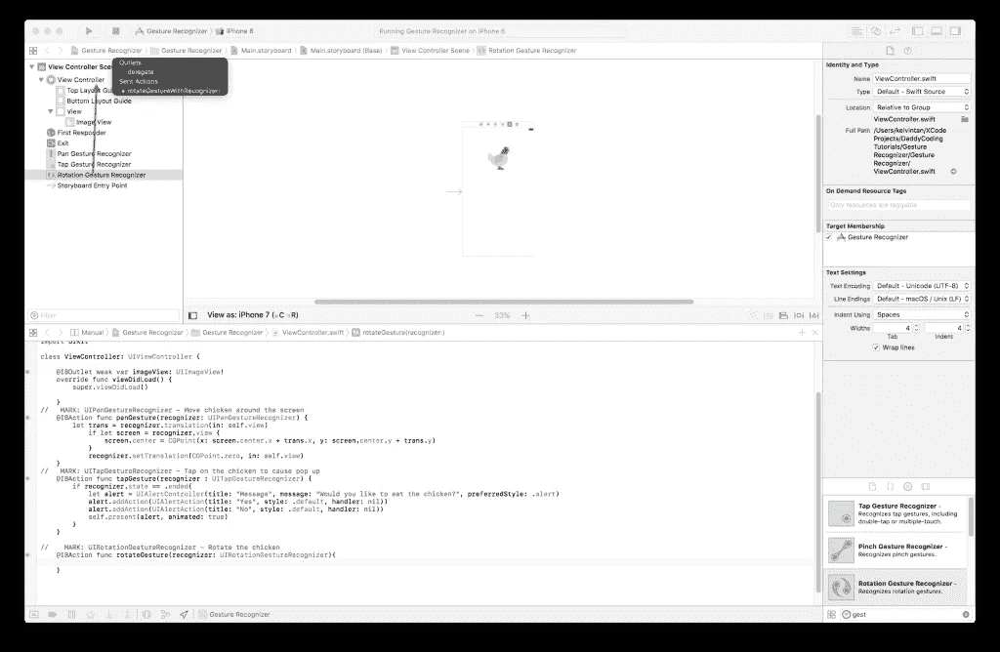

2.写代码。

对于这里的代码，我们使用了前面提到的几种状态，如`.began`、`.changed`和`.ended`。当它进入每个状态时，它将执行必要的操作。

为了跟踪最后一次旋转，最后一次被赋予值 0，因为我们没有进行任何旋转。如果我们真的旋转了，我们会把值保存在原始数据中。

当我们停止旋转时，我们将把`recognizer.rotation`保存到最后。这样，我们可以防止图像回到默认的旋转。

# 4.UIPinchGestureRecognizer

使用`UIPinchGestureRecognizer`，您可以放大/缩小图像。

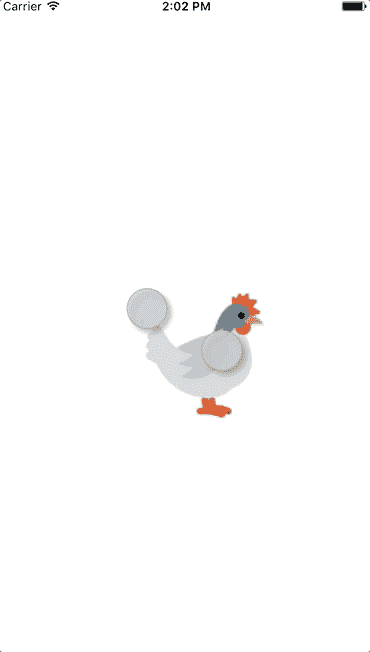

1.  将收缩手势识别器拖到图像上，按住 CTRL 键并将收缩手势识别器拖到视图控制器上，然后单击该动作。(确保您已经编写了`IBAction`方法。)

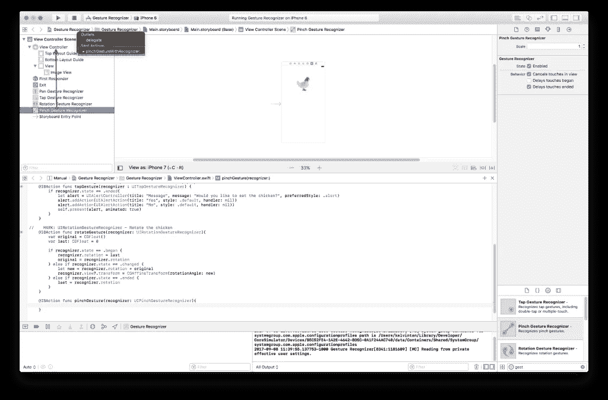

2.写代码。

# 5.UILongPressGestureRecognizer

使用`UILongPressGestureRecognizer`，您可以检测用户的长时间触摸，并启动您设置的动作。下面的例子如下所示。这确实是三秒钟，我把长度截了，让 GIF 文件变小。

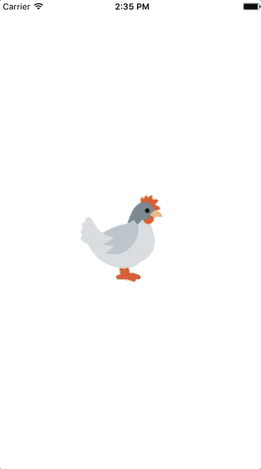

1.  将长按手势识别器拖到图像上，按住 CTRL 键的同时将长按手势识别器拖到视图控制器上，然后单击该动作。(确保你已经写好了`IBAction`方法。)

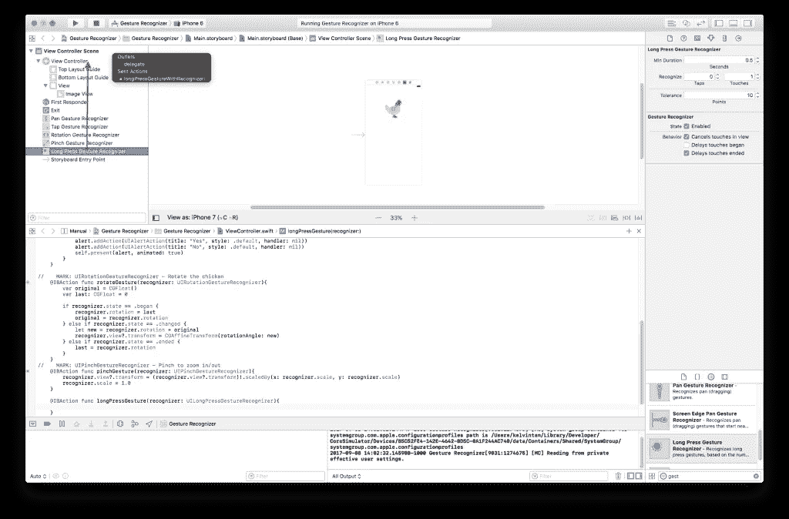

2.写代码。

# 6.UISwipeGestureRecognizer

使用本教程中实现的`UISwipeGestureRecognizer`,你可以浏览一堆图像。

在下面的例子中，我附加了两张图片，分别是鸭子和鸟。图像的排列存储在一个数组中。数组中的排列总是从 0 而不是 1 开始。

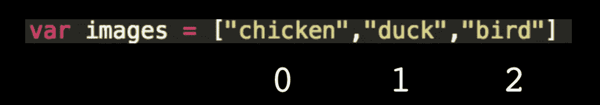

在下面的例子中，这是滑动发生时的样子。

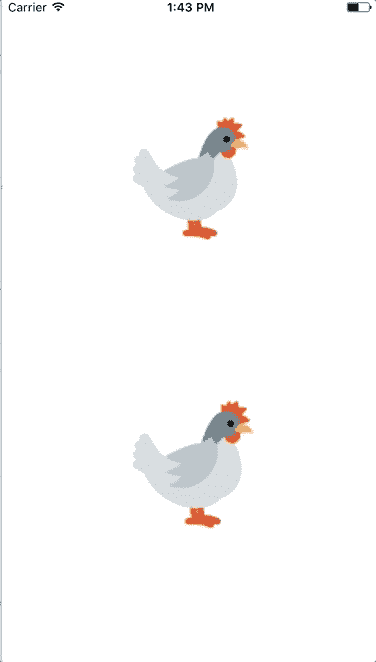

1.  将另一个图像视图拖到`Main.storyboard`上，并将一只鸡设置为它的图像。

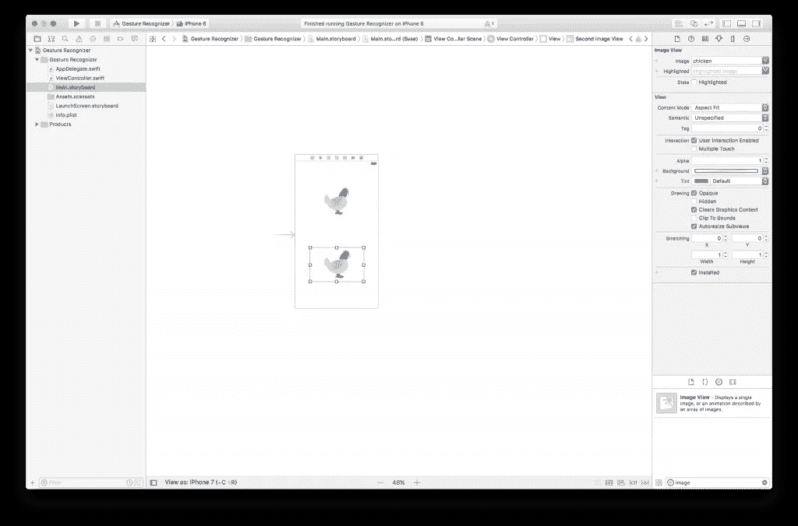

2.将两个滑动按压手势识别器拖到图像上，按住 CTRL 键的同时将长按手势识别器拖到视图控制器上，然后单击该动作。

(确保你已经写好了`IBAction`方法)。确保有左右滑动。)

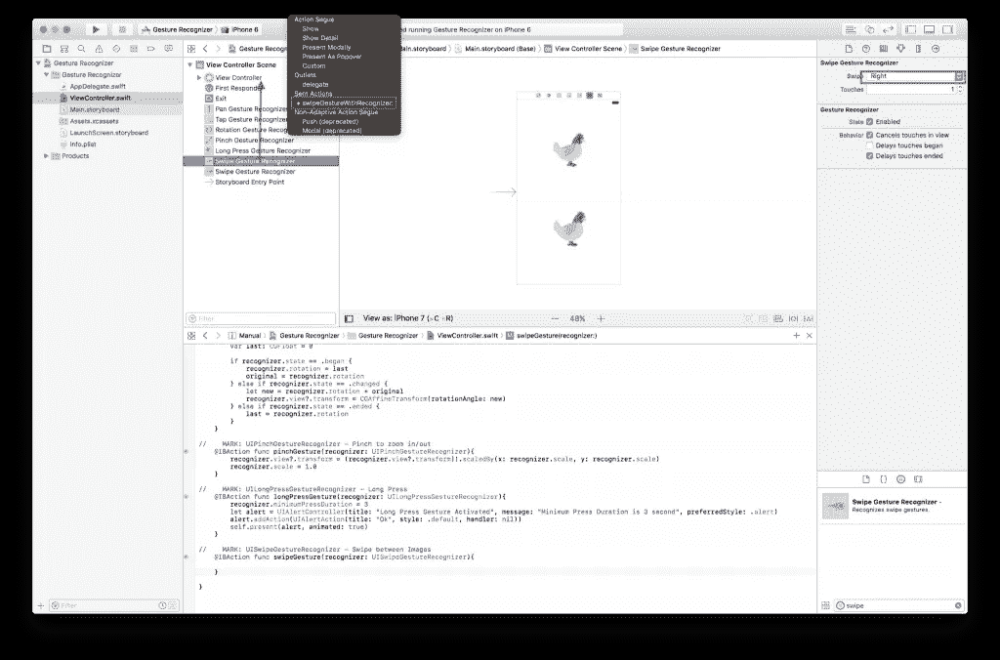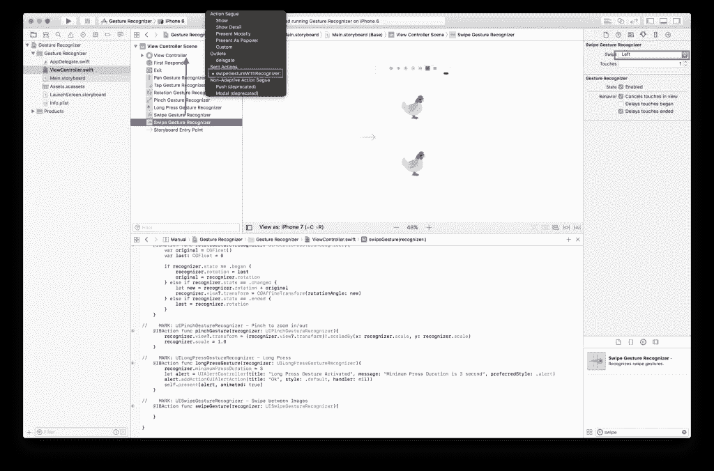

3.写代码。

该项目可以在 [GitHub](https://github.com/zhiyao92/UIGestureRecognizer) 上找到。感谢您的阅读！