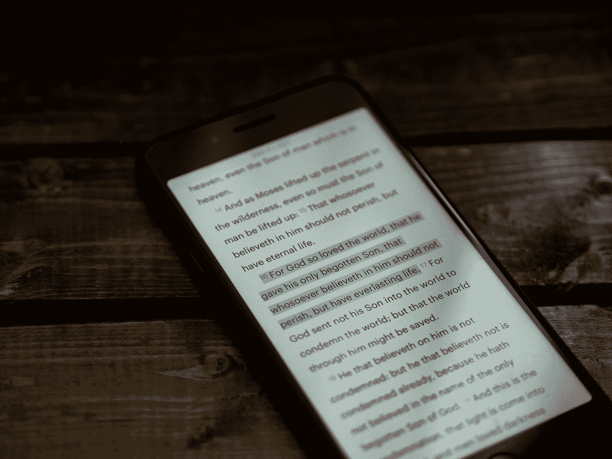
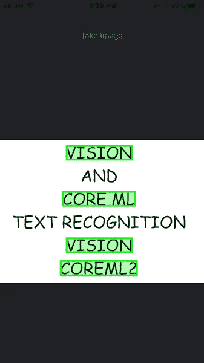

# iOS 视觉和使用 Core ML 突出显示文本

> 原文：<https://betterprogramming.pub/ios-vision-and-highlighting-text-with-core-ml-aaca104e9427>

## 从图像中查找并突出显示关键词



照片由 [Aaron Burden](https://unsplash.com/@aaronburden?utm_source=medium&utm_medium=referral) 在 [Unsplash](https://unsplash.com?utm_source=medium&utm_medium=referral) 上拍摄

愿景和核心 ML 框架是 WWDC 2017 的亮点。视觉是一个强大的框架，用于实现计算机视觉功能，而无需太多的算法先验知识。

使用视觉可以轻松检测条形码、人脸、物体和文本。
与此同时，Core ML 允许我们在我们的 iOS 应用程序中集成和运行预先训练好的模型，而无需过于深入地挖掘机器学习。

# 我们的目标

我们今天的目标是构建一个 iOS 应用程序来识别静态图像中的文本。

就像当你使用`cmd + F`搜索关键词时，所有匹配的字符串都会在屏幕上高亮显示，我们将在一张图片中高亮显示几个选中的字符串。

在进入正题之前，让我们先浏览一下将要涉及的内容。

# 涵盖的主题

*   使用照相机或图库捕捉图像
*   使用视觉的文本检测
*   使用核心 ML 的文本识别
*   在某些关键字上绘制边界框

# 我们想要达到的目标

我们希望在从相机/图库捕获的图像中识别出一些检测到的文本的名称后，突出显示这些文本，如下所示:



> 我们将这个应用程序称为 **FindMyText** 。灵感来源于 FindMyIphone 这个名字！

别再浪费时间了，让我们开始吧。启动 Xcode 并创建一个单一视图应用程序。

# 图像拾取控制器

我们不会关注故事板，因为它非常简单(只有一个 UIImage 和一个按钮)。这个想法是从照片库中上传包含文本的图像。

```
guard UIImagePickerController.isSourceTypeAvailable(.camera) else {
            presentPhotoPicker(sourceType: .photoLibrary)
            return
        }
        let photoSourcePicker = UIAlertController()
        let takePhoto = UIAlertAction(title: "Camera", style: .default) { [unowned self] _ in
            self.presentPhotoPicker(sourceType: .camera)
        }
        let choosePhoto = UIAlertAction(title: "Photos Library", style: .default) { [unowned self] _ in
            self.presentPhotoPicker(sourceType: .photoLibrary)
        }
        photoSourcePicker.addAction(takePhoto)
        photoSourcePicker.addAction(choosePhoto)
        photoSourcePicker.addAction(UIAlertAction(title: "Cancel", style: .cancel, handler: nil))

        present(photoSourcePicker, animated: true)
```

`presentPhotoPicker`用于启动适当的应用程序。一旦图像被点击，我们开始`Vision Request`。

```
extension ViewController: UIImagePickerControllerDelegate, UINavigationControllerDelegate {

    func imagePickerController(_ picker: UIImagePickerController, didFinishPickingMediaWithInfo info: [UIImagePickerController.InfoKey: Any]) {
        picker.dismiss(animated: true)

        guard let uiImage = info[UIImagePickerController.InfoKey.originalImage] as? UIImage else {
            fatalError("Error!")
        }
        imageView.image = uiImage
        createVisionRequest(image: uiImage)
    }

    private func presentPhotoPicker(sourceType: UIImagePickerController.SourceType) {
        let picker = UIImagePickerController()
        picker.delegate = self
        picker.sourceType = sourceType
        present(picker, animated: true)
    }
}
```

是时候了解一下愿景框架了！

# 愿景框架

Vision Framework 推出了 iOS 11。它带来了图像识别和分析的算法，据苹果公司称，比 CoreImage 框架更准确。对此的一个重要贡献是机器学习、深度学习和计算机视觉的底层使用。

实现该框架包括三个重要的用例:

*   `Request` -创建检测对象类型的请求。您可以设置多种类型进行检测。
*   `Request Handler` -这用于处理从请求中获得的结果。
*   `Observation` -结果以观察的形式存储。

作为愿景框架一部分的一些重要类别包括:

*   `VNRequest` -它由一组用于图像处理的请求组成。
*   `VNObservation` -这给了我们结果的输出。
*   `VNImageRequestHandler` -在给定图像上处理一个或多个`VNRequest`。

下面的代码片段显示了如何创建一个**视觉图像请求处理器**。

```
func createVisionRequest(image: UIImage){

        currentImage = image
        guard let cgImage = image.cgImage else {
            return
        }
        let requestHandler = VNImageRequestHandler(cgImage: cgImage, orientation: image.cgImageOrientation, options: [:])
        let vnRequests = [vnTextDetectionRequest]

        DispatchQueue.global(qos: .background).async {
            do{
                try requestHandler.perform(vnRequests)
            }catch let error as NSError {
                print("Error in performing Image request: \(error)")
            }
        }

}
```

我们可以传递多个请求，但是本文的目标是文本检测和识别。

`vnTextDetectionRequest`在下面的代码中定义:

上面的代码片段中有很多东西。
我们来分解一下。

*   观察是请求返回的结果。
*   我们的目标是用边界框突出显示检测到的文本，因此我们将观察结果定型为
    `VNTextObservation`。
*   我们裁剪图像中检测到的文本部分。这些裁剪后的图像充当我们的 ML 模型的微观输入。
*   在将这些图像调整到所需的输入尺寸后，我们将它们提供给核心 ML 模型进行分类。

裁剪和预处理的代码可以在本项目末尾的`ImageUtils.swift`文件中找到。

让我们来看看核心 ML，以及它与我们现阶段的关系。

# 核心 ML 框架

Core ML 是一个框架，让开发者在他们的应用程序中轻松使用 ML 模型。
在这个框架的帮助下，输入数据可以被处理以返回期望的输出。

在这个项目中，我们使用了一个`alphanum_28X28` ml 模型。
该模型要求输入尺寸为 28*28 的图像，并返回检测到的文本。

调整图像大小发生在我们前面看到的预处理函数中。
`observationStringLookup`是一个查找字典，它将每个观察值绑定到由核心 ML 模型预测的文本。

为了确定文本，我们有自己的图像分类器，它在调整大小的图像输入上运行:

`textMetadata`用于存储所有预测的单词。
现在已经创建了`observationStringLookup`，我们可以突出显示所选择的观察结果(正如我们在本文开头看到的，在最终输出中突出显示了单词 vision，core ml)。

## 视觉和边界框

现在我们知道了`VNTextObservations`中视觉检测到的文本。每个观察都有一个边界框属性。

这些观察值中的每一个的标签都是由来自前一部分的核心 ML 图像分类器预测的。

所以我们可以简单地在文本上画矩形。

下面的方法为我们完成了实现，并在图像中突出显示了单词“Vision”和“Core ML”。

> 注意:对于不同字体的文本，核心 ML 模型可能不会给出正确的结果。

> 在 iOS 13 中，新升级的 Vision 框架现在将识别的文本存储在观察实例本身中。

暂时就这样了。下面是这篇文章的完整源代码。

[](https://github.com/anupamchugh/iowncode/tree/master/iOSFindMyText) [## anupamchugh/iowncode

### 此时您不能执行该操作。您已使用另一个标签页或窗口登录。您已在另一个选项卡中注销，或者…

github.com](https://github.com/anupamchugh/iowncode/tree/master/iOSFindMyText) 

## 资源

[](https://martinmitrevski.com/2017/10/19/text-recognition-using-vision-and-coreml/) [## 使用视觉和核心 ML 的文本识别

### 简介机器学习允许计算机在没有被明确编程的情况下学习和做决定，如何…

martinmitrevski.com](https://martinmitrevski.com/2017/10/19/text-recognition-using-vision-and-coreml/)