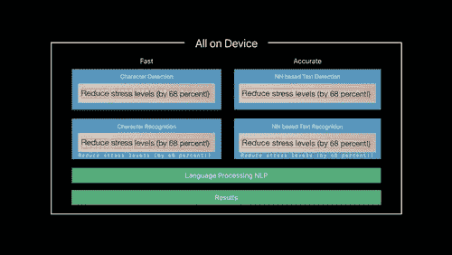
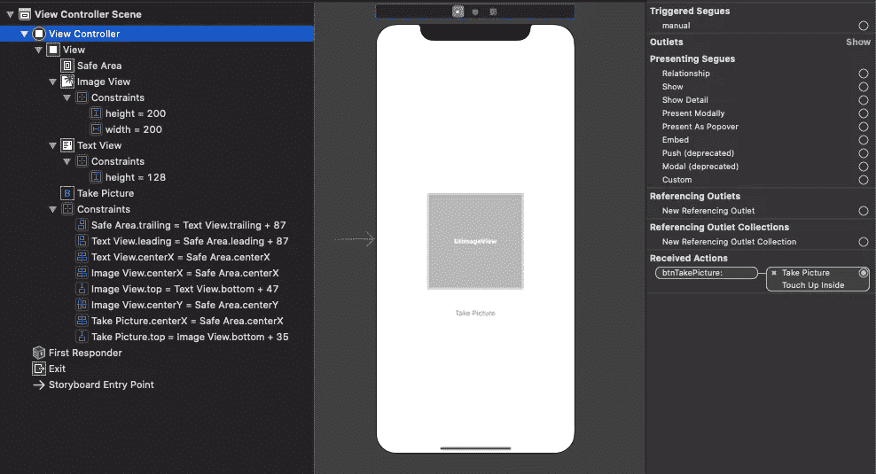
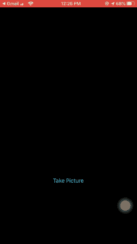

# iOS Vision 文本文档扫描仪

> 原文：<https://betterprogramming.pub/ios-vision-text-document-scanner-effc0b7f4635>

## 运行 iOS 13 中的新功能



来自 WWDC 2019 [视频](https://developer.apple.com/videos/play/wwdc2019/234/)

现在 iOS 13 已经发布了，Vision API 已经有了很大的改进。此外，还引入了 [VisionKit](https://developer.apple.com/documentation/visionkit) 框架，允许我们使用新的文档摄像头扫描文档。

# 视觉和视觉套件

iOS 11 出了 Vision API。到目前为止，它只能检测文本，而不能返回实际内容，因此我们必须为识别部分引入 [Core ML](https://developer.apple.com/documentation/coreml) 。

既然 iOS 13 升级了 Vision API，`VNRecognizedTextObservation`将返回文本、置信度以及边界框坐标。此外，VisionKit 允许我们访问系统的文档摄像头来扫描页面。

`VNDocumentCameraViewController`是视图控制器，`VNDocumentCameraViewControllerDelegate`用于处理委托回调。

# 启动文档照相机

以下代码用于在屏幕上显示文档照相机。

```
let scannerViewController = VNDocumentCameraViewController() scannerViewController.delegate = self.present(scannerViewController, animated: true)
```

扫描完成后，您只需点击*保存*和*即可触发以下委托方法:*

```
func documentCameraViewController(_ controller: VNDocumentCameraViewController, didFinishWith scan: VNDocumentCameraScan)
```

要在多幅图像中获取一幅特定的扫描图像，请在方法:`scan.imageOfPage(at: index)`中传递页面的索引。

然后，我们可以处理该图像，并使用 Vision API 检测文本。

要处理多个图像，我们可以像这样在 delegate 方法中循环扫描:

```
for i in 0 ..< scan.pageCount 
{ 
   let img = scan.imageOfPage(at: i) 
   processImage(img) 
}
```

# 正在创建 VNTextRecognitionRequest

```
let request = VNRecognizeTextRequest(completionHandler: nil) request.recognitionLevel = .accurate request.recognitionLanguages = ["en_US"]
```

`recognitionLevel`也可以被设置为`fast``，但是这样我们就不得不处理精度较低的问题。

`recognitionLanguages`是从左到右按优先级顺序传递的语言数组。我们也可以传递那些不属于字典的自定义单词，让视觉识别。

```
request.customWords = ["IOC", "COS"]
```

在下一节中，让我们创建一个简单的 [Xcode](https://developer.apple.com/xcode/) 项目，在这个项目中，我们将使用视觉请求处理程序从捕获的图像中识别文本。我们将部署目标设定为 iOS 13。

# 我们的故事板



# 密码

`ViewController.swift`的代码如下所示:

```
import UIKit
import Vision
import VisionKit

class ViewController: UIViewController, VNDocumentCameraViewControllerDelegate {

    @IBOutlet weak var imageView: UIImageView!
    @IBOutlet weak var textView: UITextView!

    var textRecognitionRequest = VNRecognizeTextRequest(completionHandler: nil)
    private let textRecognitionWorkQueue = DispatchQueue(label: "MyVisionScannerQueue", qos: .userInitiated, attributes: [], autoreleaseFrequency: .workItem)

    override func viewDidLoad() {
        super.viewDidLoad()
        textView.isEditable = false
        setupVision()
    }

    @IBAction func btnTakePicture(_ sender: Any) {

        let scannerViewController = VNDocumentCameraViewController()
        scannerViewController.delegate = self
        present(scannerViewController, animated: true)
    }

    private func setupVision() {
        textRecognitionRequest = VNRecognizeTextRequest { (request, error) in
            guard let observations = request.results as? [VNRecognizedTextObservation] else { return }

            var detectedText = ""
            for observation in observations {
                guard let topCandidate = observation.topCandidates(1).first else { return }
                print("text \(topCandidate.string) has confidence \(topCandidate.confidence)")

                detectedText += topCandidate.string
                detectedText += "\n"

            }

            DispatchQueue.main.async {
                self.textView.text = detectedText
                self.textView.flashScrollIndicators()

            }
        }

        textRecognitionRequest.recognitionLevel = .accurate
    }

    private func processImage(_ image: UIImage) {
        imageView.image = image
        recognizeTextInImage(image)
    }

    private func recognizeTextInImage(_ image: UIImage) {
        guard let cgImage = image.cgImage else { return }

        textView.text = ""
        textRecognitionWorkQueue.async {
            let requestHandler = VNImageRequestHandler(cgImage: cgImage, options: [:])
            do {
                try requestHandler.perform([self.textRecognitionRequest])
            } catch {
                print(error)
            }
        }
    }

    func documentCameraViewController(_ controller: VNDocumentCameraViewController, didFinishWith scan: VNDocumentCameraScan) {
        guard scan.pageCount >= 1 else {
            controller.dismiss(animated: true)
            return
        }

        let originalImage = scan.imageOfPage(at: 0)
        let newImage = compressedImage(originalImage)
        controller.dismiss(animated: true)

        processImage(newImage)
    }

    func documentCameraViewController(_ controller: VNDocumentCameraViewController, didFailWithError error: Error) {
        print(error)
        controller.dismiss(animated: true)
    }

    func documentCameraViewControllerDidCancel(_ controller: VNDocumentCameraViewController) {
        controller.dismiss(animated: true)
    }

    func compressedImage(_ originalImage: UIImage) -> UIImage {
        guard let imageData = originalImage.jpegData(compressionQuality: 1),
            let reloadedImage = UIImage(data: imageData) else {
                return originalImage
        }
        return reloadedImage
    }
}
```

我们在上面的代码中做了相当多的事情。让我们把它们列出来。

`textRecognitionWorkQueue`是一个用于在主线程外运行视觉请求处理器的`DispatchQueue`。

在`processImage`函数中，我们将图像传递给执行文本识别的请求处理器。

为每个请求的`results`返回`VNRecognizedTextObservation`。
从`VNRecognizedTextObservation`开始，我们最多可以查找十个候选人。通常，第一候选人给我们最准确的结果。

`topCandidate.string`返回文本,`topCandidate.confidenceLevel`返回识别文本的置信度。为了得到图像中字符串的边界框，我们可以使用这个函数:

```
topCandidate.boundingBox(for: topCandidate.string.startIndex..< topCandidate.string.endIndex)
```

这给了我们`CGRect`，我们可以在图像上绘制它。

Vision 使用与 UIKit 不同的坐标空间，因此，在绘制边界框时，您需要翻转 y 轴。

让我们来看看实际应用程序的输出。



因此，我们刚刚捕获了一本畅销小说的封面，并且能够识别在屏幕上的`TextView`中显示文本。这就是 iOS 13 的视觉文本识别器。

 [## anupamchugh/iowncode

### 此时您不能执行该操作。您已使用另一个标签页或窗口登录。您已在另一个选项卡中注销，或者…

github.com](https://github.com/anupamchugh/iowncode/tree/master/iOS13VisionTextRecogniser)