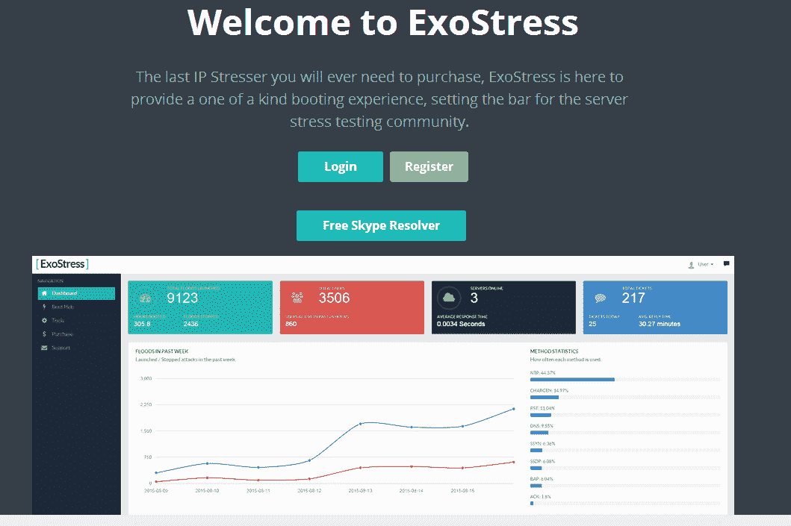
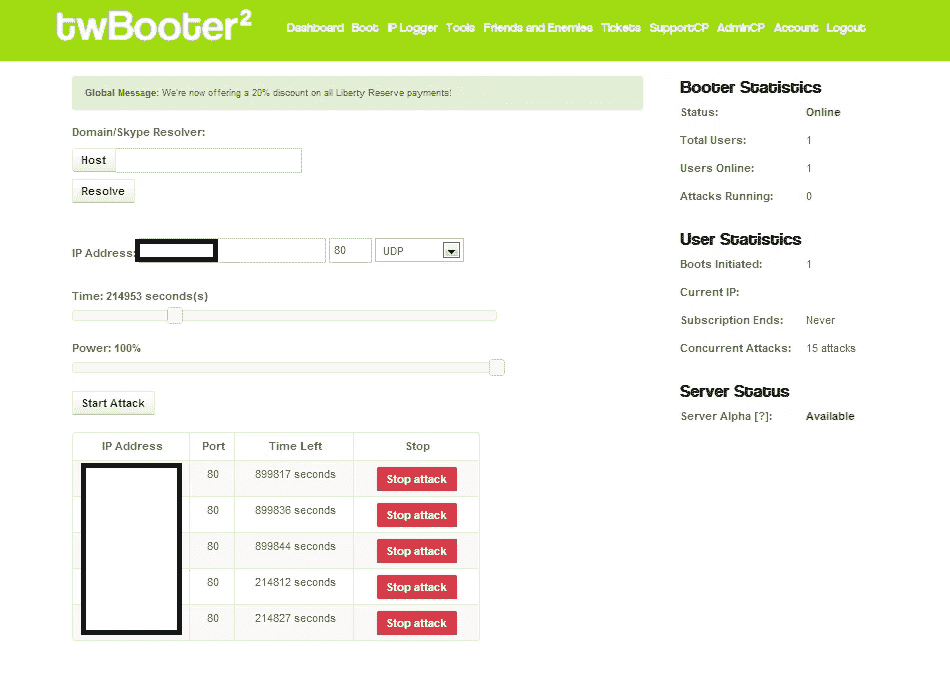
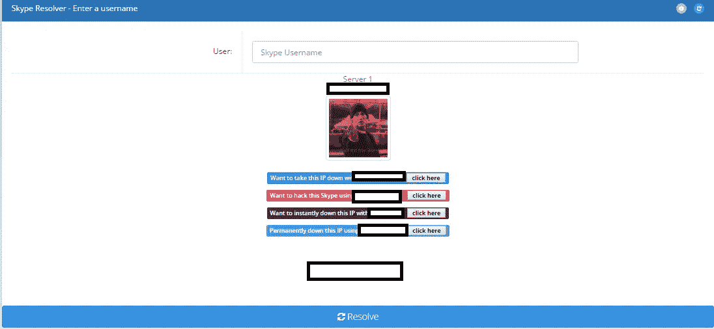
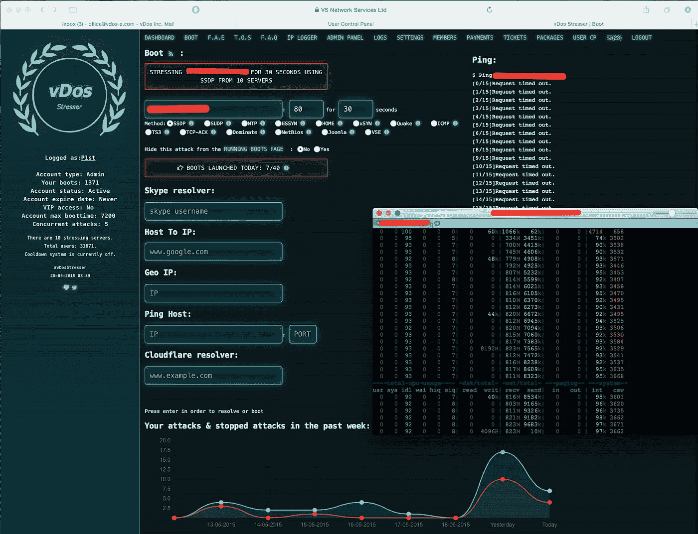

# IP Booters:互联网的危险区域

> 原文：<https://betterprogramming.pub/ip-booters-the-dangerous-area-of-the-internet-6d6a279fc0ad>

## 臭名昭著的 DDoS 出租服务简介

马库斯·斯皮斯克拍摄的照片—[https://unsplash.com/photos/FXFz-sW0uwo](https://unsplash.com/photos/FXFz-sW0uwo)

# 介绍

分布式拒绝服务(DDoS)攻击对互联网来说并不新鲜。然而，随着互联网的发展，人们完成这些攻击的媒介越来越容易获得。在这篇文章中，我想说明在 2012 年至 2016 年这个特定的时间框架内，策划自己的攻击是多么容易。

我希望这是不言而喻的，但请不要试图离开你自己，并试图在互联网上为这些服务做自己的调查。这是违反法律的 T2，当你浏览不知名的网站时，你将自己置于危险之中。

在深入研究这篇文章之前，让我们先弄清楚几件事。

# DDoS 攻击需要什么？

进行 DDoS 攻击有几种方法，但最终都归结为一点:你需要一个 IP 地址和基础设施。

我们可以认为 IP 地址是互联网公开标识网络的一种方式。当您连接到您的家庭 Wi-Fi 并浏览网站时，该网站能够看到您试图查看的页面，只需确定您的 IP 地址即可。IP 地址就像你的互联网指纹。

攻击者还需要基础设施来组织这些攻击。攻击者如何获得基础设施是一篇独立的文章。让我们假设这些攻击者拥有自己的专用计算机和专用网络，能够向任何其他 IP 地址发送流量。

# 拒绝服务是如何发生的

让我们把你家的互联网连接想象成一家咖啡店。你的咖啡店每周 7 天、每天 24 小时营业，里面总是有人。和任何建筑一样，能容纳多少人是有限度的。这就是网速发挥作用的地方。让我们假设一个典型的住宅互联网连接以每秒 100 兆比特的速度进入，在我们的例子中，假设 100 兆比特= 100 个人。

所以我们被允许在任何时候，在我们的咖啡店里有多达 100 个人。如果我们超过了 100 人的限制，我们将无法接受这种流量，从而导致拒绝服务。我们的咖啡店正忙于接待 100 人，不能再接纳更多的人了。您可能会问自己，在 DDoS 攻击中，这些攻击者可以模拟多少人。几千，如果不是几万的话。从我在这个场景中的时间来看，我看到的攻击范围从每秒 500 兆比特一直到每秒 60 千兆比特。

# IP Booters——互联网的危险区域

*IP booters* ，也被称为 *IP stressers* ，是在 2010 年代初被赋予生命的服务，并因其易于访问而获得了巨大的吸引力。这些服务允许任何人以低廉的月租费——有些低至 2 美元——租用他人的基础设施来发起 DDoS 攻击。

exo stress—2015 年开始流行的 DDoS 出租服务

当时，这些服务公开接受贝宝和信用卡支付。直到 2017 年初，PayPal 才能够彻底杜绝这些交易的发生。Booter 所有者会通过 whitehat 企业伪造他们的 PayPal 交易。(这是另一个我将在它自己的专门文章中结束谈论的话题。)

# 获取 IP 地址

获得基础设施的问题现在有了答案，但是人们如何能够收集 IP 地址呢？答案很简单。这些 IP 服务器服务不仅提供基础设施，还提供工具，帮助客户获得 IP 地址，无论是游戏服务器、网站还是个人。这些服务迎合了各种不同的观众。

只需输入目标的 IP 地址、端口、您希望攻击持续的时间、您希望攻击使用的网络协议，然后按下 Start。真的很简单。

## Skype 解析器

在互联网时代，Skype 是一个非常占主导地位的聊天服务。与此同时，由于该应用程序的 P2P 性质，存在一个安全漏洞，允许人们获取与 Skype 帐户相关的 IP 地址。这最初是在 2012 年发现的。人们最终提供了 *Skype resolver* 服务，用户可以输入一个人的 Skype 用户名，一个后端服务将获取受害者的 IP 地址。

公开提供的众多 Skype resolvers 之一

这些 Skype resolver 服务最终提供了付费 API 订阅服务，主要出售给 IP stresser 所有者，以便他们可以在自己的 booter 上创建自己的 Skype resolver 页面。这些 booter 所有者的最终目标是帮助客户获得其目标的 IP 地址。对我来说，最疯狂的是这个漏洞实际上存在了多久。直到 2016 年初，微软的 Skype 团队发布了一篇博客来解决这个问题。

## IP 抓取器

另一种获取人们 IP 地址的流行方式是使用一种字面上叫做 *IP 抓取器*的东西。Booter 所有者会提供这项服务，创建一个看起来合法的 URL。当任何人点击链接时，他们的 IP 地址都会被记录下来，这样客户就可以随心所欲地使用它。

通常，booter 所有者会利用 TinyUrl 之类的重定向 URL 服务来掩盖他们的 IP 抓取程序。不过，有些人会购买与热门网站类似的域名，如 Imgur 或 Reddit，并让客户通过这些域名访问 IP grab。这些抓取器的主要目的是看起来像一个普通的 URL，这样用户可以不假思索地点击。

# 结论

vDos Stresser——从 2012 年到 2016 年运行的受欢迎的 booter 服务

虽然 booter 服务造成了许多中断和不良影响，但它们促进了在线安全的发展，并产生了 Cloudflare、OVH、Sucuri 和 Akamai 等公司对安全保护的需求。

尽管 booter 服务和 Skype resolvers 的统治地位已经不复存在，但仍有一小部分 DDoS 服务在积极运行。无论何时在互联网上，连接到 VPN 都不会有什么坏处，但更重要的是，在浏览互联网时要经常使用常识。