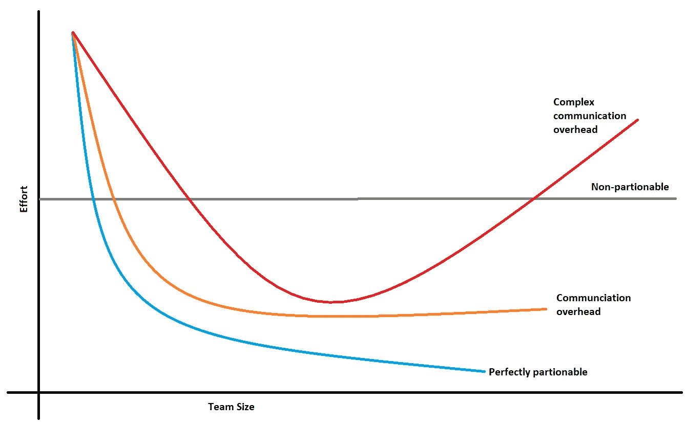
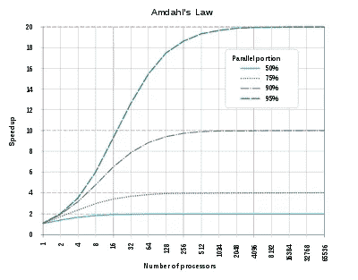

# 一个人的开发团队是最佳的吗？

> 原文：<https://betterprogramming.pub/is-a-one-person-development-team-optimal-f8aca9872ccc>

## 研究、轶事和个人经验表明 3-8 人的团队是最好的——但以下是我的发现

安妮·斯普拉特在 [Unsplash](https://unsplash.com?utm_source=medium&utm_medium=referral) 上的照片

> 一个项目中理想的程序员数量几乎总是**一个。**——(弗雷德)布鲁克定律的自由解读

我不确定他是否真的说过，但他确实说过:

> “如果在一个项目中有 *n* 个工人，那么就有 *(n -n)/2* 个接口可以进行交流，并且有可能存在几乎 2^n 团队，在这些团队中必须进行协调。”

视觉上的沟通问题如下(梅特卡夫定律):

维基共享[https://en.wikipedia.org/wiki/Metcalfe%27s_law](https://en.wikipedia.org/wiki/Metcalfe%27s_law)

随着团队的成长，你花费/浪费了大量的时间进行沟通——有些人说多达你一天的 40%。如果你是一个人，你可能会在其他方面浪费时间，但你有更多的时间来编码。是不是说一个就是最佳尺寸？稍后将详细介绍。

# 研究称< 9

In a [论文](https://www.researchgate.net/publication/228838549_Empirical_Findings_on_Team_Size_and_Productivity_in_Software_Development)通过分析国际软件基准测试标准组织(ISBSG)的软件项目库，研究人员总结了影响软件生产率的三个因素:

1.  程序设计语言
2.  开发平台
3.  团队规模

数据显示平均团队规模为 8 人，中位数为 5 人，范围从 1 到 40 人不等。他们的发现，具体到团队规模，是相当普遍的，尽管论文的名称是，总之:团队人数少于 9 人显然更有生产力。它进一步按语言和平台细分了生产率，并引用了其他观察结果，例如新项目的生产率明显低于现有系统的增强工作。

# 米勒魔术 7 2，阿姆达尔定律等。

大多数 Scrum 和敏捷指南引用米勒的著名研究来证明像 7 ^ 2 这样的数字是合理的，该研究认为这个数字是人类认知的典型极限(后来的研究表明短期记忆容量有四个组块)。这很有趣，但是它并没有确切地说 4 或 7 适用于团队规模。

但相关的是指数增长的沟通问题，这表明较小的团队更有利于减少开销——但多小才是最佳的呢？

Brooks 还提到，大型团队的扩展需要并行化的工作(任务),不需要太多的协作。与过去的整体服务相比，现在的微服务可能更容易做到这一点。然而，在微服务开发团队中，我们也有同样的问题。再次引用图例:

> Brooks 还将任务分为(I)完全可分的任务；(ii)不可分割任务，(iii)需要通信的可分割任务；以及(iv)具有复杂相互关系的任务

图片 Doug Foo——弗雷德·布鲁克斯的四类问题

> 他的观点是，软件工程中的大多数任务属于最后一类，即具有复杂相互关系的任务。[1]"

根据这些引用推断——越小越好，但是太小太慢。

阿姆达尔平行增长定律

Mark Levison 将扩展能力与阿姆达尔定律联系起来，我觉得这很有趣。您可以通过尽可能多地并行化来加速系统(dev)。即便如此，回报也是有限的或递减的，这一切都依赖于能够找到可以完全独立完成的编程任务，不幸的是，正如前面所引用的，Brooks 说这是最不常见的编程任务。

也就是说，任何大规模的并行化通常都有价值。寻找神奇最佳尺寸的工作仍在继续——让我们探索一下*的极端情况*。

# **极限/结对编程= = 2 人小组？**

Kent Beck 和结对编程的流行可能意味着两个人的团队是理想的。我不相信这一点，但我把它扔在那里只是为了寻求刺激，因为我确实相信最小的团队可能是最有效率的，一个人有点孤独，所以两个人是一个体面的妥协。我自己的经验是，在一个典型的普通软件团队中，一个超级巨星正在做大量的编程工作。我已经多次看到这种情况——这在某种程度上加强了一两个人的团队可能实际工作(一个人做编码，一个人买咖啡和给管理层更新)。

# 开源项目:团队规模 10，000 人

对小团队的一个反驳是像 Linux 这样的大规模开源项目的成功，这些项目已经有 20，000 多个贡献者(最近几年超过 4，000 个)。Linux，可以说是世界上最成功的开源项目，证明了小团队的方向是错误的吗？

我不这么认为——因为 Linux 有一些独特之处:

*   一套严格的审批者，尤其是涉及内核级工作时
*   大量可以完全独立工作的“额外功能/模块”
*   大多数“兼职”贡献者会添加额外的功能或修复错误

也就是说，像 Linux 这样的大规模项目的成功表明，最近的技术和工具已经使大型团队开发比 20 年前成功得多(见我关于这个主题的[前贴](/how-going-back-to-coding-after-10-years-almost-crushed-me-88c85ceb5376))。

# 个人经验说~5

我是小团队的信徒，但我也经历过用户和经理尖叫着要加快速度——所以我们必须在可接受的生产力损失量下找到扩大生产力的最佳点。我的选择是从一个“典型的”软件项目的五人混合团队开始。原型可能包括以下内容:

*   **技术负责人** —亲力亲为的技术架构师、强大的人员领导力+产品和管理知识
*   **高级开发人员**——至少有一个懂语言、懂开发工具的高级开发人员领导，他将成为团队绩效的标杆
*   核心开发人员——知道如何完成工作的标准面包和黄油编码员——准备一双以防电池没电
*   **初级开发人员**——团队需要有人来指导和指导，同时也要处理重复性/jr 类型的工作(可能还要去买午餐)
*   **pseudo-devo PS**——你想要的人仍然是一个强大的开发人员，但对优化产品开发任务之间的开发基础设施有经验和兴趣，这将是另一个障碍

这个五人团队也满足两个披萨的规则(虽然我发誓我可以自己吃两个)，在 7 ^ 2 规则，Scrum Alliance 建议的 3–9 之内，比最新的四项记忆规则只差一点点，等等。大多数同事和相关的博客/文章都同意一位数的范围。这是最佳尺寸吗？

Doug Foo — @ [Savoy Tokyo —世界上最好的披萨](https://robbreport.com/food-drink/dining/japan-neapolitan-pizza-2858989/) —尝尝吧！

# 总结—一个人的团队

回到最初的问题——一个人的团队是最优的吗？

如果目标是达到最高的人均生产率，那么是的。一个人完全理解问题并设想解决方案的能力是最理想的。您可以避免向人们解释远景的开销(梅特卡夫定律),以及确保远景匹配的代码审查和修订时间。

缺点是无法并行任务和加速净交付(阿姆达尔定律)，以及缺乏一个团队来反映想法和集体改进代码。

因此答案是否定的，一个人的团队不是最佳的，除非你有无限的时间来完成你的项目。根据你的项目规模，介于 3 和 9 之间的中间值似乎是每个人都同意的。

# 参考

1.  [学术研究论文](https://www.researchgate.net/profile/Daniel-Rodriguez-119/publication/228838549_Empirical_Findings_on_Team_Size_and_Productivity_in_Software_Development/links/5d4565d1a6fdcc370a773aec/Empirical-Findings-on-Team-Size-and-Productivity-in-Software-Development.pdf?origin=publication_detail)
2.  [7 2 记忆法则](https://en.wikipedia.org/wiki/The_Magical_Number_Seven,_Plus_or_Minus_Two)
3.  [新的 4 条记忆法则](https://www.livescience.com/amp/2493-mind-limit-4.html)
4.  [布鲁克斯交流定律](https://www.leadingagile.com/2018/02/applying-brooks-law/)
5.  [Linux 提交](https://www.phoronix.com/scan.php?page=news_item&px=Linux-Git-Stats-EOY2019)