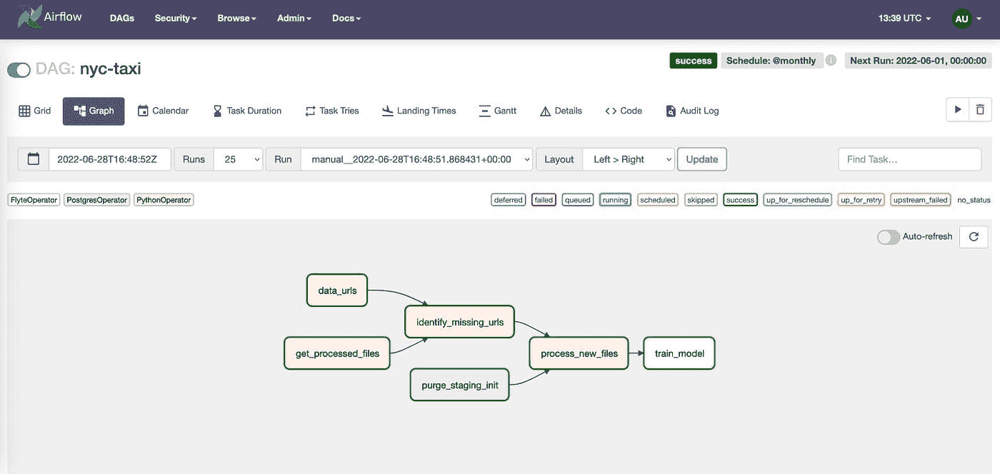
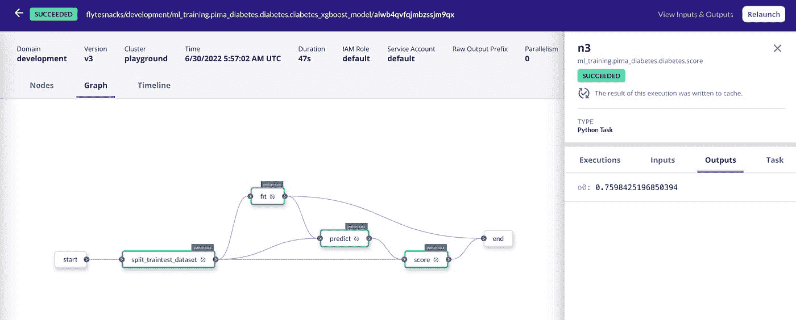

# 气流也是机器学习的正确选择吗？

> 原文：<https://betterprogramming.pub/is-airflow-the-right-choice-for-machine-learning-too-bead4eb6207d>

## 看看 ETL 和机器学习任务之间的区别

照片由 [Unsplash](https://images.unsplash.com/photo-1580064201713-696b91df7712?ixid=MXwxMjA3fDB8MHxwaG90by1wYWdlfHx8fGVufDB8fHw%3D&ixlib=rb-1.2.1&auto=format&fit=crop&w=668&q=80) 的 [charlesdeluvio](https://unsplash.com/@charlesdeluvio) 拍摄

Apache Airflow 是一个开源平台，可用于创作、监控和调度数据管道。它被 Airbnb、Lyft 和 Twitter 等公司使用，并且已经成为数据工程生态系统中的首选工具。

随着数据管道编排需求的增加，气流经历了巨大的增长。它已经将其范围从数据扩展到机器学习，现在正被用于各种用例。

但由于机器学习本身需要一个独特的编排，因此需要扩展气流以适应所有的 MLOps 要求。

为了更好地理解这一点，让我们更深入地研究机器学习和 ETL(提取-转换-加载)任务以及机器学习工程需求之间的差异。

# 机器学习与 ETL 任务

机器学习任务与 ETL 任务有不同的需求。

*   机器学习需要运行资源密集型计算。
*   机器学习需要数据血统或数据感知平台来简化调试过程。
*   机器学习需要对代码进行版本控制，以确保可重复性。
*   机器学习需要基础设施自动化。

此外，从静态到动态的工作流程有了实质性的转变。流程快速且不可预测，更多的计算能力被用于运行工作流，迭代是一种原始需求，等等。因此，传统的处理管道的方式是行不通的。

# 为什么要延长气流？

Airflow 旨在协调数据工作流。运行 ETL 任务非常有用，因为它可以轻松地连接到一组标准的第三方数据源来实现数据编排。然而，机器学习从业者有额外的要求。

*   资源密集型任务:Airflow 并没有提出一种直接的方法来处理这个问题，尽管你可以使用一个 [KubernetesPodOperator](https://airflow.apache.org/docs/apache-airflow-providers-cncf-kubernetes/stable/operators.html) 来通过将代码容器化来克服资源限制。
*   数据血统:Airflow 不是一个数据感知平台；它简单地构造了流，但是忽略了内部细节，包括传递数据。
*   版本控制:已经有一些间接的技术来处理 Airflow 中代码的版本控制，但是它仍然不是一个明显的特性。此外，Airflow 也不支持按需重新访问 Dag 和重新运行工作流。
*   基础设施自动化:在大多数情况下，机器学习代码需要高处理能力。然而，当工作流不运行时，或者当工作流中的特定数量的任务不需要更多计算能力时，我们不希望保持资源空闲，这很难通过气流实现。
*   缓存:缓存任务输出有助于加速执行并消除资源的重用，这也是 Airflow 不支持的。

Airflow 通过利用亚马逊 Sagemaker 和 Databricks 等运营商来支持构建机器学习管道。问题是，我们不会获得所有的编排优势，并且在气流端无法确保可再现性或任何上述保证。简而言之，这个场景中缺少的基本部分是细粒度的机器学习编排。

想象一个场景，机器学习工程师被带入一个已经由数据工程师建立的现有气流项目。由于 Airflow 主要是一个面向数据编排的平台，因此在术语、概念方法以及对每个团队工作成果的理解方面经常会有很大的差距。要让 Airflow 成为一个成熟的机器学习编排服务，需要比平时更大的努力，毕竟考虑到 Airflow 对 ETL 的倾向，这可能不是正确的选择。

也就是说，Airflow 仍然可以用于构建“静态”的机器学习管道，但如果您的用例是适应机器学习周围不断发展和快节奏的生态系统，并极度关注迭代(当然，还有部署)，您可能必须扩展 Airflow。

# 气流+ Flyte =最大的灵活性

Flyte 诞生于解决气流带来的挑战，特别是对机器学习工程师、从业者和数据科学家的挑战。这是一个成熟的工作流编排服务，建立在 Kubernetes 之上，以确保机器学习管道的可扩展性。那么，为什么不利用两个世界的优势——Airflow 和 Flyte——来扩展 air flow 用于机器学习任务呢？

介绍 [Flyte 气流供应商](https://github.com/flyteorg/airflow-provider-flyte/tree/master)。现在，您可以在 Airflow 中构建 ETL 管道，在 Flyte 中构建机器学习管道，并使用提供程序从 Airflow 中触发机器学习或 Flyte 管道。

如果你是 Airflow 的长期用户，你可以一点一点地处理代码，而不用担心 Airflow 和 Flyte 是如何交织在一起的。

*气流 UI 上的 DAG 示例，其中* `*train_model*` *是* `*FlyteOperator (Image by Author)*`

## Flyte 算子

您可以使用`FlyteOperator`来触发 Flyte 执行——无论是任务还是工作流执行——在此之前，您必须在后端注册您的 Flyte 工作流。在触发气流 DAG 时，相应的 Flyte 执行被触发，瞧！，您将获得 Flyte 在气流中的所有好处。

## 飞石传感器

如果您需要等待执行完成，`FlyteSensor`就会出现。使用`FlyteSensor`进行监控允许您仅在 Flyte 执行完成时触发下游流程。

## 例子

在[安装和设置气流](https://www.astronomer.io/guides/get-started-airflow-2/)后，将以下内容置于`dags/`目录下。

`pima_diabetes` Python 文件的源代码可以在[这里](https://github.com/flyteorg/flytesnacks/blob/master/cookbook/case_studies/ml_training/pima_diabetes/diabetes.py)获得。

将`airflow-provider-flyte`添加到`requirements.txt`文件，并通过将`Conn Id`设置为`flyte_conn`并将`Conn Type`设置为 Flyte 来创建 Flyte 的气流连接。

*Flyte 执行 UI(图片由作者提供)*

在 Airflow 或 Flyte 端终止执行时，相关事件将传播到另一个平台，执行将被取消。如果在 Flyte 端执行失败，在 Airflow 端的执行也会失败。

如果您想了解该提供商的实际使用案例，请观看视频[。它演示了一个从 S3 提取纽约市出租车数据、上传到 CrateDB 并构建 XGBoost 模型的示例。](https://www.youtube.com/watch?v=F2JyA0O2U4M)

气流是运行 ETL 管道的有力工具；然而，需要扩展气流来运行机器学习管道。

使用 Flyte，您可以对代码进行版本控制、审计数据、重现执行、缓存输出和插入检查点，而无需考虑机器学习管道的可伸缩性。试试 Flyte Airflow Provider，让我知道你对它的看法！

*原载于 https://blog.flyte.org***。**