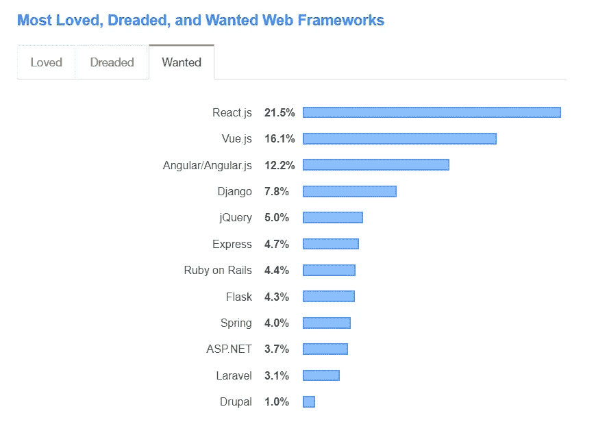
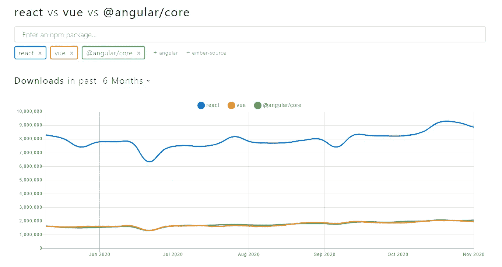
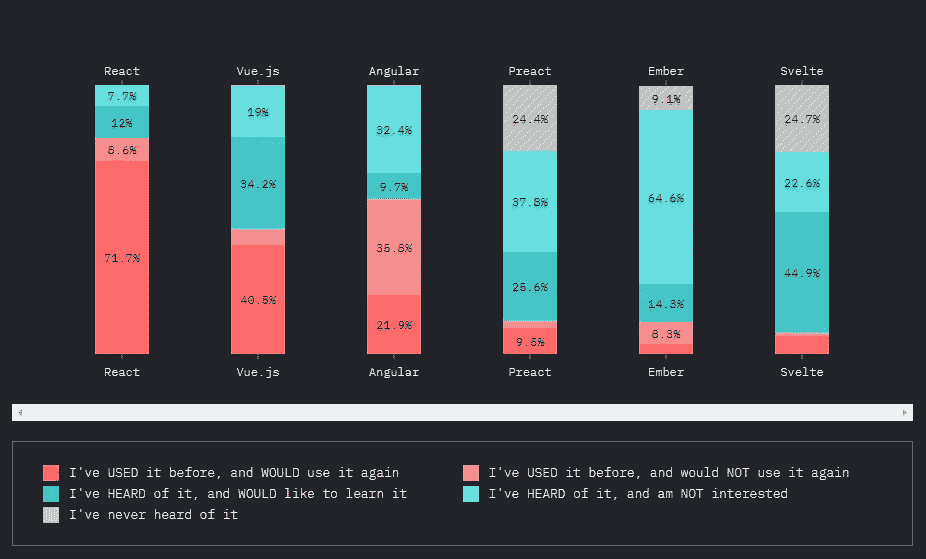

# Angular 还活着吗？

> 原文：<https://betterprogramming.pub/is-angular-still-alive-4977515f4de1>

## 你的职业生涯只知道棱角就够了吗？

[吴健雄](https://unsplash.com/@yeti?utm_source=medium&utm_medium=referral)在 [Unsplash](https://unsplash.com?utm_source=medium&utm_medium=referral) 上拍照。

当我开始软件工程师的职业生涯时，Angular 是我学习的第一个框架。在当时，它是开发人员中最流行和使用最多的 JavaScript 框架。但是随着 React 和 Vue 等框架的发展，Angular 似乎已经失去了作为顶级 JavaScript 前端框架的地位，并且在 2020 年学习它的利弊存在巨大的争论。

因此，我决定将它的功能和统计数据与其竞争对手进行比较，看看是否只知道 Angular 就足以在 2021 年生存下来。

# Angular 的过去，现在

正如我在开头提到的，Angular 是我职业生涯的起点，帮助我获得了我需要的经验。与其他 JavaScript 前端框架相比，Angular 更加成熟，并且有一个大型社区作为支持。

除了是著名的均值堆栈的一部分，Angular 还提供了一些很棒的特性:

*   双向数据绑定
*   依赖注入
*   MVVC 建筑
*   角度 CLI
*   类型脚本支持
*   指令

另一方面，Angular 的能力由于新的框架而受到质疑。在大多数情况下，SEO 支持、框架的大小、更新和学习曲线是人们对 Angular 的普遍关注。如果我们只考虑棱角，这些事情似乎不是大问题。但是当我们了解像 React 或 Vue 这样的框架时，我们觉得使用它们可以很容易地实现这些事情。

## 使用 Angular 的优点

*   适合需要可靠和可扩展架构的大规模应用。
*   包含依赖项和库的大型生态系统。这使得开发人员可以专注于应用程序的核心功能，而不用担心小事情。
*   Angular 得到了谷歌的支持，并得到了很好的确立。这意味着您可以毫不犹豫地将 Angular 用于您的生产。它还包含丰富的文档，您可以很容易地理解和遵循。
*   Angular 是使用 TypeScript 编写的，这使得代码对每个人来说都更容易理解和干净。
*   依赖注入、AOT 编译和双向数据绑定等特性增加了加载时间，减少了应用程序的开发时间，使 Angular 成为大规模应用程序的完美匹配。

## 使用角度的缺点

*   有限的搜索引擎优化支持。
*   对初学者来说，学习曲线可能有点陡。
*   Angular 相比 React 和 Vue 是一个重量级的框架。

# React 和 Vue 的影响

## 反应

在过去的 2-3 年里，React 已经成为 Angular 的主要竞争对手，似乎开发人员使用 React 比 Angular 更舒服。React 已经覆盖了 Angular 的很多缺点，包括 SEO 支持，框架大小等。它的一些功能包括:

*   React Native 的原生支持。
*   一个饱和的生态系统，有像 Redux 这样的库。
*   相比棱角分明，重量轻。
*   可重用组件。
*   更好的性能。
*   大型社区和持续更新。

凭借所有这些特性，React 最适合于以下情况:

*   创建 SPA 或跨平台应用程序。
*   开发小型企业级应用。
*   包含许多状态变化的应用程序。

## 某视频剪辑软件

Vue 是 Angular 的另一个竞争对手，其微小的框架尺寸是其受欢迎的主要原因。灵活性是另一个主要优势，尽管有时我们可以将这解释为大型开发团队的劣势。它的一些重要特征是:

*   轻量级。
*   Vue 插槽使你的代码容易理解。
*   您可以构建和共享独立的组件。
*   Vuex 状态管理模式允许你维护一个组织良好的项目。
*   测试框架支持。
*   TypeScript 支持。

此外，在某些特定情况下，Vue 可能是您的最佳解决方案:

*   构建小型轻量级应用程序。
*   构建智能和高性能的应用程序。
*   对于一个 app 的早期进入市场。

# 让数据说话

## 堆栈溢出调查

来源:[堆栈溢出](https://insights.stackoverflow.com/survey/2019#most-loved-dreaded-and-wanted)

在这个由 Stack Overflow 进行的[调查](https://insights.stackoverflow.com/survey/2019#most-loved-dreaded-and-wanted)中，React 和 Vue 分别被放在了最受欢迎和最受欢迎部分的第一位和第二位。同时，Angular 排名第三。我记得，Angular 在 2018 年在这些类别中领先 React。

## NPM 趋势

来源: [NPM 趋势](https://www.npmtrends.com/react-vs-vue-vs-@angular/core)

上面的 NPM 趋势图向我们展示了一段时间内每个框架的下载量。截图显示了过去六个月的统计数据，我们可以看到 React 以近 900 万的下载量明显领先。Vue 和 Angular 正在争夺第二名。

NPM 趋势的另一个特点是它也显示来自 GitHub 的数据。在下面的截图中，你可以看到每个框架的叉数、星数和期数:

来源: [NPM 趋势](https://www.npmtrends.com/react-vs-vue-vs-@angular/core)

这些数据再次强调了 Angular 的用户流失。Angular 只有 67，000+颗星，而 Vue 和 React 在其 GitHub repos 中分别以 158，000+和 175，000+颗星遥遥领先。

## JavaScript 的现状

JavaScript 的 [2019 状态包含了 JavaScript 上的另一个报告生成平台，你可以在那里找到各种对比。下图显示了用户的反应，他们是否会再次使用它，他们是否听说过这项技术，等等。](https://2019.stateofjs.com/front-end-frameworks/)

来源:https://2019.stateofjs.com/front-end-frameworks/

我们可以看到，最多的用户可能会再次使用 React 和 Vue，而不是 Angular。此外，投票给“我以前用过它，不会再用它”的用户数量在 Angular 上比其他两个都高。这意味着 Angular 正在迅速失去用户。

# Angular 10 能有所作为吗？

通过更新不能满足用户的需求是对 Angular 的主要批评之一。但在今年之内，Angular 发布了两次重大更新(Angular 9 和 Angular 10)。尽管 Angular 10 更新带来了一些现有的功能，如语言服务、编译器更新、新的默认浏览器配置、Ngcc、Typescript 3.9 支持、本地化、服务人员更新、性能改进等等，但我们在开发人员预期的领域中看不到任何改进。

所以，我能说的是，Angular 10 对挽回流失的用户帮助不大。

# 结论

在整篇文章中，我谈到了 Angular 的缺点和其他框架的积极方面。但是有一件事我们不能忘记:Angular 已经存在很长时间了，并且已经很好地建立起来了。在 2021 年，组织将继续使用它，所以你将能够在未来的项目中使用你的 Angular 知识。

另一方面，像 React 和 Vue 这样的框架正在接管，新的趋势似乎对它们有利。这意味着学习这些其他框架对你的职业生涯将是一个巨大的推动。

你只知道 Angular 就能挺过 2021 年，但是学习 React 或 Vue 会确保你的位置，因为学习新事物总是更好。